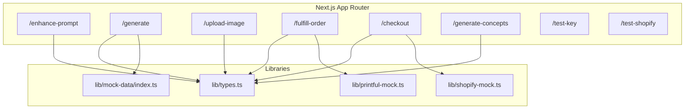
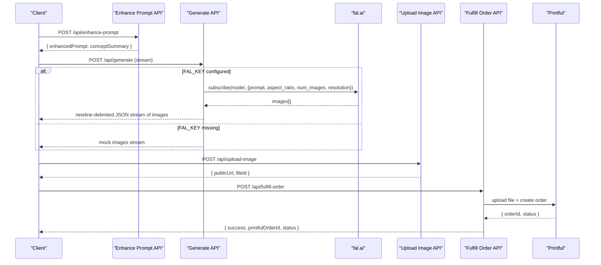
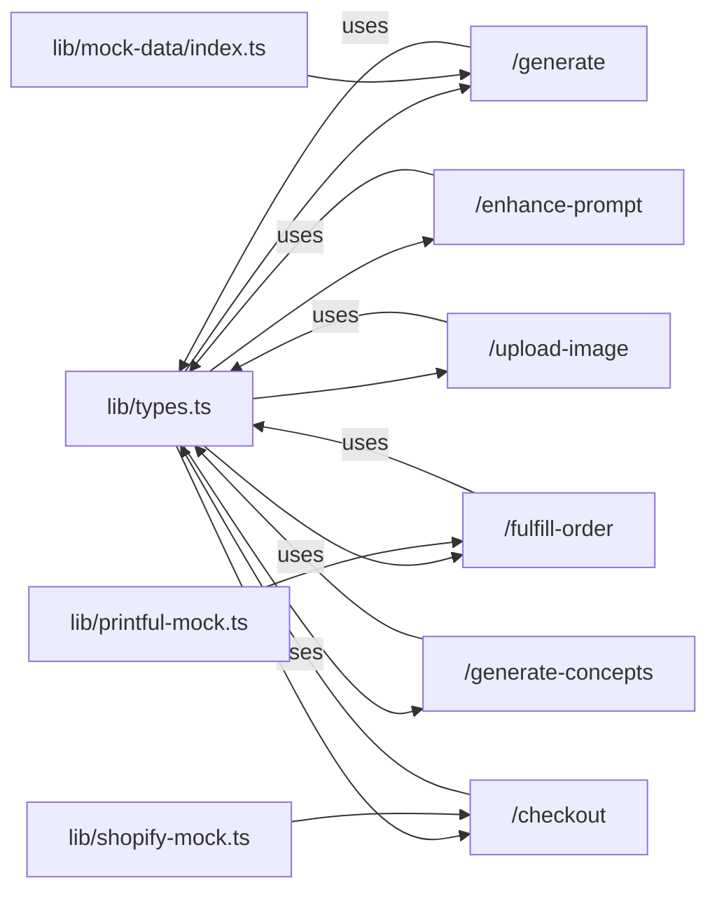

# API Reference

<cite>
**Referenced Files in This Document**
- [enhance-prompt route](file://app/api/enhance-prompt/route.ts)
- [generate route](file://app/api/generate/route.ts)
- [upload-image route](file://app/api/upload-image/route.ts)
- [fulfill-order route](file://app/api/fulfill-order/route.ts)
- [checkout route](file://app/api/checkout/route.ts)
- [generate-concepts route](file://app/api/generate-concepts/route.ts)
- [test-key route](file://app/api/test-key/route.ts)
- [test-shopify route](file://app/api/test-shopify/route.ts)
- [types](file://lib/types.ts)
- [mock-data](file://lib/mock-data/index.ts)
- [printful-mock](file://lib/printful-mock.ts)
- [shopify-mock](file://lib/shopify-mock.ts)
- [README](file://README.md)
- [package.json](file://package.json)
</cite>

## Table of Contents
1. [Introduction](#introduction)
2. [Project Structure](#project-structure)
3. [Core Components](#core-components)
4. [Architecture Overview](#architecture-overview)
5. [Detailed Component Analysis](#detailed-component-analysis)
6. [Dependency Analysis](#dependency-analysis)
7. [Performance Considerations](#performance-considerations)
8. [Troubleshooting Guide](#troubleshooting-guide)
9. [Conclusion](#conclusion)
10. [Appendices](#appendices)

## Introduction
This document describes the Muse platform’s REST API surface implemented under app/api/*. It covers:
- Prompt enhancement API using LLM context
- Image generation API with fal.ai FLUX integration
- Image upload service
- Order fulfillment API
- Shopify checkout integration

It specifies HTTP methods, URL patterns, request/response schemas, authentication requirements, error handling, and operational guidance. It also includes curl examples, SDK integration notes, rate limiting considerations, security, validation, and performance optimization tips.

## Project Structure
The API routes are organized under app/api/<endpoint>/route.ts. Supporting types and mocks reside in lib/.

**Diagram sources**
- [enhance-prompt route:1-102](file://app/api/enhance-prompt/route.ts#L1-L102)
- [generate route:1-145](file://app/api/generate/route.ts#L1-L145)
- [upload-image route:1-22](file://app/api/upload-image/route.ts#L1-L22)
- [fulfill-order route:1-39](file://app/api/fulfill-order/route.ts#L1-L39)
- [checkout route:1-76](file://app/api/checkout/route.ts#L1-L76)
- [generate-concepts route:1-190](file://app/api/generate-concepts/route.ts#L1-L190)
- [test-key route:1-14](file://app/api/test-key/route.ts#L1-L14)
- [test-shopify route:1-91](file://app/api/test-shopify/route.ts#L1-L91)
- [types:1-132](file://lib/types.ts#L1-L132)
- [mock-data:1-315](file://lib/mock-data/index.ts#L1-L315)
- [printful-mock:1-77](file://lib/printful-mock.ts#L1-L77)
- [shopify-mock:1-74](file://lib/shopify-mock.ts#L1-L74)

**Section sources**
- [README:60-68](file://README.md#L60-L68)
- [README:191-217](file://README.md#L191-L217)

## Core Components
- Prompt Enhancement API: Transforms user input plus a style profile into an optimized prompt for image generation.
- Image Generation API: Streams generated images via fal.ai FLUX; falls back to mock images if the key is missing.
- Image Upload Service: Returns a public URL for downstream print fulfillment.
- Order Fulfillment API: Uploads a print-ready file to Printful and creates an order.
- Shopify Checkout API: Creates a draft order and returns a checkout/invoice URL; operates in mock mode unless configured.

**Section sources**
- [enhance-prompt route:9-101](file://app/api/enhance-prompt/route.ts#L9-L101)
- [generate route:19-144](file://app/api/generate/route.ts#L19-L144)
- [upload-image route:8-21](file://app/api/upload-image/route.ts#L8-L21)
- [fulfill-order route:11-38](file://app/api/fulfill-order/route.ts#L11-L38)
- [checkout route:5-75](file://app/api/checkout/route.ts#L5-L75)

## Architecture Overview

**Diagram sources**
- [enhance-prompt route:9-101](file://app/api/enhance-prompt/route.ts#L9-L101)
- [generate route:19-144](file://app/api/generate/route.ts#L19-L144)
- [upload-image route:8-21](file://app/api/upload-image/route.ts#L8-L21)
- [fulfill-order route:11-38](file://app/api/fulfill-order/route.ts#L11-L38)
- [printful-mock:38-61](file://lib/printful-mock.ts#L38-L61)

## Detailed Component Analysis

### Prompt Enhancement API
- Method: POST
- URL: /api/enhance-prompt
- Authentication: None
- Request body:
  - userInput: string
  - styleProfile: StyleProfile
    - palettes: array of PaletteOption
    - styles: array of StyleOption
    - subjects: array of SubjectOption
    - mood: optional MoodOption
    - room: optional RoomOption
  - aspectRatio: string (from supported aspect ratios)
- Response:
  - enhancedPrompt: string
  - conceptSummary: string
- Behavior:
  - Builds an enhanced prompt by combining user input with mapped style profile terms.
  - Returns a ready-to-use prompt for image generation.
- Validation:
  - Accepts arrays for palettes/styles/subjects; other fields are optional.
- Rate limiting: Not enforced in code.
- Security: No auth required; sanitize inputs on client-side if accepting untrusted content.
- Example curl:
  - curl -X POST http://localhost:3000/api/enhance-prompt -H "Content-Type: application/json" -d '{ "...request body..." }'

**Section sources**
- [enhance-prompt route:9-101](file://app/api/enhance-prompt/route.ts#L9-L101)
- [types:2-14](file://lib/types.ts#L2-L14)
- [types:32-41](file://lib/types.ts#L32-L41)

### Image Generation API (fal.ai FLUX)
- Method: POST
- URL: /api/generate
- Authentication: Requires FAL_KEY in environment
- Request body:
  - enhancedPrompt: string
  - aspectRatio: string ("3:4" | "1:1" | "4:3" | "16:9")
  - count: number (clamped to <= 4)
  - quality: "standard" | "premium"
- Response (stream):
  - newline-delimited JSON objects:
    - id: string
    - url: string
    - prompt: string
    - width: number
    - height: number
- Behavior:
  - If FAL_KEY is missing, returns mock images from the gallery with a simulated delay per item.
  - On success, streams generated images from fal.ai subscription.
  - On fal.ai errors, falls back to mock images.
- Validation:
  - aspectRatio defaults to "3:4" if unrecognized.
  - count is capped at 4.
- Rate limiting: Not enforced in code.
- Security:
  - Keep FAL_KEY secret.
  - Validate prompt length and content on client-side before sending.
- Example curl:
  - curl -N -X POST http://localhost:3000/api/generate -H "Content-Type: application/json" -d '{ "...request body..." }'

**Section sources**
- [generate route:19-144](file://app/api/generate/route.ts#L19-L144)
- [types:43-48](file://lib/types.ts#L43-L48)
- [types:17-23](file://lib/types.ts#L17-L23)

### Image Upload Service
- Method: POST
- URL: /api/upload-image
- Authentication: None
- Request body:
  - imageUrl: string (public URL of the selected image)
- Response:
  - publicUrl: string (cloud storage URL)
  - fileId: string (identifier for downstream services)
- Behavior:
  - In production, decodes and uploads base64 image data to cloud storage and returns a public URL.
  - Mock returns the input URL or a generated mock URL.
- Validation:
  - Validates presence of imageUrl.
- Rate limiting: Not enforced in code.
- Security:
  - Ensure uploaded URLs are publicly accessible for Printful.
  - Sanitize and validate URLs on client-side.
- Example curl:
  - curl -X POST http://localhost:3000/api/upload-image -H "Content-Type: application/json" -d '{ "...request body..." }'

**Section sources**
- [upload-image route:8-21](file://app/api/upload-image/route.ts#L8-L21)

### Order Fulfillment API
- Method: POST
- URL: /api/fulfill-order
- Authentication: None
- Request body:
  - imageUrl: string
  - recipient: object (name, address1, city, state_code, country_code, zip)
  - variantId: string
  - retailPrice: string (format depends on upstream)
- Response:
  - success: boolean
  - printfulOrderId: number
  - status: string
- Behavior:
  - Uploads the print-ready file to Printful and creates an order.
  - Returns success with order identifiers.
- Validation:
  - Requires imageUrl and recipient fields.
- Error handling:
  - Returns 500 with error message on failure.
- Rate limiting: Not enforced in code.
- Security:
  - Keep Printful credentials secure if integrating with real API.
- Example curl:
  - curl -X POST http://localhost:3000/api/fulfill-order -H "Content-Type: application/json" -d '{ "...request body..." }'

**Section sources**
- [fulfill-order route:11-38](file://app/api/fulfill-order/route.ts#L11-L38)
- [printful-mock:38-61](file://lib/printful-mock.ts#L38-L61)

### Shopify Checkout Integration
- Method: POST
- URL: /api/checkout
- Authentication: None
- Request body:
  - items: array of CartItem
    - id, variantId, imageId, imageUrl, title, size, medium, frame, mat, price (cents), quantity
  - email: optional string
- Response:
  - checkoutUrl: string (Shopify invoice URL or placeholder)
  - orderId: string (identifier)
  - isMock: boolean
- Behavior:
  - If Shopify is not configured, returns a mock checkout URL and marks isMock=true.
  - Otherwise, converts items to line items and creates a draft order with properties for image, size, medium, frame, and mat.
- Validation:
  - Rejects empty carts with 400.
- Error handling:
  - Returns 500 with error details on failure.
- Rate limiting: Not enforced in code.
- Security:
  - Ensure environment variables are set for production.
- Example curl:
  - curl -X POST http://localhost:3000/api/checkout -H "Content-Type: application/json" -d '{ "...request body..." }'

**Section sources**
- [checkout route:5-75](file://app/api/checkout/route.ts#L5-L75)
- [types:91-103](file://lib/types.ts#L91-L103)

### Additional Utilities

#### Generate Starting Concepts (GET/POST)
- GET /api/generate-concepts
  - Returns a static list of concepts when no API key is configured.
- POST /api/generate-concepts
  - Accepts styleProfile and generates AI-derived concepts using Gemini.
  - Falls back to mock concepts if API key is missing or request fails.
- Authentication: None
- Response:
  - concepts: array of StartingConcept with id, title, prompt, styles, subjects, moods.

**Section sources**
- [generate-concepts route:141-189](file://app/api/generate-concepts/route.ts#L141-L189)
- [types:124-131](file://lib/types.ts#L124-L131)

#### Test Keys and Integrations
- GET /api/test-key
  - Checks if FAL_KEY is configured and returns a brief status.
- GET /api/test-shopify
  - Tests Shopify Admin API connectivity and returns configuration status and troubleshooting hints.

**Section sources**
- [test-key route:3-13](file://app/api/test-key/route.ts#L3-L13)
- [test-shopify route:3-90](file://app/api/test-shopify/route.ts#L3-L90)

## Dependency Analysis

**Diagram sources**
- [types:1-132](file://lib/types.ts#L1-L132)
- [mock-data:1-315](file://lib/mock-data/index.ts#L1-L315)
- [printful-mock:1-77](file://lib/printful-mock.ts#L1-L77)
- [shopify-mock:1-74](file://lib/shopify-mock.ts#L1-L74)
- [enhance-prompt route:1-102](file://app/api/enhance-prompt/route.ts#L1-L102)
- [generate route:1-145](file://app/api/generate/route.ts#L1-L145)
- [upload-image route:1-22](file://app/api/upload-image/route.ts#L1-L22)
- [fulfill-order route:1-39](file://app/api/fulfill-order/route.ts#L1-L39)
- [checkout route:1-76](file://app/api/checkout/route.ts#L1-L76)
- [generate-concepts route:1-190](file://app/api/generate-concepts/route.ts#L1-L190)

**Section sources**
- [package.json:11-63](file://package.json#L11-L63)

## Performance Considerations
- Streaming image generation:
  - The /generate endpoint streams newline-delimited JSON to reduce latency and memory overhead.
- Mock fallback:
  - When FAL_KEY is missing, the server returns mock images with a small per-item delay to simulate network behavior.
- Concurrency:
  - No explicit concurrency limits are enforced in the API routes; consider rate limiting at the ingress or gateway level.
- Caching:
  - Consider caching static concepts from /generate-concepts when API keys are unavailable.
- Image sizing:
  - Use appropriate aspect ratios and quality settings to balance fidelity and throughput.

[No sources needed since this section provides general guidance]

## Troubleshooting Guide
- Image generation returns mock images:
  - Cause: FAL_KEY not set.
  - Action: Add FAL_KEY to environment and restart the server.
- fal.ai API errors:
  - The /generate endpoint falls back to mock images on failure; inspect logs for details.
- Shopify checkout returns mock:
  - Cause: Missing SHOPIFY_STORE_DOMAIN or SHOPIFY_ACCESS_TOKEN.
  - Action: Configure environment variables and re-test with /api/test-shopify.
- Fulfillment failures:
  - The /fulfill-order endpoint returns 500 on error; verify Printful integration readiness.
- Validation errors:
  - Empty cart during checkout yields 400; ensure items are present.

**Section sources**
- [generate route:32-64](file://app/api/generate/route.ts#L32-L64)
- [generate route:114-143](file://app/api/generate/route.ts#L114-L143)
- [checkout route:17-27](file://app/api/checkout/route.ts#L17-L27)
- [fulfill-order route:34-37](file://app/api/fulfill-order/route.ts#L34-L37)
- [test-shopify route:13-24](file://app/api/test-shopify/route.ts#L13-L24)

## Conclusion
The Muse API provides a cohesive pipeline from prompt enhancement to image generation, upload, and fulfillment, with optional Shopify checkout integration. Production readiness requires configuring API keys and replacing mock integrations with real services. The endpoints are designed for simplicity and streaming performance, with clear fallbacks for development.

[No sources needed since this section summarizes without analyzing specific files]

## Appendices

### API Definitions

- POST /api/enhance-prompt
  - Request: EnhancePromptRequest
  - Response: EnhancePromptResponse
  - Auth: None
  - Errors: None explicitly handled beyond defaults

- POST /api/generate
  - Request: GenerateRequest
  - Response: Stream of GeneratedImage
  - Auth: Requires FAL_KEY
  - Errors: 500 on internal/fal errors (fallback to mock)

- POST /api/upload-image
  - Request: { imageUrl: string }
  - Response: { publicUrl: string, fileId: string }
  - Auth: None
  - Errors: None explicitly handled beyond defaults

- POST /api/fulfill-order
  - Request: { imageUrl: string, recipient: object, variantId: string, retailPrice: string }
  - Response: { success: boolean, printfulOrderId: number, status: string }
  - Auth: None
  - Errors: 500 on failure

- POST /api/checkout
  - Request: { items: CartItem[], email?: string }
  - Response: { checkoutUrl: string, orderId: string, isMock: boolean }
  - Auth: None
  - Errors: 400 for empty cart, 500 on failure

- GET /api/generate-concepts
  - Response: { concepts: StartingConcept[] }
  - Auth: None

- POST /api/generate-concepts
  - Request: { styleProfile?: StyleProfile }
  - Response: { concepts: StartingConcept[] }
  - Auth: None

- GET /api/test-key
  - Response: { hasKey: boolean, keyPrefix: string, message: string }
  - Auth: None

- GET /api/test-shopify
  - Response: { configured: boolean, connected?: boolean, message: string, ... }
  - Auth: None

**Section sources**
- [enhance-prompt route:9-101](file://app/api/enhance-prompt/route.ts#L9-L101)
- [generate route:19-144](file://app/api/generate/route.ts#L19-L144)
- [upload-image route:8-21](file://app/api/upload-image/route.ts#L8-L21)
- [fulfill-order route:11-38](file://app/api/fulfill-order/route.ts#L11-L38)
- [checkout route:5-75](file://app/api/checkout/route.ts#L5-L75)
- [generate-concepts route:141-189](file://app/api/generate-concepts/route.ts#L141-L189)
- [test-key route:3-13](file://app/api/test-key/route.ts#L3-L13)
- [test-shopify route:3-90](file://app/api/test-shopify/route.ts#L3-L90)
- [types:32-48](file://lib/types.ts#L32-L48)
- [types:17-23](file://lib/types.ts#L17-L23)
- [types:91-103](file://lib/types.ts#L91-L103)
- [types:124-131](file://lib/types.ts#L124-L131)

### Request/Response Schemas

- EnhancePromptRequest
  - userInput: string
  - styleProfile: StyleProfile
  - aspectRatio: string

- EnhancePromptResponse
  - enhancedPrompt: string
  - conceptSummary: string

- GenerateRequest
  - enhancedPrompt: string
  - aspectRatio: string
  - count: number
  - quality: "standard" | "premium"

- GeneratedImage
  - id: string
  - url: string
  - prompt: string
  - width: number
  - height: number

- CartItem
  - id: string
  - variantId: string
  - imageId: string
  - imageUrl: string
  - title: string
  - size: string
  - medium: string
  - frame: string
  - mat: string
  - price: number
  - quantity: number

- StartingConcept
  - id: string
  - title: string
  - prompt: string
  - styles: string[]
  - subjects: string[]
  - moods: string[]

**Section sources**
- [types:32-48](file://lib/types.ts#L32-L48)
- [types:17-23](file://lib/types.ts#L17-L23)
- [types:91-103](file://lib/types.ts#L91-L103)
- [types:124-131](file://lib/types.ts#L124-L131)

### Authentication and Security
- Public endpoints require no auth; protect sensitive keys (FAL_KEY, Shopify, Printful) via environment variables.
- Sanitize and validate all inputs on the client-side before sending requests.
- For production, enforce rate limiting at the edge and rotate keys periodically.

**Section sources**
- [README:191-217](file://README.md#L191-L217)

### Rate Limiting
- Not implemented in code; apply at ingress or proxy. Consider per-IP quotas for /generate and /checkout.

[No sources needed since this section provides general guidance]

### SDK Integration Guidelines
- Use standard HTTP clients to call the endpoints.
- For streaming responses (e.g., /generate), consume newline-delimited JSON incrementally.
- For Shopify and Printful, replace mock implementations with real fetch calls using documented headers and payloads.

**Section sources**
- [README:219-246](file://README.md#L219-L246)

### Example curl Commands
- Prompt enhancement:
  - curl -X POST http://localhost:3000/api/enhance-prompt -H "Content-Type: application/json" -d '{ "userInput": "...", "styleProfile": { "palettes": [...], "styles": [...], "subjects": [...], "mood": "...", "room": "..." }, "aspectRatio": "3:4" }'
- Image generation:
  - curl -N -X POST http://localhost:3000/api/generate -H "Content-Type: application/json" -d '{ "enhancedPrompt": "...", "aspectRatio": "3:4", "count": 4, "quality": "standard" }'
- Upload image:
  - curl -X POST http://localhost:3000/api/upload-image -H "Content-Type: application/json" -d '{ "imageUrl": "https://example.com/image.png" }'
- Fulfill order:
  - curl -X POST http://localhost:3000/api/fulfill-order -H "Content-Type: application/json" -d '{ "imageUrl": "...", "recipient": { "name": "...", "address1": "...", "city": "...", "state_code": "...", "country_code": "...", "zip": "..." }, "variantId": "...", "retailPrice": "..." }'
- Checkout:
  - curl -X POST http://localhost:3000/api/checkout -H "Content-Type: application/json" -d '{ "items": [...], "email": "customer@example.com" }'

[No sources needed since this section provides general guidance]