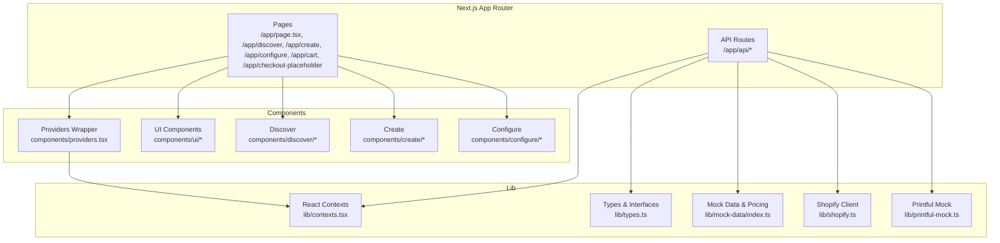
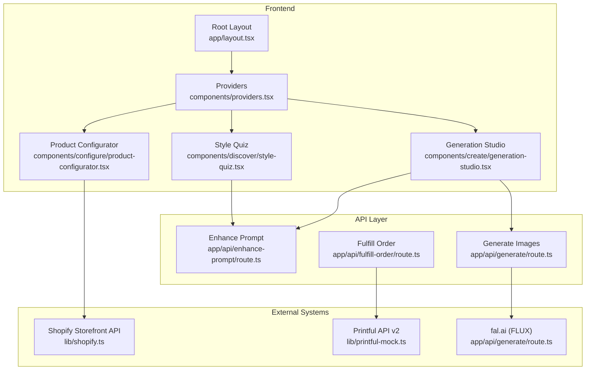
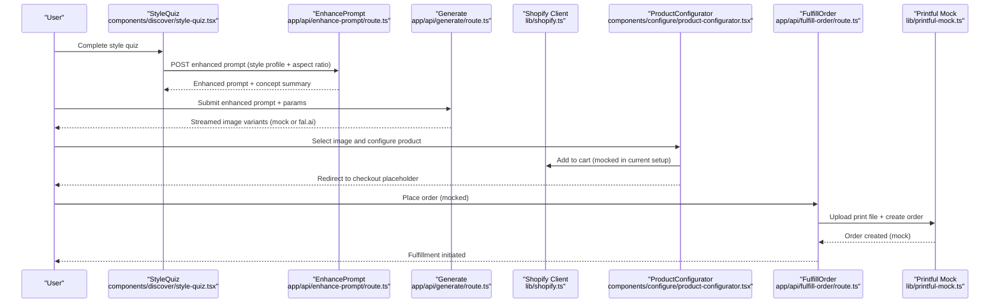
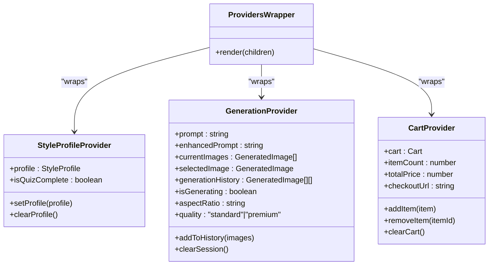
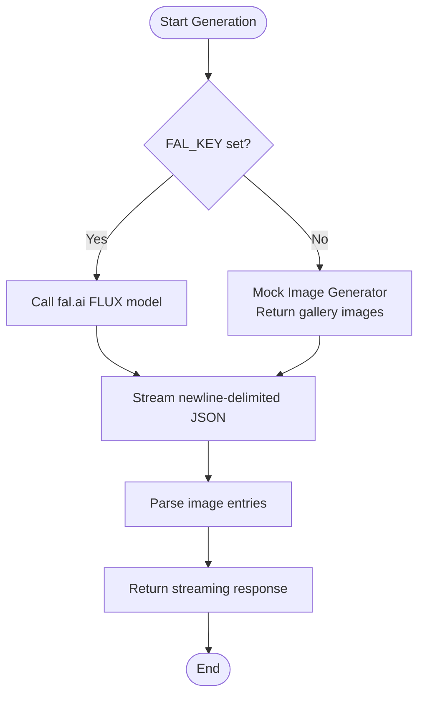
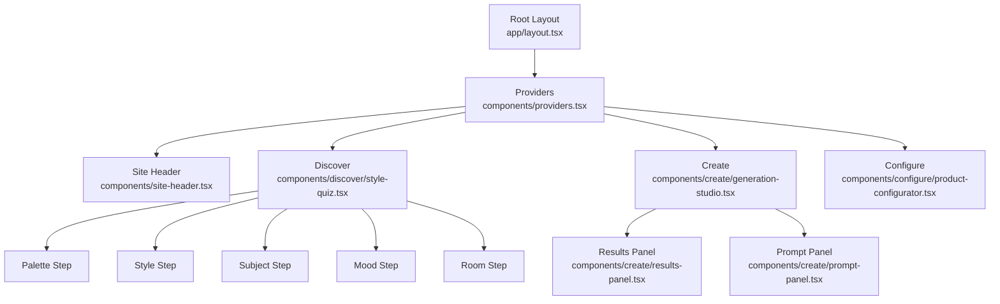

# Architecture Overview

<cite>
**Referenced Files in This Document**
- [README.md](file://README.md)
- [package.json](file://package.json)
- [next.config.mjs](file://next.config.mjs)
- [tailwind.config.ts](file://tailwind.config.ts)
- [lib/shopify.ts](file://lib/shopify.ts)
- [lib/printful-mock.ts](file://lib/printful-mock.ts)
- [lib/contexts.tsx](file://lib/contexts.tsx)
- [lib/types.ts](file://lib/types.ts)
- [lib/mock-data/index.ts](file://lib/mock-data/index.ts)
- [app/layout.tsx](file://app/layout.tsx)
- [components/providers.tsx](file://components/providers.tsx)
- [components/discover/style-quiz.tsx](file://components/discover/style-quiz.tsx)
- [components/create/generation-studio.tsx](file://components/create/generation-studio.tsx)
- [components/configure/product-configurator.tsx](file://components/configure/product-configurator.tsx)
- [app/api/enhance-prompt/route.ts](file://app/api/enhance-prompt/route.ts)
- [app/api/generate/route.ts](file://app/api/generate/route.ts)
- [app/api/fulfill-order/route.ts](file://app/api/fulfill-order/route.ts)
</cite>

## Table of Contents
1. [Introduction](#introduction)
2. [Project Structure](#project-structure)
3. [Core Components](#core-components)
4. [Architecture Overview](#architecture-overview)
5. [Detailed Component Analysis](#detailed-component-analysis)
6. [Dependency Analysis](#dependency-analysis)
7. [Performance Considerations](#performance-considerations)
8. [Troubleshooting Guide](#troubleshooting-guide)
9. [Conclusion](#conclusion)

## Introduction
This document describes the architecture of the Muse AI wall art platform. It covers the high-level design integrating the Next.js 16 App Router frontend, Shopify Storefront API, and Printful fulfillment, along with the end-to-end data flow from the style quiz, through image generation, to product configuration and checkout. It also documents the technology stack, component architecture, state management with React Context, integration patterns, system boundaries, external API integrations, and deployment topology. Cross-cutting concerns such as authentication, error handling, and performance optimization are addressed.

## Project Structure
The project is organized around the Next.js App Router with a clear separation of pages, components, API routes, and shared libraries:
- app/: Next.js pages and API routes under the App Router
- components/: reusable UI components and providers
- lib/: shared types, contexts, mocks, and utilities
- Styles and design system are configured via Tailwind CSS and a global stylesheet



**Diagram sources**
- [app/layout.tsx:26-42](file://app/layout.tsx#L26-L42)
- [components/providers.tsx:5-13](file://components/providers.tsx#L5-L13)
- [lib/contexts.tsx:30-65](file://lib/contexts.tsx#L30-L65)
- [lib/types.ts:1-132](file://lib/types.ts#L1-L132)
- [lib/mock-data/index.ts:1-315](file://lib/mock-data/index.ts#L1-L315)
- [lib/shopify.ts:17-70](file://lib/shopify.ts#L17-L70)
- [lib/printful-mock.ts:38-61](file://lib/printful-mock.ts#L38-L61)

**Section sources**
- [README.md:69-125](file://README.md#L69-L125)
- [package.json:11-63](file://package.json#L11-L63)
- [next.config.mjs:6-19](file://next.config.mjs#L6-L19)
- [tailwind.config.ts:12-68](file://tailwind.config.ts#L12-L68)

## Core Components
- Style Profile Context: Manages user style quiz results and persists them to local storage.
- Generation Context: Orchestrates prompt enhancement, image generation, selection, and refinement history.
- Cart Context: Manages shopping cart state, persistence, and checkout URL.
- UI Providers: Wrap the app with context providers for global state.
- Shopify Client: Encapsulates Storefront GraphQL requests with robust error handling.
- Printful Mock: Provides a mock fulfillment pipeline for development and testing.

Key responsibilities:
- State management via React Context ensures predictable state updates across pages.
- API routes encapsulate integration with external services and expose internal orchestration.
- Shared types and mock data unify data structures and pricing logic.

**Section sources**
- [lib/contexts.tsx:30-65](file://lib/contexts.tsx#L30-L65)
- [lib/contexts.tsx:116-158](file://lib/contexts.tsx#L116-L158)
- [lib/contexts.tsx:185-250](file://lib/contexts.tsx#L185-L250)
- [components/providers.tsx:5-13](file://components/providers.tsx#L5-L13)
- [lib/shopify.ts:17-70](file://lib/shopify.ts#L17-L70)
- [lib/printful-mock.ts:38-61](file://lib/printful-mock.ts#L38-L61)

## Architecture Overview
The system integrates three primary domains:
- Next.js Frontend: Pages and components for discovery, generation, configuration, cart, and checkout.
- Shopify Storefront: Handles cart creation and checkout initiation via GraphQL mutations and queries.
- Printful Fulfillment: Mock fulfillment pipeline simulates file upload and order creation.



**Diagram sources**
- [app/layout.tsx:34-38](file://app/layout.tsx#L34-L38)
- [components/providers.tsx:5-13](file://components/providers.tsx#L5-L13)
- [components/discover/style-quiz.tsx:17-62](file://components/discover/style-quiz.tsx#L17-L62)
- [components/create/generation-studio.tsx:8-34](file://components/create/generation-studio.tsx#L8-L34)
- [components/configure/product-configurator.tsx:19-86](file://components/configure/product-configurator.tsx#L19-L86)
- [app/api/enhance-prompt/route.ts:9-101](file://app/api/enhance-prompt/route.ts#L9-L101)
- [app/api/generate/route.ts:19-144](file://app/api/generate/route.ts#L19-L144)
- [app/api/fulfill-order/route.ts:11-38](file://app/api/fulfill-order/route.ts#L11-L38)
- [lib/shopify.ts:108-157](file://lib/shopify.ts#L108-L157)
- [lib/printful-mock.ts:38-61](file://lib/printful-mock.ts#L38-L61)

## Detailed Component Analysis

### Data Flow: Style Quiz to Checkout
The end-to-end flow from style discovery to checkout and fulfillment:



**Diagram sources**
- [components/discover/style-quiz.tsx:40-48](file://components/discover/style-quiz.tsx#L40-L48)
- [app/api/enhance-prompt/route.ts:9-101](file://app/api/enhance-prompt/route.ts#L9-L101)
- [app/api/generate/route.ts:19-144](file://app/api/generate/route.ts#L19-L144)
- [components/configure/product-configurator.tsx:44-69](file://components/configure/product-configurator.tsx#L44-L69)
- [lib/shopify.ts:108-157](file://lib/shopify.ts#L108-L157)
- [app/api/fulfill-order/route.ts:11-38](file://app/api/fulfill-order/route.ts#L11-L38)
- [lib/printful-mock.ts:38-61](file://lib/printful-mock.ts#L38-L61)

### State Management with React Context
The application uses three contexts to manage global state:
- StyleProfileProvider: Stores and syncs the user’s style profile with local storage.
- GenerationProvider: Tracks prompts, generated images, selection, history, and generation settings.
- CartProvider: Maintains cart items, totals, and persistence.



**Diagram sources**
- [lib/contexts.tsx:30-65](file://lib/contexts.tsx#L30-L65)
- [lib/contexts.tsx:116-158](file://lib/contexts.tsx#L116-L158)
- [lib/contexts.tsx:185-250](file://lib/contexts.tsx#L185-L250)
- [components/providers.tsx:5-13](file://components/providers.tsx#L5-L13)

**Section sources**
- [lib/contexts.tsx:30-65](file://lib/contexts.tsx#L30-L65)
- [lib/contexts.tsx:116-158](file://lib/contexts.tsx#L116-L158)
- [lib/contexts.tsx:185-250](file://lib/contexts.tsx#L185-L250)
- [components/providers.tsx:5-13](file://components/providers.tsx#L5-L13)

### API Integrations and Orchestration
- Enhance Prompt: Transforms user input plus style profile into an optimized prompt for image generation.
- Generate Images: Streams image variants from fal.ai (or mock fallback) based on enhanced prompt and parameters.
- Fulfill Order: Mock endpoint simulates uploading a print file and creating a Printful order.



**Diagram sources**
- [app/api/generate/route.ts:25-64](file://app/api/generate/route.ts#L25-L64)
- [app/api/generate/route.ts:74-113](file://app/api/generate/route.ts#L74-L113)

**Section sources**
- [app/api/enhance-prompt/route.ts:9-101](file://app/api/enhance-prompt/route.ts#L9-L101)
- [app/api/generate/route.ts:19-144](file://app/api/generate/route.ts#L19-L144)
- [app/api/fulfill-order/route.ts:11-38](file://app/api/fulfill-order/route.ts#L11-L38)

### Component Architecture
- Root Layout: Applies fonts, providers, header, and notifications.
- Providers: Compose the three contexts at the top level.
- Discover: Multi-step quiz with step navigation and results.
- Create: Two-panel studio for prompt input and results.
- Configure: Product configurator with live preview and cart integration.



**Diagram sources**
- [app/layout.tsx:32-39](file://app/layout.tsx#L32-L39)
- [components/providers.tsx:5-13](file://components/providers.tsx#L5-L13)
- [components/discover/style-quiz.tsx:94-121](file://components/discover/style-quiz.tsx#L94-L121)
- [components/create/generation-studio.tsx:27-31](file://components/create/generation-studio.tsx#L27-L31)
- [components/configure/product-configurator.tsx:104-126](file://components/configure/product-configurator.tsx#L104-L126)

**Section sources**
- [app/layout.tsx:26-42](file://app/layout.tsx#L26-L42)
- [components/providers.tsx:5-13](file://components/providers.tsx#L5-L13)
- [components/discover/style-quiz.tsx:17-62](file://components/discover/style-quiz.tsx#L17-L62)
- [components/create/generation-studio.tsx:8-34](file://components/create/generation-studio.tsx#L8-L34)
- [components/configure/product-configurator.tsx:19-86](file://components/configure/product-configurator.tsx#L19-L86)

## Dependency Analysis
Technology stack and key dependencies:
- Framework: Next.js 16 with App Router and Turbopack
- Language: TypeScript
- Styling: Tailwind CSS with design tokens and animations
- UI primitives: shadcn/ui components
- State: React Context
- Notifications: Sonner
- Package manager: pnpm

External integrations:
- fal.ai: Image generation via FLUX model
- Shopify Storefront API: Cart and checkout (GraphQL)
- Printful: Fulfillment (mock implementation)

```mermaid
graph TB
NEXT["Next.js 16<br/>package.json:51"] --> TS["TypeScript<br/>package.json:72"]
NEXT --> TWRN["Tailwind CSS<br/>package.json:61, tailwind.config.ts"]
NEXT --> SHADCN["shadcn/ui<br/>components/ui/*"]
NEXT --> RM["Radix UI Primitives<br/>package.json:15-41"]
NEXT --> ANIM["Framer Motion<br/>package.json:48]
NEXT --> FORM["React Hook Form + Zod<br/>package.json:56-63]
NEXT --> UTIL["Utilities<br/>package.json:42-59]
APP["Application Code"] --> NEXT
APP --> RM
APP --> ANIM
APP --> FORM
APP --> UTIL
EXT["External APIs"] --> FAL["fal.ai"]
EXT --> SHOPIFY["Shopify Storefront API"]
EXT --> PF["Printful API"]
```

**Diagram sources**
- [package.json:11-63](file://package.json#L11-L63)
- [tailwind.config.ts:12-68](file://tailwind.config.ts#L12-L68)

**Section sources**
- [package.json:11-63](file://package.json#L11-L63)
- [README.md:35-47](file://README.md#L35-L47)
- [tailwind.config.ts:12-68](file://tailwind.config.ts#L12-L68)

## Performance Considerations
- Streaming responses: The image generation API streams newline-delimited JSON to progressively render results.
- Remote image optimization: Next.js image optimization is configured for trusted hosts.
- Local state persistence: Contexts persist to local storage to reduce re-computation and improve UX.
- Mock fallbacks: Without a fal.ai key, the app serves mock images to maintain responsiveness.
- Client-side rendering: UI components leverage motion and responsive layouts for smooth interactions.

Recommendations:
- Implement request deduplication for concurrent generation requests.
- Add caching for enhanced prompts and frequently used configurations.
- Optimize Tailwind builds and consider component-level CSS extraction for large deployments.
- Monitor API latency for Shopify and Printful during production rollout.

**Section sources**
- [app/api/generate/route.ts:36-64](file://app/api/generate/route.ts#L36-L64)
- [next.config.mjs:6-19](file://next.config.mjs#L6-L19)
- [lib/contexts.tsx:34-54](file://lib/contexts.tsx#L34-L54)

## Troubleshooting Guide
Common issues and resolutions:
- Shopify credentials missing: Ensure NEXT_PUBLIC_SHOPIFY_STORE_DOMAIN and NEXT_PUBLIC_SHOPIFY_STOREFRONT_ACCESS_TOKEN are set; the client throws explicit errors on 401 or missing data.
- Printful mock behavior: The mock returns randomized identifiers; replace with real API calls when integrating.
- fal.ai key missing: Without FAL_KEY, the app falls back to mock images; add the key to enable real generation.
- Cart persistence: Cart state is persisted to local storage; clearing local storage resets the cart.

Operational checks:
- Verify environment variables for Shopify and Printful before enabling production features.
- Confirm network access to external APIs and appropriate CORS/CDN policies for image assets.
- Use browser devtools to inspect API responses and network timing for generation and fulfillment flows.

**Section sources**
- [lib/shopify.ts:18-20](file://lib/shopify.ts#L18-L20)
- [lib/shopify.ts:44-52](file://lib/shopify.ts#L44-L52)
- [lib/shopify.ts:66-69](file://lib/shopify.ts#L66-L69)
- [lib/printful-mock.ts:11-13](file://lib/printful-mock.ts#L11-L13)
- [app/api/generate/route.ts:25-35](file://app/api/generate/route.ts#L25-L35)

## Conclusion
The Muse AI wall art platform employs a clean, modular architecture centered on Next.js 16 App Router, with React Context managing state across the user journey from style discovery to checkout and fulfillment. The design cleanly separates concerns between UI, API orchestration, and external integrations, with mock implementations ready for production rollout. By leveraging streaming responses, local persistence, and a cohesive design system, the platform balances performance, scalability, and user experience.