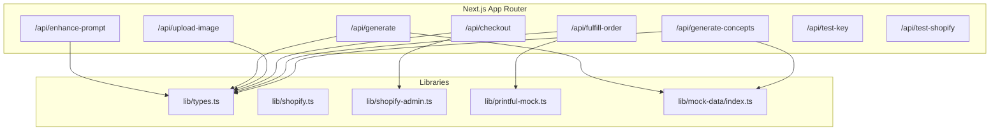
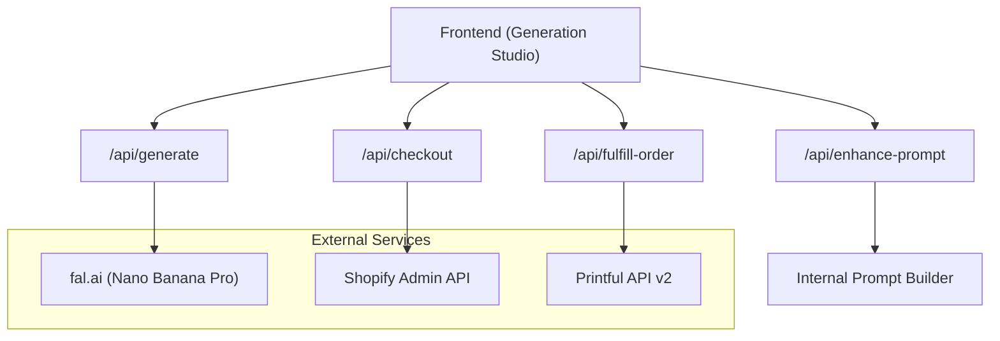
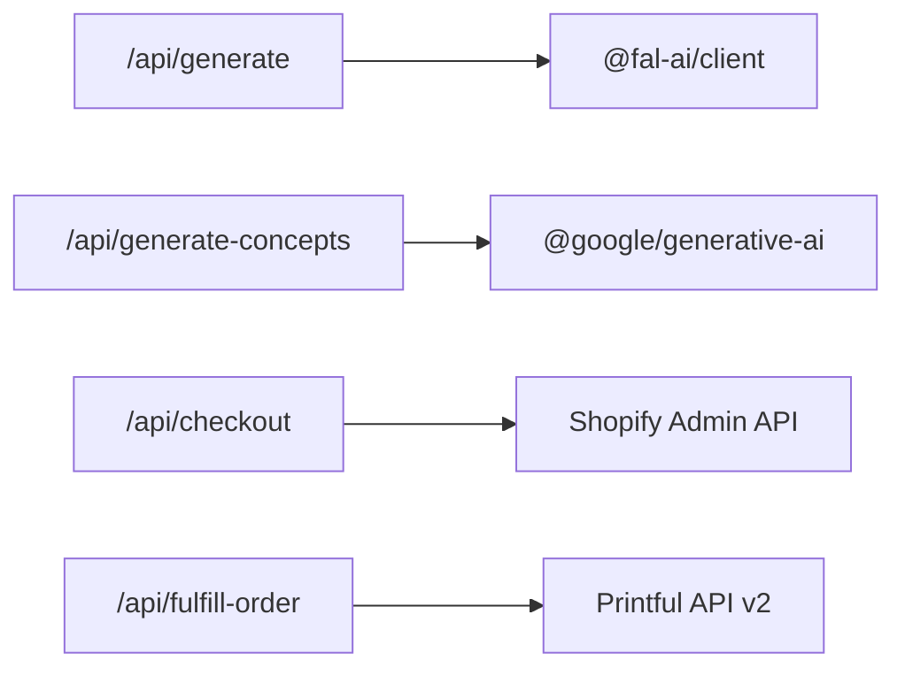

# Backend API Design

<cite>
**Referenced Files in This Document**
- [enhance-prompt route](file://app/api/enhance-prompt/route.ts)
- [generate route](file://app/api/generate/route.ts)
- [upload-image route](file://app/api/upload-image/route.ts)
- [checkout route](file://app/api/checkout/route.ts)
- [fulfill-order route](file://app/api/fulfill-order/route.ts)
- [generate-concepts route](file://app/api/generate-concepts/route.ts)
- [test-key route](file://app/api/test-key/route.ts)
- [test-shopify route](file://app/api/test-shopify/route.ts)
- [types](file://lib/types.ts)
- [shopify.ts](file://lib/shopify.ts)
- [shopify-admin.ts](file://lib/shopify-admin.ts)
- [printful-mock.ts](file://lib/printful-mock.ts)
- [mock-data/index.ts](file://lib/mock-data/index.ts)
- [package.json](file://package.json)
- [README.md](file://README.md)
</cite>

## Table of Contents
1. [Introduction](#introduction)
2. [Project Structure](#project-structure)
3. [Core Components](#core-components)
4. [Architecture Overview](#architecture-overview)
5. [Detailed Component Analysis](#detailed-component-analysis)
6. [Dependency Analysis](#dependency-analysis)
7. [Performance Considerations](#performance-considerations)
8. [Troubleshooting Guide](#troubleshooting-guide)
9. [Conclusion](#conclusion)
10. [Appendices](#appendices)

## Introduction
This document describes the backend API that powers the Muse AI platform. It covers RESTful endpoints for prompt enhancement, image generation, file uploads, checkout processing, and order fulfillment. It also documents authentication, rate limiting, security considerations, and integration patterns with external services such as Shopify and Printful. The API is implemented as Next.js App Router API routes under app/api/.

## Project Structure
The backend API is organized by feature-specific routes under app/api/. Shared types and integrations live under lib/.

**Diagram sources**
- [enhance-prompt route:1-102](file://app/api/enhance-prompt/route.ts#L1-L102)
- [generate route:1-145](file://app/api/generate/route.ts#L1-L145)
- [upload-image route:1-22](file://app/api/upload-image/route.ts#L1-L22)
- [checkout route:1-76](file://app/api/checkout/route.ts#L1-L76)
- [fulfill-order route:1-39](file://app/api/fulfill-order/route.ts#L1-L39)
- [generate-concepts route:1-190](file://app/api/generate-concepts/route.ts#L1-L190)
- [test-key route:1-14](file://app/api/test-key/route.ts#L1-L14)
- [test-shopify route:1-91](file://app/api/test-shopify/route.ts#L1-L91)
- [types:1-132](file://lib/types.ts#L1-L132)
- [shopify.ts:1-303](file://lib/shopify.ts#L1-L303)
- [shopify-admin.ts:1-103](file://lib/shopify-admin.ts#L1-L103)
- [printful-mock.ts:1-77](file://lib/printful-mock.ts#L1-L77)
- [mock-data/index.ts:1-315](file://lib/mock-data/index.ts#L1-L315)

**Section sources**
- [README.md:60-68](file://README.md#L60-L68)

## Core Components
- Prompt Enhancement: Transforms user input and style profile into an optimized prompt for image generation.
- Image Generation: Streams generated images via fal.ai (with mock fallback).
- File Upload: Returns a public URL for print production (mock).
- Checkout: Creates a Shopify Draft Order and returns an invoice URL.
- Fulfillment: Creates a Printful fulfillment order (mock).
- Concept Generation: Provides curated starting concepts (LLM-backed with fallback).
- Health Checks: Verifies service keys and Shopify connectivity.

**Section sources**
- [enhance-prompt route:9-101](file://app/api/enhance-prompt/route.ts#L9-L101)
- [generate route:19-144](file://app/api/generate/route.ts#L19-L144)
- [upload-image route:8-21](file://app/api/upload-image/route.ts#L8-L21)
- [checkout route:5-75](file://app/api/checkout/route.ts#L5-L75)
- [fulfill-order route:11-38](file://app/api/fulfill-order/route.ts#L11-L38)
- [generate-concepts route:141-189](file://app/api/generate-concepts/route.ts#L141-L189)
- [test-key route:3-13](file://app/api/test-key/route.ts#L3-L13)
- [test-shopify route:3-90](file://app/api/test-shopify/route.ts#L3-L90)

## Architecture Overview
The backend integrates with external services for image generation, e-commerce, and fulfillment. The flow begins with a style quiz and prompt enhancement, proceeds to image generation, and ends with checkout and fulfillment.

**Diagram sources**
- [generate route:19-144](file://app/api/generate/route.ts#L19-L144)
- [checkout route:5-75](file://app/api/checkout/route.ts#L5-L75)
- [fulfill-order route:11-38](file://app/api/fulfill-order/route.ts#L11-L38)
- [shopify-admin.ts:25-94](file://lib/shopify-admin.ts#L25-L94)
- [printful-mock.ts:38-61](file://lib/printful-mock.ts#L38-L61)

## Detailed Component Analysis

### Prompt Enhancement API
- Method: POST
- Path: /api/enhance-prompt
- Purpose: Enhances user input with style profile and aspect ratio to produce an optimized prompt and concept summary.

Request schema
- userInput: string
- styleProfile: StyleProfile
  - palettes: PaletteOption[]
  - styles: StyleOption[]
  - subjects: SubjectOption[]
  - mood: MoodOption|null
  - room: RoomOption|null
- aspectRatio: string

Response schema
- enhancedPrompt: string
- conceptSummary: string

Behavior
- Builds a composite prompt using style profile mappings and aspect ratio context.
- Returns a concise concept summary derived from the style profile.

Error handling
- Returns 200 OK with enhanced prompt and summary on success.
- No explicit error responses are defined in the route; validation failures should be handled by the caller.

Security and rate limiting
- No authentication or rate limiting is implemented in this route.

Example usage
- Client sends a JSON payload with user input, style profile, and aspect ratio.
- Server responds with enhanced prompt and concept summary.

**Section sources**
- [enhance-prompt route:9-101](file://app/api/enhance-prompt/route.ts#L9-L101)
- [types:32-41](file://lib/types.ts#L32-L41)

### Image Generation API
- Method: POST
- Path: /api/generate
- Purpose: Generates image variants using fal.ai Nano Banana Pro (streams newline-delimited JSON). Falls back to mock images if FAL_KEY is not configured.

Request schema
- enhancedPrompt: string
- aspectRatio: string ("3:4" | "1:1" | "4:3" | "16:9")
- count: number (max 4)
- quality: "standard"|"premium"

Response schema
- Stream of newline-delimited JSON objects:
  - id: string
  - url: string
  - prompt: string
  - width: number
  - height: number

Behavior
- Validates aspect ratio and maps to internal dimensions.
- If FAL_KEY is present, subscribes to fal.ai model and streams results.
- If FAL_KEY is missing, streams mock images from the gallery.

Error handling
- On fal.ai failure, falls back to mock images.
- Logs warnings and continues with mock data.

Security and rate limiting
- No authentication or rate limiting is implemented in this route.

Example usage
- Client sends a JSON payload with enhanced prompt, aspect ratio, count, and quality.
- Server streams image metadata until completion.

**Section sources**
- [generate route:19-144](file://app/api/generate/route.ts#L19-L144)
- [types:43-52](file://lib/types.ts#L43-L52)
- [mock-data/index.ts:82-169](file://lib/mock-data/index.ts#L82-L169)

### File Upload API
- Method: POST
- Path: /api/upload-image
- Purpose: Returns a public URL for print production (mock). In production, this would upload to cloud storage and return a CDN URL.

Request schema
- imageUrl: string

Response schema
- publicUrl: string
- fileId: string

Behavior
- Simulates upload delay and returns either the provided URL or a mock URL.

Error handling
- Returns 200 OK with public URL and fileId on success.

Security and rate limiting
- No authentication or rate limiting is implemented in this route.

Example usage
- Client sends the selected image URL.
- Server responds with a public URL suitable for Printful.

**Section sources**
- [upload-image route:8-21](file://app/api/upload-image/route.ts#L8-L21)

### Checkout API
- Method: POST
- Path: /api/checkout
- Purpose: Creates a Shopify Draft Order and returns an invoice URL. If Shopify is not configured, returns a mock checkout URL.

Request schema
- items: CartItem[]
  - id: string
  - variantId: string
  - imageId: string
  - imageUrl: string
  - title: string
  - size: string
  - medium: string
  - frame: string
  - mat: string
  - price: number (cents)
  - quantity: number
- email: string (optional)

Response schema
- checkoutUrl: string
- orderId: string
- isMock: boolean

Behavior
- Validates presence of items.
- Converts cart items to Shopify line items with properties for image URL, size, medium, frame, and mat.
- Creates a draft order via Shopify Admin API.
- Returns invoice URL and order ID; if not configured, returns mock values.

Error handling
- Returns 400 if items are missing.
- Returns 500 with error details on failure.

Security and rate limiting
- No authentication or rate limiting is implemented in this route.

Example usage
- Client sends cart items and optional email.
- Server returns a checkout URL and order identifier.

**Section sources**
- [checkout route:5-75](file://app/api/checkout/route.ts#L5-L75)
- [types:91-110](file://lib/types.ts#L91-L110)
- [shopify-admin.ts:25-94](file://lib/shopify-admin.ts#L25-L94)

### Fulfillment API
- Method: POST
- Path: /api/fulfill-order
- Purpose: Creates a Printful fulfillment order (mock). In production, this would be triggered by a Shopify webhook.

Request schema
- imageUrl: string
- recipient: Recipient (name, address1, city, state_code, country_code, zip)
- variantId: string
- retailPrice: string

Response schema
- success: boolean
- printfulOrderId: number
- status: string

Behavior
- Uploads the print-ready file to Printful.
- Creates a fulfillment order with the specified variant and retail price.
- Returns success, order ID, and status.

Error handling
- Returns 500 with error on failure.

Security and rate limiting
- No authentication or rate limiting is implemented in this route.

Example usage
- Client sends image URL, recipient details, variant ID, and retail price.
- Server responds with fulfillment confirmation.

**Section sources**
- [fulfill-order route:11-38](file://app/api/fulfill-order/route.ts#L11-L38)
- [printful-mock.ts:38-61](file://lib/printful-mock.ts#L38-L61)

### Concept Generation API
- Methods: GET and POST
- Path: /api/generate-concepts
- Purpose: Returns curated starting concepts. Supports fetching defaults or generating new concepts based on a style profile.

GET
- Response schema
  - concepts: StartingConcept[]
    - id: string
    - title: string
    - prompt: string
    - styles: StyleOption[]
    - subjects: SubjectOption[]
    - moods: MoodOption[]

POST
- Request schema
  - styleProfile: StyleProfile (optional)
- Response schema
  - concepts: StartingConcept[]

Behavior
- If GOOGLE_AI_API_KEY is present, queries Gemini to generate concepts; otherwise uses fallback concepts.
- POST supports building a user prompt from a style profile.

Error handling
- Returns fallback concepts on API failure or missing key.

Security and rate limiting
- No authentication or rate limiting is implemented in this route.

Example usage
- GET returns default concepts.
- POST with styleProfile returns AI-generated concepts aligned with the profile.

**Section sources**
- [generate-concepts route:141-189](file://app/api/generate-concepts/route.ts#L141-L189)
- [types:124-131](file://lib/types.ts#L124-L131)
- [mock-data/index.ts:172-237](file://lib/mock-data/index.ts#L172-L237)

### Health Check APIs

#### Test API Key
- Method: GET
- Path: /api/test-key
- Purpose: Reports whether the fal.ai API key is configured.

Response schema
- hasKey: boolean
- keyPrefix: string
- message: string

**Section sources**
- [test-key route:3-13](file://app/api/test-key/route.ts#L3-L13)

#### Test Shopify
- Method: GET
- Path: /api/test-shopify
- Purpose: Tests Shopify Admin API configuration and connectivity.

Response schema
- configured: boolean
- connected: boolean
- message: string
- details: object (domain/token/version booleans)
- instructions: string
- endpoint: string
- shop: object (name, domain, email) (when connected)
- status: number (when not connected)
- error: string
- troubleshooting: object (HTTP status-specific guidance)

**Section sources**
- [test-shopify route:3-90](file://app/api/test-shopify/route.ts#L3-L90)

## Dependency Analysis
External dependencies and integrations:
- fal.ai client for image generation
- Google Generative AI for concept generation
- Shopify Admin API for draft orders
- Printful API v2 for fulfillment (mock)

**Diagram sources**
- [generate route:2-2](file://app/api/generate/route.ts#L2-L2)
- [generate-concepts route:2-2](file://app/api/generate-concepts/route.ts#L2-L2)
- [checkout route:2-2](file://app/api/checkout/route.ts#L2-L2)
- [fulfill-order route:2-2](file://app/api/fulfill-order/route.ts#L2-L2)
- [package.json:12-13](file://package.json#L12-L13)

**Section sources**
- [package.json:11-81](file://package.json#L11-L81)

## Performance Considerations
- Streaming responses: The image generation endpoint streams newline-delimited JSON to reduce latency and memory usage during generation.
- Mock fallback: When FAL_KEY is missing, the system streams preselected gallery images to avoid blocking the UI.
- Delays: Routes intentionally introduce small delays to simulate network and processing overhead, improving UX consistency.
- Rate limits: Not implemented at the API level; consider implementing rate limiting and caching at the platform layer if needed.

[No sources needed since this section provides general guidance]

## Troubleshooting Guide
Common issues and resolutions:
- Missing fal.ai key
  - Symptom: Image generation falls back to mock images.
  - Action: Set FAL_KEY and restart the server.
- Shopify not configured
  - Symptom: Checkout returns mock values.
  - Action: Set SHOPIFY_STORE_DOMAIN, SHOPIFY_ACCESS_TOKEN, and SHOPIFY_API_VERSION; verify Admin API permissions.
- Shopify Admin API errors
  - 401: Invalid access token or missing Admin API permissions.
  - 403: Insufficient permissions for draft orders.
  - 404: Incorrect store domain.
- Printful fulfillment
  - Currently mocked; ensure production credentials are configured when enabling real fulfillment.

**Section sources**
- [generate route:32-64](file://app/api/generate/route.ts#L32-L64)
- [checkout route:18-27](file://app/api/checkout/route.ts#L18-L27)
- [test-shopify route:43-58](file://app/api/test-shopify/route.ts#L43-L58)
- [fulfill-order route:34-37](file://app/api/fulfill-order/route.ts#L34-L37)

## Conclusion
The Muse AI backend provides a cohesive set of API endpoints that orchestrate prompt enhancement, image generation, checkout, and fulfillment. While several routes currently use mocks, the architecture is designed to integrate seamlessly with production services such as fal.ai, Shopify, and Printful. Security and rate limiting are not implemented at the API level and should be considered for production deployments.

[No sources needed since this section summarizes without analyzing specific files]

## Appendices

### Authentication and Security
- Authentication: No authentication is implemented in the current routes.
- Recommendations:
  - Add API key validation for sensitive endpoints.
  - Enforce HTTPS and secure headers.
  - Implement rate limiting and request quotas.
  - Sanitize and validate all request inputs.

[No sources needed since this section provides general guidance]

### Integration Patterns
- Prompt Enhancement → Image Generation: The enhanced prompt is passed to the image generation endpoint to produce variants.
- Checkout: Cart items are transformed into Shopify line items and a draft order is created.
- Fulfillment: After checkout, the fulfillment endpoint uploads the print file and creates a Printful order.

**Section sources**
- [enhance-prompt route:9-101](file://app/api/enhance-prompt/route.ts#L9-L101)
- [generate route:19-144](file://app/api/generate/route.ts#L19-L144)
- [checkout route:5-75](file://app/api/checkout/route.ts#L5-L75)
- [fulfill-order route:11-38](file://app/api/fulfill-order/route.ts#L11-L38)