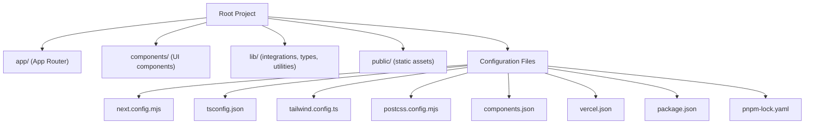
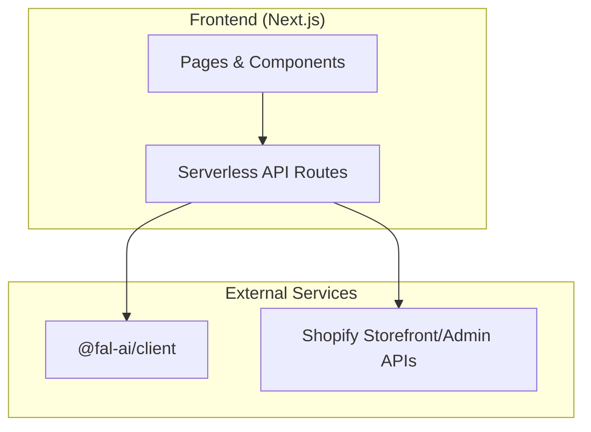
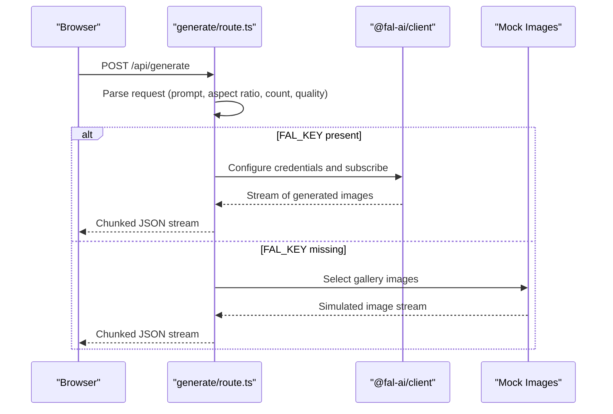
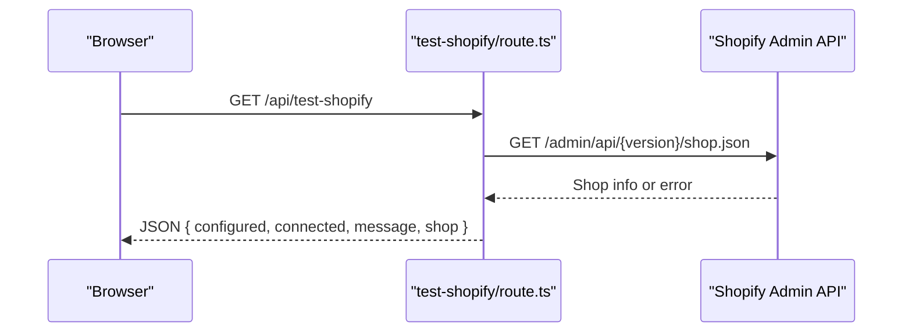
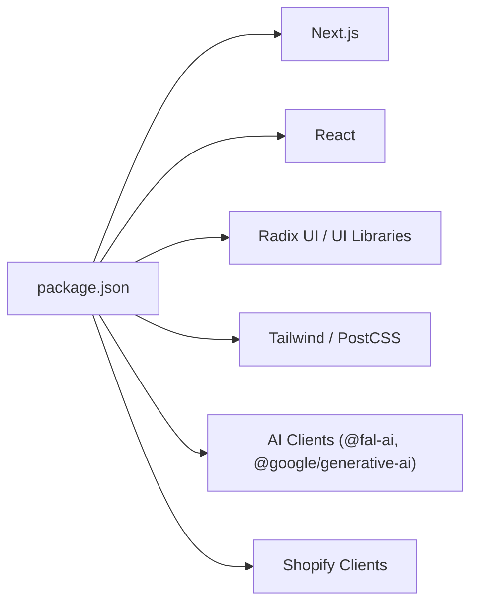

# Deployment & Configuration

<cite>
**Referenced Files in This Document**
- [package.json](file://package.json)
- [pnpm-lock.yaml](file://pnpm-lock.yaml)
- [vercel.json](file://vercel.json)
- [next.config.mjs](file://next.config.mjs)
- [tsconfig.json](file://tsconfig.json)
- [tailwind.config.ts](file://tailwind.config.ts)
- [postcss.config.mjs](file://postcss.config.mjs)
- [components.json](file://components.json)
- [lib/types.ts](file://lib/types.ts)
- [lib/utils.ts](file://lib/utils.ts)
- [lib/shopify.ts](file://lib/shopify.ts)
- [lib/shopify-admin.ts](file://lib/shopify-admin.ts)
- [lib/shopify-mock.ts](file://lib/shopify-mock.ts)
- [app/layout.tsx](file://app/layout.tsx)
- [app/api/generate/route.ts](file://app/api/generate/route.ts)
- [app/api/test-key/route.ts](file://app/api/test-key/route.ts)
- [app/api/test-shopify/route.ts](file://app/api/test-shopify/route.ts)
- [SHOPIFY_ADMIN_API_SETUP.md](file://SHOPIFY_ADMIN_API_SETUP.md)
- [SHOPIFY_TROUBLESHOOTING.md](file://SHOPIFY_TROUBLESHOOTING.md)
- [TROUBLESHOOTING.md](file://TROUBLESHOOTING.md)
</cite>

## Table of Contents
1. [Introduction](#introduction)
2. [Project Structure](#project-structure)
3. [Core Components](#core-components)
4. [Architecture Overview](#architecture-overview)
5. [Detailed Component Analysis](#detailed-component-analysis)
6. [Dependency Analysis](#dependency-analysis)
7. [Performance Considerations](#performance-considerations)
8. [Troubleshooting Guide](#troubleshooting-guide)
9. [Conclusion](#conclusion)
10. [Appendices](#appendices)

## Introduction
This document provides deployment and configuration guidance for the Muse AI platform, a Next.js application integrated with AI image generation and Shopify fulfillment. It covers build configuration, environment variables, Vercel hosting setup, TypeScript and Tailwind CSS configuration, component library setup, package management with pnpm, production deployment workflows, environment-specific configurations, monitoring, security, performance optimizations, and scaling considerations.

## Project Structure
The project follows a Next.js App Router structure with a clear separation of client-side pages, API routes, shared components, and libraries for integrations. Key configuration files define build behavior, styling, and component library conventions.

**Diagram sources**
- [next.config.mjs:1-23](file://next.config.mjs#L1-L23)
- [tsconfig.json:1-34](file://tsconfig.json#L1-L34)
- [tailwind.config.ts:1-101](file://tailwind.config.ts#L1-L101)
- [postcss.config.mjs:1-9](file://postcss.config.mjs#L1-L9)
- [components.json:1-22](file://components.json#L1-L22)
- [vercel.json:1-5](file://vercel.json#L1-L5)
- [package.json:1-81](file://package.json#L1-L81)
- [pnpm-lock.yaml:1-200](file://pnpm-lock.yaml#L1-L200)

**Section sources**
- [next.config.mjs:1-23](file://next.config.mjs#L1-L23)
- [tsconfig.json:1-34](file://tsconfig.json#L1-L34)
- [tailwind.config.ts:1-101](file://tailwind.config.ts#L1-L101)
- [postcss.config.mjs:1-9](file://postcss.config.mjs#L1-L9)
- [components.json:1-22](file://components.json#L1-L22)
- [vercel.json:1-5](file://vercel.json#L1-L5)
- [package.json:1-81](file://package.json#L1-L81)
- [pnpm-lock.yaml:1-200](file://pnpm-lock.yaml#L1-L200)

## Core Components
- Build and framework configuration: Next.js configuration defines TypeScript behavior and remote image domains.
- Type-safe contracts: Shared types define the shape of prompts, generation requests, cart items, and product variants.
- Styling pipeline: Tailwind CSS with PostCSS, plus a component library configuration for shadcn/ui.
- Integrations: Shopify storefront and admin clients, with mock implementations for local development.
- API routes: Image generation and environment checks exposed via Next.js API routes.

**Section sources**
- [next.config.mjs:1-23](file://next.config.mjs#L1-L23)
- [lib/types.ts:1-132](file://lib/types.ts#L1-L132)
- [tailwind.config.ts:1-101](file://tailwind.config.ts#L1-L101)
- [postcss.config.mjs:1-9](file://postcss.config.mjs#L1-L9)
- [components.json:1-22](file://components.json#L1-L22)
- [lib/shopify.ts:1-303](file://lib/shopify.ts#L1-L303)
- [lib/shopify-admin.ts:1-103](file://lib/shopify-admin.ts#L1-L103)
- [lib/shopify-mock.ts:1-74](file://lib/shopify-mock.ts#L1-L74)
- [app/api/generate/route.ts:1-145](file://app/api/generate/route.ts#L1-L145)
- [app/api/test-key/route.ts:1-14](file://app/api/test-key/route.ts#L1-L14)
- [app/api/test-shopify/route.ts:1-39](file://app/api/test-shopify/route.ts#L1-L39)

## Architecture Overview
The platform integrates AI image generation with a Shopify fulfillment pipeline. The frontend is a Next.js application that communicates with external APIs via serverless routes.

**Diagram sources**
- [app/api/generate/route.ts:1-145](file://app/api/generate/route.ts#L1-L145)
- [lib/shopify.ts:1-303](file://lib/shopify.ts#L1-L303)
- [lib/shopify-admin.ts:1-103](file://lib/shopify-admin.ts#L1-L103)

## Detailed Component Analysis

### Build and Framework Configuration
- Next.js configuration:
  - TypeScript: Build errors are ignored during the build phase to allow partial type updates.
  - Remote images: Whitelist domains for AI-generated and storage images.
- TypeScript configuration:
  - Strict mode enabled with ES target and bundler module resolution.
  - Path aliases mapped via tsconfig.
- Tailwind CSS:
  - Dark mode via class strategy.
  - Content scanning across pages, components, and app directories.
  - Theme extensions for colors, fonts, radii, and animations.
- PostCSS:
  - Tailwind CSS plugin loaded.
- Component library (shadcn/ui):
  - RSC and TSX enabled.
  - Tailwind config and CSS variables aligned with project setup.
  - Aliases for components, utils, and hooks.

**Section sources**
- [next.config.mjs:1-23](file://next.config.mjs#L1-L23)
- [tsconfig.json:1-34](file://tsconfig.json#L1-L34)
- [tailwind.config.ts:1-101](file://tailwind.config.ts#L1-L101)
- [postcss.config.mjs:1-9](file://postcss.config.mjs#L1-L9)
- [components.json:1-22](file://components.json#L1-L22)

### Package Management with pnpm
- Lockfile and overrides:
  - The lockfile reflects pinned dependency versions and overrides for React types.
- Scripts:
  - Dev, build, start, and lint scripts for Next.js.
- Dependencies:
  - Next.js, React, Radix UI primitives, Tailwind-based UI packages, and AI clients.
- Overrides:
  - Ensures consistent React and React DOM types across the project.

**Section sources**
- [pnpm-lock.yaml:1-200](file://pnpm-lock.yaml#L1-L200)
- [package.json:1-81](file://package.json#L1-L81)

### Environment Variables and Secrets
- AI image generation:
  - FAL_KEY is required for real-time generation; otherwise, mock images are streamed.
- Shopify integration:
  - Storefront API:
    - NEXT_PUBLIC_SHOPIFY_STORE_DOMAIN and NEXT_PUBLIC_SHOPIFY_STOREFRONT_ACCESS_TOKEN are required for storefront operations.
    - NEXT_PUBLIC_SHOPIFY_API_VERSION supports versioned API calls.
  - Admin API:
    - SHOPIFY_STORE_DOMAIN, SHOPIFY_ACCESS_TOKEN, and SHOPIFY_API_VERSION are required for draft orders.
- Verification endpoints:
  - /api/test-key validates FAL_KEY presence.
  - /api/test-shopify validates Admin API configuration and connectivity.

**Section sources**
- [app/api/generate/route.ts:1-145](file://app/api/generate/route.ts#L1-L145)
- [app/api/test-key/route.ts:1-14](file://app/api/test-key/route.ts#L1-L14)
- [app/api/test-shopify/route.ts:1-39](file://app/api/test-shopify/route.ts#L1-L39)
- [lib/shopify.ts:1-303](file://lib/shopify.ts#L1-L303)
- [lib/shopify-admin.ts:1-103](file://lib/shopify-admin.ts#L1-L103)

### API Workflows

#### Image Generation Flow

**Diagram sources**
- [app/api/generate/route.ts:1-145](file://app/api/generate/route.ts#L1-L145)

#### Shopify Draft Order Creation Flow

**Diagram sources**
- [app/api/test-shopify/route.ts:1-39](file://app/api/test-shopify/route.ts#L1-L39)
- [lib/shopify-admin.ts:1-103](file://lib/shopify-admin.ts#L1-L103)

### Component Library Setup (shadcn/ui)
- Configuration aligns with Tailwind CSS and project aliases.
- Enables TSX and RSC compatibility.
- Provides consistent component usage across the application.

**Section sources**
- [components.json:1-22](file://components.json#L1-L22)
- [tailwind.config.ts:1-101](file://tailwind.config.ts#L1-L101)

### Styling Pipeline
- Tailwind CSS configured with theme extensions and plugin support.
- PostCSS pipeline applies Tailwind directives.
- Utility function combines and merges class names for predictable styling.

**Section sources**
- [tailwind.config.ts:1-101](file://tailwind.config.ts#L1-L101)
- [postcss.config.mjs:1-9](file://postcss.config.mjs#L1-L9)
- [lib/utils.ts:1-7](file://lib/utils.ts#L1-L7)

### Layout and Global Styles
- Root layout sets metadata, font variables, and global providers.
- Sonner toast provider and site header included at the top level.

**Section sources**
- [app/layout.tsx:1-43](file://app/layout.tsx#L1-L43)

## Dependency Analysis
The project’s runtime dependencies center on Next.js, React, UI primitives, Tailwind-based components, and AI/ecommerce integrations. The lockfile ensures deterministic installs and consistent versions.

**Diagram sources**
- [package.json:1-81](file://package.json#L1-L81)
- [pnpm-lock.yaml:1-200](file://pnpm-lock.yaml#L1-L200)

**Section sources**
- [package.json:1-81](file://package.json#L1-L81)
- [pnpm-lock.yaml:1-200](file://pnpm-lock.yaml#L1-L200)

## Performance Considerations
- Streaming responses:
  - Image generation uses a readable stream to progressively deliver results, reducing perceived latency.
- Remote image optimization:
  - Next.js image optimization is configured for whitelisted domains to improve load performance.
- Build-time type checking:
  - TypeScript build errors are ignored to accelerate builds; ensure type safety via development linters and tests.
- Asset delivery:
  - Tailwind CSS is processed via PostCSS; ensure purge/content globs are accurate to minimize CSS size.

[No sources needed since this section provides general guidance]

## Troubleshooting Guide
- Shopify Admin API verification:
  - Use the test endpoint to confirm domain, token, and API version configuration.
  - Follow documented steps to resolve 401, domain formatting, and environment variable loading issues.
- Environment variables:
  - Confirm exact variable names and absence of quotes/spaces.
  - Restart the development server after changes.
- Prevention tips:
  - Restart server after .env changes, monitor rate limits, and keep dependencies updated.

**Section sources**
- [app/api/test-shopify/route.ts:1-39](file://app/api/test-shopify/route.ts#L1-L39)
- [SHOPIFY_ADMIN_API_SETUP.md:67-132](file://SHOPIFY_ADMIN_API_SETUP.md#L67-L132)
- [SHOPIFY_TROUBLESHOOTING.md:62-125](file://SHOPIFY_TROUBLESHOOTING.md#L62-L125)
- [TROUBLESHOOTING.md:338-364](file://TROUBLESHOOTING.md#L338-L364)

## Conclusion
The Muse AI platform is configured for efficient development and production deployment using Next.js, pnpm, Tailwind CSS, and shadcn/ui. Integrations with AI generation and Shopify are encapsulated behind API routes and environment-driven configuration. Following the deployment and configuration practices outlined here will ensure reliable builds, secure secrets handling, and scalable performance.

[No sources needed since this section summarizes without analyzing specific files]

## Appendices

### Vercel Deployment Configuration
- Framework detection:
  - Vercel is configured to use Next.js.
- Build command:
  - Install dependencies with pnpm and run the Next.js build script.

**Section sources**
- [vercel.json:1-5](file://vercel.json#L1-L5)
- [package.json:1-81](file://package.json#L1-L81)

### Environment Variable Reference
- AI image generation:
  - FAL_KEY: Required for real-time generation; optional for mock fallback.
- Shopify Storefront API:
  - NEXT_PUBLIC_SHOPIFY_STORE_DOMAIN: Store domain without protocol or trailing slash.
  - NEXT_PUBLIC_SHOPIFY_STOREFRONT_ACCESS_TOKEN: Storefront access token.
  - NEXT_PUBLIC_SHOPIFY_API_VERSION: Optional API version.
- Shopify Admin API:
  - SHOPIFY_STORE_DOMAIN: Store domain without protocol or trailing slash.
  - SHOPIFY_ACCESS_TOKEN: Admin access token with appropriate scopes.
  - SHOPIFY_API_VERSION: Optional API version.

**Section sources**
- [app/api/generate/route.ts:1-145](file://app/api/generate/route.ts#L1-L145)
- [lib/shopify.ts:1-303](file://lib/shopify.ts#L1-L303)
- [lib/shopify-admin.ts:1-103](file://lib/shopify-admin.ts#L1-L103)

### Monitoring and Health Checks
- Use the provided endpoints to validate configuration:
  - /api/test-key: Confirms FAL_KEY availability.
  - /api/test-shopify: Confirms Admin API configuration and connectivity.

**Section sources**
- [app/api/test-key/route.ts:1-14](file://app/api/test-key/route.ts#L1-L14)
- [app/api/test-shopify/route.ts:1-39](file://app/api/test-shopify/route.ts#L1-L39)