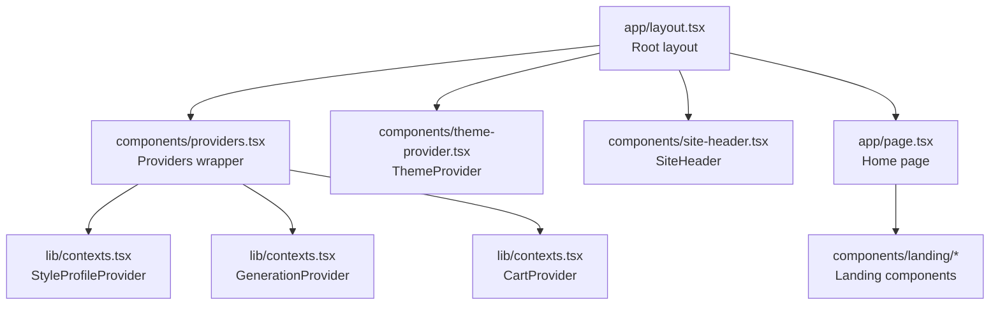
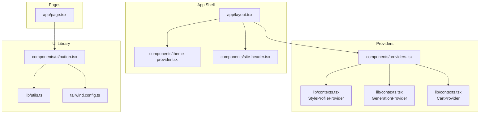
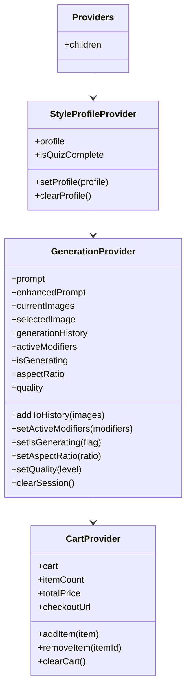
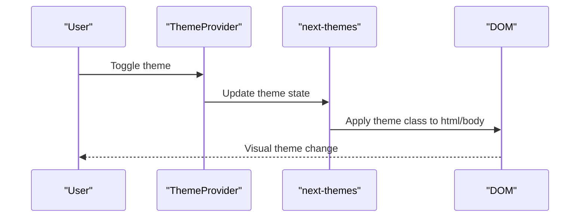
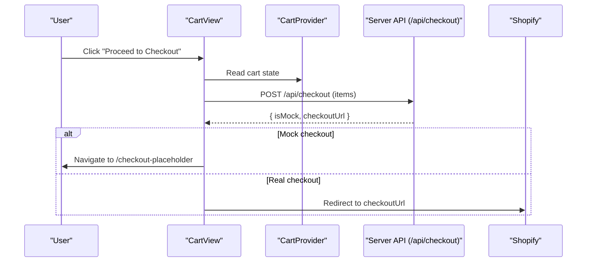
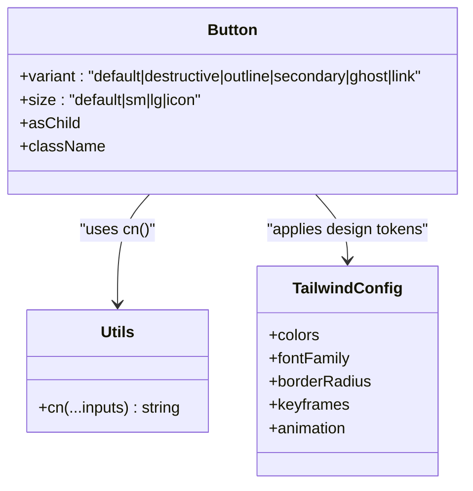
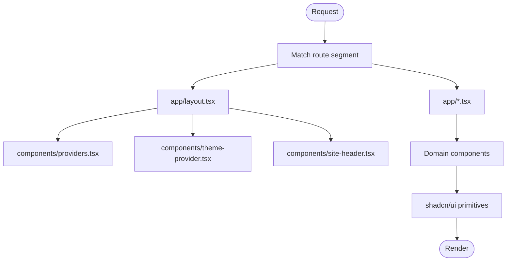
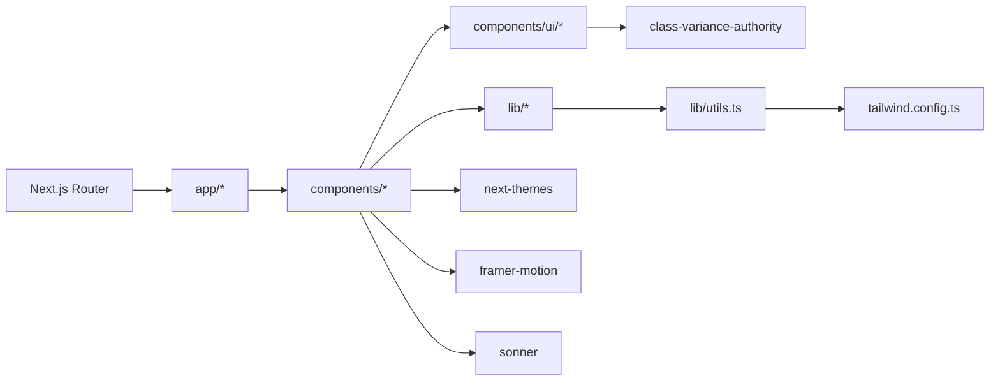

# Frontend Architecture

<cite>
**Referenced Files in This Document**
- [app/layout.tsx](file://app/layout.tsx)
- [components/providers.tsx](file://components/providers.tsx)
- [lib/contexts.tsx](file://lib/contexts.tsx)
- [components/theme-provider.tsx](file://components/theme-provider.tsx)
- [components/site-header.tsx](file://components/site-header.tsx)
- [components/cart/cart-view.tsx](file://components/cart/cart-view.tsx)
- [components/create/generation-studio.tsx](file://components/create/generation-studio.tsx)
- [lib/types.ts](file://lib/types.ts)
- [components/ui/button.tsx](file://components/ui/button.tsx)
- [components/ui/use-toast.ts](file://components/ui/use-toast.ts)
- [hooks/use-toast.ts](file://hooks/use-toast.ts)
- [lib/utils.ts](file://lib/utils.ts)
- [tailwind.config.ts](file://tailwind.config.ts)
- [next.config.mjs](file://next.config.mjs)
- [app/page.tsx](file://app/page.tsx)
</cite>

## Table of Contents
1. [Introduction](#introduction)
2. [Project Structure](#project-structure)
3. [Core Components](#core-components)
4. [Architecture Overview](#architecture-overview)
5. [Detailed Component Analysis](#detailed-component-analysis)
6. [Dependency Analysis](#dependency-analysis)
7. [Performance Considerations](#performance-considerations)
8. [Troubleshooting Guide](#troubleshooting-guide)
9. [Conclusion](#conclusion)

## Introduction
This document describes the frontend architecture of the Muse AI wall art platform built with Next.js 16 App Router. It covers the application shell, routing patterns, layout composition, global state via React Context, theme management, UI component library using shadcn/ui primitives, and design system consistency. It also documents component composition patterns, prop drilling alternatives, and performance optimization strategies.

## Project Structure
The project follows Next.js 16’s App Router conventions:
- app/: Page routes and shared layout
- components/: Reusable UI and domain components
- lib/: Shared utilities, types, and global contexts
- hooks/: Custom hooks
- styles/: Global CSS
- public/: Static assets
- Tailwind and Next.js configuration files

Key entry points:
- Root layout initializes providers, theme provider, header, and global styles.
- Pages under app/ define route segments and render domain components.

**Diagram sources**
- [app/layout.tsx:1-43](file://app/layout.tsx#L1-L43)
- [components/providers.tsx:1-14](file://components/providers.tsx#L1-L14)
- [lib/contexts.tsx:1-255](file://lib/contexts.tsx#L1-L255)
- [components/theme-provider.tsx:1-12](file://components/theme-provider.tsx#L1-L12)
- [components/site-header.tsx:1-91](file://components/site-header.tsx#L1-L91)
- [app/page.tsx:1-28](file://app/page.tsx#L1-L28)

**Section sources**
- [app/layout.tsx:1-43](file://app/layout.tsx#L1-L43)
- [components/providers.tsx:1-14](file://components/providers.tsx#L1-L14)
- [lib/contexts.tsx:1-255](file://lib/contexts.tsx#L1-L255)
- [components/theme-provider.tsx:1-12](file://components/theme-provider.tsx#L1-L12)
- [components/site-header.tsx:1-91](file://components/site-header.tsx#L1-L91)
- [app/page.tsx:1-28](file://app/page.tsx#L1-L28)

## Core Components
- Providers: Composes global providers for style profile, generation session, and cart.
- Contexts: Encapsulate global state with localStorage persistence for continuity across sessions.
- Theme Provider: Enables light/dark mode with next-themes.
- Site Header: Navigation and cart badge integration.
- Cart View: Shopping cart UI with checkout flow.
- Generation Studio: Composition of prompt panel and results panel for AI generation.
- UI Library: shadcn/ui primitives with consistent variants and design tokens.
- Utilities: Tailwind-based design system and class merging helpers.

**Section sources**
- [components/providers.tsx:1-14](file://components/providers.tsx#L1-L14)
- [lib/contexts.tsx:1-255](file://lib/contexts.tsx#L1-L255)
- [components/theme-provider.tsx:1-12](file://components/theme-provider.tsx#L1-L12)
- [components/site-header.tsx:1-91](file://components/site-header.tsx#L1-L91)
- [components/cart/cart-view.tsx:1-221](file://components/cart/cart-view.tsx#L1-L221)
- [components/create/generation-studio.tsx:1-35](file://components/create/generation-studio.tsx#L1-L35)
- [components/ui/button.tsx:1-58](file://components/ui/button.tsx#L1-L58)
- [lib/utils.ts:1-7](file://lib/utils.ts#L1-L7)
- [tailwind.config.ts:1-101](file://tailwind.config.ts#L1-L101)

## Architecture Overview
The architecture centers on a layered approach:
- App Shell: Root layout composes providers and header.
- Global State: Three independent contexts manage style profile, generation session, and cart.
- UI Layer: shadcn/ui primitives with consistent variants and design tokens.
- Routing: App Router pages compose domain components.

**Diagram sources**
- [app/layout.tsx:1-43](file://app/layout.tsx#L1-L43)
- [components/theme-provider.tsx:1-12](file://components/theme-provider.tsx#L1-L12)
- [components/site-header.tsx:1-91](file://components/site-header.tsx#L1-L91)
- [components/providers.tsx:1-14](file://components/providers.tsx#L1-L14)
- [lib/contexts.tsx:1-255](file://lib/contexts.tsx#L1-L255)
- [app/page.tsx:1-28](file://app/page.tsx#L1-L28)
- [components/ui/button.tsx:1-58](file://components/ui/button.tsx#L1-L58)
- [lib/utils.ts:1-7](file://lib/utils.ts#L1-L7)
- [tailwind.config.ts:1-101](file://tailwind.config.ts#L1-L101)

## Detailed Component Analysis

### Global State Management with React Context
The global state is organized into three contexts:
- StyleProfileProvider: Manages user style quiz profile and persists to localStorage.
- GenerationProvider: Manages generation session state, history, and modifiers.
- CartProvider: Manages shopping cart, item counts, totals, and persistence.

Composition pattern:
- Providers wraps children in a nested hierarchy to expose all contexts.

**Diagram sources**
- [components/providers.tsx:1-14](file://components/providers.tsx#L1-L14)
- [lib/contexts.tsx:1-255](file://lib/contexts.tsx#L1-L255)

**Section sources**
- [lib/contexts.tsx:1-255](file://lib/contexts.tsx#L1-L255)
- [components/providers.tsx:1-14](file://components/providers.tsx#L1-L14)

### Theme Management
ThemeProvider integrates next-themes to enable light/dark mode with system preference support and class-based toggling.

**Diagram sources**
- [components/theme-provider.tsx:1-12](file://components/theme-provider.tsx#L1-L12)

**Section sources**
- [components/theme-provider.tsx:1-12](file://components/theme-provider.tsx#L1-L12)

### Cart Functionality
CartView renders cart items, computes totals, and initiates checkout via a server API endpoint. It integrates with the CartProvider to read and mutate cart state.

**Diagram sources**
- [components/cart/cart-view.tsx:1-221](file://components/cart/cart-view.tsx#L1-L221)
- [lib/contexts.tsx:164-250](file://lib/contexts.tsx#L164-L250)

**Section sources**
- [components/cart/cart-view.tsx:1-221](file://components/cart/cart-view.tsx#L1-L221)
- [lib/contexts.tsx:164-250](file://lib/contexts.tsx#L164-L250)

### Component Library and Design System
The UI library is based on shadcn/ui primitives with consistent variants and design tokens:
- Button: Variants (default, destructive, outline, secondary, ghost, link) and sizes (default, sm, lg, icon).
- Utilities: cn combines and merges Tailwind classes.
- Tailwind config: Extends design tokens (colors, typography, radii, animations) and enables dark mode.

**Diagram sources**
- [components/ui/button.tsx:1-58](file://components/ui/button.tsx#L1-L58)
- [lib/utils.ts:1-7](file://lib/utils.ts#L1-L7)
- [tailwind.config.ts:1-101](file://tailwind.config.ts#L1-L101)

**Section sources**
- [components/ui/button.tsx:1-58](file://components/ui/button.tsx#L1-L58)
- [lib/utils.ts:1-7](file://lib/utils.ts#L1-L7)
- [tailwind.config.ts:1-101](file://tailwind.config.ts#L1-L101)

### Routing Patterns and Layout Composition
Routing follows Next.js App Router conventions:
- app/page.tsx defines the home page and composes landing components.
- app/layout.tsx composes Providers, ThemeProvider, SiteHeader, and global styles.
- SiteHeader reads current path to highlight active navigation and displays cart item count.

**Diagram sources**
- [app/layout.tsx:1-43](file://app/layout.tsx#L1-L43)
- [components/site-header.tsx:1-91](file://components/site-header.tsx#L1-L91)
- [app/page.tsx:1-28](file://app/page.tsx#L1-L28)

**Section sources**
- [app/layout.tsx:1-43](file://app/layout.tsx#L1-L43)
- [components/site-header.tsx:1-91](file://components/site-header.tsx#L1-L91)
- [app/page.tsx:1-28](file://app/page.tsx#L1-L28)

### Responsive Design Implementation
Responsive behavior is achieved through:
- Tailwind utilities for breakpoints and responsive grids.
- Component layouts using CSS Grid and Flexbox.
- Mobile-first navigation with a collapsible menu in SiteHeader.
- Image optimization via Next/Image and remote image configuration.

**Section sources**
- [components/site-header.tsx:1-91](file://components/site-header.tsx#L1-L91)
- [tailwind.config.ts:1-101](file://tailwind.config.ts#L1-L101)
- [next.config.mjs:1-23](file://next.config.mjs#L1-L23)

### Component Composition Patterns and Prop Drilling Alternatives
- Composition over inheritance: Providers wrap children to expose contexts.
- Hooks for state extraction: useCart, useGeneration, useStyleProfile encapsulate context access.
- Localized state: Each context manages its own slice of state with minimal cross-context coupling.
- Avoiding prop drilling: Consumers access state directly via hooks instead of passing props down multiple levels.

**Section sources**
- [components/providers.tsx:1-14](file://components/providers.tsx#L1-L14)
- [lib/contexts.tsx:1-255](file://lib/contexts.tsx#L1-L255)

## Dependency Analysis
The frontend relies on:
- Next.js App Router for routing and SSR/SSG.
- Tailwind CSS for styling and design tokens.
- Radix UI and class-variance-authority for UI primitives.
- next-themes for theme management.
- Framer Motion for animations.
- Sonner for toast notifications.

**Diagram sources**
- [lib/utils.ts:1-7](file://lib/utils.ts#L1-L7)
- [tailwind.config.ts:1-101](file://tailwind.config.ts#L1-L101)
- [components/ui/button.tsx:1-58](file://components/ui/button.tsx#L1-L58)
- [components/theme-provider.tsx:1-12](file://components/theme-provider.tsx#L1-L12)
- [components/cart/cart-view.tsx:1-221](file://components/cart/cart-view.tsx#L1-L221)

**Section sources**
- [lib/utils.ts:1-7](file://lib/utils.ts#L1-L7)
- [tailwind.config.ts:1-101](file://tailwind.config.ts#L1-L101)
- [components/ui/button.tsx:1-58](file://components/ui/button.tsx#L1-L58)
- [components/theme-provider.tsx:1-12](file://components/theme-provider.tsx#L1-L12)
- [components/cart/cart-view.tsx:1-221](file://components/cart/cart-view.tsx#L1-L221)

## Performance Considerations
- Client directives: "use client" ensures only interactive components are client-side.
- Memoization: Contexts use useCallback to prevent unnecessary re-renders.
- Local storage persistence: Reduces server round-trips for cart and style profile.
- Animations: Framer Motion is used selectively for smooth UX without heavy overhead.
- Images: Next/Image with optimized sizing and unoptimized fallback for dynamic URLs.
- Remote images: next.config.mjs allowslisted domains for performance and security.

**Section sources**
- [lib/contexts.tsx:1-255](file://lib/contexts.tsx#L1-L255)
- [components/cart/cart-view.tsx:1-221](file://components/cart/cart-view.tsx#L1-L221)
- [next.config.mjs:1-23](file://next.config.mjs#L1-L23)

## Troubleshooting Guide
Common areas to inspect:
- Cart checkout failures: Verify API endpoint behavior and error handling in CartView.
- Toast notifications: Confirm use-toast hook integration and Sonner setup.
- Theme switching: Ensure next-themes provider is mounted at root.
- Context initialization: Confirm Providers wrap the app and contexts initialize without errors.

**Section sources**
- [components/cart/cart-view.tsx:1-221](file://components/cart/cart-view.tsx#L1-L221)
- [components/ui/use-toast.ts:1-192](file://components/ui/use-toast.ts#L1-L192)
- [hooks/use-toast.ts:1-192](file://hooks/use-toast.ts#L1-L192)
- [components/theme-provider.tsx:1-12](file://components/theme-provider.tsx#L1-L12)
- [components/providers.tsx:1-14](file://components/providers.tsx#L1-L14)

## Conclusion
The Muse AI wall art platform employs a clean, modular architecture leveraging Next.js 16 App Router, React Context for global state, and a consistent UI library built on shadcn/ui primitives. The design system, composed through Tailwind and class-variance-authority, ensures visual coherence and maintainability. Providers encapsulate state management, while hooks minimize prop drilling and improve composability. Responsive design and performance-conscious patterns deliver a robust user experience across devices.