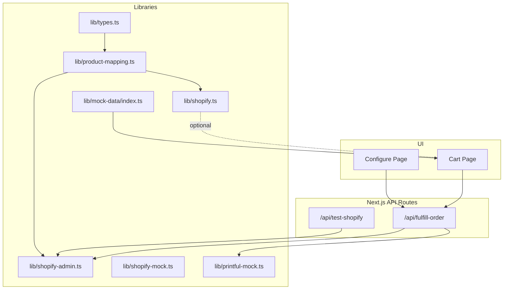
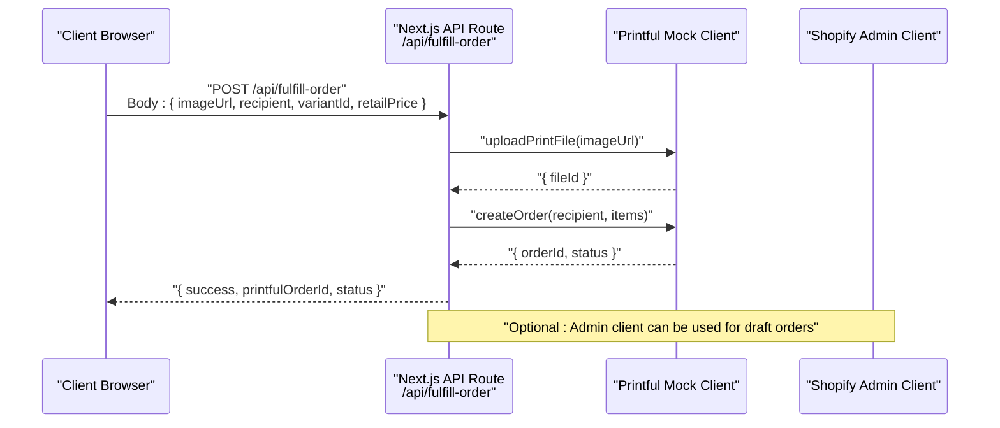
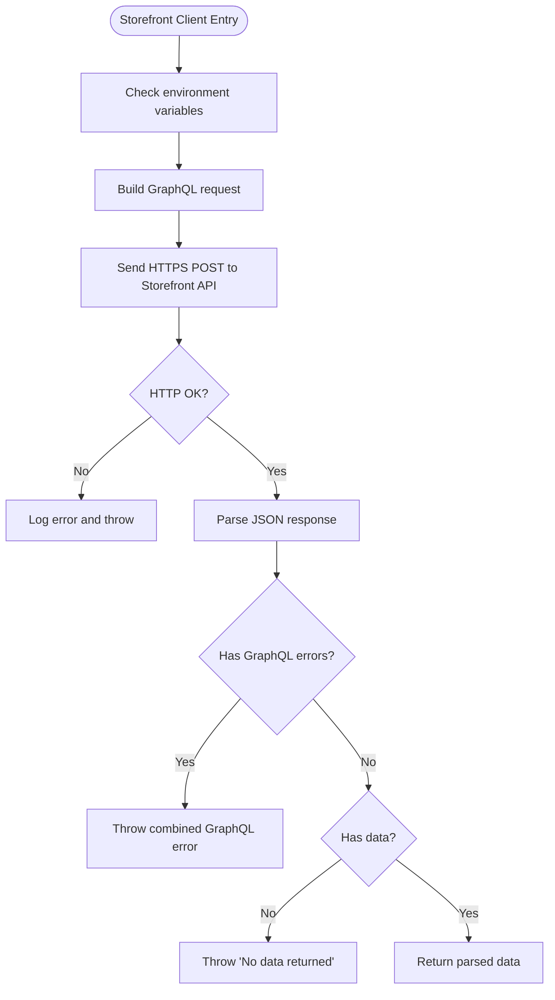
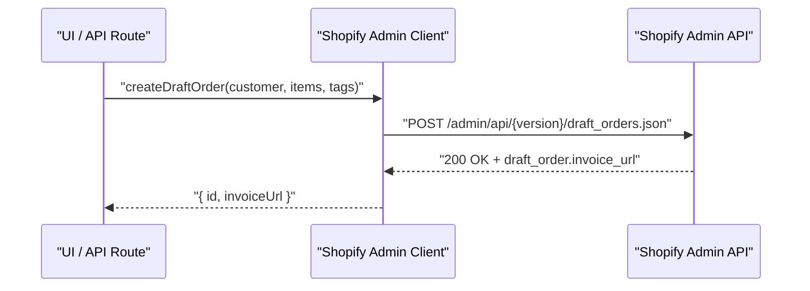
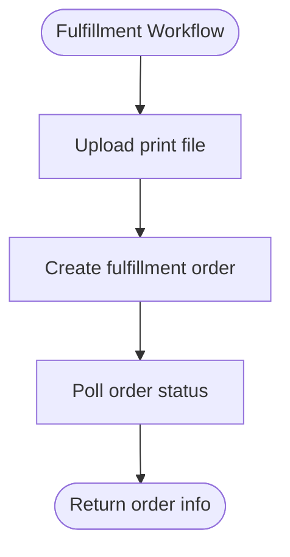
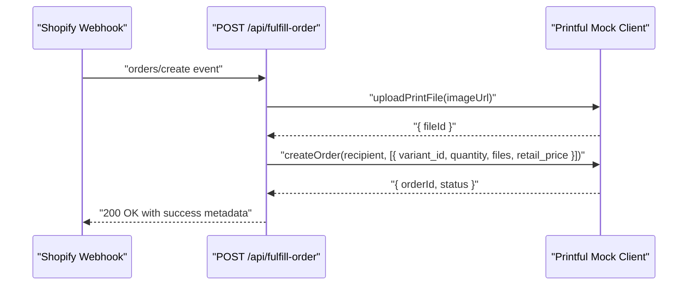
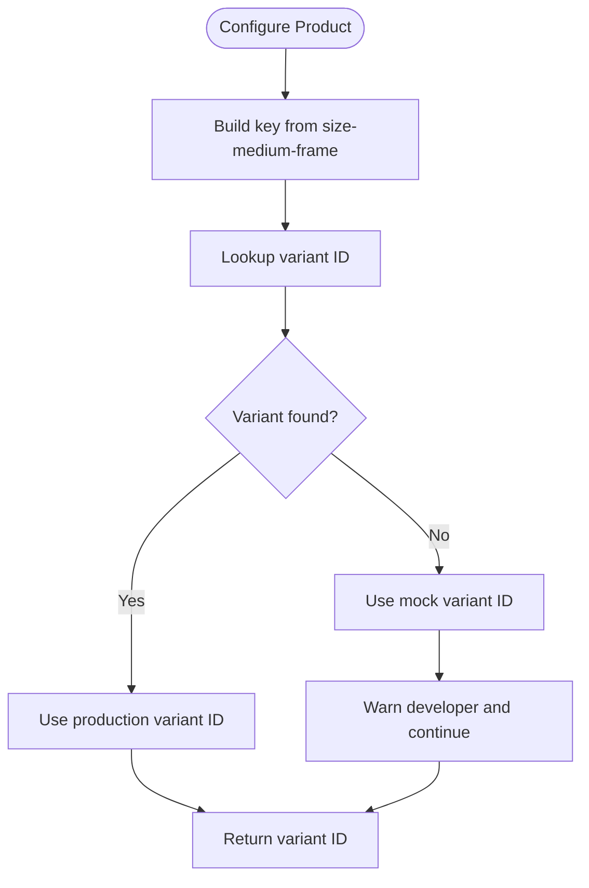
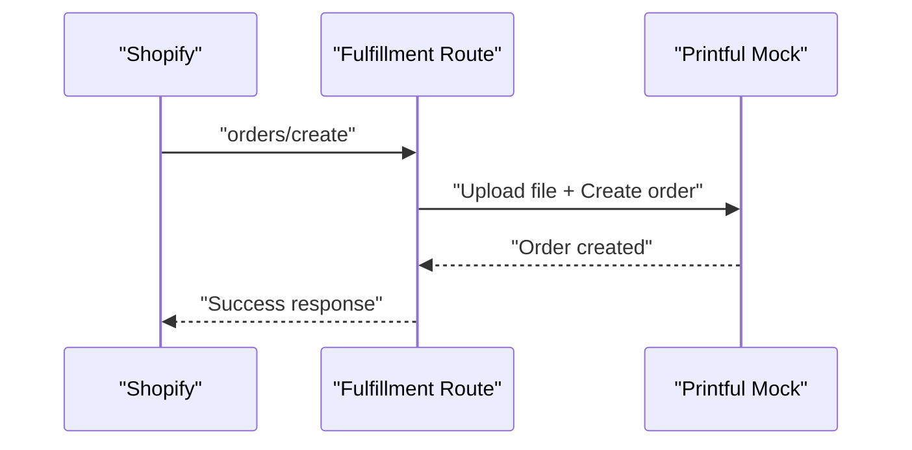
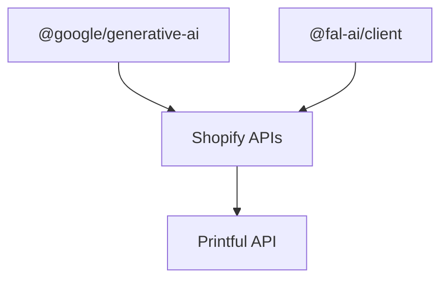

# Integration Patterns

<cite>
**Referenced Files in This Document**
- [lib/shopify.ts](file://lib/shopify.ts)
- [lib/shopify-admin.ts](file://lib/shopify-admin.ts)
- [lib/shopify-mock.ts](file://lib/shopify-mock.ts)
- [lib/printful-mock.ts](file://lib/printful-mock.ts)
- [app/api/fulfill-order/route.ts](file://app/api/fulfill-order/route.ts)
- [app/api/test-shopify/route.ts](file://app/api/test-shopify/route.ts)
- [lib/types.ts](file://lib/types.ts)
- [lib/product-mapping.ts](file://lib/product-mapping.ts)
- [lib/mock-data/index.ts](file://lib/mock-data/index.ts)
- [INTEGRATION_SUMMARY.md](file://INTEGRATION_SUMMARY.md)
- [SHOPIFY_ADMIN_API_SETUP.md](file://SHOPIFY_ADMIN_API_SETUP.md)
- [package.json](file://package.json)
</cite>

## Table of Contents
1. [Introduction](#introduction)
2. [Project Structure](#project-structure)
3. [Core Components](#core-components)
4. [Architecture Overview](#architecture-overview)
5. [Detailed Component Analysis](#detailed-component-analysis)
6. [Dependency Analysis](#dependency-dependency-analysis)
7. [Performance Considerations](#performance-considerations)
8. [Troubleshooting Guide](#troubleshooting-guide)
9. [Conclusion](#conclusion)
10. [Appendices](#appendices)

## Introduction
This document explains the external service integration patterns powering the Muse AI platform, focusing on:
- Shopify storefront and admin APIs for product catalog representation, cart and checkout orchestration, and order lifecycle management
- Printful fulfillment integration for print-on-demand and shipping coordination
- Authentication patterns, webhook-triggered workflows, and data synchronization strategies
- Mock implementations for development and testing, plus fallback mechanisms
- Error handling, retry policies, and monitoring approaches for reliable external integrations

## Project Structure
The integration surface spans client-side UI, Next.js API routes, and library modules encapsulating external service clients. Key areas:
- Shopify storefront client for cart and checkout session creation
- Shopify admin client for draft order creation and invoice redirection
- Printful mock client for fulfillment orchestration
- API routes for fulfillment processing and Shopify connectivity testing
- Type definitions and product mapping for variant resolution
- Mock data and pricing helpers for development and fallbacks

**Diagram sources**
- [lib/shopify.ts](file://lib/shopify.ts)
- [lib/shopify-admin.ts](file://lib/shopify-admin.ts)
- [lib/shopify-mock.ts](file://lib/shopify-mock.ts)
- [lib/printful-mock.ts](file://lib/printful-mock.ts)
- [app/api/fulfill-order/route.ts](file://app/api/fulfill-order/route.ts)
- [app/api/test-shopify/route.ts](file://app/api/test-shopify/route.ts)
- [lib/types.ts](file://lib/types.ts)
- [lib/product-mapping.ts](file://lib/product-mapping.ts)
- [lib/mock-data/index.ts](file://lib/mock-data/index.ts)

**Section sources**
- [lib/shopify.ts](file://lib/shopify.ts)
- [lib/shopify-admin.ts](file://lib/shopify-admin.ts)
- [lib/shopify-mock.ts](file://lib/shopify-mock.ts)
- [lib/printful-mock.ts](file://lib/printful-mock.ts)
- [app/api/fulfill-order/route.ts](file://app/api/fulfill-order/route.ts)
- [app/api/test-shopify/route.ts](file://app/api/test-shopify/route.ts)
- [lib/types.ts](file://lib/types.ts)
- [lib/product-mapping.ts](file://lib/product-mapping.ts)
- [lib/mock-data/index.ts](file://lib/mock-data/index.ts)

## Core Components
- Shopify Storefront client: Provides cart creation, line item management, and checkout URL retrieval via the Storefront GraphQL API.
- Shopify Admin client: Creates draft orders and returns invoice URLs for hosted checkout, enabling seamless customer experience while centralizing order management.
- Printful mock client: Simulates file upload, fulfillment order creation, and status polling for development and testing.
- Fulfillment API route: Orchestrates the end-to-end fulfillment workflow triggered by Shopify webhooks.
- Product mapping: Resolves product configurations to Shopify variant IDs and provides fallbacks for development.
- Types and mock data: Define product options, pricing helpers, and gallery concepts for UI and fallbacks.

**Section sources**
- [lib/shopify.ts](file://lib/shopify.ts)
- [lib/shopify-admin.ts](file://lib/shopify-admin.ts)
- [lib/printful-mock.ts](file://lib/printful-mock.ts)
- [app/api/fulfill-order/route.ts](file://app/api/fulfill-order/route.ts)
- [lib/product-mapping.ts](file://lib/product-mapping.ts)
- [lib/types.ts](file://lib/types.ts)
- [lib/mock-data/index.ts](file://lib/mock-data/index.ts)

## Architecture Overview
The platform integrates external services through controlled API routes and library clients. The fulfillment pipeline is webhook-driven: Shopify sends order events to the backend, which uploads print-ready assets to Printful and creates fulfillment orders. Shopify admin manages checkout and order visibility, while storefront APIs support cart operations.

**Diagram sources**
- [app/api/fulfill-order/route.ts](file://app/api/fulfill-order/route.ts)
- [lib/printful-mock.ts](file://lib/printful-mock.ts)
- [lib/shopify-admin.ts](file://lib/shopify-admin.ts)

## Detailed Component Analysis

### Shopify Storefront Integration
The storefront client encapsulates GraphQL queries and mutations for cart operations and checkout URL retrieval. It enforces environment configuration checks, validates responses, and surfaces errors with actionable guidance.

Key capabilities:
- Create cart with initial line items
- Add/remove line items
- Retrieve cart details
- Obtain checkout URL for hosted checkout

**Diagram sources**
- [lib/shopify.ts](file://lib/shopify.ts)

**Section sources**
- [lib/shopify.ts](file://lib/shopify.ts)

### Shopify Admin Integration
The admin client creates draft orders and returns invoice URLs for hosted checkout. It validates environment configuration and handles HTTP errors with specific guidance for common issues.

Key capabilities:
- Create draft orders with customer email, line items, and tags
- Return invoice URL for hosted checkout

**Diagram sources**
- [lib/shopify-admin.ts](file://lib/shopify-admin.ts)

**Section sources**
- [lib/shopify-admin.ts](file://lib/shopify-admin.ts)
- [SHOPIFY_ADMIN_API_SETUP.md](file://SHOPIFY_ADMIN_API_SETUP.md)

### Printful Fulfillment Integration
The Printful mock client simulates the file upload and fulfillment order creation workflow. It introduces artificial delays to mimic network latency and returns deterministic results for repeatable testing.

Key capabilities:
- Upload print file and receive file ID
- Create fulfillment order with recipient and items
- Poll order status

**Diagram sources**
- [lib/printful-mock.ts](file://lib/printful-mock.ts)

**Section sources**
- [lib/printful-mock.ts](file://lib/printful-mock.ts)
- [app/api/fulfill-order/route.ts](file://app/api/fulfill-order/route.ts)

### Fulfillment API Route
The fulfillment route orchestrates the end-to-end workflow:
1. Receives order payload from Shopify webhook
2. Uploads the print-ready image to Printful
3. Creates a fulfillment order
4. Returns success metadata

**Diagram sources**
- [app/api/fulfill-order/route.ts](file://app/api/fulfill-order/route.ts)
- [lib/printful-mock.ts](file://lib/printful-mock.ts)

**Section sources**
- [app/api/fulfill-order/route.ts](file://app/api/fulfill-order/route.ts)

### Product Catalog Management and Variant Mapping
The product mapping module resolves product configurations (size, medium, frame) to Shopify variant IDs. It provides fallbacks and validation to ensure development and testing continue smoothly even when production variants are not yet configured.

**Diagram sources**
- [lib/product-mapping.ts](file://lib/product-mapping.ts)

**Section sources**
- [lib/product-mapping.ts](file://lib/product-mapping.ts)
- [lib/types.ts](file://lib/types.ts)
- [lib/mock-data/index.ts](file://lib/mock-data/index.ts)

### API Authentication Patterns
- Shopify Storefront API: Uses an access token header for storefront GraphQL requests.
- Shopify Admin API: Uses an access token header for admin REST requests.
- Printful: Mock client does not require authentication; production would use bearer token.

Environment variables:
- Storefront: NEXT_PUBLIC_SHOPIFY_STORE_DOMAIN, NEXT_PUBLIC_SHOPIFY_STOREFRONT_ACCESS_TOKEN, NEXT_PUBLIC_SHOPIFY_API_VERSION
- Admin: SHOPIFY_STORE_DOMAIN, SHOPIFY_ACCESS_TOKEN, SHOPIFY_API_VERSION

**Section sources**
- [lib/shopify.ts](file://lib/shopify.ts)
- [lib/shopify-admin.ts](file://lib/shopify-admin.ts)
- [SHOPIFY_ADMIN_API_SETUP.md](file://SHOPIFY_ADMIN_API_SETUP.md)

### Webhook Implementations and Data Synchronization
- Webhook trigger: Shopify orders/create event triggers the fulfillment route.
- Payload: Expects image URL, recipient, variant ID, and retail price.
- Synchronization: Fulfillment route updates order metadata (order ID, status) for downstream systems.

**Diagram sources**
- [app/api/fulfill-order/route.ts](file://app/api/fulfill-order/route.ts)
- [lib/printful-mock.ts](file://lib/printful-mock.ts)

**Section sources**
- [app/api/fulfill-order/route.ts](file://app/api/fulfill-order/route.ts)

### Mock Implementations and Fallback Mechanisms
- Shopify storefront mock: Simulates cart operations with deterministic responses and delays.
- Printful mock: Simulates file upload, order creation, and status polling.
- Fallbacks: When API keys or environment variables are missing, the system falls back to mock data and gallery images.

**Section sources**
- [lib/shopify-mock.ts](file://lib/shopify-mock.ts)
- [lib/printful-mock.ts](file://lib/printful-mock.ts)
- [lib/mock-data/index.ts](file://lib/mock-data/index.ts)
- [INTEGRATION_SUMMARY.md](file://INTEGRATION_SUMMARY.md)

## Dependency Analysis
External dependencies relevant to integrations:
- @google/generative-ai: Enables AI image generation (used elsewhere in the project; relevant for asset generation workflows)
- @fal-ai/client: Used for image generation via Fal.ai (referenced in package.json)

**Diagram sources**
- [package.json](file://package.json)

**Section sources**
- [package.json](file://package.json)

## Performance Considerations
- Network latency: Introduce jitter and exponential backoff for retries against external services.
- Concurrency: Batch operations where possible; avoid synchronous external calls in hot paths.
- Caching: Cache variant metadata and product options to reduce repeated lookups.
- Monitoring: Log request/response durations and error rates for external services.
- Rate limiting: Respect provider rate limits; queue or throttle requests accordingly.

## Troubleshooting Guide
Common issues and resolutions:
- Shopify Admin API 401 Unauthorized: Ensure Admin API scopes include write_draft_orders and reinstall the app to refresh the token.
- Missing Shopify configuration: Confirm environment variables are present and correctly named; restart the development server.
- Store domain incorrect: Use the myshopify domain without protocol or trailing slash.
- Printful mock behavior: Verify mock delays and deterministic responses during local testing.

Testing endpoints:
- Test Shopify Admin API connectivity via the dedicated API route to validate configuration and permissions.

**Section sources**
- [app/api/test-shopify/route.ts](file://app/api/test-shopify/route.ts)
- [SHOPIFY_ADMIN_API_SETUP.md](file://SHOPIFY_ADMIN_API_SETUP.md)

## Conclusion
The Muse AI platform integrates Shopify and Printful through well-defined library clients and API routes. The storefront client supports cart operations, while the admin client enables hosted checkout via draft orders. The fulfillment route orchestrates print-on-demand workflows triggered by Shopify webhooks. Mock implementations and fallbacks ensure robust development and testing experiences. Adhering to the authentication patterns, webhook flows, and monitoring strategies outlined here will help maintain reliable and scalable integrations.

## Appendices

### Appendix A: Environment Variables Reference
- Storefront
  - NEXT_PUBLIC_SHOPIFY_STORE_DOMAIN
  - NEXT_PUBLIC_SHOPIFY_STOREFRONT_ACCESS_TOKEN
  - NEXT_PUBLIC_SHOPIFY_API_VERSION
- Admin
  - SHOPIFY_STORE_DOMAIN
  - SHOPIFY_ACCESS_TOKEN
  - SHOPIFY_API_VERSION

**Section sources**
- [lib/shopify.ts](file://lib/shopify.ts)
- [lib/shopify-admin.ts](file://lib/shopify-admin.ts)
- [SHOPIFY_ADMIN_API_SETUP.md](file://SHOPIFY_ADMIN_API_SETUP.md)