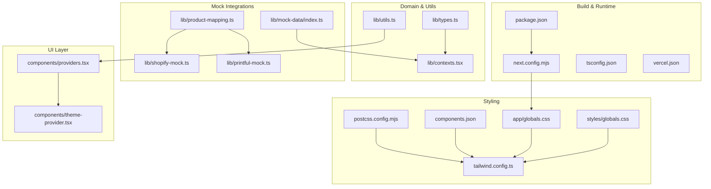
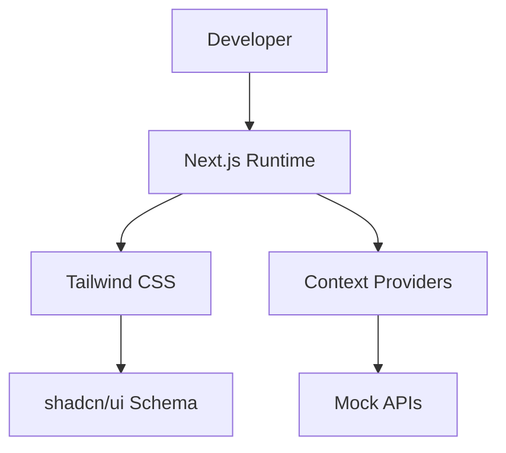
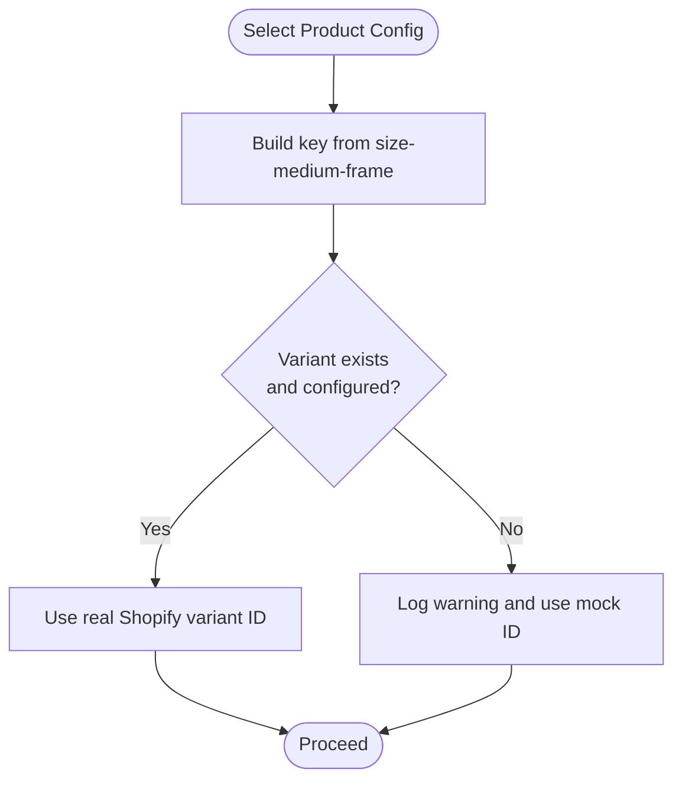
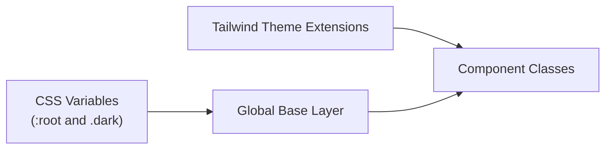
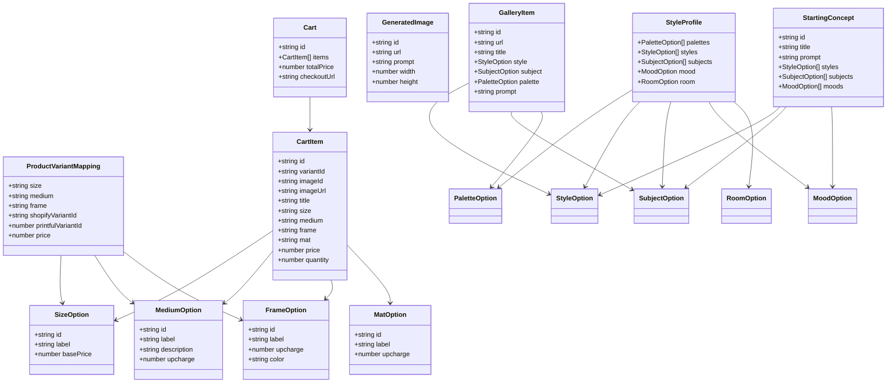
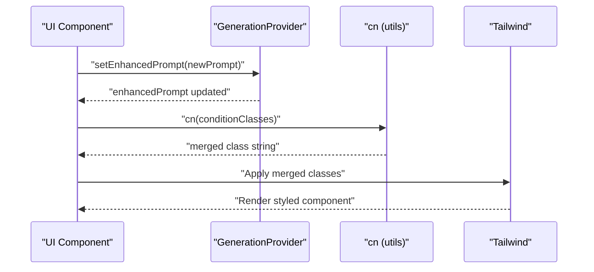
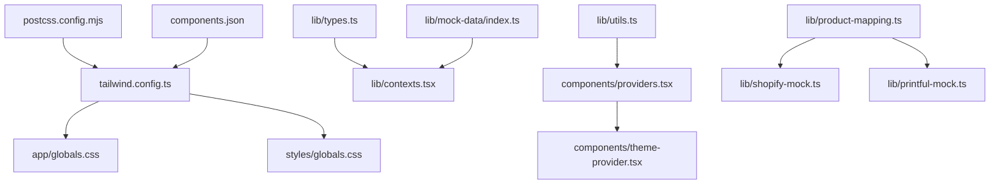

# Configuration & Customization

<cite>
**Referenced Files in This Document**
- [package.json](file://package.json)
- [next.config.mjs](file://next.config.mjs)
- [tailwind.config.ts](file://tailwind.config.ts)
- [postcss.config.mjs](file://postcss.config.mjs)
- [components.json](file://components.json)
- [app/globals.css](file://app/globals.css)
- [styles/globals.css](file://styles/globals.css)
- [lib/types.ts](file://lib/types.ts)
- [lib/utils.ts](file://lib/utils.ts)
- [lib/product-mapping.ts](file://lib/product-mapping.ts)
- [lib/mock-data/index.ts](file://lib/mock-data/index.ts)
- [lib/shopify-mock.ts](file://lib/shopify-mock.ts)
- [lib/printful-mock.ts](file://lib/printful-mock.ts)
- [lib/contexts.tsx](file://lib/contexts.tsx)
- [components/providers.tsx](file://components/providers.tsx)
- [components/theme-provider.tsx](file://components/theme-provider.tsx)
- [vercel.json](file://vercel.json)
- [tsconfig.json](file://tsconfig.json)
</cite>

## Table of Contents
1. [Introduction](#introduction)
2. [Project Structure](#project-structure)
3. [Core Components](#core-components)
4. [Architecture Overview](#architecture-overview)
5. [Detailed Component Analysis](#detailed-component-analysis)
6. [Dependency Analysis](#dependency-analysis)
7. [Performance Considerations](#performance-considerations)
8. [Troubleshooting Guide](#troubleshooting-guide)
9. [Conclusion](#conclusion)
10. [Appendices](#appendices)

## Introduction
This document explains how to configure and customize the project, focusing on environment-driven behavior, product mapping, design system customization, type safety, utility functions, and mock integrations. It also covers Tailwind CSS configuration, component customization via shadcn/ui, global styling options, and practical guidance for extending the design system, adding new product configurations, and optimizing performance and deployments.

## Project Structure
The project is a Next.js application with a clear separation of concerns:
- Build and runtime configuration in Next.js, PostCSS, and TypeScript
- Design system powered by Tailwind CSS and shadcn/ui
- Type-safe domain models and utilities
- Mock integrations for Shopify and Printful
- Global styling and theme provider

**Diagram sources**
- [package.json:1-81](file://package.json#L1-L81)
- [next.config.mjs:1-23](file://next.config.mjs#L1-L23)
- [tsconfig.json:1-34](file://tsconfig.json#L1-L34)
- [vercel.json:1-5](file://vercel.json#L1-L5)
- [tailwind.config.ts:1-101](file://tailwind.config.ts#L1-L101)
- [postcss.config.mjs:1-9](file://postcss.config.mjs#L1-L9)
- [components.json:1-22](file://components.json#L1-L22)
- [app/globals.css:1-69](file://app/globals.css#L1-L69)
- [styles/globals.css:1-95](file://styles/globals.css#L1-L95)
- [lib/types.ts:1-132](file://lib/types.ts#L1-L132)
- [lib/utils.ts:1-7](file://lib/utils.ts#L1-L7)
- [lib/contexts.tsx:1-255](file://lib/contexts.tsx#L1-L255)
- [lib/product-mapping.ts:1-68](file://lib/product-mapping.ts#L1-L68)
- [lib/shopify-mock.ts:1-74](file://lib/shopify-mock.ts#L1-L74)
- [lib/printful-mock.ts:1-77](file://lib/printful-mock.ts#L1-L77)
- [lib/mock-data/index.ts:1-315](file://lib/mock-data/index.ts#L1-L315)
- [components/providers.tsx:1-14](file://components/providers.tsx#L1-L14)
- [components/theme-provider.tsx:1-12](file://components/theme-provider.tsx#L1-L12)

**Section sources**
- [package.json:1-81](file://package.json#L1-L81)
- [next.config.mjs:1-23](file://next.config.mjs#L1-L23)
- [tsconfig.json:1-34](file://tsconfig.json#L1-L34)
- [vercel.json:1-5](file://vercel.json#L1-L5)

## Core Components
- Environment and build configuration: scripts, Next.js configuration, TypeScript compiler options, and Vercel deployment settings.
- Design system: Tailwind CSS configuration, PostCSS pipeline, shadcn/ui schema, and global CSS layers.
- Type system: Strongly typed domain models for generation, product configurator, cart, gallery, and style profiles.
- Utilities: Utility function for merging Tailwind classes.
- Product mapping: Mapping between product configurations and Shopify variant identifiers with fallbacks.
- Mock integrations: Shopify Storefront and Printful mocks for development and testing.
- Context providers: Centralized state management for style profile, generation session, and cart.
- Theme provider: Theme switching support via next-themes.

**Section sources**
- [lib/types.ts:1-132](file://lib/types.ts#L1-L132)
- [lib/utils.ts:1-7](file://lib/utils.ts#L1-L7)
- [lib/product-mapping.ts:1-68](file://lib/product-mapping.ts#L1-L68)
- [lib/shopify-mock.ts:1-74](file://lib/shopify-mock.ts#L1-L74)
- [lib/printful-mock.ts:1-77](file://lib/printful-mock.ts#L1-L77)
- [lib/contexts.tsx:1-255](file://lib/contexts.tsx#L1-L255)
- [components/theme-provider.tsx:1-12](file://components/theme-provider.tsx#L1-L12)

## Architecture Overview
The configuration and customization architecture centers around:
- Build-time: Next.js, TypeScript, and Vercel orchestration
- Styling-time: Tailwind CSS with CSS variables and shadcn/ui conventions
- Runtime: Context providers managing state and integrating with mock APIs

[No sources needed since this diagram shows conceptual workflow, not actual code structure]

## Detailed Component Analysis

### Environment Variable Configuration
- Define environment variables for production integrations:
  - Shopify Storefront: domain, storefront access token, and API version
  - Printful: API key
- These are referenced in mock implementations to guide production migration.

Practical guidance:
- Create a local environment file for development and a secure secrets store for production.
- Keep sensitive values out of client-side code; expose only necessary public keys via Next.js public runtime config.

**Section sources**
- [lib/shopify-mock.ts:4-15](file://lib/shopify-mock.ts#L4-L15)
- [lib/printful-mock.ts:4-9](file://lib/printful-mock.ts#L4-L9)

### Product Mapping Setup
- Central mapping registry for product variants linking size, medium, and frame to Shopify variant IDs.
- Fallback behavior logs warnings and uses mock variant IDs during development.
- Helper functions to check configuration completeness and enumerate configured variants.

Customization steps:
- Create products in Shopify and populate variant IDs in the mapping registry.
- Validate configuration before enabling checkout flows.

**Diagram sources**
- [lib/product-mapping.ts:37-49](file://lib/product-mapping.ts#L37-L49)

**Section sources**
- [lib/product-mapping.ts:1-68](file://lib/product-mapping.ts#L1-L68)

### Design System Customization
- Tailwind CSS configuration extends color palette, typography, border radius, keyframes, and animations.
- CSS variables define semantic tokens applied in global base layer.
- shadcn/ui schema aligns component aliases and styling conventions.

Customization steps:
- Adjust color tokens in the base layer to reflect brand identity.
- Extend theme extensions for spacing, typography, and animation.
- Use the shadcn/ui alias map to maintain consistent imports across the app.

**Diagram sources**
- [app/globals.css:32-68](file://app/globals.css#L32-L68)
- [tailwind.config.ts:11-98](file://tailwind.config.ts#L11-L98)
- [components.json:6-21](file://components.json#L6-L21)

**Section sources**
- [app/globals.css:1-69](file://app/globals.css#L1-L69)
- [styles/globals.css:15-95](file://styles/globals.css#L15-L95)
- [tailwind.config.ts:1-101](file://tailwind.config.ts#L1-L101)
- [components.json:1-22](file://components.json#L1-L22)

### Type System Architecture
The type system defines:
- Style profile and selection options
- Generation requests and responses
- Product configurator options and variant mapping
- Cart item and cart models
- Gallery items and starting concepts

**Diagram sources**
- [lib/types.ts:1-132](file://lib/types.ts#L1-L132)

**Section sources**
- [lib/types.ts:1-132](file://lib/types.ts#L1-L132)

### Utility Functions
- cn: Merges Tailwind classes safely using clsx and tailwind-merge.

Usage guidance:
- Prefer cn for composing conditional class lists in components.
- Avoid duplicating conflicting utility classes.

**Section sources**
- [lib/utils.ts:1-7](file://lib/utils.ts#L1-L7)

### Mock Data Structure
- Defines sizes, mediums, frames, mats, aspect ratios, and product variant mappings.
- Provides gallery items and starting concepts for discovery and style quiz.
- Includes helpers for pricing calculation, price formatting, and resolution validation.

Customization steps:
- Extend or replace arrays for sizes, mediums, frames, and mats to match offerings.
- Add or modify gallery items and starting concepts to reflect brand assets.
- Adjust pricing logic and validation thresholds as business rules evolve.

**Section sources**
- [lib/mock-data/index.ts:11-315](file://lib/mock-data/index.ts#L11-L315)

### Context Providers and State Management
- StyleProfileProvider persists and manages style quiz selections.
- GenerationProvider tracks prompts, generated images, history, modifiers, aspect ratio, and quality.
- CartProvider manages cart items, totals, and persistence.

**Diagram sources**
- [lib/contexts.tsx:116-158](file://lib/contexts.tsx#L116-L158)
- [lib/utils.ts:4-6](file://lib/utils.ts#L4-L6)

**Section sources**
- [lib/contexts.tsx:1-255](file://lib/contexts.tsx#L1-L255)
- [components/providers.tsx:1-14](file://components/providers.tsx#L1-L14)

### Component Customization via shadcn/ui
- The shadcn/ui schema defines style, RSC/TSX preferences, Tailwind configuration linkage, and alias map.
- Use the alias map to keep imports consistent across the project.

Customization steps:
- Run shadcn/ui add commands to scaffold new components respecting the schema.
- Keep aliases aligned with project structure to avoid import drift.

**Section sources**
- [components.json:1-22](file://components.json#L1-L22)

### Global Styling Options
- Two global CSS files define base, layer utilities, and CSS variables.
- One version resides under app/, another under styles/.
- Tailwind directives are included at the top of each file.

Guidelines:
- Choose one global CSS file as the canonical source and remove duplication.
- Centralize CSS variables in the base layer for consistent theming.

**Section sources**
- [app/globals.css:1-69](file://app/globals.css#L1-L69)
- [styles/globals.css:1-95](file://styles/globals.css#L1-L95)

### Theme Provider
- next-themes integrates with Tailwind dark mode and CSS variables.
- Apply the ThemeProvider at the root to enable theme switching.

**Section sources**
- [components/theme-provider.tsx:1-12](file://components/theme-provider.tsx#L1-L12)

### Tailwind CSS Configuration
- Dark mode uses class strategy.
- Content paths include pages, components, app, and root-level files.
- Theme extends colors, fonts, radii, keyframes, and animations.
- Plugin includes tailwindcss-animate.

Customization tips:
- Add new color scales and semantic tokens to the theme extension.
- Introduce new keyframes and animations for motion design.
- Keep content globs aligned with the project’s file structure.

**Section sources**
- [tailwind.config.ts:1-101](file://tailwind.config.ts#L1-L101)

### Build and Deployment Configuration
- Next.js configuration:
  - Ignore TypeScript build errors for development speed.
  - Configure remote image hosts for optimized image loading.
- TypeScript configuration:
  - Strict mode, ES target, module resolution, JSX transform, and path mapping.
- Vercel configuration:
  - Build command and framework specification.

Optimization suggestions:
- Enable incremental builds and strict checks in CI.
- Consider enabling image optimization and compression in production.

**Section sources**
- [next.config.mjs:1-23](file://next.config.mjs#L1-L23)
- [tsconfig.json:1-34](file://tsconfig.json#L1-L34)
- [vercel.json:1-5](file://vercel.json#L1-L5)

## Dependency Analysis
The following diagram highlights key dependencies among configuration and customization components.

**Diagram sources**
- [tailwind.config.ts:1-101](file://tailwind.config.ts#L1-L101)
- [postcss.config.mjs:1-9](file://postcss.config.mjs#L1-L9)
- [components.json:1-22](file://components.json#L1-L22)
- [app/globals.css:1-69](file://app/globals.css#L1-L69)
- [styles/globals.css:1-95](file://styles/globals.css#L1-L95)
- [lib/utils.ts:1-7](file://lib/utils.ts#L1-L7)
- [lib/types.ts:1-132](file://lib/types.ts#L1-L132)
- [lib/contexts.tsx:1-255](file://lib/contexts.tsx#L1-L255)
- [components/providers.tsx:1-14](file://components/providers.tsx#L1-L14)
- [components/theme-provider.tsx:1-12](file://components/theme-provider.tsx#L1-L12)
- [lib/product-mapping.ts:1-68](file://lib/product-mapping.ts#L1-L68)
- [lib/shopify-mock.ts:1-74](file://lib/shopify-mock.ts#L1-L74)
- [lib/printful-mock.ts:1-77](file://lib/printful-mock.ts#L1-L77)
- [lib/mock-data/index.ts:1-315](file://lib/mock-data/index.ts#L1-L315)

**Section sources**
- [package.json:11-63](file://package.json#L11-L63)

## Performance Considerations
- Build optimization
  - Use Next.js incremental builds and strict TypeScript checks in CI.
  - Keep content globs in Tailwind configuration minimal to reduce scanning overhead.
- Image optimization
  - Configure allowed remote image hosts to leverage Next.js image optimization.
- CSS and class merging
  - Use the cn utility to avoid redundant classes and minimize bundle size.
- State management
  - Persist only essential state to localStorage to reduce hydration costs.
- Mock vs. production
  - Replace mock integrations with real API clients in production to avoid unnecessary overhead.

[No sources needed since this section provides general guidance]

## Troubleshooting Guide
- Missing or invalid Shopify variant IDs
  - Symptom: Warning logs and mock variant IDs in use.
  - Action: Populate real variant IDs and re-run.
- Unconfigured product mapping
  - Symptom: Checkout flows may fail or redirect unexpectedly.
  - Action: Verify mapping registry and ensure at least one variant is configured.
- Local storage issues
  - Symptom: Lost cart or style profile after refresh.
  - Action: Clear browser cache or disable private browsing mode.
- Tailwind classes not applying
  - Symptom: Styles missing or overwritten.
  - Action: Ensure global CSS is imported and content paths include component locations.

**Section sources**
- [lib/product-mapping.ts:41-46](file://lib/product-mapping.ts#L41-L46)
- [lib/contexts.tsx:36-54](file://lib/contexts.tsx#L36-L54)
- [app/globals.css:1-3](file://app/globals.css#L1-L3)

## Conclusion
This project provides a robust foundation for configuration and customization:
- Environment variables drive production integrations while mocks enable rapid development.
- The type system enforces correctness across generation, product configuration, cart, and gallery domains.
- Tailwind CSS and shadcn/ui offer a scalable design system with consistent component conventions.
- Context providers centralize state management and integrate seamlessly with global styling and theme support.
By following the customization steps and troubleshooting guidance, teams can extend the design system, add new product configurations, and optimize performance and deployment.

[No sources needed since this section summarizes without analyzing specific files]

## Appendices

### A. Extending the Design System
- Add new color tokens to the base layer and Tailwind theme extension.
- Introduce new component variants via shadcn/ui and update aliases consistently.
- Use CSS variables for semantic theming and ensure both light and dark modes are covered.

**Section sources**
- [app/globals.css:32-68](file://app/globals.css#L32-L68)
- [tailwind.config.ts:11-98](file://tailwind.config.ts#L11-L98)
- [components.json:13-19](file://components.json#L13-L19)

### B. Adding New Product Configurations
- Define new sizes, mediums, frames, and mats in mock data.
- Generate or add variant mappings with accurate pricing.
- Update product mapping registry with real Shopify variant IDs.

**Section sources**
- [lib/mock-data/index.ts:11-80](file://lib/mock-data/index.ts#L11-L80)
- [lib/product-mapping.ts:15-32](file://lib/product-mapping.ts#L15-L32)

### C. Customizing the Aesthetic
- Adjust CSS variables in the base layer to change brand colors.
- Extend typography and border radius to fit brand guidelines.
- Use Tailwind utilities and component classes to maintain consistency.

**Section sources**
- [styles/globals.css:16-84](file://styles/globals.css#L16-L84)
- [tailwind.config.ts:65-73](file://tailwind.config.ts#L65-L73)

### D. Performance Tuning and Build Optimization
- Keep Tailwind content globs precise.
- Use cn for efficient class merging.
- Leverage Next.js image optimization and strict TypeScript checks.

**Section sources**
- [tailwind.config.ts:5-10](file://tailwind.config.ts#L5-L10)
- [lib/utils.ts:4-6](file://lib/utils.ts#L4-L6)
- [next.config.mjs:3-19](file://next.config.mjs#L3-L19)

### E. Deployment Customization
- Configure Vercel build command and framework.
- Ensure environment variables are set in the platform’s dashboard.
- Validate image host configuration for production image optimization.

**Section sources**
- [vercel.json:1-5](file://vercel.json#L1-L5)
- [next.config.mjs:6-18](file://next.config.mjs#L6-L18)