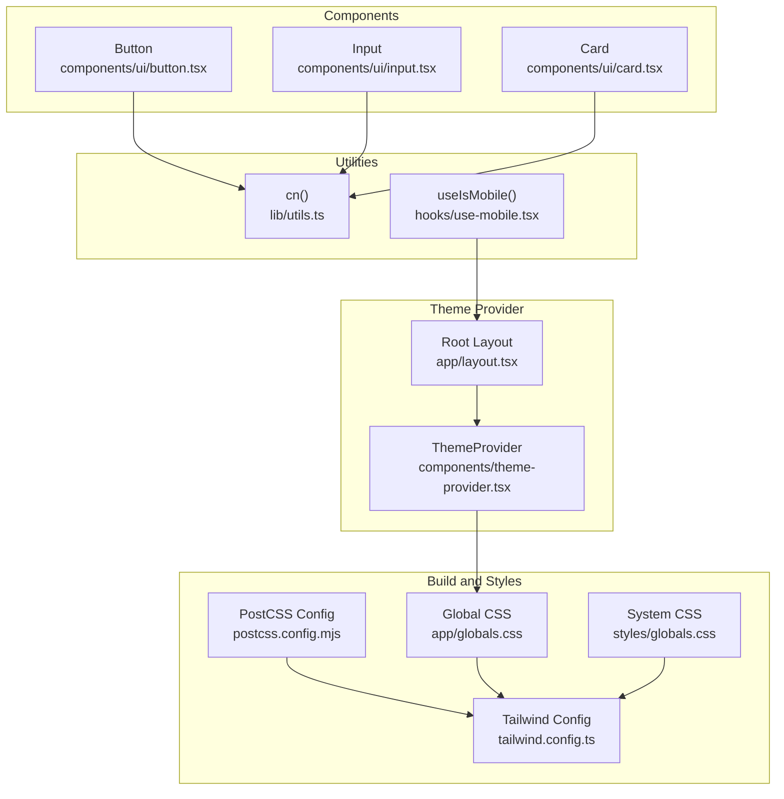
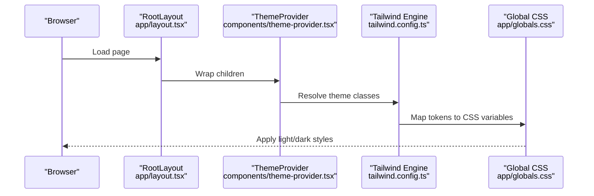
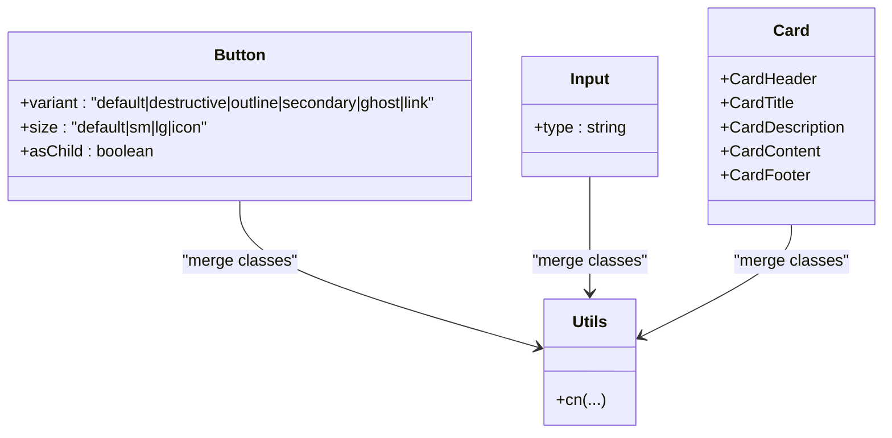
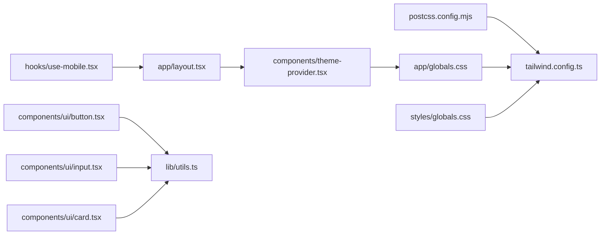

# Design System

<cite>
**Referenced Files in This Document**
- [tailwind.config.ts](file://tailwind.config.ts)
- [postcss.config.mjs](file://postcss.config.mjs)
- [components.json](file://components.json)
- [app/globals.css](file://app/globals.css)
- [styles/globals.css](file://styles/globals.css)
- [components/theme-provider.tsx](file://components/theme-provider.tsx)
- [components/providers.tsx](file://components/providers.tsx)
- [components/ui/button.tsx](file://components/ui/button.tsx)
- [components/ui/input.tsx](file://components/ui/input.tsx)
- [components/ui/card.tsx](file://components/ui/card.tsx)
- [app/layout.tsx](file://app/layout.tsx)
- [lib/contexts.tsx](file://lib/contexts.tsx)
- [lib/utils.ts](file://lib/utils.ts)
- [hooks/use-mobile.tsx](file://hooks/use-mobile.tsx)
- [components/ui/use-mobile.tsx](file://components/ui/use-mobile.tsx)
</cite>

## Table of Contents
1. [Introduction](#introduction)
2. [Project Structure](#project-structure)
3. [Core Components](#core-components)
4. [Architecture Overview](#architecture-overview)
5. [Detailed Component Analysis](#detailed-component-analysis)
6. [Dependency Analysis](#dependency-analysis)
7. [Performance Considerations](#performance-considerations)
8. [Troubleshooting Guide](#troubleshooting-guide)
9. [Conclusion](#conclusion)
10. [Appendices](#appendices)

## Introduction
This document describes the design system and customization capabilities of the project. It covers Tailwind CSS configuration, custom color schemes, typography, spacing and radius scales, the shadcn/ui integration via components.json, theme provider implementation for dark/light mode, responsive design patterns, and guidelines for extending the design system and maintaining consistency.

## Project Structure
The design system is built on top of Tailwind CSS with a layered CSS architecture and a theme provider for dynamic light/dark mode. Global CSS defines CSS variables for colors and radii, while Tailwind reads those variables to generate utility classes. The shadcn/ui component library is integrated through a configuration that aligns aliases and CSS variables.

**Diagram sources**
- [tailwind.config.ts:1-101](file://tailwind.config.ts#L1-L101)
- [postcss.config.mjs:1-9](file://postcss.config.mjs#L1-L9)
- [app/globals.css:1-69](file://app/globals.css#L1-L69)
- [styles/globals.css:1-95](file://styles/globals.css#L1-L95)
- [components/theme-provider.tsx:1-12](file://components/theme-provider.tsx#L1-L12)
- [app/layout.tsx:1-43](file://app/layout.tsx#L1-L43)
- [components/ui/button.tsx:1-58](file://components/ui/button.tsx#L1-L58)
- [components/ui/input.tsx:1-23](file://components/ui/input.tsx#L1-L23)
- [components/ui/card.tsx:1-80](file://components/ui/card.tsx#L1-L80)
- [lib/utils.ts:1-7](file://lib/utils.ts#L1-L7)
- [hooks/use-mobile.tsx:1-19](file://hooks/use-mobile.tsx#L1-L19)

**Section sources**
- [tailwind.config.ts:1-101](file://tailwind.config.ts#L1-L101)
- [postcss.config.mjs:1-9](file://postcss.config.mjs#L1-L9)
- [app/globals.css:1-69](file://app/globals.css#L1-L69)
- [styles/globals.css:1-95](file://styles/globals.css#L1-L95)
- [components/theme-provider.tsx:1-12](file://components/theme-provider.tsx#L1-L12)
- [app/layout.tsx:1-43](file://app/layout.tsx#L1-L43)
- [lib/utils.ts:1-7](file://lib/utils.ts#L1-L7)
- [hooks/use-mobile.tsx:1-19](file://hooks/use-mobile.tsx#L1-L19)

## Core Components
- Tailwind configuration defines color tokens mapped to CSS variables, typography families, border radius scale, and motion animations.
- Global CSS establishes CSS variables for light and dark themes, plus base layer styles and utility animations.
- Theme provider wraps the app to enable theme switching and persistence.
- UI primitives (Button, Input, Card) consume design tokens via Tailwind classes and a shared cn() utility.

Key design tokens and scales:
- Color palette: background, foreground, primary, secondary, muted, accent, destructive, card, popover, border, input, ring, chart, and sidebar palettes.
- Typography: sans and serif families bound to CSS variables.
- Radius: lg/md/sm derived from a single CSS variable.
- Motion: accordion animations for collapsible components.

**Section sources**
- [tailwind.config.ts:11-96](file://tailwind.config.ts#L11-L96)
- [app/globals.css:31-68](file://app/globals.css#L31-L68)
- [styles/globals.css:15-85](file://styles/globals.css#L15-L85)
- [components/theme-provider.tsx:9-11](file://components/theme-provider.tsx#L9-L11)
- [components/ui/button.tsx:7-34](file://components/ui/button.tsx#L7-L34)
- [components/ui/input.tsx:5-22](file://components/ui/input.tsx#L5-L22)
- [components/ui/card.tsx:5-79](file://components/ui/card.tsx#L5-L79)
- [lib/utils.ts:4-6](file://lib/utils.ts#L4-L6)

## Architecture Overview
The design system architecture ties together configuration, runtime theming, and component primitives.

**Diagram sources**
- [app/layout.tsx:32-39](file://app/layout.tsx#L32-L39)
- [components/theme-provider.tsx:9-11](file://components/theme-provider.tsx#L9-L11)
- [tailwind.config.ts:11-96](file://tailwind.config.ts#L11-L96)
- [app/globals.css:31-68](file://app/globals.css#L31-L68)

## Detailed Component Analysis

### Tailwind Configuration
- Dark mode strategy uses a class-based approach.
- Content paths scan pages, components, app, and root directories.
- Extends theme with color tokens, font families, border radius scale, and keyframe/animation definitions.
- Registers a motion plugin for animations.

Customization tips:
- Add new color tokens under theme.extend.colors.
- Extend typography families under theme.extend.fontFamily.
- Adjust border radius scale for consistent corner treatment.
- Add keyframes and animation names for component transitions.

**Section sources**
- [tailwind.config.ts:3-10](file://tailwind.config.ts#L3-L10)
- [tailwind.config.ts:11-96](file://tailwind.config.ts#L11-L96)
- [tailwind.config.ts:98-99](file://tailwind.config.ts#L98-L99)

### Global CSS Architecture
- Uses Tailwind layers: base, components, utilities.
- Defines CSS variables for light and dark themes.
- Applies base styles to borders and body text/background.
- Provides utility animations (e.g., shimmer) using color tokens.

Customization tips:
- Modify :root and .dark variables to change brand colors or palettes.
- Add new CSS variables for consistent spacing or typography scales.
- Keep base layer minimal; prefer Tailwind utilities for component styles.

**Section sources**
- [app/globals.css:1-3](file://app/globals.css#L1-L3)
- [app/globals.css:31-68](file://app/globals.css#L31-L68)
- [app/globals.css:5-29](file://app/globals.css#L5-L29)

### System CSS (Alternative Base)
- An alternate global CSS exists in styles/globals.css with a different color scheme and additional sidebar variables.
- Demonstrates how to maintain multiple base themes or environments.

**Section sources**
- [styles/globals.css:1-95](file://styles/globals.css#L1-L95)

### Theme Provider and Dark/Light Mode
- ThemeProvider is a thin wrapper around next-themes.
- The app’s root layout applies the provider to wrap UI.
- CSS variables drive theme switching; Tailwind consumes those variables.

Implementation notes:
- Ensure the html element toggles the theme class to activate dark styles.
- Persist theme preference using next-themes’ storage mechanisms.

**Section sources**
- [components/theme-provider.tsx:9-11](file://components/theme-provider.tsx#L9-L11)
- [app/layout.tsx:32-39](file://app/layout.tsx#L32-L39)
- [styles/globals.css:51-84](file://styles/globals.css#L51-L84)

### Shadcn/UI Integration via components.json
- Schema aligns with shadcn/ui expectations.
- Style defaults to “default”; RSC and TSX enabled.
- Tailwind config and CSS paths configured; baseColor set to neutral.
- CSS variables enabled for theme-aware tokens.
- Aliases map internal paths for components, utils, UI, lib, hooks.

Customization tips:
- Use the alias map to keep imports consistent across the project.
- When adding new components, follow the established alias conventions.
- Keep baseColor aligned with your primary palette for consistent variants.

**Section sources**
- [components.json:1-22](file://components.json#L1-L22)

### UI Primitives: Button, Input, Card
- Button uses class variance authority (CVA) to define variants and sizes; integrates with cn() for merging classes.
- Input composes Tailwind classes for focus states, padding, and responsive text sizing.
- Card groups related content with consistent spacing and typography.

Best practices:
- Prefer CVA for component variants to centralize style logic.
- Use cn() to merge incoming classes safely.
- Keep component-specific styles scoped to the component.

**Diagram sources**
- [components/ui/button.tsx:7-34](file://components/ui/button.tsx#L7-L34)
- [components/ui/button.tsx:43-54](file://components/ui/button.tsx#L43-L54)
- [components/ui/input.tsx:5-22](file://components/ui/input.tsx#L5-L22)
- [components/ui/card.tsx:5-79](file://components/ui/card.tsx#L5-L79)
- [lib/utils.ts:4-6](file://lib/utils.ts#L4-L6)

**Section sources**
- [components/ui/button.tsx:1-58](file://components/ui/button.tsx#L1-L58)
- [components/ui/input.tsx:1-23](file://components/ui/input.tsx#L1-L23)
- [components/ui/card.tsx:1-80](file://components/ui/card.tsx#L1-L80)
- [lib/utils.ts:1-7](file://lib/utils.ts#L1-L7)

### Responsive Design Patterns
- Mobile detection hook compares viewport against a breakpoint to compute responsive behavior.
- Components apply responsive utilities (e.g., md:text-sm) to adapt typography and spacing.

Guidelines:
- Use the provided mobile hook to gate responsive logic.
- Favor Tailwind’s responsive prefixes (sm:, md:, lg:, etc.) for consistent breakpoints.

**Section sources**
- [hooks/use-mobile.tsx:3-19](file://hooks/use-mobile.tsx#L3-L19)
- [components/ui/input.tsx:10-12](file://components/ui/input.tsx#L10-L12)

## Dependency Analysis
The design system depends on Tailwind for utility generation, PostCSS for build-time processing, and CSS variables for theming. Components depend on a shared cn() utility for safe class merging.

**Diagram sources**
- [postcss.config.mjs:1-9](file://postcss.config.mjs#L1-L9)
- [tailwind.config.ts:1-101](file://tailwind.config.ts#L1-L101)
- [app/globals.css:1-69](file://app/globals.css#L1-L69)
- [styles/globals.css:1-95](file://styles/globals.css#L1-L95)
- [components/theme-provider.tsx:1-12](file://components/theme-provider.tsx#L1-L12)
- [app/layout.tsx:1-43](file://app/layout.tsx#L1-L43)
- [components/ui/button.tsx:1-58](file://components/ui/button.tsx#L1-L58)
- [components/ui/input.tsx:1-23](file://components/ui/input.tsx#L1-L23)
- [components/ui/card.tsx:1-80](file://components/ui/card.tsx#L1-L80)
- [lib/utils.ts:1-7](file://lib/utils.ts#L1-L7)
- [hooks/use-mobile.tsx:1-19](file://hooks/use-mobile.tsx#L1-L19)

**Section sources**
- [postcss.config.mjs:1-9](file://postcss.config.mjs#L1-L9)
- [tailwind.config.ts:1-101](file://tailwind.config.ts#L1-L101)
- [app/globals.css:1-69](file://app/globals.css#L1-L69)
- [styles/globals.css:1-95](file://styles/globals.css#L1-L95)
- [components/theme-provider.tsx:1-12](file://components/theme-provider.tsx#L1-L12)
- [app/layout.tsx:1-43](file://app/layout.tsx#L1-L43)
- [lib/utils.ts:1-7](file://lib/utils.ts#L1-L7)
- [hooks/use-mobile.tsx:1-19](file://hooks/use-mobile.tsx#L1-L19)

## Performance Considerations
- Keep Tailwind content paths accurate to avoid unused CSS bloat.
- Prefer CSS variables for theme tokens to minimize re-renders during theme switches.
- Use responsive utilities judiciously; avoid excessive conditional rendering for small screens.
- Consolidate shared utilities (like cn()) to reduce bundle size and improve maintainability.

## Troubleshooting Guide
Common issues and resolutions:
- Theme not switching: verify the theme provider is wrapping the app and that the html class toggles appropriately.
- Colors not updating: ensure CSS variables are defined in both :root and .dark selectors.
- New colors not applied: confirm the new tokens are registered in Tailwind’s theme.extend and rebuild styles.
- Component styles not merging: check that cn() is used to merge incoming classes.

**Section sources**
- [components/theme-provider.tsx:9-11](file://components/theme-provider.tsx#L9-L11)
- [styles/globals.css:51-84](file://styles/globals.css#L51-L84)
- [tailwind.config.ts:11-96](file://tailwind.config.ts#L11-L96)
- [lib/utils.ts:4-6](file://lib/utils.ts#L4-L6)

## Conclusion
The project’s design system centers on Tailwind CSS with a robust theme provider and CSS variables for consistent light/dark mode. The shadcn/ui integration via components.json streamlines component development. By adhering to the established patterns—using CSS variables, cn(), responsive utilities, and CVA—you can extend the system reliably while maintaining design consistency.

## Appendices

### A. Customizing Tailwind Tokens
- Add new tokens in tailwind.config.ts under theme.extend.
- Rebuild styles after changes.
- Reference tokens in components via Tailwind utilities.

**Section sources**
- [tailwind.config.ts:11-96](file://tailwind.config.ts#L11-L96)

### B. Defining a New Color Palette
- Define CSS variables in app/globals.css or styles/globals.css for both :root and .dark.
- Register the color in Tailwind’s theme.extend.colors.
- Use the new palette in components and variants.

**Section sources**
- [app/globals.css:31-68](file://app/globals.css#L31-L68)
- [styles/globals.css:15-85](file://styles/globals.css#L15-L85)
- [tailwind.config.ts:13-64](file://tailwind.config.ts#L13-L64)

### C. Adding a New Component
- Place the component under components/ui.
- Use cn() to merge classes.
- Export variants via CVA if applicable.
- Update components.json aliases if introducing new paths.

**Section sources**
- [lib/utils.ts:4-6](file://lib/utils.ts#L4-L6)
- [components.json:13-19](file://components.json#L13-L19)

### D. Responsive Utilities
- Use the mobile hook to detect small screens.
- Apply responsive prefixes in component classes for adaptive layouts.

**Section sources**
- [hooks/use-mobile.tsx:3-19](file://hooks/use-mobile.tsx#L3-L19)
- [components/ui/input.tsx:10-12](file://components/ui/input.tsx#L10-L12)