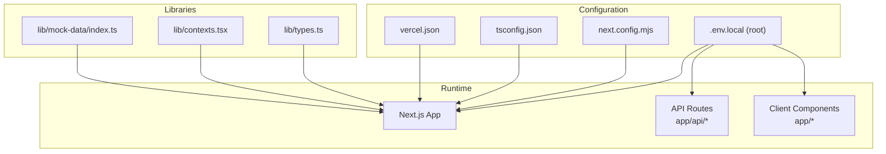
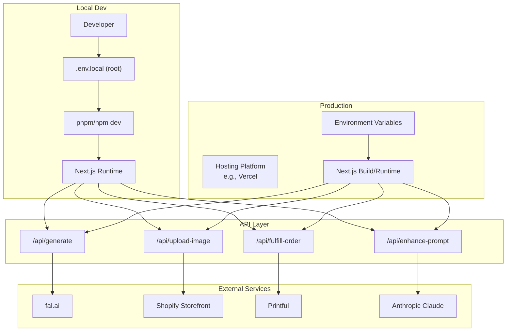
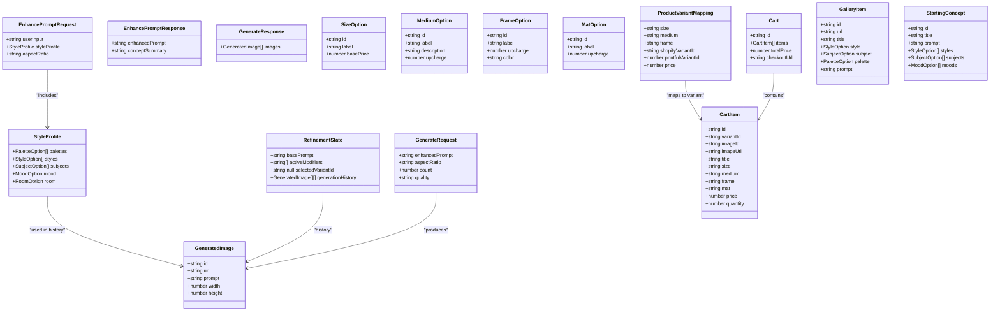
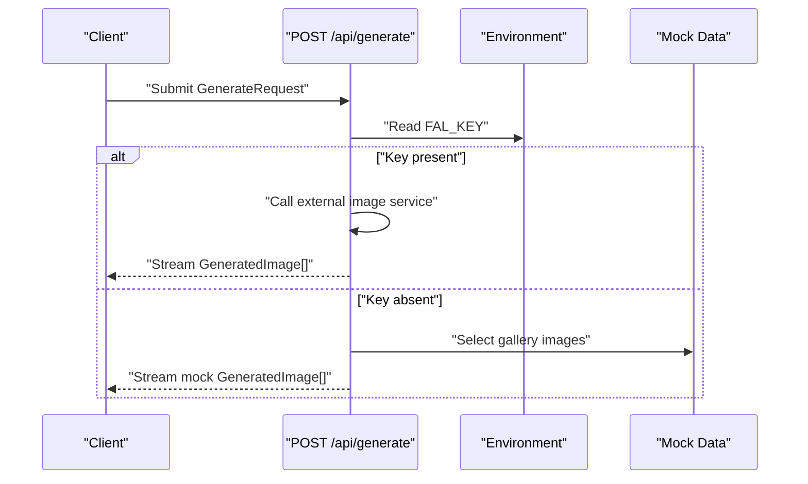
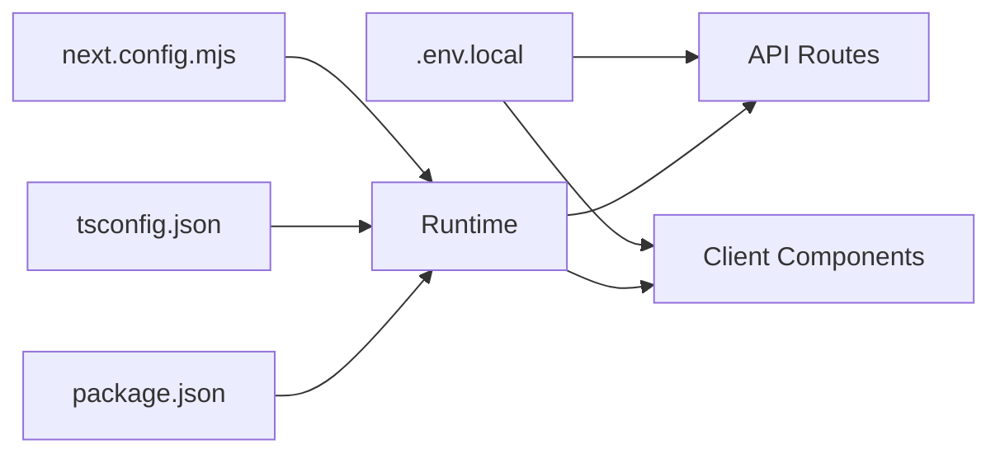

# Environment Setup

<cite>
**Referenced Files in This Document**
- [package.json](file://package.json)
- [next.config.mjs](file://next.config.mjs)
- [tsconfig.json](file://tsconfig.json)
- [vercel.json](file://vercel.json)
- [lib/types.ts](file://lib/types.ts)
- [lib/contexts.tsx](file://lib/contexts.tsx)
- [lib/mock-data/index.ts](file://lib/mock-data/index.ts)
- [app/api/generate/route.ts](file://app/api/generate/route.ts)
- [app/layout.tsx](file://app/layout.tsx)
- [README.md](file://README.md)
- [SETUP.md](file://SETUP.md)
- [QUICK_START.md](file://QUICK_START.md)
- [TROUBLESHOOTING.md](file://TROUBLESHOOTING.md)
- [SHOPIFY_SETUP.md](file://SHOPIFY_SETUP.md)
</cite>

## Table of Contents
1. [Introduction](#introduction)
2. [Project Structure](#project-structure)
3. [Core Components](#core-components)
4. [Architecture Overview](#architecture-overview)
5. [Detailed Component Analysis](#detailed-component-analysis)
6. [Dependency Analysis](#dependency-analysis)
7. [Performance Considerations](#performance-considerations)
8. [Troubleshooting Guide](#troubleshooting-guide)
9. [Conclusion](#conclusion)
10. [Appendices](#appendices)

## Introduction
This document provides comprehensive guidance for environment setup and configuration. It covers required environment variables, their purposes, and defaults; the type system architecture defined in lib/types.ts and how it integrates with the application; development versus production differences; local development setup; deployment configuration; troubleshooting common environment issues; security considerations for API keys; and best practices for managing sensitive configuration data. It also documents Next.js configuration options, TypeScript compiler settings, and package.json dependencies.

## Project Structure
The project is a Next.js 16 application using the App Router. Environment configuration primarily resides in:
- Local environment files (.env.local) placed at the project root
- Next.js configuration (next.config.mjs)
- TypeScript configuration (tsconfig.json)
- Build and deployment configuration (vercel.json)
- Application code that reads environment variables at runtime

**Diagram sources**
- [next.config.mjs:1-23](file://next.config.mjs#L1-L23)
- [tsconfig.json:1-34](file://tsconfig.json#L1-L34)
- [vercel.json:1-5](file://vercel.json#L1-L5)
- [lib/types.ts:1-132](file://lib/types.ts#L1-L132)
- [lib/contexts.tsx:1-255](file://lib/contexts.tsx#L1-L255)
- [lib/mock-data/index.ts:1-315](file://lib/mock-data/index.ts#L1-L315)
- [app/api/generate/route.ts:1-145](file://app/api/generate/route.ts#L1-L145)
- [app/layout.tsx:1-43](file://app/layout.tsx#L1-L43)

**Section sources**
- [next.config.mjs:1-23](file://next.config.mjs#L1-L23)
- [tsconfig.json:1-34](file://tsconfig.json#L1-L34)
- [vercel.json:1-5](file://vercel.json#L1-L5)
- [lib/types.ts:1-132](file://lib/types.ts#L1-L132)
- [lib/contexts.tsx:1-255](file://lib/contexts.tsx#L1-L255)
- [lib/mock-data/index.ts:1-315](file://lib/mock-data/index.ts#L1-L315)
- [app/api/generate/route.ts:1-145](file://app/api/generate/route.ts#L1-L145)
- [app/layout.tsx:1-43](file://app/layout.tsx#L1-L43)

## Core Components
- Environment variables
  - Required for image generation: FAL_KEY
  - Optional for production features: NEXT_PUBLIC_SHOPIFY_STORE_DOMAIN, SHOPIFY_STOREFRONT_ACCESS_TOKEN, SHOPIFY_API_VERSION, PRINTFUL_API_KEY, ANTHROPIC_API_KEY
- Next.js configuration
  - TypeScript build behavior and image remote patterns
- TypeScript configuration
  - Strictness, module resolution, JSX transform, and path aliases
- Type system
  - Strongly typed interfaces and enums for style profiles, generation requests, product configurator options, cart, gallery, and starting concepts
- Runtime integration
  - API routes read environment variables and fall back to mock data when keys are absent
  - Context providers manage state locally and coordinate with API routes

**Section sources**
- [README.md:191-218](file://README.md#L191-L218)
- [SETUP.md:14-27](file://SETUP.md#L14-L27)
- [next.config.mjs:3-19](file://next.config.mjs#L3-L19)
- [tsconfig.json:2-24](file://tsconfig.json#L2-L24)
- [lib/types.ts:1-132](file://lib/types.ts#L1-L132)
- [app/api/generate/route.ts:25-64](file://app/api/generate/route.ts#L25-L64)

## Architecture Overview
The environment setup supports two operational modes:
- Development mode: local .env.local supplies API keys; Next.js serves the app with hot reload
- Production mode: hosting platforms inject environment variables; Next.js builds and serves the app

**Diagram sources**
- [README.md:60-68](file://README.md#L60-L68)
- [README.md:191-218](file://README.md#L191-L218)
- [app/api/generate/route.ts:1-145](file://app/api/generate/route.ts#L1-L145)
- [vercel.json:1-5](file://vercel.json#L1-L5)

## Detailed Component Analysis

### Environment Variables and Their Roles
- FAL_KEY
  - Purpose: Authenticates requests to fal.ai image generation
  - Presence: Checked in API routes; absence triggers mock fallback
  - Defaults: None; required for real generation
- NEXT_PUBLIC_SHOPIFY_STORE_DOMAIN
  - Purpose: Publicly exposed store domain for client-side checkout redirection
  - Defaults: None; optional for production features
- SHOPIFY_STOREFRONT_ACCESS_TOKEN
  - Purpose: Secure storefront API access token for Shopify integration
  - Defaults: None; optional for production features
- SHOPIFY_API_VERSION
  - Purpose: API version for Shopify Storefront API
  - Defaults: None; optional for production features
- PRINTFUL_API_KEY
  - Purpose: Authentication for Printful fulfillment
  - Defaults: None; optional for production features
- ANTHROPIC_API_KEY
  - Purpose: Authentication for prompt enhancement via Anthropic Claude
  - Defaults: None; optional for production features

Best practices:
- Store secrets in .env.local at the project root
- Do not commit .env.local to version control
- Use hosting platform dashboards to set production environment variables
- Restart the server after updating .env.local

**Section sources**
- [README.md:191-218](file://README.md#L191-L218)
- [SETUP.md:14-27](file://SETUP.md#L14-L27)
- [SHOPIFY_SETUP.md:50-58](file://SHOPIFY_SETUP.md#L50-L58)
- [TROUBLESHOOTING.md:217-246](file://TROUBLESHOOTING.md#L217-L246)

### Type System Architecture (lib/types.ts)
The type system defines strongly typed contracts for:
- StyleProfile and associated enums (palettes, styles, subjects, mood, room)
- Generation pipeline (GeneratedImage, RefinementState, EnhancePromptRequest/Response, GenerateRequest/Response)
- Product configurator (SizeOption, MediumOption, FrameOption, MatOption, ProductVariantMapping)
- Cart (CartItem, Cart)
- Gallery and starting concepts (GalleryItem, StartingConcept)

**Diagram sources**
- [lib/types.ts:1-132](file://lib/types.ts#L1-L132)

**Section sources**
- [lib/types.ts:1-132](file://lib/types.ts#L1-L132)

### Integration with Application Code
- API routes read environment variables and conditionally execute real or mock flows
- Context providers manage UI state and persist selections to localStorage
- Mock data provides realistic defaults for development and testing

**Diagram sources**
- [app/api/generate/route.ts:19-64](file://app/api/generate/route.ts#L19-L64)
- [lib/mock-data/index.ts:82-169](file://lib/mock-data/index.ts#L82-L169)

**Section sources**
- [app/api/generate/route.ts:19-64](file://app/api/generate/route.ts#L19-L64)
- [lib/mock-data/index.ts:82-169](file://lib/mock-data/index.ts#L82-L169)

### Development vs Production Differences
- Development
  - Use .env.local at project root
  - Run with pnpm/npm dev
  - API routes may fall back to mock images if keys are missing
- Production
  - Hosting platforms inject environment variables
  - Build via pnpm install && pnpm run build
  - Ensure variables are set before redeploy

**Section sources**
- [README.md:174-189](file://README.md#L174-L189)
- [vercel.json:1-5](file://vercel.json#L1-L5)
- [SETUP.md:149-154](file://SETUP.md#L149-L154)

### Local Development Setup
- Obtain API keys and place them in .env.local
- Install dependencies and start the development server
- Access the app at http://localhost:3000

**Section sources**
- [SETUP.md:14-40](file://SETUP.md#L14-L40)
- [QUICK_START.md:10-40](file://QUICK_START.md#L10-L40)

### Deployment Configuration
- Build command and framework are defined for Vercel
- Ensure environment variables are configured in the hosting platform

**Section sources**
- [vercel.json:1-5](file://vercel.json#L1-L5)

### Next.js Configuration Options
- TypeScript build behavior
  - ignoreBuildErrors: true
- Remote image patterns
  - Allowlisted hosts for images (fal media and Google Cloud Storage)

**Section sources**
- [next.config.mjs:3-19](file://next.config.mjs#L3-L19)

### TypeScript Compiler Settings
- Strict mode enabled
- ES6 target with ESNext modules and bundler module resolution
- React JSX transform and incremental compilation
- Path aliases (@/*)

**Section sources**
- [tsconfig.json:2-24](file://tsconfig.json#L2-L24)

### Package.json Dependencies
- Core framework: next
- UI primitives and design system: radix-ui, lucide-react, tailwind-based libraries
- State and forms: react-hook-form, zod
- Utilities: date-fns, recharts, clsx, tailwind-merge
- AI clients: @fal-ai/client, @google/generative-ai
- Development dependencies: TypeScript, PostCSS, Tailwind CSS

**Section sources**
- [package.json:11-79](file://package.json#L11-L79)

## Dependency Analysis
The environment setup influences several subsystems:
- API routes depend on environment variables for external service authentication
- Client components rely on public environment variables for third-party integrations
- Build and runtime behavior is governed by Next.js and TypeScript configurations

**Diagram sources**
- [next.config.mjs:1-23](file://next.config.mjs#L1-L23)
- [tsconfig.json:1-34](file://tsconfig.json#L1-L34)
- [package.json:1-81](file://package.json#L1-L81)
- [app/api/generate/route.ts:1-145](file://app/api/generate/route.ts#L1-L145)
- [app/layout.tsx:1-43](file://app/layout.tsx#L1-L43)

**Section sources**
- [next.config.mjs:1-23](file://next.config.mjs#L1-L23)
- [tsconfig.json:1-34](file://tsconfig.json#L1-L34)
- [package.json:1-81](file://package.json#L1-L81)
- [app/api/generate/route.ts:1-145](file://app/api/generate/route.ts#L1-L145)
- [app/layout.tsx:1-43](file://app/layout.tsx#L1-L43)

## Performance Considerations
- Prefer standard quality for rapid iteration; reserve premium quality for final outputs
- Monitor rate limits and implement backoff strategies
- Use caching and streaming responses where appropriate
- Keep dependencies updated to benefit from performance improvements

## Troubleshooting Guide
Common environment issues and resolutions:
- Images not generating (still seeing gallery images)
  - Restart the development server
  - Verify .env.local location and format
  - Confirm API key presence in console
- API key invalid
  - Obtain a fresh key from the provider
  - Ensure no extraneous characters or spaces
- Rate limit exceeded
  - Wait for quota reset or upgrade plan
  - Reduce generation frequency
- Mock images still showing in production
  - Set environment variables in the hosting platform
  - Verify variable is applied and redeploy
- Build errors
  - Clean install and check TypeScript errors
  - Confirm environment variables are present

Security considerations:
- Never commit .env.local or API keys to version control
- Use hosting platform dashboards to manage secrets
- Rotate keys periodically and revoke compromised ones
- Restrict API permissions to least privilege

**Section sources**
- [TROUBLESHOOTING.md:5-364](file://TROUBLESHOOTING.md#L5-L364)
- [README.md:191-218](file://README.md#L191-L218)
- [SETUP.md:89-123](file://SETUP.md#L89-L123)

## Conclusion
A robust environment setup requires clear separation of concerns between local development and production deployment, strict handling of secrets, and consistent configuration across Next.js and TypeScript. By following the guidelines in this document—using .env.local for local secrets, hosting platforms for production variables, and strong typing to enforce correctness—you can maintain a secure, reliable, and scalable environment for your AI art generation platform.

## Appendices
- Environment variables quick reference
  - FAL_KEY: Required for real image generation
  - NEXT_PUBLIC_SHOPIFY_STORE_DOMAIN: Public store domain for client-side checkout
  - SHOPIFY_STOREFRONT_ACCESS_TOKEN: Secure storefront API token
  - SHOPIFY_API_VERSION: API version for Shopify Storefront
  - PRINTFUL_API_KEY: Printful fulfillment authentication
  - ANTHROPIC_API_KEY: Prompt enhancement via Claude

**Section sources**
- [README.md:191-218](file://README.md#L191-L218)
- [SHOPIFY_SETUP.md:50-58](file://SHOPIFY_SETUP.md#L50-L58)