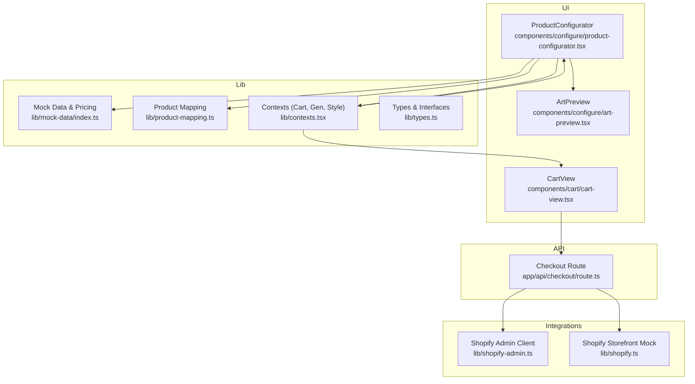
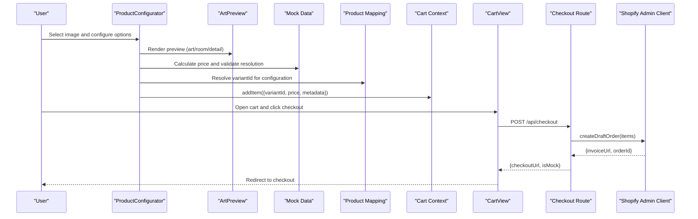
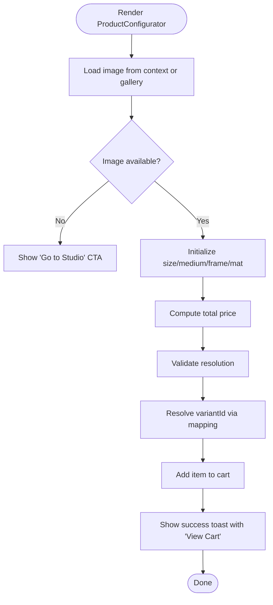
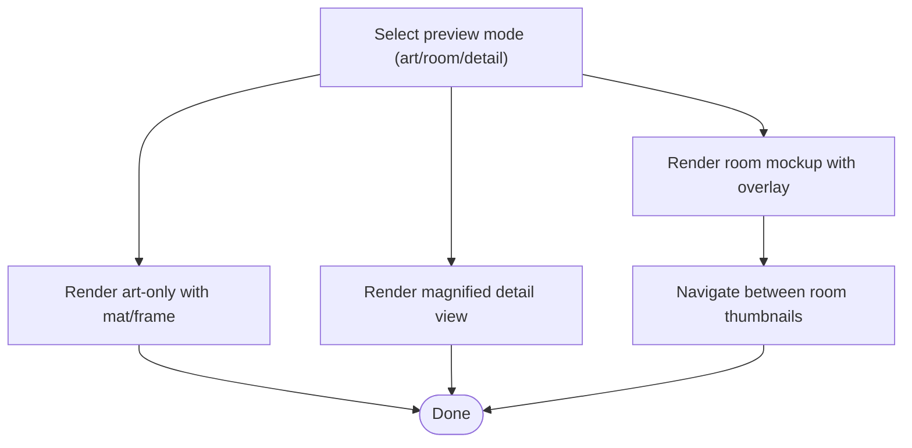
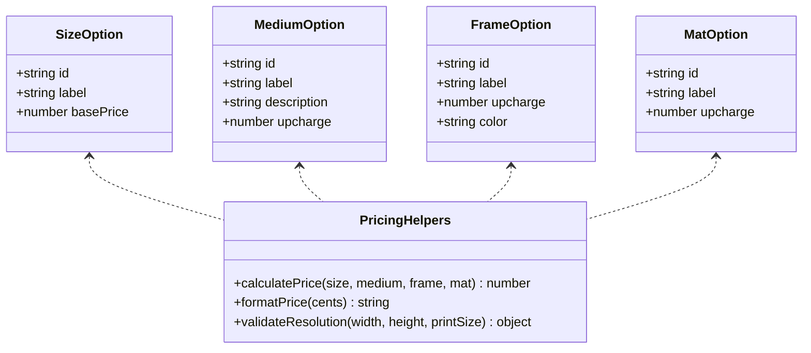
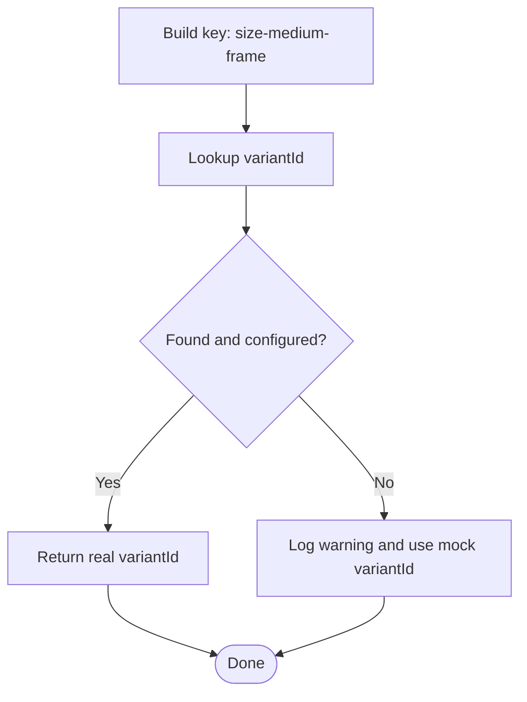
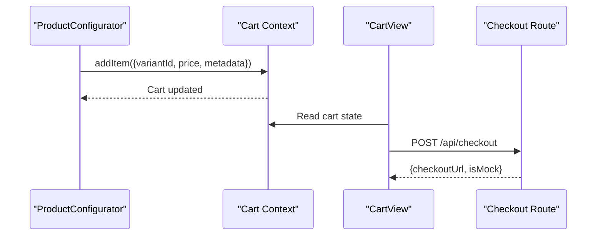
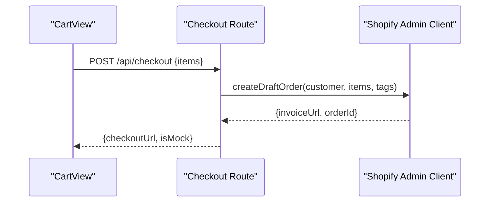
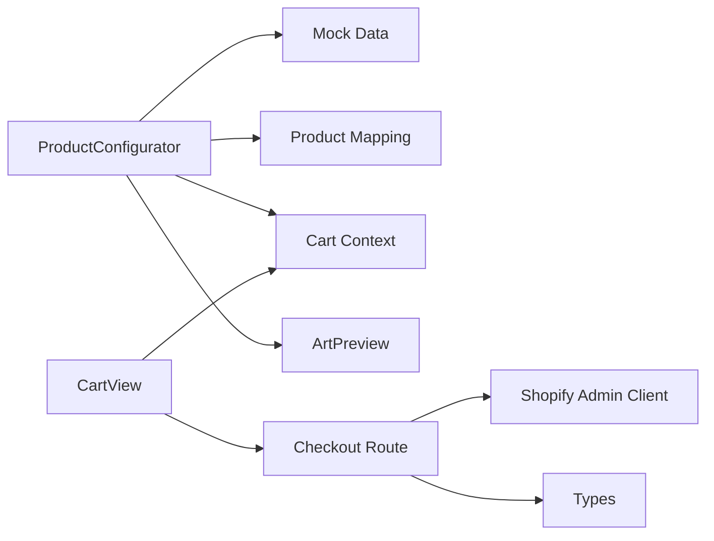

# Product Configuration

<cite>
**Referenced Files in This Document**
- [product-configurator.tsx](file://components/configure/product-configurator.tsx)
- [art-preview.tsx](file://components/configure/art-preview.tsx)
- [index.ts](file://lib/mock-data/index.ts)
- [product-mapping.ts](file://lib/product-mapping.ts)
- [types.ts](file://lib/types.ts)
- [contexts.tsx](file://lib/contexts.tsx)
- [cart-view.tsx](file://components/cart/cart-view.tsx)
- [route.ts](file://app/api/checkout/route.ts)
- [shopify.ts](file://lib/shopify.ts)
- [shopify-admin.ts](file://lib/shopify-admin.ts)
- [providers.tsx](file://components/providers.tsx)
- [page.tsx](file://app/configure/[imageId]/page.tsx)
- [README.md](file://README.md)
- [package.json](file://package.json)
</cite>

## Table of Contents
1. [Introduction](#introduction)
2. [Project Structure](#project-structure)
3. [Core Components](#core-components)
4. [Architecture Overview](#architecture-overview)
5. [Detailed Component Analysis](#detailed-component-analysis)
6. [Dependency Analysis](#dependency-analysis)
7. [Performance Considerations](#performance-considerations)
8. [Troubleshooting Guide](#troubleshooting-guide)
9. [Conclusion](#conclusion)
10. [Appendices](#appendices)

## Introduction
This document explains the product configuration and mapping systems powering the AI-generated art print customization flow. It covers how products are modeled, configured for different platforms, and how the configurator integrates with the shopping cart and checkout pipeline. It also documents the mock data structure used during development, the configuration workflow from image selection to product customization, and guidelines for extending the system with new product types and settings.

## Project Structure
The product configuration system spans UI components, shared data, and integration layers:
- UI configurator and preview components
- Shared mock data and pricing helpers
- Product variant mapping and type definitions
- Cart and checkout integration
- API routes for checkout orchestration

**Diagram sources**
- [product-configurator.tsx:1-279](file://components/configure/product-configurator.tsx#L1-L279)
- [art-preview.tsx:1-354](file://components/configure/art-preview.tsx#L1-L354)
- [index.ts:1-315](file://lib/mock-data/index.ts#L1-L315)
- [product-mapping.ts:1-68](file://lib/product-mapping.ts#L1-L68)
- [contexts.tsx:1-255](file://lib/contexts.tsx#L1-L255)
- [types.ts:1-132](file://lib/types.ts#L1-L132)
- [cart-view.tsx:1-221](file://components/cart/cart-view.tsx#L1-L221)
- [route.ts:1-76](file://app/api/checkout/route.ts#L1-L76)
- [shopify.ts:1-303](file://lib/shopify.ts#L1-L303)
- [shopify-admin.ts:1-103](file://lib/shopify-admin.ts#L1-L103)

**Section sources**
- [README.md:1-250](file://README.md#L1-L250)
- [package.json:1-81](file://package.json#L1-L81)

## Core Components
- ProductConfigurator: Orchestrates image selection, configuration options (size, medium, frame, mat), live preview, pricing calculation, and cart integration.
- ArtPreview: Renders the configured print in three modes: art-only, room mockup, and detail view.
- Mock Data: Defines sizes, mediums, frames, mats, gallery items, starting concepts, and pricing helpers.
- Product Mapping: Maps configuration keys to platform variant identifiers (Shopify or mock).
- Contexts: Provide cart state, generation state, and style profile to the UI.
- CartView: Displays cart items and initiates checkout via API route.
- Checkout Route: Creates Shopify draft orders and returns checkout URLs.
- Shopify Clients: Admin API client for draft orders and storefront client for cart operations.

**Section sources**
- [product-configurator.tsx:1-279](file://components/configure/product-configurator.tsx#L1-L279)
- [art-preview.tsx:1-354](file://components/configure/art-preview.tsx#L1-L354)
- [index.ts:1-315](file://lib/mock-data/index.ts#L1-L315)
- [product-mapping.ts:1-68](file://lib/product-mapping.ts#L1-L68)
- [contexts.tsx:1-255](file://lib/contexts.tsx#L1-L255)
- [cart-view.tsx:1-221](file://components/cart/cart-view.tsx#L1-L221)
- [route.ts:1-76](file://app/api/checkout/route.ts#L1-L76)
- [shopify.ts:1-303](file://lib/shopify.ts#L1-L303)
- [shopify-admin.ts:1-103](file://lib/shopify-admin.ts#L1-L103)

## Architecture Overview
The configuration flow begins after an image is selected (either from generation or gallery). The configurator computes pricing, validates resolution, and lets users preview the print in different contexts. Adding to cart stores a cart item with the computed price and a variant identifier. The cart view triggers checkout, which creates a Shopify draft order and returns a checkout URL.

**Diagram sources**
- [product-configurator.tsx:44-69](file://components/configure/product-configurator.tsx#L44-L69)
- [art-preview.tsx:1-354](file://components/configure/art-preview.tsx#L1-L354)
- [index.ts:287-314](file://lib/mock-data/index.ts#L287-L314)
- [product-mapping.ts:37-49](file://lib/product-mapping.ts#L37-L49)
- [contexts.tsx:207-219](file://lib/contexts.tsx#L207-L219)
- [cart-view.tsx:18-52](file://components/cart/cart-view.tsx#L18-L52)
- [route.ts:5-62](file://app/api/checkout/route.ts#L5-L62)
- [shopify-admin.ts:25-95](file://lib/shopify-admin.ts#L25-L95)

## Detailed Component Analysis

### ProductConfigurator
Responsibilities:
- Selects the active image from generation context or gallery fallback.
- Manages configuration state (size, medium, frame, mat).
- Computes total price and validates resolution.
- Resolves a variant identifier for the selected configuration.
- Adds a cart item with metadata and navigates to cart on success.

Key behaviors:
- Uses mock pricing helpers to compute totals.
- Uses product mapping to resolve variant IDs (fallback to mock variant ID when not configured).
- Integrates with ArtPreview for live rendering.

**Diagram sources**
- [product-configurator.tsx:19-69](file://components/configure/product-configurator.tsx#L19-L69)
- [index.ts:287-314](file://lib/mock-data/index.ts#L287-L314)
- [product-mapping.ts:37-49](file://lib/product-mapping.ts#L37-L49)

**Section sources**
- [product-configurator.tsx:1-279](file://components/configure/product-configurator.tsx#L1-L279)
- [page.tsx:1-12](file://app/configure/[imageId]/page.tsx#L1-L12)

### ArtPreview
Responsibilities:
- Renders the configured print in three modes:
  - Art-only: shows the print with optional mat and frame.
  - Room view: overlays the print on room mockups with navigation between rooms.
  - Detail: magnified view of the artwork.
- Supports dynamic sizing and frame styling.

**Diagram sources**
- [art-preview.tsx:118-354](file://components/configure/art-preview.tsx#L118-L354)

**Section sources**
- [art-preview.tsx:1-354](file://components/configure/art-preview.tsx#L1-L354)

### Mock Data and Pricing
Structure:
- Sizes, Mediums, Frames, Mats define selectable options and associated upcharges.
- Gallery items and starting concepts provide curated content for discovery and generation.
- Pricing helpers compute total price and format currency.
- Resolution validation ensures minimum DPI thresholds and suggests upscaling when needed.

**Diagram sources**
- [index.ts:11-314](file://lib/mock-data/index.ts#L11-L314)

**Section sources**
- [index.ts:1-315](file://lib/mock-data/index.ts#L1-L315)

### Product Mapping
Purpose:
- Map configuration keys (size-medium-frame) to platform variant identifiers.
- Provide fallback behavior when mappings are missing (development mode).
- Expose helpers to check configuration completeness and list configured variants.

Behavior:
- Keys are constructed from selected options.
- Returns a real variant ID when configured; otherwise returns a mock variant ID and logs warnings.

**Diagram sources**
- [product-mapping.ts:37-49](file://lib/product-mapping.ts#L37-L49)

**Section sources**
- [product-mapping.ts:1-68](file://lib/product-mapping.ts#L1-L68)

### Cart Integration
Cart Context:
- Stores cart in localStorage and exposes methods to add/remove items and compute totals.
- Provides checkout URL placeholder until integration is configured.

Cart View:
- Displays items with metadata (size, medium, frame, mat).
- Initiates checkout via API route and handles mock vs. real checkout.

**Diagram sources**
- [contexts.tsx:207-241](file://lib/contexts.tsx#L207-L241)
- [cart-view.tsx:18-52](file://components/cart/cart-view.tsx#L18-L52)
- [route.ts:5-62](file://app/api/checkout/route.ts#L5-L62)

**Section sources**
- [contexts.tsx:164-255](file://lib/contexts.tsx#L164-L255)
- [cart-view.tsx:1-221](file://components/cart/cart-view.tsx#L1-L221)

### Checkout Workflow
Checkout Route:
- Validates cart items and checks Shopify configuration.
- Creates a Shopify draft order and returns an invoice URL.
- Falls back to a placeholder checkout when Shopify is not configured.

Shopify Admin Client:
- Creates draft orders using Admin API with line items and properties.
- Requires proper credentials and permissions.

**Diagram sources**
- [route.ts:5-62](file://app/api/checkout/route.ts#L5-L62)
- [shopify-admin.ts:25-95](file://lib/shopify-admin.ts#L25-L95)

**Section sources**
- [route.ts:1-76](file://app/api/checkout/route.ts#L1-L76)
- [shopify-admin.ts:1-103](file://lib/shopify-admin.ts#L1-L103)

## Dependency Analysis
- ProductConfigurator depends on:
  - Mock data for options and pricing.
  - Product mapping for variant resolution.
  - Cart context for adding items.
  - ArtPreview for rendering previews.
- CartView depends on:
  - Cart context for state.
  - Checkout route for initiating checkout.
- Checkout route depends on:
  - Shopify Admin client for draft orders.
  - Types for item structure.

**Diagram sources**
- [product-configurator.tsx:1-279](file://components/configure/product-configurator.tsx#L1-L279)
- [art-preview.tsx:1-354](file://components/configure/art-preview.tsx#L1-L354)
- [index.ts:1-315](file://lib/mock-data/index.ts#L1-L315)
- [product-mapping.ts:1-68](file://lib/product-mapping.ts#L1-L68)
- [contexts.tsx:164-255](file://lib/contexts.tsx#L164-L255)
- [cart-view.tsx:1-221](file://components/cart/cart-view.tsx#L1-L221)
- [route.ts:1-76](file://app/api/checkout/route.ts#L1-L76)
- [shopify-admin.ts:1-103](file://lib/shopify-admin.ts#L1-L103)
- [types.ts:90-110](file://lib/types.ts#L90-L110)

**Section sources**
- [types.ts:90-110](file://lib/types.ts#L90-L110)
- [contexts.tsx:164-255](file://lib/contexts.tsx#L164-L255)

## Performance Considerations
- Pricing computation is O(1) per option lookup; memoization prevents unnecessary recalculations.
- Preview rendering uses lightweight CSS transforms and image scaling; avoid excessive DOM updates.
- LocalStorage usage for cart and profile is efficient but consider clearing stale entries periodically.
- API calls to Shopify Admin should be batched and validated before submission to minimize errors.

## Troubleshooting Guide
Common issues and resolutions:
- Missing Shopify credentials:
  - Symptoms: Checkout route returns mock checkout URL and warnings.
  - Resolution: Set required environment variables and re-run.
- Unconfigured product mapping:
  - Symptoms: Warning logs about missing variant ID; mock variant used.
  - Resolution: Populate product mapping with real variant IDs.
- Cart not persisting:
  - Symptoms: Cart resets after reload.
  - Resolution: Verify localStorage availability and absence of storage quota errors.
- Checkout failures:
  - Symptoms: Error responses from Shopify Admin API.
  - Resolution: Confirm Admin API token permissions and domain configuration.

**Section sources**
- [route.ts:17-27](file://app/api/checkout/route.ts#L17-L27)
- [product-mapping.ts:41-46](file://lib/product-mapping.ts#L41-L46)
- [contexts.tsx:189-205](file://lib/contexts.tsx#L189-L205)
- [shopify-admin.ts:30-32](file://lib/shopify-admin.ts#L30-L32)

## Conclusion
The product configuration system combines a flexible configurator, robust mock data, and a clear mapping layer to deliver a smooth customization experience. By structuring variants around size, medium, and frame, and by integrating with the cart and checkout pipeline, the system supports scalable product types and seamless transitions to production integrations.

## Appendices

### Configuration Workflow Summary
- Image selection: From generation context or gallery.
- Configuration: Choose size, medium, frame, mat; preview in multiple modes.
- Pricing: Computed from base price plus upcharges; formatted for display.
- Variant resolution: Maps configuration to platform variant ID; uses mock fallback if needed.
- Cart: Item added with metadata; checkout initiated via API.
- Checkout: Draft order created; redirects to Shopify checkout.

**Section sources**
- [product-configurator.tsx:33-69](file://components/configure/product-configurator.tsx#L33-L69)
- [index.ts:287-314](file://lib/mock-data/index.ts#L287-L314)
- [product-mapping.ts:37-49](file://lib/product-mapping.ts#L37-L49)
- [contexts.tsx:207-219](file://lib/contexts.tsx#L207-L219)
- [route.ts:29-62](file://app/api/checkout/route.ts#L29-L62)

### Guidelines for Adding New Product Types
- Extend mock data:
  - Add new size/medium/frame/mat options with appropriate upcharges.
  - Update pricing helpers if new categories require special logic.
- Update product mapping:
  - Add new configuration keys with corresponding variant IDs.
  - Ensure isProductMappingConfigured reflects completeness.
- Update UI:
  - Add new options to configurator selectors.
  - Adjust preview logic if new attributes affect rendering.
- Integrate with cart and checkout:
  - Ensure cart items include new attributes.
  - Confirm checkout route can handle new properties.

**Section sources**
- [index.ts:11-80](file://lib/mock-data/index.ts#L11-L80)
- [product-mapping.ts:15-32](file://lib/product-mapping.ts#L15-L32)
- [types.ts:81-103](file://lib/types.ts#L81-L103)

### Extending the Configuration Interface
- Add new attributes by extending types and mock data.
- Update configurator state and rendering logic.
- Ensure preview adapts to new attributes (e.g., additional overlays or room placements).
- Keep pricing helpers generic to support new combinations.

**Section sources**
- [types.ts:54-88](file://lib/types.ts#L54-L88)
- [index.ts:287-314](file://lib/mock-data/index.ts#L287-L314)
- [art-preview.tsx:118-354](file://components/configure/art-preview.tsx#L118-L354)

### Relationship Between Configuration and Shopping Cart
- Cart items carry:
  - variantId (resolved from configuration).
  - imageId and imageUrl for fulfillment.
  - Title, size, medium, frame, mat for display and order details.
  - price and quantity for totals.
- Checkout route converts cart items to Shopify draft order line items with properties preserved.

**Section sources**
- [types.ts:90-110](file://lib/types.ts#L90-L110)
- [contexts.tsx:207-219](file://lib/contexts.tsx#L207-L219)
- [route.ts:32-46](file://app/api/checkout/route.ts#L32-L46)