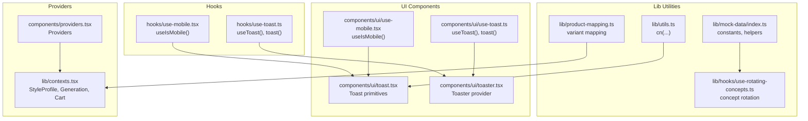
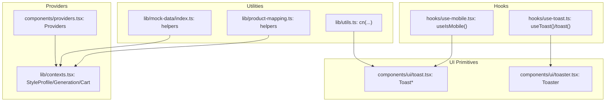
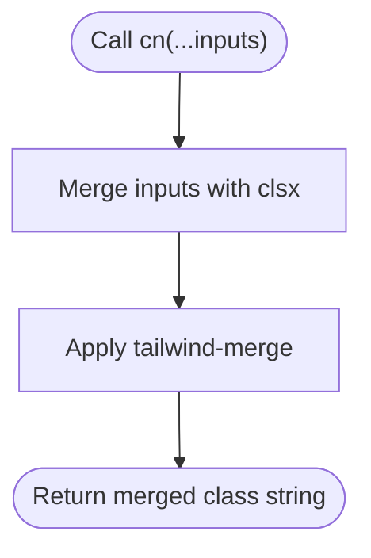
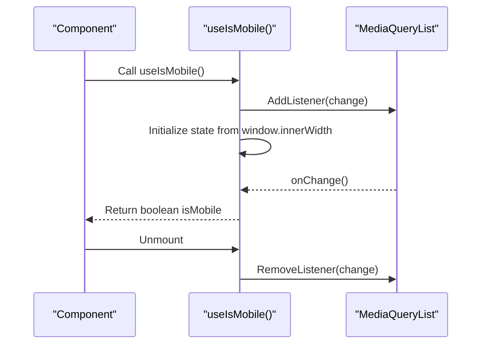
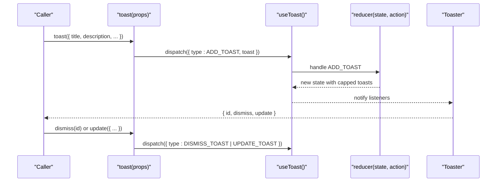
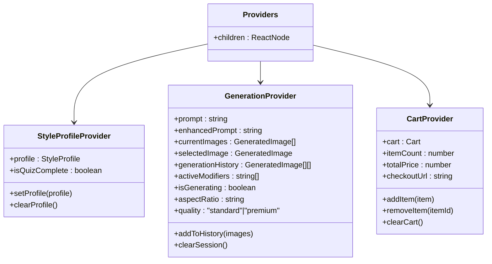
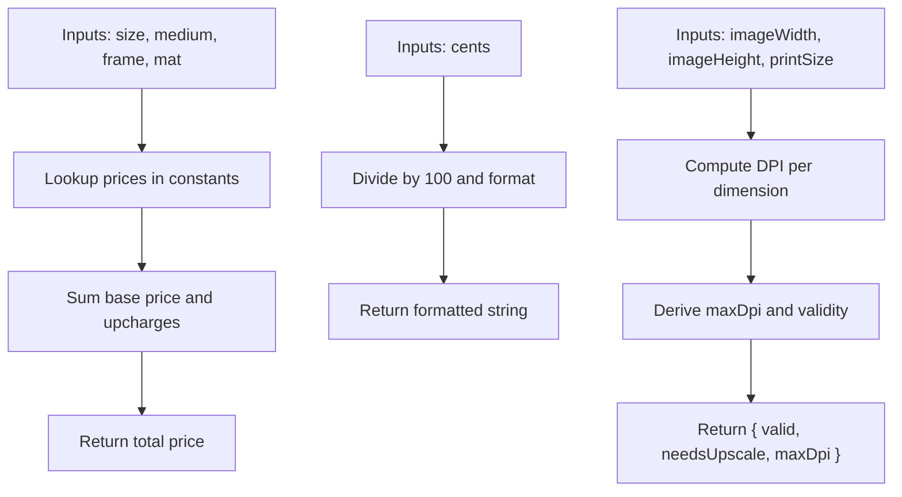
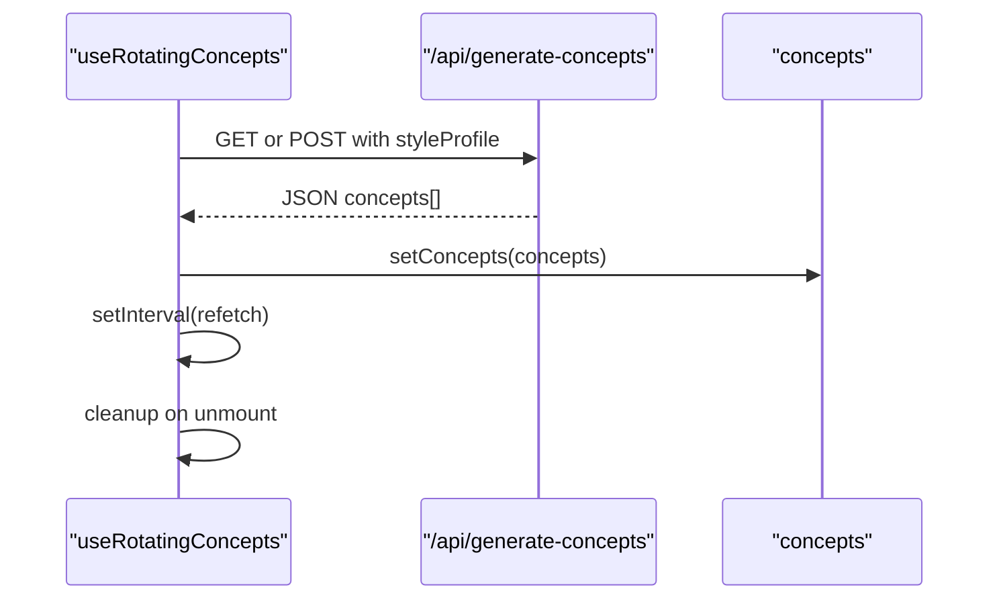
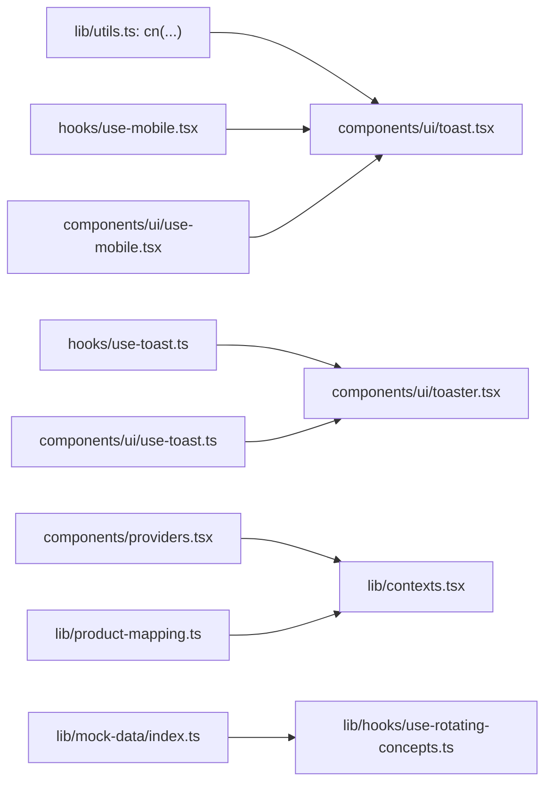

# Utility Functions

<cite>
**Referenced Files in This Document**
- [lib/utils.ts](file://lib/utils.ts)
- [hooks/use-mobile.tsx](file://hooks/use-mobile.tsx)
- [hooks/use-toast.ts](file://hooks/use-toast.ts)
- [components/ui/use-mobile.tsx](file://components/ui/use-mobile.tsx)
- [components/ui/use-toast.ts](file://components/ui/use-toast.ts)
- [components/ui/toast.tsx](file://components/ui/toast.tsx)
- [components/ui/toaster.tsx](file://components/ui/toaster.tsx)
- [components/providers.tsx](file://components/providers.tsx)
- [lib/contexts.tsx](file://lib/contexts.tsx)
- [lib/types.ts](file://lib/types.ts)
- [lib/mock-data/index.ts](file://lib/mock-data/index.ts)
- [lib/hooks/use-rotating-concepts.ts](file://lib/hooks/use-rotating-concepts.ts)
- [lib/product-mapping.ts](file://lib/product-mapping.ts)
</cite>

## Table of Contents
1. [Introduction](#introduction)
2. [Project Structure](#project-structure)
3. [Core Components](#core-components)
4. [Architecture Overview](#architecture-overview)
5. [Detailed Component Analysis](#detailed-component-analysis)
6. [Dependency Analysis](#dependency-analysis)
7. [Performance Considerations](#performance-considerations)
8. [Troubleshooting Guide](#troubleshooting-guide)
9. [Conclusion](#conclusion)
10. [Appendices](#appendices)

## Introduction
This document focuses on the utility functions and helper modules that power the application’s UI, state management, and developer ergonomics. It covers:
- The Tailwind CSS class merging utility
- Mobile detection hooks
- The toast notification system (including providers and components)
- Reusable context providers for global state
- Helper functions for data manipulation and formatting
- Patterns for extending the utility library and maintaining consistency

## Project Structure
The utility and helper modules are organized by responsibility:
- Shared utilities live under lib/utils.ts
- Hooks for cross-cutting concerns live under hooks/ and lib/hooks/
- UI toast primitives and provider live under components/ui/
- Global state providers live under lib/contexts.tsx and are composed via components/providers.tsx
- Types and shared constants live under lib/types.ts and lib/mock-data/index.ts
- Product mapping helpers live under lib/product-mapping.ts

**Diagram sources**
- [lib/utils.ts:1-7](file://lib/utils.ts#L1-L7)
- [lib/mock-data/index.ts:1-315](file://lib/mock-data/index.ts#L1-L315)
- [lib/product-mapping.ts:1-68](file://lib/product-mapping.ts#L1-L68)
- [lib/hooks/use-rotating-concepts.ts:1-45](file://lib/hooks/use-rotating-concepts.ts#L1-L45)
- [hooks/use-mobile.tsx:1-20](file://hooks/use-mobile.tsx#L1-L20)
- [hooks/use-toast.ts:1-192](file://hooks/use-toast.ts#L1-L192)
- [components/ui/use-mobile.tsx:1-20](file://components/ui/use-mobile.tsx#L1-L20)
- [components/ui/use-toast.ts:1-192](file://components/ui/use-toast.ts#L1-L192)
- [components/ui/toast.tsx:1-130](file://components/ui/toast.tsx#L1-L130)
- [components/ui/toaster.tsx:1-36](file://components/ui/toaster.tsx#L1-L36)
- [components/providers.tsx:1-14](file://components/providers.tsx#L1-L14)
- [lib/contexts.tsx:1-255](file://lib/contexts.tsx#L1-L255)

**Section sources**
- [lib/utils.ts:1-7](file://lib/utils.ts#L1-L7)
- [hooks/use-mobile.tsx:1-20](file://hooks/use-mobile.tsx#L1-L20)
- [hooks/use-toast.ts:1-192](file://hooks/use-toast.ts#L1-L192)
- [components/ui/use-mobile.tsx:1-20](file://components/ui/use-mobile.tsx#L1-L20)
- [components/ui/use-toast.ts:1-192](file://components/ui/use-toast.ts#L1-L192)
- [components/ui/toast.tsx:1-130](file://components/ui/toast.tsx#L1-L130)
- [components/ui/toaster.tsx:1-36](file://components/ui/toaster.tsx#L1-L36)
- [components/providers.tsx:1-14](file://components/providers.tsx#L1-L14)
- [lib/contexts.tsx:1-255](file://lib/contexts.tsx#L1-L255)
- [lib/types.ts:1-132](file://lib/types.ts#L1-L132)
- [lib/mock-data/index.ts:1-315](file://lib/mock-data/index.ts#L1-L315)
- [lib/hooks/use-rotating-concepts.ts:1-45](file://lib/hooks/use-rotating-concepts.ts#L1-L45)
- [lib/product-mapping.ts:1-68](file://lib/product-mapping.ts#L1-L68)

## Core Components
This section documents the primary utility functions and helper modules, their purpose, parameters, and return values.

- Tailwind class merging utility
  - Purpose: Merge and deduplicate Tailwind CSS classes safely.
  - Function: cn(...inputs: ClassValue[]): string
  - Parameters: A spread of class inputs compatible with clsx/tailwind-merge.
  - Returns: A single merged class string.
  - Usage: Replace manual class concatenation with cn(...) for predictable Tailwind merging.
  - Section sources
    - [lib/utils.ts:4-6](file://lib/utils.ts#L4-L6)

- Mobile detection hook
  - Purpose: Detect whether the current device is mobile based on viewport width and media queries.
  - Hook: useIsMobile(): boolean
  - Parameters: None
  - Returns: Boolean indicating mobile state.
  - Behavior: Initializes from current width, subscribes to media query change events, and cleans up listeners.
  - Notes: Two identical implementations exist—one in hooks/ and one in components/ui/. Choose the appropriate one depending on module boundaries.
  - Section sources
    - [hooks/use-mobile.tsx:5-18](file://hooks/use-mobile.tsx#L5-L18)
    - [components/ui/use-mobile.tsx:5-18](file://components/ui/use-mobile.tsx#L5-L18)

- Toast notification system
  - Purpose: Provide a lightweight, declarative toast notification system with a reducer-driven store and imperative API.
  - Exports:
    - useToast(): { toasts, toast(props), dismiss(toastId?) }
    - toast(props): { id, dismiss(), update(props) }
  - Props for toast(): title?, description?, action?, variant?, open?, onOpenChange?
  - Behavior:
    - Maintains a capped list of toasts (limit configured).
    - Auto-dismiss after a long delay; dismiss triggers removal queue.
    - Supports updating existing toasts by id.
  - Section sources
    - [hooks/use-toast.ts:171-189](file://hooks/use-toast.ts#L171-L189)
    - [hooks/use-toast.ts:142-169](file://hooks/use-toast.ts#L142-L169)
    - [hooks/use-toast.ts:74-127](file://hooks/use-toast.ts#L74-L127)
    - [components/ui/use-toast.ts:171-189](file://components/ui/use-toast.ts#L171-L189)
    - [components/ui/use-toast.ts:142-169](file://components/ui/use-toast.ts#L142-L169)
    - [components/ui/use-toast.ts:74-127](file://components/ui/use-toast.ts#L74-L127)

- Toast UI primitives and provider
  - Components: ToastProvider, ToastViewport, Toast, ToastTitle, ToastDescription, ToastClose, ToastAction
  - Provider: Toaster renders toasts from useToast() and wires Radix UI primitives with Tailwind variants.
  - Section sources
    - [components/ui/toast.tsx:10-129](file://components/ui/toast.tsx#L10-L129)
    - [components/ui/toaster.tsx:13-35](file://components/ui/toaster.tsx#L13-L35)

- Global context providers
  - Providers: StyleProfileProvider, GenerationProvider, CartProvider
  - Composition: Providers wraps children in nested context providers.
  - Section sources
    - [components/providers.tsx:5-12](file://components/providers.tsx#L5-L12)
    - [lib/contexts.tsx:30-65](file://lib/contexts.tsx#L30-L65)
    - [lib/contexts.tsx:116-158](file://lib/contexts.tsx#L116-L158)
    - [lib/contexts.tsx:185-250](file://lib/contexts.tsx#L185-L250)

- Data manipulation helpers
  - Pricing and formatting:
    - calculatePrice(size, medium, frame, mat): number
    - formatPrice(cents): string
  - Resolution validation:
    - validateResolution(imageWidth, imageHeight, printSize): { valid, needsUpscale, maxDpi }
  - Section sources
    - [lib/mock-data/index.ts:288-314](file://lib/mock-data/index.ts#L288-L314)

- Rotating concepts hook
  - Purpose: Periodically fetch starting concepts, optionally filtered by style profile.
  - Hook: useRotatingConcepts(styleProfile: StyleProfile | null)
  - Returns: { concepts, isLoading, refetch }
  - Behavior: Fetches concepts on mount and at intervals; handles errors and loading states.
  - Section sources
    - [lib/hooks/use-rotating-concepts.ts:9-44](file://lib/hooks/use-rotating-concepts.ts#L9-L44)

- Product mapping helpers
  - Purpose: Map product configurations to Shopify variant IDs with safe fallbacks.
  - Functions:
    - getShopifyVariantId(size, medium, frame): string
    - isProductMappingConfigured(): boolean
    - getConfiguredVariants(): string[]
  - Section sources
    - [lib/product-mapping.ts:37-49](file://lib/product-mapping.ts#L37-L49)
    - [lib/product-mapping.ts:54-67](file://lib/product-mapping.ts#L54-L67)

## Architecture Overview
The utility architecture centers around three pillars:
- UI utilities: Tailwind class merging and toast primitives
- Cross-cutting hooks: Mobile detection and toast orchestration
- Global state: Context providers for style profile, generation session, and cart

**Diagram sources**
- [lib/utils.ts:4-6](file://lib/utils.ts#L4-L6)
- [lib/mock-data/index.ts:288-314](file://lib/mock-data/index.ts#L288-L314)
- [lib/product-mapping.ts:37-49](file://lib/product-mapping.ts#L37-L49)
- [hooks/use-mobile.tsx:5-18](file://hooks/use-mobile.tsx#L5-L18)
- [hooks/use-toast.ts:171-189](file://hooks/use-toast.ts#L171-L189)
- [components/ui/toast.tsx:10-129](file://components/ui/toast.tsx#L10-L129)
- [components/ui/toaster.tsx:13-35](file://components/ui/toaster.tsx#L13-L35)
- [components/providers.tsx:5-12](file://components/providers.tsx#L5-L12)
- [lib/contexts.tsx:30-65](file://lib/contexts.tsx#L30-L65)

## Detailed Component Analysis

### Tailwind Class Merging Utility
Purpose: Provide a robust way to merge Tailwind classes while resolving conflicts.
Implementation highlights:
- Uses clsx for union logic and tailwind-merge for deduplication.
- Accepts a variadic list of class inputs.
- Returns a single optimized class string.

**Diagram sources**
- [lib/utils.ts:4-6](file://lib/utils.ts#L4-L6)

**Section sources**
- [lib/utils.ts:4-6](file://lib/utils.ts#L4-L6)

### Mobile Detection Hook
Purpose: Provide responsive-awareness via a hook that tracks media query changes.
Key behaviors:
- Initializes state from current window width
- Subscribes to media query change events
- Cleans up listeners on unmount
- Returns a boolean flag for mobile state

**Diagram sources**
- [hooks/use-mobile.tsx:8-16](file://hooks/use-mobile.tsx#L8-L16)
- [components/ui/use-mobile.tsx:8-16](file://components/ui/use-mobile.tsx#L8-L16)

**Section sources**
- [hooks/use-mobile.tsx:5-18](file://hooks/use-mobile.tsx#L5-L18)
- [components/ui/use-mobile.tsx:5-18](file://components/ui/use-mobile.tsx#L5-L18)

### Toast Notification System
Purpose: Deliver user feedback with minimal boilerplate and consistent UX.
Core elements:
- useToast(): exposes toasts array and imperative actions
- toast(props): creates a toast with automatic id and lifecycle
- Reducer manages state transitions for add/update/dismiss/remove
- Toaster renders primitives and wires Radix UI with Tailwind variants

**Diagram sources**
- [hooks/use-toast.ts:142-169](file://hooks/use-toast.ts#L142-L169)
- [hooks/use-toast.ts:74-127](file://hooks/use-toast.ts#L74-L127)
- [components/ui/use-toast.ts:142-169](file://components/ui/use-toast.ts#L142-L169)
- [components/ui/use-toast.ts:74-127](file://components/ui/use-toast.ts#L74-L127)
- [components/ui/toaster.tsx:13-35](file://components/ui/toaster.tsx#L13-L35)

**Section sources**
- [hooks/use-toast.ts:171-189](file://hooks/use-toast.ts#L171-L189)
- [hooks/use-toast.ts:142-169](file://hooks/use-toast.ts#L142-L169)
- [hooks/use-toast.ts:74-127](file://hooks/use-toast.ts#L74-L127)
- [components/ui/use-toast.ts:171-189](file://components/ui/use-toast.ts#L171-L189)
- [components/ui/use-toast.ts:142-169](file://components/ui/use-toast.ts#L142-L169)
- [components/ui/use-toast.ts:74-127](file://components/ui/use-toast.ts#L74-L127)
- [components/ui/toaster.tsx:13-35](file://components/ui/toaster.tsx#L13-L35)

### Global Context Providers
Purpose: Encapsulate global state and expose typed hooks for consumption.
Structure:
- StyleProfileProvider: persists profile to localStorage and computes completion state
- GenerationProvider: manages prompts, generated images, selection, history, modifiers, ratios, and quality
- CartProvider: manages items, totals, and persistence; supports add/remove/clear
- Providers composes all context providers for the app

**Diagram sources**
- [lib/contexts.tsx:30-65](file://lib/contexts.tsx#L30-L65)
- [lib/contexts.tsx:116-158](file://lib/contexts.tsx#L116-L158)
- [lib/contexts.tsx:185-250](file://lib/contexts.tsx#L185-L250)
- [components/providers.tsx:5-12](file://components/providers.tsx#L5-L12)

**Section sources**
- [lib/contexts.tsx:30-65](file://lib/contexts.tsx#L30-L65)
- [lib/contexts.tsx:116-158](file://lib/contexts.tsx#L116-L158)
- [lib/contexts.tsx:185-250](file://lib/contexts.tsx#L185-L250)
- [components/providers.tsx:5-12](file://components/providers.tsx#L5-L12)

### Data Manipulation Helpers
Purpose: Centralize formatting, pricing, and resolution validation logic.
Patterns:
- Pure functions with explicit inputs and deterministic outputs
- Clear separation between constants and computed helpers

**Diagram sources**
- [lib/mock-data/index.ts:288-314](file://lib/mock-data/index.ts#L288-L314)

**Section sources**
- [lib/mock-data/index.ts:288-314](file://lib/mock-data/index.ts#L288-L314)

### Rotating Concepts Hook
Purpose: Periodically refresh starting concepts, optionally tailored by style profile.
Behavior:
- Fetches concepts on mount and at fixed intervals
- Handles loading and error states
- Exposes refetch for manual refresh

**Diagram sources**
- [lib/hooks/use-rotating-concepts.ts:15-41](file://lib/hooks/use-rotating-concepts.ts#L15-L41)

**Section sources**
- [lib/hooks/use-rotating-concepts.ts:9-44](file://lib/hooks/use-rotating-concepts.ts#L9-L44)

## Dependency Analysis
This section maps how utilities depend on each other and external libraries.

**Diagram sources**
- [lib/utils.ts:4-6](file://lib/utils.ts#L4-L6)
- [hooks/use-toast.ts:171-189](file://hooks/use-toast.ts#L171-L189)
- [components/ui/toaster.tsx:13-35](file://components/ui/toaster.tsx#L13-L35)
- [components/ui/use-toast.ts:171-189](file://components/ui/use-toast.ts#L171-L189)
- [hooks/use-mobile.tsx:5-18](file://hooks/use-mobile.tsx#L5-L18)
- [components/ui/use-mobile.tsx:5-18](file://components/ui/use-mobile.tsx#L5-L18)
- [components/providers.tsx:5-12](file://components/providers.tsx#L5-L12)
- [lib/contexts.tsx:30-65](file://lib/contexts.tsx#L30-L65)
- [lib/product-mapping.ts:37-49](file://lib/product-mapping.ts#L37-L49)
- [lib/mock-data/index.ts:172-237](file://lib/mock-data/index.ts#L172-L237)
- [lib/hooks/use-rotating-concepts.ts:9-44](file://lib/hooks/use-rotating-concepts.ts#L9-L44)

**Section sources**
- [lib/utils.ts:4-6](file://lib/utils.ts#L4-L6)
- [hooks/use-toast.ts:171-189](file://hooks/use-toast.ts#L171-L189)
- [components/ui/toaster.tsx:13-35](file://components/ui/toaster.tsx#L13-L35)
- [components/ui/use-toast.ts:171-189](file://components/ui/use-toast.ts#L171-L189)
- [hooks/use-mobile.tsx:5-18](file://hooks/use-mobile.tsx#L5-L18)
- [components/ui/use-mobile.tsx:5-18](file://components/ui/use-mobile.tsx#L5-L18)
- [components/providers.tsx:5-12](file://components/providers.tsx#L5-L12)
- [lib/contexts.tsx:30-65](file://lib/contexts.tsx#L30-L65)
- [lib/product-mapping.ts:37-49](file://lib/product-mapping.ts#L37-L49)
- [lib/mock-data/index.ts:172-237](file://lib/mock-data/index.ts#L172-L237)
- [lib/hooks/use-rotating-concepts.ts:9-44](file://lib/hooks/use-rotating-concepts.ts#L9-L44)

## Performance Considerations
- Memoization and callbacks
  - Prefer useCallback for event handlers and derived computations in contexts to avoid unnecessary re-renders.
  - Keep heavy computations outside render paths; cache results when inputs are stable.
- Toast performance
  - Limit concurrent toasts to reduce DOM churn.
  - Avoid frequent updates; batch updates when possible.
- Media query listeners
  - Clean up listeners on unmount to prevent memory leaks.
- Rendering helpers
  - Use cn(...) to minimize class string concatenation overhead and avoid redundant Tailwind rules.
- Data helpers
  - Cache constant lookups (sizes, mediums, frames) when repeatedly accessed.
  - Defer expensive calculations until inputs change.

## Troubleshooting Guide
- Toasts not appearing
  - Ensure Toaster is rendered at the root and useToast() is called within the provider tree.
  - Verify that the toast function is invoked with valid props and that the component consuming useToast() is mounted.
  - Section sources
    - [components/ui/toaster.tsx:13-35](file://components/ui/toaster.tsx#L13-L35)
    - [hooks/use-toast.ts:171-189](file://hooks/use-toast.ts#L171-L189)

- Toasts not dismissing automatically
  - Confirm that the global timeout mechanism is active and that ids are being tracked.
  - Check that onOpenChange is wired to dismiss when open becomes false.
  - Section sources
    - [hooks/use-toast.ts:158-162](file://hooks/use-toast.ts#L158-L162)
    - [components/ui/use-toast.ts:158-162](file://components/ui/use-toast.ts#L158-L162)

- Mobile detection returns incorrect state
  - Verify the media query breakpoint matches the intended threshold.
  - Ensure listeners are attached and cleaned up properly.
  - Section sources
    - [hooks/use-mobile.tsx:8-16](file://hooks/use-mobile.tsx#L8-L16)
    - [components/ui/use-mobile.tsx:8-16](file://components/ui/use-mobile.tsx#L8-L16)

- Context state not persisting
  - Confirm localStorage keys and parsing logic in providers.
  - Ensure providers are wrapped around the consuming components.
  - Section sources
    - [lib/contexts.tsx:34-54](file://lib/contexts.tsx#L34-L54)
    - [lib/contexts.tsx:189-205](file://lib/contexts.tsx#L189-L205)
    - [components/providers.tsx:5-12](file://components/providers.tsx#L5-L12)

- Product mapping returns mock variant IDs
  - Update lib/product-mapping.ts with real Shopify variant IDs.
  - Use isProductMappingConfigured() to guard UI behavior during development.
  - Section sources
    - [lib/product-mapping.ts:54-67](file://lib/product-mapping.ts#L54-L67)
    - [lib/product-mapping.ts:37-49](file://lib/product-mapping.ts#L37-L49)

## Conclusion
The utility library provides a cohesive foundation for UI composition, responsive behavior, notifications, and global state. By adhering to the patterns documented here—memoization, provider composition, and pure helper functions—you can extend the system reliably while maintaining performance and consistency.

## Appendices

### Guidelines for Extending the Utility Library
- Keep helpers pure and deterministic
  - Inputs drive outputs; avoid hidden side effects.
- Favor composition over duplication
  - Build higher-level helpers from existing utilities (e.g., combine cn(...) with formatting helpers).
- Maintain consistent naming
  - Prefix hooks with use..., utilities with verb-based names, and constants in uppercase.
- Document exports
  - Include purpose, parameters, and return values for new functions.
- Test critical paths
  - Validate edge cases (empty inputs, invalid IDs, missing localStorage entries).

### Creating New Helper Functions
- Place in lib/utils.ts for UI/class helpers
- Place in lib/mock-data/index.ts for constants and formatting helpers
- Place in lib/product-mapping.ts for Shopify-related helpers
- Export clearly and reuse across components

### Best Practices for Utility Functions
- Minimize global state mutations
- Use callbacks and memoization to stabilize references
- Keep DOM-related helpers isolated (e.g., class merging)
- Ensure toast and provider boundaries align with component trees