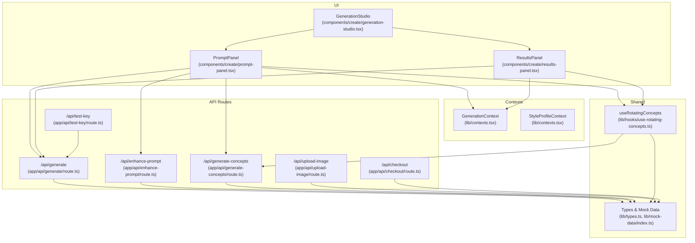
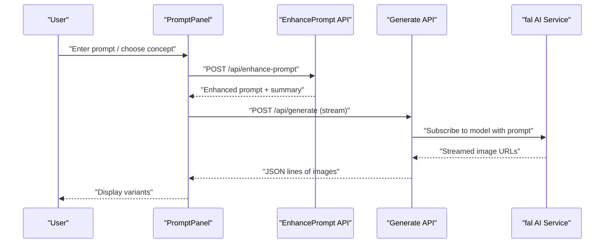
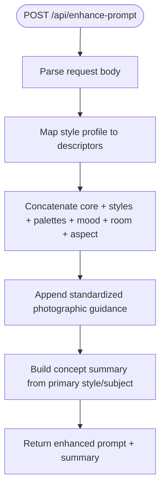
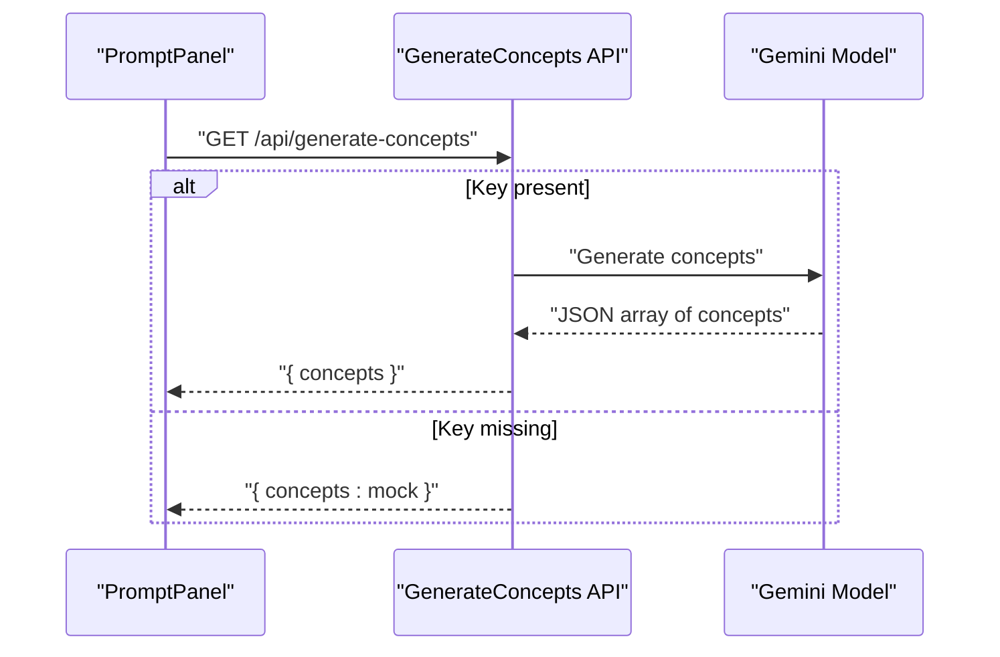
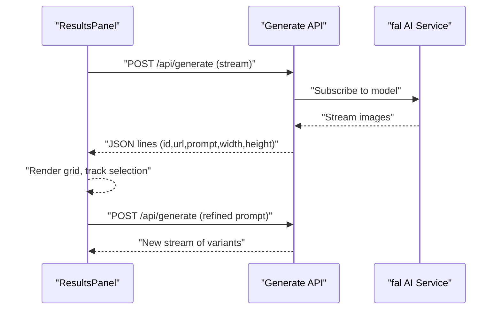
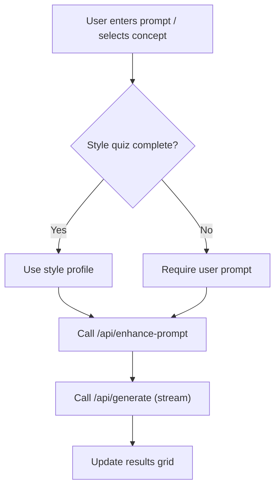
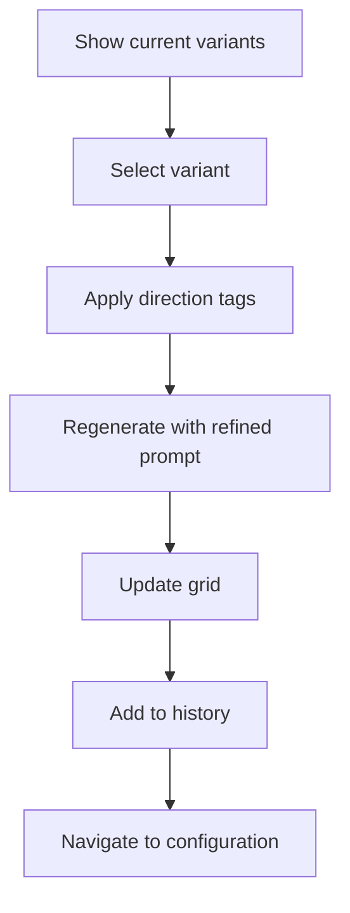
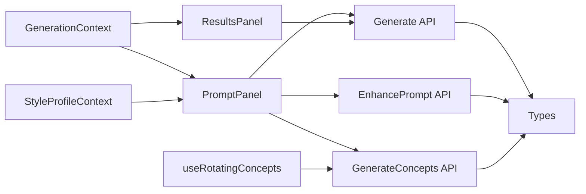

# AI Generation Studio

<cite>
**Referenced Files in This Document**
- [app/api/enhance-prompt/route.ts](file://app/api/enhance-prompt/route.ts)
- [app/api/generate-concepts/route.ts](file://app/api/generate-concepts/route.ts)
- [app/api/generate/route.ts](file://app/api/generate/route.ts)
- [app/api/test-key/route.ts](file://app/api/test-key/route.ts)
- [app/api/upload-image/route.ts](file://app/api/upload-image/route.ts)
- [app/api/checkout/route.ts](file://app/api/checkout/route.ts)
- [components/create/generation-studio.tsx](file://components/create/generation-studio.tsx)
- [components/create/prompt-panel.tsx](file://components/create/prompt-panel.tsx)
- [components/create/results-panel.tsx](file://components/create/results-panel.tsx)
- [lib/contexts.tsx](file://lib/contexts.tsx)
- [lib/types.ts](file://lib/types.ts)
- [lib/mock-data/index.ts](file://lib/mock-data/index.ts)
- [lib/hooks/use-rotating-concepts.ts](file://lib/hooks/use-rotating-concepts.ts)
- [components/providers.tsx](file://components/providers.tsx)
- [app/create/page.tsx](file://app/create/page.tsx)
</cite>

## Table of Contents
1. [Introduction](#introduction)
2. [Project Structure](#project-structure)
3. [Core Components](#core-components)
4. [Architecture Overview](#architecture-overview)
5. [Detailed Component Analysis](#detailed-component-analysis)
6. [Dependency Analysis](#dependency-analysis)
7. [Performance Considerations](#performance-considerations)
8. [Troubleshooting Guide](#troubleshooting-guide)
9. [Conclusion](#conclusion)
10. [Appendices](#appendices)

## Introduction
This document explains the AI Generation Studio feature end-to-end. It covers the prompt enhancement system, concept generation workflow, and image variant selection process. It documents integrations with AI APIs, request/response handling, error management, and the UI panels for prompt entry and results display. It also outlines API endpoints, request schemas, response formats, and practical prompt engineering tips for optimal results.

## Project Structure
The AI Generation Studio spans UI components, React contexts for state, and backend API routes. The frontend orchestrates user actions, while the backend integrates with external AI services and returns streamed image data.

**Diagram sources**
- [components/create/generation-studio.tsx:1-35](file://components/create/generation-studio.tsx#L1-L35)
- [components/create/prompt-panel.tsx:1-242](file://components/create/prompt-panel.tsx#L1-L242)
- [components/create/results-panel.tsx:1-301](file://components/create/results-panel.tsx#L1-L301)
- [lib/contexts.tsx:1-255](file://lib/contexts.tsx#L1-L255)
- [lib/hooks/use-rotating-concepts.ts:1-45](file://lib/hooks/use-rotating-concepts.ts#L1-L45)
- [app/api/enhance-prompt/route.ts:1-102](file://app/api/enhance-prompt/route.ts#L1-L102)
- [app/api/generate-concepts/route.ts:1-190](file://app/api/generate-concepts/route.ts#L1-L190)
- [app/api/generate/route.ts:1-145](file://app/api/generate/route.ts#L1-L145)
- [app/api/test-key/route.ts:1-14](file://app/api/test-key/route.ts#L1-L14)
- [app/api/upload-image/route.ts:1-22](file://app/api/upload-image/route.ts#L1-L22)
- [app/api/checkout/route.ts:1-76](file://app/api/checkout/route.ts#L1-L76)
- [lib/types.ts:1-132](file://lib/types.ts#L1-L132)
- [lib/mock-data/index.ts:1-315](file://lib/mock-data/index.ts#L1-L315)

**Section sources**
- [components/create/generation-studio.tsx:1-35](file://components/create/generation-studio.tsx#L1-L35)
- [components/providers.tsx:1-14](file://components/providers.tsx#L1-L14)
- [app/create/page.tsx:1-11](file://app/create/page.tsx#L1-L11)

## Core Components
- Prompt Enhancement: Converts user input plus style profile into an optimized prompt for image generation.
- Concept Generation: Provides curated starting concepts via an LLM or falls back to mock data.
- Image Generation: Streams generated images from an AI service, with fallback to mock images when keys are missing.
- Prompt Panel: Collects user prompts, aspect ratio, quality, and triggers generation; displays starting concepts.
- Results Panel: Shows generated variants, supports refinement via direction tags, selection, and continuation to configuration.

**Section sources**
- [app/api/enhance-prompt/route.ts:1-102](file://app/api/enhance-prompt/route.ts#L1-L102)
- [app/api/generate-concepts/route.ts:1-190](file://app/api/generate-concepts/route.ts#L1-L190)
- [app/api/generate/route.ts:1-145](file://app/api/generate/route.ts#L1-L145)
- [components/create/prompt-panel.tsx:1-242](file://components/create/prompt-panel.tsx#L1-L242)
- [components/create/results-panel.tsx:1-301](file://components/create/results-panel.tsx#L1-L301)

## Architecture Overview
The studio follows a client-driven workflow:
- The Prompt Panel sends a prompt and style profile to the enhancement endpoint, then streams image generation results from the generation endpoint.
- The Results Panel allows refinement by adding directional modifiers to the enhanced prompt and regenerating variants.
- The system gracefully handles missing API keys by returning mock images and informative messages.

**Diagram sources**
- [components/create/prompt-panel.tsx:35-124](file://components/create/prompt-panel.tsx#L35-L124)
- [app/api/enhance-prompt/route.ts:9-101](file://app/api/enhance-prompt/route.ts#L9-L101)
- [app/api/generate/route.ts:19-144](file://app/api/generate/route.ts#L19-L144)

## Detailed Component Analysis

### Prompt Enhancement System
Purpose:
- Combine user input with a style profile to produce a structured, optimized prompt tailored for image generation.

Key behaviors:
- Maps style profile fields (palettes, styles, subjects, mood, room, aspect ratio) to descriptive phrases.
- Builds a cohesive prompt string with optional user input and fixed photographic tone guidance.
- Returns both the enhanced prompt and a concise concept summary.

**Diagram sources**
- [app/api/enhance-prompt/route.ts:9-101](file://app/api/enhance-prompt/route.ts#L9-L101)

**Section sources**
- [app/api/enhance-prompt/route.ts:1-102](file://app/api/enhance-prompt/route.ts#L1-L102)
- [lib/types.ts:32-41](file://lib/types.ts#L32-L41)

### Concept Generation Workflow
Purpose:
- Provide starting concepts for users who have not completed the style quiz or want inspiration.

Key behaviors:
- Uses an LLM to generate six diverse concepts with titles and prompts.
- Falls back to mock concepts when the API key is missing.
- Accepts an optional style profile to tailor concepts to user preferences.

**Diagram sources**
- [lib/hooks/use-rotating-concepts.ts:15-43](file://lib/hooks/use-rotating-concepts.ts#L15-L43)
- [app/api/generate-concepts/route.ts:141-156](file://app/api/generate-concepts/route.ts#L141-L156)
- [app/api/generate-concepts/route.ts:158-189](file://app/api/generate-concepts/route.ts#L158-L189)

**Section sources**
- [app/api/generate-concepts/route.ts:1-190](file://app/api/generate-concepts/route.ts#L1-L190)
- [lib/mock-data/index.ts:171-237](file://lib/mock-data/index.ts#L171-L237)

### Image Variant Selection Process
Purpose:
- Stream and render multiple image variants, allow refinement via direction tags, and enable selection for configuration.

Key behaviors:
- Streams JSON lines representing images; updates the UI incrementally.
- Supports refinement by appending direction modifiers to the enhanced prompt and regenerating.
- Maintains generation history for quick reversion.

**Diagram sources**
- [components/create/results-panel.tsx:38-122](file://components/create/results-panel.tsx#L38-L122)
- [app/api/generate/route.ts:66-144](file://app/api/generate/route.ts#L66-L144)

**Section sources**
- [components/create/results-panel.tsx:1-301](file://components/create/results-panel.tsx#L1-L301)
- [lib/types.ts:17-23](file://lib/types.ts#L17-L23)

### Prompt Panel Functionality
Highlights:
- Starting concepts grid: pre-generated prompts to inspire users.
- Prompt input: optional when a style profile is complete.
- Aspect ratio and quality toggles.
- Generate button: orchestrates enhancement and streaming generation.

**Diagram sources**
- [components/create/prompt-panel.tsx:20-124](file://components/create/prompt-panel.tsx#L20-L124)
- [app/api/enhance-prompt/route.ts:9-101](file://app/api/enhance-prompt/route.ts#L9-L101)
- [app/api/generate/route.ts:19-144](file://app/api/generate/route.ts#L19-L144)

**Section sources**
- [components/create/prompt-panel.tsx:1-242](file://components/create/prompt-panel.tsx#L1-L242)
- [lib/mock-data/index.ts:46-52](file://lib/mock-data/index.ts#L46-L52)

### Results Panel Features
Highlights:
- Image grid with shimmer loading and selection feedback.
- Refinement controls: directional modifiers applied to the enhanced prompt.
- Continue button to proceed to configuration.
- History panel to revisit previous generations.

**Diagram sources**
- [components/create/results-panel.tsx:24-122](file://components/create/results-panel.tsx#L24-L122)
- [lib/types.ts:25-30](file://lib/types.ts#L25-L30)

**Section sources**
- [components/create/results-panel.tsx:1-301](file://components/create/results-panel.tsx#L1-L301)

## Dependency Analysis
- UI depends on React contexts for shared state and on hooks for concept rotation.
- API routes depend on environment variables and external AI SDKs.
- Shared types define request/response contracts used across components and routes.

**Diagram sources**
- [components/create/prompt-panel.tsx:1-242](file://components/create/prompt-panel.tsx#L1-L242)
- [components/create/results-panel.tsx:1-301](file://components/create/results-panel.tsx#L1-L301)
- [lib/contexts.tsx:1-255](file://lib/contexts.tsx#L1-L255)
- [lib/hooks/use-rotating-concepts.ts:1-45](file://lib/hooks/use-rotating-concepts.ts#L1-L45)
- [app/api/enhance-prompt/route.ts:1-102](file://app/api/enhance-prompt/route.ts#L1-L102)
- [app/api/generate-concepts/route.ts:1-190](file://app/api/generate-concepts/route.ts#L1-L190)
- [app/api/generate/route.ts:1-145](file://app/api/generate/route.ts#L1-L145)
- [lib/types.ts:1-132](file://lib/types.ts#L1-L132)

**Section sources**
- [lib/contexts.tsx:1-255](file://lib/contexts.tsx#L1-L255)
- [lib/types.ts:1-132](file://lib/types.ts#L1-L132)

## Performance Considerations
- Streaming generation reduces perceived latency by rendering images progressively.
- Mock fallback ensures usability during development or when API keys are missing.
- Directional refinement reuses the enhanced prompt and regenerates fewer images, minimizing cost and time.
- Local caching of style profile and cart improves UX continuity.

[No sources needed since this section provides general guidance]

## Troubleshooting Guide
Common issues and remedies:
- Missing fal.ai API key:
  - Verify key presence via the test endpoint and ensure the server is restarted after adding the key.
  - Without the key, the system streams mock images instead of real generation.
- LLM concept generation failures:
  - When the Google AI key is missing or requests fail, the system falls back to mock concepts.
- Network or API errors during generation:
  - The generation route catches errors and falls back to mock images, preserving user experience.

**Section sources**
- [app/api/test-key/route.ts:1-14](file://app/api/test-key/route.ts#L1-L14)
- [app/api/generate/route.ts:32-64](file://app/api/generate/route.ts#L32-L64)
- [app/api/generate-concepts/route.ts:142-156](file://app/api/generate-concepts/route.ts#L142-L156)
- [app/api/generate-concepts/route.ts:172-189](file://app/api/generate-concepts/route.ts#L172-L189)

## Conclusion
The AI Generation Studio integrates prompt enhancement, concept generation, and streaming image generation into a cohesive workflow. The UI provides intuitive controls for refinement and selection, while the backend gracefully handles missing keys and errors. The modular design enables easy extension to additional AI providers or features.

[No sources needed since this section summarizes without analyzing specific files]

## Appendices

### API Endpoints, Schemas, and Responses
- POST /api/enhance-prompt
  - Request: EnhancePromptRequest
    - userInput: string
    - styleProfile: StyleProfile
    - aspectRatio: string
  - Response: EnhancePromptResponse
    - enhancedPrompt: string
    - conceptSummary: string
  - Notes: Uses style profile mappings to construct a descriptive prompt.

- GET /api/generate-concepts
  - Response: { concepts: StartingConcept[] }
  - Behavior: Returns curated concepts or mock fallback.

- POST /api/generate-concepts
  - Request: { styleProfile?: StyleProfile }
  - Response: { concepts: StartingConcept[] }
  - Behavior: Generates concepts using an LLM or returns mock fallback.

- POST /api/generate
  - Request: GenerateRequest
    - enhancedPrompt: string
    - aspectRatio: string
    - count: number
    - quality: "standard" | "premium"
  - Response: Stream of GeneratedImage JSON lines
    - id: string
    - url: string
    - prompt: string
    - width: number
    - height: number
  - Notes: Streams images; falls back to mock images when key is missing.

- GET /api/test-key
  - Response: { hasKey: boolean, keyPrefix: string, message: string }

- POST /api/upload-image
  - Request: { imageUrl: string }
  - Response: { publicUrl: string, fileId: string }
  - Notes: Placeholder for cloud storage integration.

- POST /api/checkout
  - Request: { items: CartItem[], email?: string }
  - Response: { checkoutUrl: string, orderId: string, isMock?: boolean }
  - Notes: Creates a Shopify draft order or returns mock data when not configured.

**Section sources**
- [app/api/enhance-prompt/route.ts:32-41](file://app/api/enhance-prompt/route.ts#L32-L41)
- [app/api/enhance-prompt/route.ts:38-41](file://app/api/enhance-prompt/route.ts#L38-L41)
- [app/api/generate-concepts/route.ts:141-156](file://app/api/generate-concepts/route.ts#L141-L156)
- [app/api/generate-concepts/route.ts:158-189](file://app/api/generate-concepts/route.ts#L158-L189)
- [app/api/generate/route.ts:43-56](file://app/api/generate/route.ts#L43-L56)
- [app/api/generate/route.ts:88-113](file://app/api/generate/route.ts#L88-L113)
- [app/api/test-key/route.ts:3-12](file://app/api/test-key/route.ts#L3-L12)
- [app/api/upload-image/route.ts:8-21](file://app/api/upload-image/route.ts#L8-L21)
- [app/api/checkout/route.ts:5-75](file://app/api/checkout/route.ts#L5-L75)
- [lib/types.ts:17-52](file://lib/types.ts#L17-L52)

### Prompt Engineering Tips and Best Practices
- Be specific: Include subjects, styles, and moods to guide the model toward desired aesthetics.
- Compose for context: Mention intended room placement to influence composition and framing cues.
- Keep tone consistent: Use descriptive adjectives and avoid contradictory instructions.
- Iterate with modifiers: Use direction tags (e.g., warmer, cooler, more dramatic) to refine quickly.
- Test aspect ratios: Choose an aspect ratio aligned with your composition goals.
- Reference examples: Use starting concepts as templates and adapt them to your vision.

[No sources needed since this section provides general guidance]