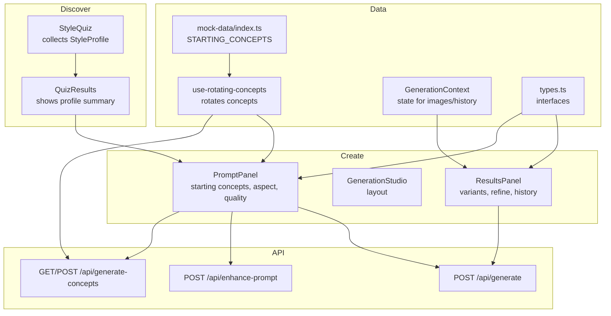
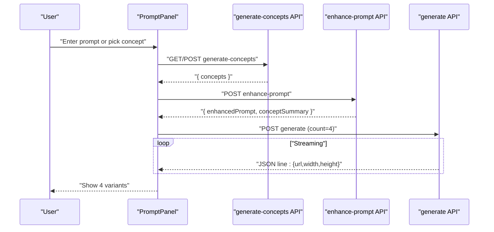
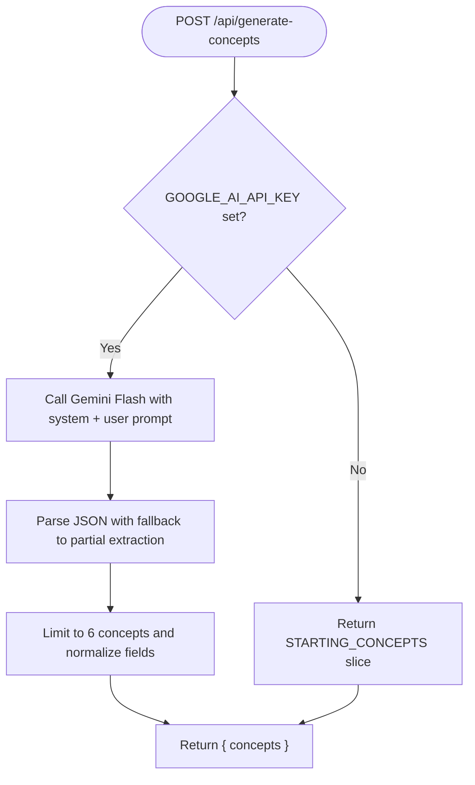
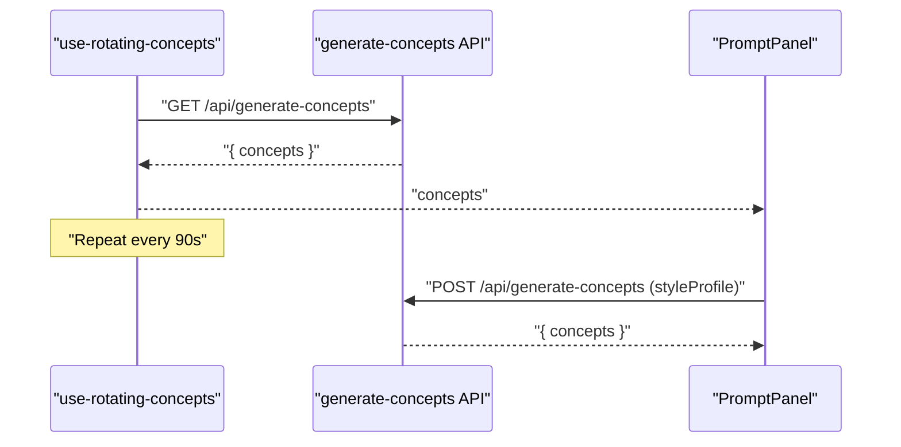
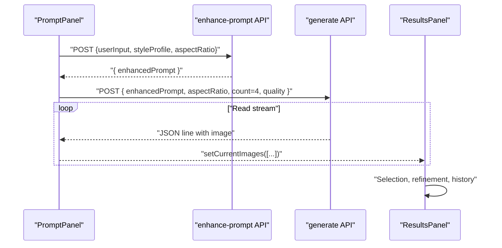
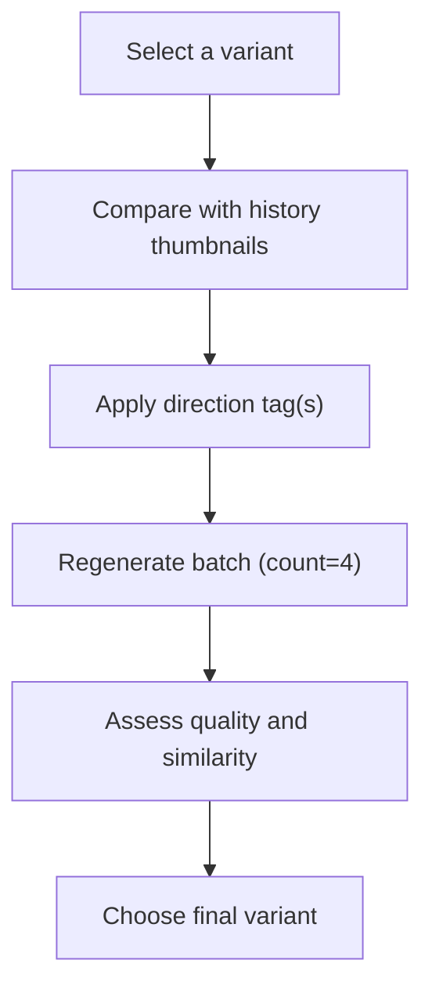
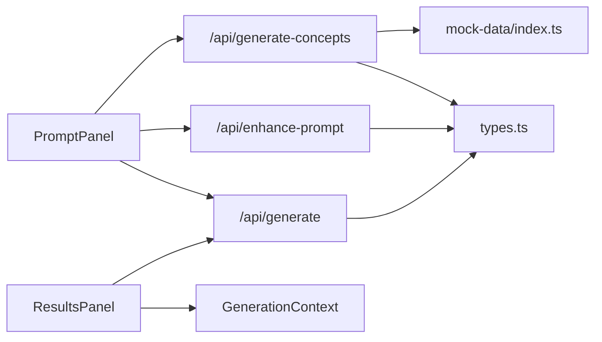

# Concept Generation Workflow

<cite>
**Referenced Files in This Document**
- [route.ts](file://app/api/generate-concepts/route.ts)
- [route.ts](file://app/api/enhance-prompt/route.ts)
- [route.ts](file://app/api/generate/route.ts)
- [generation-studio.tsx](file://components/create/generation-studio.tsx)
- [prompt-panel.tsx](file://components/create/prompt-panel.tsx)
- [results-panel.tsx](file://components/create/results-panel.tsx)
- [style-quiz.tsx](file://components/discover/style-quiz.tsx)
- [quiz-results.tsx](file://components/discover/quiz-results.tsx)
- [use-rotating-concepts.ts](file://lib/hooks/use-rotating-concepts.ts)
- [contexts.tsx](file://lib/contexts.tsx)
- [types.ts](file://lib/types.ts)
- [index.ts](file://lib/mock-data/index.ts)
- [README.md](file://README.md)
</cite>

## Table of Contents
1. [Introduction](#introduction)
2. [Project Structure](#project-structure)
3. [Core Components](#core-components)
4. [Architecture Overview](#architecture-overview)
5. [Detailed Component Analysis](#detailed-component-analysis)
6. [Dependency Analysis](#dependency-analysis)
7. [Performance Considerations](#performance-considerations)
8. [Troubleshooting Guide](#troubleshooting-guide)
9. [Conclusion](#conclusion)
10. [Appendices](#appendices)

## Introduction
This document explains the concept generation workflow in the AI wall art application. It covers how users discover their style through a guided quiz, how starting concepts are generated (including batch and parallel-like rotation), how the generation studio orchestrates prompts and refinements, and how users compare variants and assess quality. It also documents the generate-concepts API endpoint, including request parameters, generation limits, and timeout handling behavior, along with practical examples and troubleshooting guidance.

## Project Structure
The concept generation workflow spans frontend components, React contexts, and backend API routes:
- Style discovery: quiz pages collect a style profile (palettes, styles, subjects, mood, room).
- Concept generation: a rotating set of starting concepts is fetched from the generate-concepts API.
- Generation studio: prompt panel builds an enhanced prompt, then streams image variants from the generate API.
- Results panel: displays variants, allows selection, refinement, and history navigation.

**Diagram sources**
- [style-quiz.tsx:17-62](file://components/discover/style-quiz.tsx#L17-L62)
- [quiz-results.tsx:9-98](file://components/discover/quiz-results.tsx#L9-L98)
- [prompt-panel.tsx:20-124](file://components/create/prompt-panel.tsx#L20-L124)
- [generation-studio.tsx:8-34](file://components/create/generation-studio.tsx#L8-L34)
- [results-panel.tsx:24-122](file://components/create/results-panel.tsx#L24-L122)
- [route.ts:141-189](file://app/api/generate-concepts/route.ts#L141-L189)
- [route.ts:9-101](file://app/api/enhance-prompt/route.ts#L9-L101)
- [route.ts:19-144](file://app/api/generate/route.ts#L19-L144)
- [use-rotating-concepts.ts:9-44](file://lib/hooks/use-rotating-concepts.ts#L9-L44)
- [contexts.tsx:71-158](file://lib/contexts.tsx#L71-L158)
- [types.ts:1-132](file://lib/types.ts#L1-L132)
- [index.ts:171-237](file://lib/mock-data/index.ts#L171-L237)

**Section sources**
- [README.md:48-68](file://README.md#L48-L68)
- [style-quiz.tsx:17-62](file://components/discover/style-quiz.tsx#L17-L62)
- [prompt-panel.tsx:20-124](file://components/create/prompt-panel.tsx#L20-L124)
- [results-panel.tsx:24-122](file://components/create/results-panel.tsx#L24-L122)
- [route.ts:141-189](file://app/api/generate-concepts/route.ts#L141-L189)
- [route.ts:9-101](file://app/api/enhance-prompt/route.ts#L9-L101)
- [route.ts:19-144](file://app/api/generate/route.ts#L19-L144)
- [use-rotating-concepts.ts:9-44](file://lib/hooks/use-rotating-concepts.ts#L9-L44)
- [contexts.tsx:71-158](file://lib/contexts.tsx#L71-L158)
- [types.ts:1-132](file://lib/types.ts#L1-L132)
- [index.ts:171-237](file://lib/mock-data/index.ts#L171-L237)

## Core Components
- Style quiz and profile: collects user preferences and persists them in local storage for later use in concept generation.
- Rotating concepts hook: periodically fetches new starting concepts from the generate-concepts API, falling back to static concepts if needed.
- Prompt panel: constructs an enhanced prompt using the style profile and optional user input, then triggers image generation.
- Generation context: manages current images, selection, refinement modifiers, and generation history.
- Results panel: renders variants, supports refinement via direction tags, and lets users continue to configuration.

**Section sources**
- [style-quiz.tsx:17-62](file://components/discover/style-quiz.tsx#L17-L62)
- [quiz-results.tsx:9-98](file://components/discover/quiz-results.tsx#L9-L98)
- [use-rotating-concepts.ts:9-44](file://lib/hooks/use-rotating-concepts.ts#L9-L44)
- [prompt-panel.tsx:20-124](file://components/create/prompt-panel.tsx#L20-L124)
- [contexts.tsx:71-158](file://lib/contexts.tsx#L71-L158)
- [results-panel.tsx:24-122](file://components/create/results-panel.tsx#L24-L122)

## Architecture Overview
The workflow integrates three API endpoints:
- /api/generate-concepts: generates or rotates starting concepts based on a style profile.
- /api/enhance-prompt: transforms user input plus style profile into an optimized prompt.
- /api/generate: streams 4 image variants per request, with quality toggles and aspect ratios.

**Diagram sources**
- [prompt-panel.tsx:35-124](file://components/create/prompt-panel.tsx#L35-L124)
- [route.ts:141-189](file://app/api/generate-concepts/route.ts#L141-L189)
- [route.ts:9-101](file://app/api/enhance-prompt/route.ts#L9-L101)
- [route.ts:19-144](file://app/api/generate/route.ts#L19-L144)

## Detailed Component Analysis

### Concept Generation API: generate-concepts
- Endpoint: GET /api/generate-concepts (returns static fallback concepts if no API key)
- Endpoint: POST /api/generate-concepts (accepts a styleProfile and returns AI-generated concepts)
- Request body (POST):
  - styleProfile: object with palettes[], styles[], subjects[], mood, room
- Behavior:
  - If GOOGLE_AI_API_KEY is missing, returns fallback concepts from STARTING_CONCEPTS.
  - Otherwise, sends a structured prompt to Gemini Flash to produce 6 JSON concept objects.
  - Includes robust parsing with fallback extraction from partial JSON.
- Response:
  - { concepts: StartingConcept[] } where each concept includes id, title, prompt, and metadata arrays.

**Diagram sources**
- [route.ts:141-189](file://app/api/generate-concepts/route.ts#L141-L189)
- [index.ts:171-237](file://lib/mock-data/index.ts#L171-L237)

**Section sources**
- [route.ts:141-189](file://app/api/generate-concepts/route.ts#L141-L189)
- [types.ts:124-131](file://lib/types.ts#L124-L131)
- [index.ts:171-237](file://lib/mock-data/index.ts#L171-L237)

### Concept Rotation and Selection
- use-rotating-concepts hook:
  - Fetches concepts every 90 seconds.
  - Calls GET /api/generate-concepts when no style profile is present.
  - Calls POST /api/generate-concepts with styleProfile when available.
  - On error, logs and continues with previous concepts.
- Prompt panel:
  - Displays rotating concepts and lets users pick one to seed the prompt.

**Diagram sources**
- [use-rotating-concepts.ts:9-44](file://lib/hooks/use-rotating-concepts.ts#L9-L44)
- [prompt-panel.tsx:31-31](file://components/create/prompt-panel.tsx#L31-L31)

**Section sources**
- [use-rotating-concepts.ts:9-44](file://lib/hooks/use-rotating-concepts.ts#L9-L44)
- [prompt-panel.tsx:31-31](file://components/create/prompt-panel.tsx#L31-L31)

### Generation Studio Orchestration
- GenerationStudio sets up the two-panel layout.
- PromptPanel:
  - Builds styleProfile from quiz completion or defaults.
  - Calls /api/enhance-prompt to get an optimized prompt.
  - Streams 4 variants from /api/generate, updating the UI progressively.
- ResultsPanel:
  - Renders variants in a grid, supports selection and refinement.
  - Provides direction tags to refine variants.
  - Maintains generation history and allows switching between batches.

**Diagram sources**
- [generation-studio.tsx:8-34](file://components/create/generation-studio.tsx#L8-L34)
- [prompt-panel.tsx:35-124](file://components/create/prompt-panel.tsx#L35-L124)
- [results-panel.tsx:38-122](file://components/create/results-panel.tsx#L38-L122)
- [route.ts:9-101](file://app/api/enhance-prompt/route.ts#L9-L101)
- [route.ts:19-144](file://app/api/generate/route.ts#L19-L144)

**Section sources**
- [generation-studio.tsx:8-34](file://components/create/generation-studio.tsx#L8-L34)
- [prompt-panel.tsx:35-124](file://components/create/prompt-panel.tsx#L35-L124)
- [results-panel.tsx:38-122](file://components/create/results-panel.tsx#L38-L122)
- [contexts.tsx:71-158](file://lib/contexts.tsx#L71-L158)

### Concept Selection and Variant Comparison
- Selection:
  - Click a variant to mark it as selected; the Continue button becomes enabled.
- Comparison:
  - Thumbnails in the history panel show recent batches for quick comparison.
- Refinement:
  - Direction tags (e.g., warmer, cooler, more dramatic) append modifiers to the prompt and regenerate a new batch.
- Quality assessment:
  - Use direction tags to move toward preferred aesthetics.
  - Switch between Standard and Premium quality to balance speed and detail.

**Diagram sources**
- [results-panel.tsx:207-297](file://components/create/results-panel.tsx#L207-L297)

**Section sources**
- [results-panel.tsx:207-297](file://components/create/results-panel.tsx#L207-L297)

### Timeout Handling and Streaming
- PromptPanel and ResultsPanel stream responses from /api/generate using a reader and incremental JSON parsing.
- The UI updates as soon as each line is received, enabling near-real-time feedback.
- If the stream ends early or fails, the UI remains responsive and logs errors.

**Section sources**
- [prompt-panel.tsx:82-124](file://components/create/prompt-panel.tsx#L82-L124)
- [results-panel.tsx:74-122](file://components/create/results-panel.tsx#L74-L122)
- [route.ts:36-64](file://app/api/generate/route.ts#L36-L64)

## Dependency Analysis
- PromptPanel depends on:
  - GenerationContext for prompt, aspect ratio, quality, and state.
  - use-rotating-concepts for starting concepts.
  - enhance-prompt and generate APIs.
- ResultsPanel depends on:
  - GenerationContext for currentImages, selectedImage, activeModifiers, and history.
  - Direction tags to refine prompts.
- generate-concepts API depends on:
  - GoogleGenerativeAI SDK and environment configuration.
  - STARTING_CONCEPTS as fallback.
- enhance-prompt API depends on:
  - StyleProfile mappings to construct an optimized prompt.
- generate API depends on:
  - fal.ai client and environment configuration.
  - Fallback to mock images when FAL_KEY is absent.

**Diagram sources**
- [prompt-panel.tsx:35-124](file://components/create/prompt-panel.tsx#L35-L124)
- [results-panel.tsx:38-122](file://components/create/results-panel.tsx#L38-L122)
- [route.ts:141-189](file://app/api/generate-concepts/route.ts#L141-L189)
- [route.ts:9-101](file://app/api/enhance-prompt/route.ts#L9-L101)
- [route.ts:19-144](file://app/api/generate/route.ts#L19-L144)
- [contexts.tsx:71-158](file://lib/contexts.tsx#L71-L158)
- [types.ts:1-132](file://lib/types.ts#L1-L132)
- [index.ts:171-237](file://lib/mock-data/index.ts#L171-L237)

**Section sources**
- [prompt-panel.tsx:35-124](file://components/create/prompt-panel.tsx#L35-L124)
- [results-panel.tsx:38-122](file://components/create/results-panel.tsx#L38-L122)
- [route.ts:141-189](file://app/api/generate-concepts/route.ts#L141-L189)
- [route.ts:9-101](file://app/api/enhance-prompt/route.ts#L9-L101)
- [route.ts:19-144](file://app/api/generate/route.ts#L19-L144)
- [contexts.tsx:71-158](file://lib/contexts.tsx#L71-L158)
- [types.ts:1-132](file://lib/types.ts#L1-L132)
- [index.ts:171-237](file://lib/mock-data/index.ts#L171-L237)

## Performance Considerations
- Streaming reduces perceived latency by rendering images as they arrive.
- Batch size is capped at 4 per request to balance responsiveness and resource usage.
- Quality toggling switches inference parameters; Premium increases detail but may increase latency.
- Concept rotation interval (90 seconds) balances freshness with API cost.

[No sources needed since this section provides general guidance]

## Troubleshooting Guide
Common issues and resolutions:
- Missing GOOGLE_AI_API_KEY:
  - The generate-concepts endpoint returns fallback concepts from STARTING_CONCEPTS.
  - Verify environment configuration and restart the server.
- Missing FAL_KEY:
  - The generate endpoint returns mock images from the gallery with a 800ms delay per image.
  - Add FAL_KEY to enable real generation via fal.ai.
- Empty or malformed prompt:
  - Ensure a style profile exists or enter a descriptive prompt.
  - The system defaults to a realistic/photographic style when no profile is present.
- Slow or stalled generation:
  - Check network connectivity and API quotas.
  - Retry after a short delay; the UI handles partial streams gracefully.

**Section sources**
- [route.ts:142-156](file://app/api/generate-concepts/route.ts#L142-L156)
- [route.ts:32-64](file://app/api/generate/route.ts#L32-L64)
- [prompt-panel.tsx:35-52](file://components/create/prompt-panel.tsx#L35-L52)

## Conclusion
The concept generation workflow combines a guided style quiz, rotating starting concepts, and a generation studio that streams high-quality variants. The generate-concepts API provides batch concept generation with robust fallbacks, while the generation studio offers intuitive refinement and comparison tools. Together, they deliver a smooth, iterative creative process tailored to user preferences.

[No sources needed since this section summarizes without analyzing specific files]

## Appendices

### API Reference: generate-concepts
- GET /api/generate-concepts
  - Purpose: Retrieve a batch of starting concepts.
  - Behavior: Returns fallback concepts if GOOGLE_AI_API_KEY is not set.
- POST /api/generate-concepts
  - Purpose: Generate concepts aligned with a style profile.
  - Request body:
    - styleProfile: { palettes[], styles[], subjects[], mood, room }
  - Response:
    - { concepts: StartingConcept[] }

**Section sources**
- [route.ts:141-189](file://app/api/generate-concepts/route.ts#L141-L189)
- [types.ts:124-131](file://lib/types.ts#L124-L131)

### Example Workflows
- New user without quiz:
  - Enter a prompt or pick a rotating concept; the system uses a default realistic style and generates 4 variants.
- Returning user with quiz:
  - The system builds a richer prompt from the style profile and generates 4 concept variants.
- Refining a variant:
  - Apply one or more direction tags to adjust tone, lighting, or abstraction; regenerate a new batch and compare.

**Section sources**
- [prompt-panel.tsx:35-124](file://components/create/prompt-panel.tsx#L35-L124)
- [results-panel.tsx:38-122](file://components/create/results-panel.tsx#L38-L122)
- [use-rotating-concepts.ts:9-44](file://lib/hooks/use-rotating-concepts.ts#L9-L44)