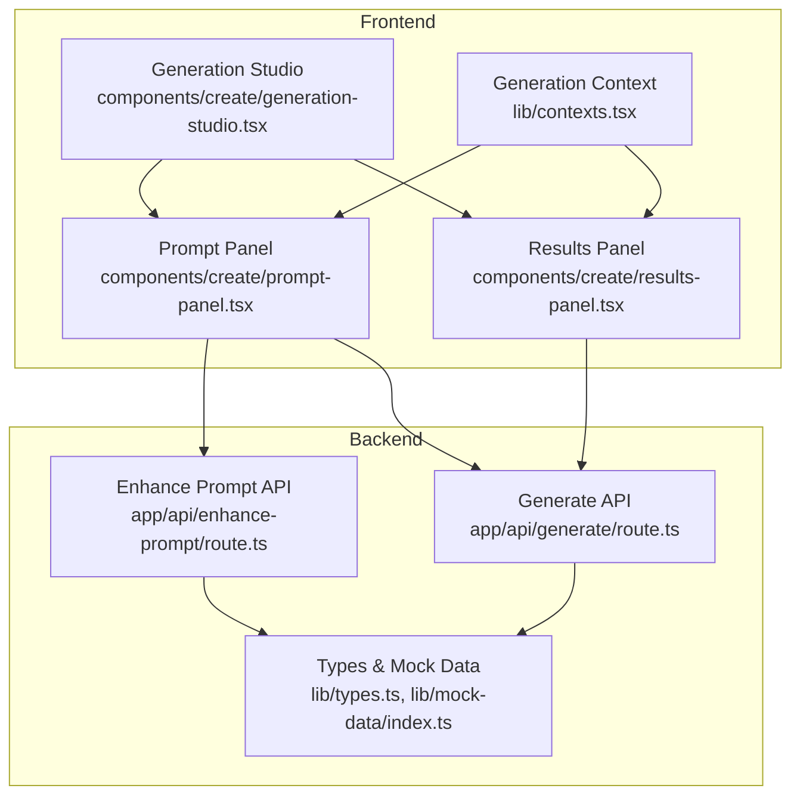
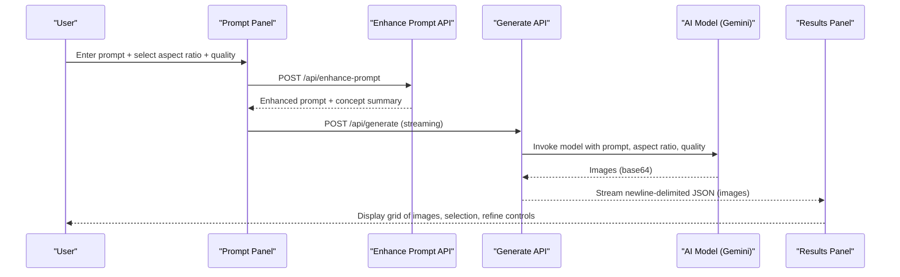
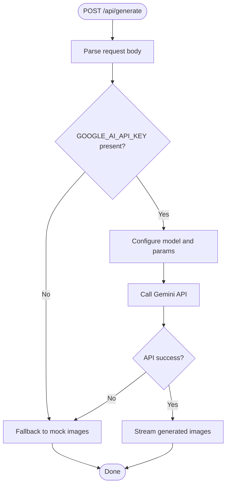
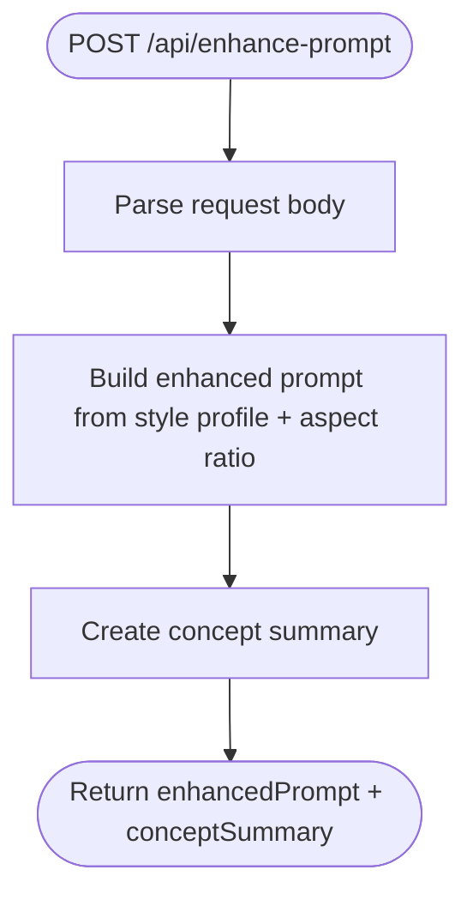
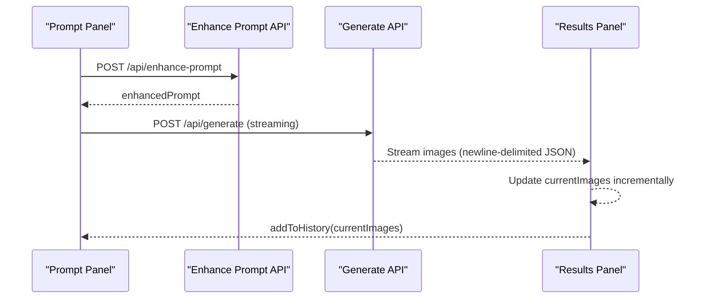
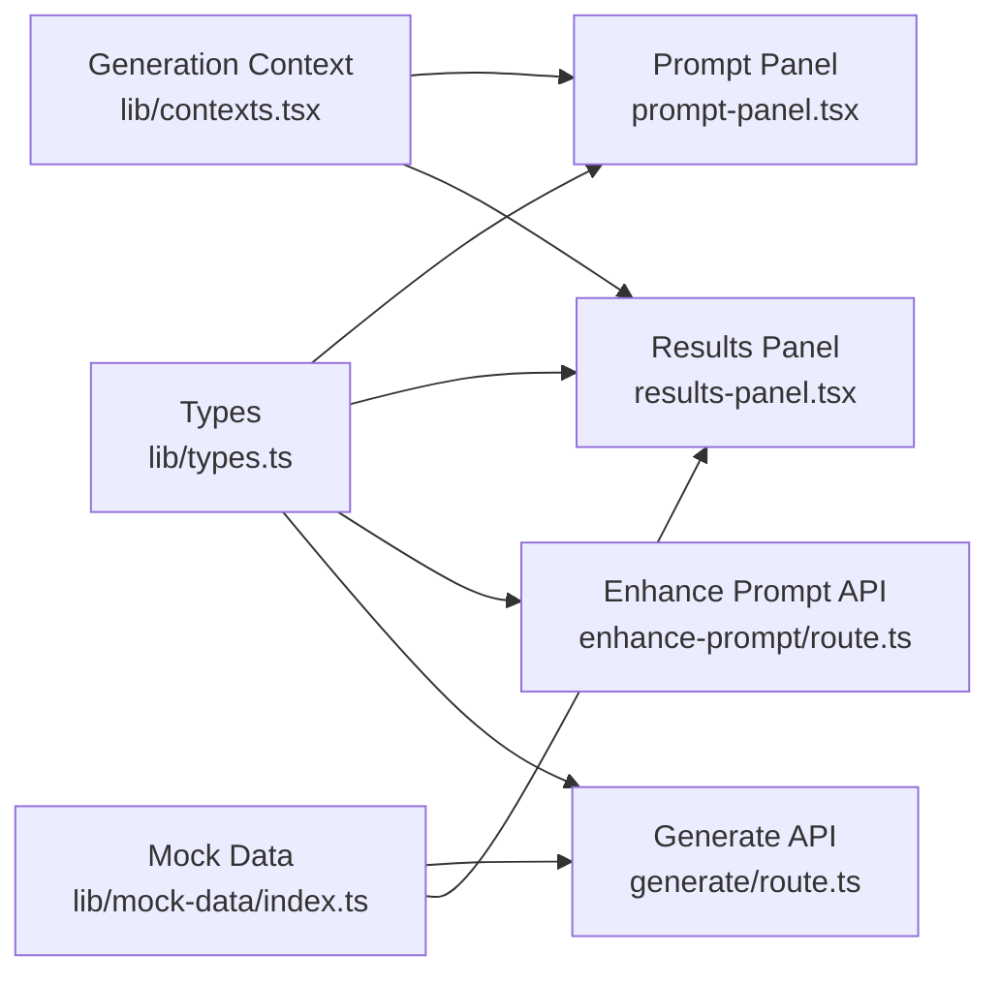

# Image Generation API

<cite>
**Referenced Files in This Document**
- [route.ts](file://app/api/generate/route.ts)
- [route.ts](file://app/api/enhance-prompt/route.ts)
- [results-panel.tsx](file://components/create/results-panel.tsx)
- [prompt-panel.tsx](file://components/create/prompt-panel.tsx)
- [generation-studio.tsx](file://components/create/generation-studio.tsx)
- [types.ts](file://lib/types.ts)
- [contexts.tsx](file://lib/contexts.tsx)
- [index.ts](file://lib/mock-data/index.ts)
- [README.md](file://README.md)
- [INTEGRATION_SUMMARY.md](file://INTEGRATION_SUMMARY.md)
</cite>

## Table of Contents
1. [Introduction](#introduction)
2. [Project Structure](#project-structure)
3. [Core Components](#core-components)
4. [Architecture Overview](#architecture-overview)
5. [Detailed Component Analysis](#detailed-component-analysis)
6. [Dependency Analysis](#dependency-analysis)
7. [Performance Considerations](#performance-considerations)
8. [Troubleshooting Guide](#troubleshooting-guide)
9. [Conclusion](#conclusion)
10. [Appendices](#appendices)

## Introduction
This document provides comprehensive API documentation for the image generation endpoint used by the AI Art Generation Studio. It covers HTTP methods, URL patterns, request/response schemas, authentication requirements, generation parameters (resolution, style presets, quality settings), the end-to-end generation pipeline, and the results panel functionality including image display, refinement controls, and fallback behavior. It also includes error handling, retry strategies, performance characteristics, and practical examples.

## Project Structure
The image generation feature spans frontend components and backend API routes:
- Frontend: Prompt panel, results panel, and studio layout orchestrate user input and display.
- Backend: Enhance prompt service transforms user input into optimized prompts using style profiles; the generation service invokes the AI model and streams results.
- Shared types and contexts define request/response schemas and manage session state.

**Diagram sources**
- [prompt-panel.tsx:1-242](file://components/create/prompt-panel.tsx#L1-L242)
- [results-panel.tsx:1-301](file://components/create/results-panel.tsx#L1-L301)
- [generation-studio.tsx:1-35](file://components/create/generation-studio.tsx#L1-L35)
- [route.ts:1-102](file://app/api/enhance-prompt/route.ts#L1-L102)
- [route.ts:1-145](file://app/api/generate/route.ts#L1-L145)
- [types.ts:1-132](file://lib/types.ts#L1-L132)
- [index.ts:1-315](file://lib/mock-data/index.ts#L1-L315)
- [contexts.tsx:1-255](file://lib/contexts.tsx#L1-L255)

**Section sources**
- [README.md:60-68](file://README.md#L60-L68)
- [INTEGRATION_SUMMARY.md:1-259](file://INTEGRATION_SUMMARY.md#L1-L259)

## Core Components
- Generate API route: Accepts a structured request, validates parameters, and streams newline-delimited JSON responses representing generated images.
- Enhance Prompt API route: Transforms user input plus style profile into an optimized prompt suitable for the AI model.
- Frontend panels: Prompt panel collects user input, aspect ratio, and quality; Results panel displays generated images, supports refinement, and manages history.
- Types and contexts: Define request/response schemas and manage generation state across sessions.

**Section sources**
- [route.ts:1-145](file://app/api/generate/route.ts#L1-L145)
- [route.ts:1-102](file://app/api/enhance-prompt/route.ts#L1-L102)
- [prompt-panel.tsx:1-242](file://components/create/prompt-panel.tsx#L1-L242)
- [results-panel.tsx:1-301](file://components/create/results-panel.tsx#L1-L301)
- [types.ts:16-52](file://lib/types.ts#L16-L52)
- [contexts.tsx:71-162](file://lib/contexts.tsx#L71-L162)

## Architecture Overview
The generation pipeline integrates user input, prompt enhancement, AI model invocation, and streaming results to the UI.

**Diagram sources**
- [prompt-panel.tsx:35-124](file://components/create/prompt-panel.tsx#L35-L124)
- [route.ts:9-101](file://app/api/enhance-prompt/route.ts#L9-L101)
- [route.ts:66-143](file://app/api/generate/route.ts#L66-L143)
- [results-panel.tsx:38-122](file://components/create/results-panel.tsx#L38-L122)

## Detailed Component Analysis

### Generate API Endpoint
- Method: POST
- Path: /api/generate
- Purpose: Generate image variants using the AI model and stream results to the client.
- Authentication: Requires GOOGLE_AI_API_KEY in environment; falls back to mock images if missing.
- Request body schema:
  - enhancedPrompt: string
  - aspectRatio: "3:4" | "1:1" | "4:3" | "16:9"
  - count: number (clamped to <= 4)
  - quality: "standard" | "premium"
- Response: Streaming text/plain with newline-delimited JSON objects. Each object represents a generated image with id, url, prompt, width, height.
- Behavior:
  - Validates presence of GOOGLE_AI_API_KEY.
  - Selects model based on quality ("gemini-2.5-flash-image" for standard, "gemini-3-pro-image-preview" for premium).
  - Maps aspect ratio to internal dimensions and sets resolution accordingly.
  - Streams images as they become available.
  - On API errors or missing key, falls back to mock images from the gallery.

**Diagram sources**
- [route.ts:19-143](file://app/api/generate/route.ts#L19-L143)

**Section sources**
- [route.ts:1-145](file://app/api/generate/route.ts#L1-L145)
- [INTEGRATION_SUMMARY.md:3-19](file://INTEGRATION_SUMMARY.md#L3-L19)

### Enhance Prompt API Endpoint
- Method: POST
- Path: /api/enhance-prompt
- Purpose: Transform user input and style profile into an optimized prompt for the AI model.
- Request body schema:
  - userInput: string
  - styleProfile: StyleProfile (palette, style, subject, mood, room)
  - aspectRatio: "3:4" | "1:1" | "4:3" | "16:9"
- Response schema:
  - enhancedPrompt: string
  - conceptSummary: string
- Behavior:
  - Builds enhanced prompt by combining user input with style profile attributes and aspect ratio context.
  - Adds standardized artistic direction and composition guidance.
  - Returns concept summary for display.

**Diagram sources**
- [route.ts:9-101](file://app/api/enhance-prompt/route.ts#L9-L101)

**Section sources**
- [route.ts:1-102](file://app/api/enhance-prompt/route.ts#L1-L102)
- [types.ts:1-15](file://lib/types.ts#L1-L15)

### Frontend Panels and Results Panel
- Prompt Panel:
  - Collects user prompt, aspect ratio, and quality.
  - Calls /api/enhance-prompt, then /api/generate.
  - Streams and renders images as they arrive.
  - Manages generation state and clears previous results.
- Results Panel:
  - Displays a grid of generated images with selection feedback.
  - Provides refinement controls (direction tags) to generate improved variants.
  - Supports history navigation and continuation to product configuration.
  - Handles loading states and skeleton placeholders during generation.

**Diagram sources**
- [prompt-panel.tsx:35-124](file://components/create/prompt-panel.tsx#L35-L124)
- [results-panel.tsx:38-122](file://components/create/results-panel.tsx#L38-L122)

**Section sources**
- [prompt-panel.tsx:1-242](file://components/create/prompt-panel.tsx#L1-L242)
- [results-panel.tsx:1-301](file://components/create/results-panel.tsx#L1-L301)
- [contexts.tsx:71-162](file://lib/contexts.tsx#L71-L162)

### Generation Parameters
- Aspect Ratio:
  - Supported values: "3:4", "1:1", "4:3", "16:9".
  - Maps to internal dimensions used for resolution and display.
- Quality:
  - "standard": Uses gemini-2.5-flash-image.
  - "premium": Uses gemini-3-pro-image-preview with higher resolution.
- Count:
  - Maximum 4 images per request; clamped if larger.
- Resolution:
  - Premium quality increases resolution; standard uses lower resolution.
- Model Selection:
  - Standard: gemini-2.5-flash-image.
  - Premium: gemini-3-pro-image-preview.

**Section sources**
- [route.ts:6-11](file://app/api/generate/route.ts#L6-L11)
- [route.ts:69-81](file://app/api/generate/route.ts#L69-L81)
- [INTEGRATION_SUMMARY.md:104-111](file://INTEGRATION_SUMMARY.md#L104-L111)

### Results Panel Functionality
- Image Display:
  - Grid layout with aspect ratio-preserving thumbnails.
  - Selection feedback with check indicator.
  - Skeleton loaders during generation.
- Refinement Controls:
  - Direction tags (e.g., warmer, cooler, more dramatic) to refine prompts.
  - "Try Different Composition" resets modifiers.
  - "Continue to Print Options" navigates to product configuration.
- History:
  - Batches of previous generations displayed as thumbnails.
  - Click to restore a previous batch.
- Download and Sharing:
  - The current implementation focuses on display and selection within the app.
  - Generated images are served via CDN URLs; downstream sharing/download would be handled by the product configurator and checkout flow.

**Section sources**
- [results-panel.tsx:130-301](file://components/create/results-panel.tsx#L130-L301)
- [contexts.tsx:127-138](file://lib/contexts.tsx#L127-L138)

## Dependency Analysis
- Frontend depends on:
  - Generation context for state management.
  - Prompt panel and results panel for user interaction.
- Backend depends on:
  - Google AI SDK for Gemini API calls.
  - Environment variables for API keys.
  - Mock data for fallback behavior.
- Types define shared schemas across frontend and backend.

**Diagram sources**
- [types.ts:1-132](file://lib/types.ts#L1-L132)
- [prompt-panel.tsx:1-242](file://components/create/prompt-panel.tsx#L1-L242)
- [results-panel.tsx:1-301](file://components/create/results-panel.tsx#L1-L301)
- [route.ts:1-102](file://app/api/enhance-prompt/route.ts#L1-L102)
- [route.ts:1-145](file://app/api/generate/route.ts#L1-L145)
- [contexts.tsx:1-255](file://lib/contexts.tsx#L1-L255)
- [index.ts:1-315](file://lib/mock-data/index.ts#L1-L315)

**Section sources**
- [types.ts:1-132](file://lib/types.ts#L1-L132)
- [contexts.tsx:1-255](file://lib/contexts.tsx#L1-L255)
- [index.ts:1-315](file://lib/mock-data/index.ts#L1-L315)

## Performance Considerations
- Generation time:
  - Standard quality: approximately 3–5 seconds per image.
  - Premium quality: approximately 5–10 seconds per image.
  - Total for 4 images: 12–40 seconds with parallel generation.
- Rate limits (free tier):
  - 15 requests per minute; each generation counts as 4 requests (one per image).
  - Maximum ~3 generations per minute.
- Recommendations:
  - Implement per-user rate limiting on the API route.
  - Cache generated images by prompt hash to reduce repeated calls.
  - Queue requests during peak load.
  - Store images on a CDN for faster delivery.
  - Monitor success rates and error patterns.

**Section sources**
- [INTEGRATION_SUMMARY.md:130-146](file://INTEGRATION_SUMMARY.md#L130-L146)

## Troubleshooting Guide
Common issues and resolutions:
- Missing GOOGLE_AI_API_KEY:
  - Symptom: Fallback to mock images.
  - Action: Add GOOGLE_AI_API_KEY to environment and restart the server.
- API errors during generation:
  - Symptom: Fallback to mock images with console warnings.
  - Action: Retry after a short delay; verify API key validity and quotas.
- Rate limit exceeded:
  - Symptom: API returns errors; user should wait 60 seconds before retrying.
  - Action: Implement client-side throttling and user notifications.
- Prompt enhancement failures:
  - Symptom: UI indicates generation failed.
  - Action: Ensure style profile is complete; retry with clearer prompts.
- Streaming parsing errors:
  - Symptom: UI logs "Failed to parse image".
  - Action: Confirm newline-delimited JSON format; inspect network tab for malformed chunks.

Retry mechanisms:
- Automatic fallback to mock images on API errors or missing key.
- Manual retry by re-running generation with the same parameters.
- Client-side debouncing to prevent rapid retries.

**Section sources**
- [route.ts:32-64](file://app/api/generate/route.ts#L32-L64)
- [route.ts:114-143](file://app/api/generate/route.ts#L114-L143)
- [INTEGRATION_SUMMARY.md:123-129](file://INTEGRATION_SUMMARY.md#L123-L129)

## Conclusion
The image generation API integrates prompt enhancement, AI model invocation, and streaming results to deliver a responsive, user-friendly experience. With robust fallback behavior and clear error handling, it supports both development and production deployment. By following the performance and troubleshooting recommendations, teams can optimize reliability and user satisfaction.

## Appendices

### API Definitions

- POST /api/enhance-prompt
  - Request body:
    - userInput: string
    - styleProfile: StyleProfile
    - aspectRatio: "3:4" | "1:1" | "4:3" | "16:9"
  - Response:
    - enhancedPrompt: string
    - conceptSummary: string

- POST /api/generate
  - Request body:
    - enhancedPrompt: string
    - aspectRatio: "3:4" | "1:1" | "4:3" | "16:9"
    - count: number (<= 4)
    - quality: "standard" | "premium"
  - Response (streaming):
    - Newline-delimited JSON objects:
      - id: string
      - url: string
      - prompt: string
      - width: number
      - height: number

**Section sources**
- [route.ts:9-101](file://app/api/enhance-prompt/route.ts#L9-L101)
- [route.ts:19-113](file://app/api/generate/route.ts#L19-L113)
- [types.ts:43-52](file://lib/types.ts#L43-L52)

### Example Requests and Responses

- Successful generation request:
  - POST /api/enhance-prompt
    - Body: { userInput: "...", styleProfile: { ... }, aspectRatio: "3:4" }
    - Response: { enhancedPrompt: "...", conceptSummary: "..." }
  - POST /api/generate
    - Body: { enhancedPrompt: "...", aspectRatio: "3:4", count: 4, quality: "standard" }
    - Response: Stream of newline-delimited JSON objects representing images.

- Common troubleshooting scenarios:
  - Missing GOOGLE_AI_API_KEY: Falls back to mock images.
  - API error: Falls back to mock images; check logs for details.
  - Rate limit exceeded: Wait 60 seconds; retry.

**Section sources**
- [route.ts:9-101](file://app/api/enhance-prompt/route.ts#L9-L101)
- [route.ts:32-64](file://app/api/generate/route.ts#L32-L64)
- [route.ts:114-143](file://app/api/generate/route.ts#L114-L143)