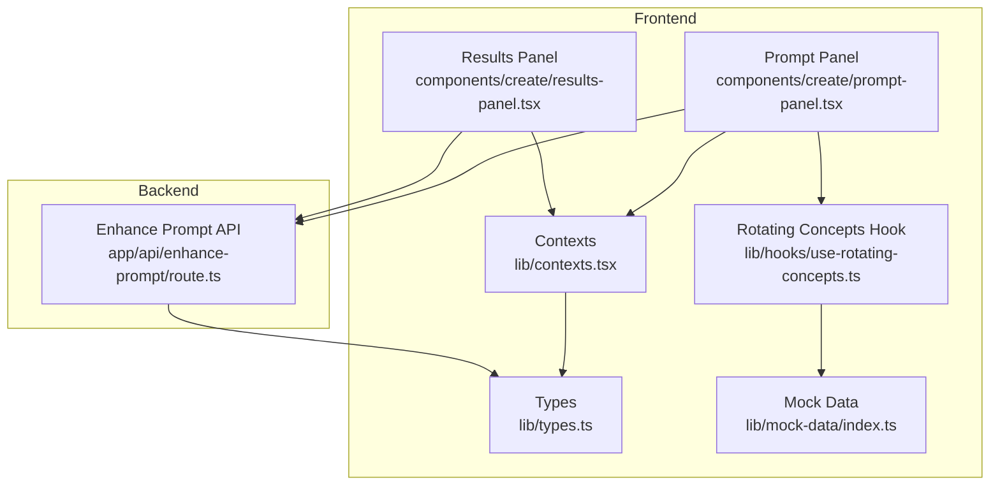
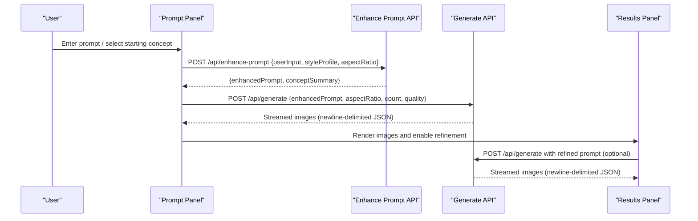
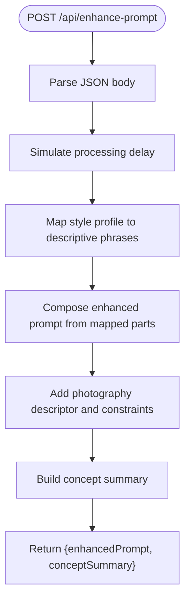
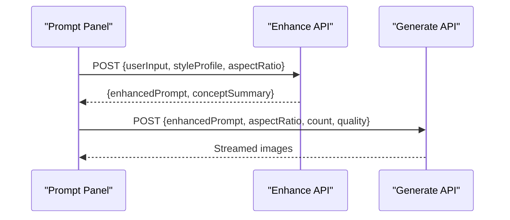
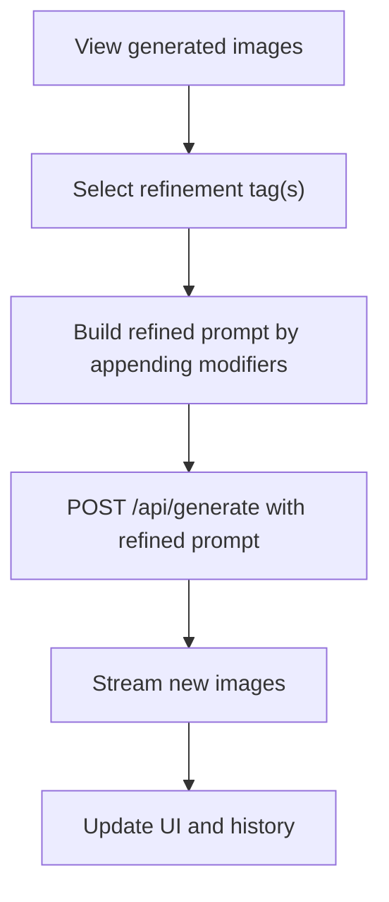
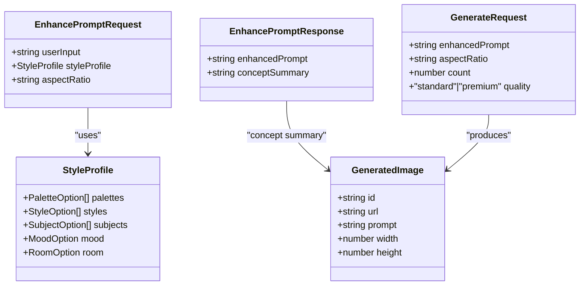
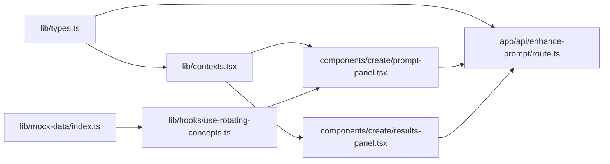

# Prompt Enhancement System

<cite>
**Referenced Files in This Document**
- [route.ts](file://app/api/enhance-prompt/route.ts)
- [prompt-panel.tsx](file://components/create/prompt-panel.tsx)
- [results-panel.tsx](file://components/create/results-panel.tsx)
- [types.ts](file://lib/types.ts)
- [contexts.tsx](file://lib/contexts.tsx)
- [index.ts](file://lib/mock-data/index.ts)
- [use-rotating-concepts.ts](file://lib/hooks/use-rotating-concepts.ts)
- [README.md](file://README.md)
</cite>

## Table of Contents
1. [Introduction](#introduction)
2. [Project Structure](#project-structure)
3. [Core Components](#core-components)
4. [Architecture Overview](#architecture-overview)
5. [Detailed Component Analysis](#detailed-component-analysis)
6. [Dependency Analysis](#dependency-analysis)
7. [Performance Considerations](#performance-considerations)
8. [Troubleshooting Guide](#troubleshooting-guide)
9. [Conclusion](#conclusion)

## Introduction
This document describes the prompt enhancement system that powers AI-powered prompt refinement in the Muse AI wall art platform. The system transforms user input prompts into optimized, style-aware prompts using a style profile derived from a style quiz and contextual metadata such as aspect ratio. It integrates with a mock LLM pipeline that composes a structured, professional prompt suitable for image generation, and it exposes a dedicated API endpoint for external integrations.

Key goals:
- Provide a robust prompt enhancement pipeline that combines user intent with stylistic preferences.
- Offer a clear API contract for prompt enhancement requests and responses.
- Enable manual refinement controls and suggestion previews for iterative prompt improvement.
- Document best practices for prompt engineering and error handling.

## Project Structure
The prompt enhancement system spans frontend UI components, shared types, and backend API routes:

- Frontend
  - Prompt panel: collects user input, displays starting concepts, and triggers enhancement and generation.
  - Results panel: shows generated images, allows refinement via direction tags, and manages history.
  - Contexts: manage prompt state, enhanced prompt, aspect ratio, quality, and generation history.
  - Hooks: provide rotating starting concepts and style profile integration.
  - Mock data: defines style options, aspect ratios, and starting concepts.

- Backend
  - API route: accepts a request with user input, style profile, and aspect ratio, and returns an enhanced prompt plus a concept summary.

**Diagram sources**
- [prompt-panel.tsx:1-242](file://components/create/prompt-panel.tsx#L1-L242)
- [results-panel.tsx:1-301](file://components/create/results-panel.tsx#L1-L301)
- [contexts.tsx:1-255](file://lib/contexts.tsx#L1-L255)
- [types.ts:1-132](file://lib/types.ts#L1-L132)
- [index.ts:1-315](file://lib/mock-data/index.ts#L1-L315)
- [use-rotating-concepts.ts:1-45](file://lib/hooks/use-rotating-concepts.ts#L1-L45)
- [route.ts:1-102](file://app/api/enhance-prompt/route.ts#L1-L102)

**Section sources**
- [README.md:60-68](file://README.md#L60-L68)
- [prompt-panel.tsx:1-242](file://components/create/prompt-panel.tsx#L1-L242)
- [results-panel.tsx:1-301](file://components/create/results-panel.tsx#L1-L301)
- [contexts.tsx:1-255](file://lib/contexts.tsx#L1-L255)
- [types.ts:1-132](file://lib/types.ts#L1-L132)
- [index.ts:1-315](file://lib/mock-data/index.ts#L1-L315)
- [use-rotating-concepts.ts:1-45](file://lib/hooks/use-rotating-concepts.ts#L1-L45)
- [route.ts:1-102](file://app/api/enhance-prompt/route.ts#L1-L102)

## Core Components
- Prompt Panel
  - Collects user input and style profile, triggers enhancement, and initiates image generation.
  - Integrates with rotating starting concepts and aspect/quality controls.
- Results Panel
  - Displays generated images, supports refinement via direction tags, and maintains generation history.
- Contexts
  - Provide centralized state for prompt, enhanced prompt, images, selection, aspect ratio, quality, and history.
- Types
  - Define the style profile, request/response contracts for enhancement, and generation payloads.
- Mock Data
  - Supplies style options, aspect ratios, and starting concepts used by the UI and hooks.
- Enhance Prompt API
  - Accepts user input, style profile, and aspect ratio, and returns an enhanced prompt plus a concept summary.

**Section sources**
- [prompt-panel.tsx:20-124](file://components/create/prompt-panel.tsx#L20-L124)
- [results-panel.tsx:24-122](file://components/create/results-panel.tsx#L24-L122)
- [contexts.tsx:71-162](file://lib/contexts.tsx#L71-L162)
- [types.ts:2-52](file://lib/types.ts#L2-L52)
- [index.ts:47-285](file://lib/mock-data/index.ts#L47-L285)
- [route.ts:9-101](file://app/api/enhance-prompt/route.ts#L9-L101)

## Architecture Overview
The prompt enhancement pipeline connects the frontend UI to the backend API and subsequent image generation:

**Diagram sources**
- [prompt-panel.tsx:54-76](file://components/create/prompt-panel.tsx#L54-L76)
- [route.ts:9-101](file://app/api/enhance-prompt/route.ts#L9-L101)
- [results-panel.tsx:58-121](file://components/create/results-panel.tsx#L58-L121)

## Detailed Component Analysis

### Enhance Prompt API
The API endpoint performs prompt enhancement by combining user input with a style profile and aspect ratio into a structured, professional prompt. It simulates processing latency and returns both the enhanced prompt and a concise concept summary.

Key behaviors:
- Validates and extracts request payload fields.
- Maps style profile options to descriptive phrases.
- Composes an enhanced prompt by concatenating core elements with optional style, palette, mood, room, and aspect context.
- Adds a standardized photography descriptor suitable for wall art.
- Returns an enhanced prompt and a concept summary.

**Diagram sources**
- [route.ts:9-101](file://app/api/enhance-prompt/route.ts#L9-L101)

**Section sources**
- [route.ts:9-101](file://app/api/enhance-prompt/route.ts#L9-L101)

### Prompt Panel Interface
The prompt panel integrates user input, starting concepts, aspect ratio, and quality controls. It triggers the enhancement and generation flow, manages loading states, and updates UI with streamed results.

Key behaviors:
- Uses a style profile when available; otherwise defaults to a realistic photographic baseline.
- Sends a request to the enhancement API with user input, style profile, and aspect ratio.
- Sets the returned enhanced prompt for downstream generation.
- Streams and renders generated images as they arrive.

**Diagram sources**
- [prompt-panel.tsx:42-124](file://components/create/prompt-panel.tsx#L42-L124)
- [route.ts:9-101](file://app/api/enhance-prompt/route.ts#L9-L101)

**Section sources**
- [prompt-panel.tsx:20-124](file://components/create/prompt-panel.tsx#L20-L124)
- [use-rotating-concepts.ts:9-44](file://lib/hooks/use-rotating-concepts.ts#L9-L44)
- [index.ts:171-237](file://lib/mock-data/index.ts#L171-L237)

### Results Panel and Manual Refinement
The results panel displays generated images, enables refinement via direction tags, and maintains generation history. Users can iteratively adjust prompts by adding directional modifiers and regenerating images.

Key behaviors:
- Presents direction tags for warming/cooling, drama/subtlety, detail level, abstraction, brightness, and darkness.
- Builds a refined prompt by appending modifiers mapped from tag IDs.
- Streams and renders new images upon refinement.
- Maintains a history of previous generations for quick recall.

**Diagram sources**
- [results-panel.tsx:38-122](file://components/create/results-panel.tsx#L38-L122)

**Section sources**
- [results-panel.tsx:13-22](file://components/create/results-panel.tsx#L13-L22)
- [results-panel.tsx:206-297](file://components/create/results-panel.tsx#L206-L297)

### Data Models and Contracts
The system relies on strongly typed contracts for style profiles, enhancement requests/responses, and generation payloads.

**Diagram sources**
- [types.ts:2-52](file://lib/types.ts#L2-L52)

**Section sources**
- [types.ts:2-52](file://lib/types.ts#L2-L52)

## Dependency Analysis
The prompt enhancement system exhibits clear separation of concerns:

- UI components depend on contexts for state and on hooks for dynamic content.
- The enhance API depends on shared types for request/response contracts.
- The results panel depends on the generation API for refinement flows.
- Mock data supplies style options and starting concepts used by the UI.

**Diagram sources**
- [types.ts:1-132](file://lib/types.ts#L1-L132)
- [contexts.tsx:1-255](file://lib/contexts.tsx#L1-L255)
- [prompt-panel.tsx:1-242](file://components/create/prompt-panel.tsx#L1-L242)
- [results-panel.tsx:1-301](file://components/create/results-panel.tsx#L1-L301)
- [index.ts:1-315](file://lib/mock-data/index.ts#L1-L315)
- [use-rotating-concepts.ts:1-45](file://lib/hooks/use-rotating-concepts.ts#L1-L45)
- [route.ts:1-102](file://app/api/enhance-prompt/route.ts#L1-L102)

**Section sources**
- [types.ts:1-132](file://lib/types.ts#L1-L132)
- [contexts.tsx:1-255](file://lib/contexts.tsx#L1-L255)
- [prompt-panel.tsx:1-242](file://components/create/prompt-panel.tsx#L1-L242)
- [results-panel.tsx:1-301](file://components/create/results-panel.tsx#L1-L301)
- [index.ts:1-315](file://lib/mock-data/index.ts#L1-L315)
- [use-rotating-concepts.ts:1-45](file://lib/hooks/use-rotating-concepts.ts#L1-L45)
- [route.ts:1-102](file://app/api/enhance-prompt/route.ts#L1-L102)

## Performance Considerations
- The enhance API introduces a simulated processing delay to mimic LLM latency. In production, replace the mock logic with a real LLM call and tune concurrency limits.
- Streaming generation reduces perceived latency by rendering images incrementally. Ensure clients handle newline-delimited JSON streams reliably.
- Use caching for frequently reused style profile mappings to reduce computation overhead.
- Consider batching enhancement requests when integrating with external LLM providers to optimize throughput.

[No sources needed since this section provides general guidance]

## Troubleshooting Guide
Common issues and resolutions:
- Enhancement API returns unexpected prompt structure
  - Verify that the request payload includes all required fields: userInput, styleProfile, and aspectRatio.
  - Confirm that style profile option values match the expected enumerations.
- No response body from generation API
  - The UI checks for a response body before streaming. Ensure the backend returns a readable stream.
- Parsing errors during streaming
  - The UI decodes chunks and parses JSON lines. Validate that the backend emits newline-delimited JSON objects.
- Enhancement failures
  - The UI catches and logs errors during enhancement and refinement. Inspect console logs for underlying causes.
- Rate limiting and fallbacks
  - The README documents fallback behavior for image generation when API keys are missing. Apply similar fallback strategies for the enhancement API by returning a deterministic, well-formed prompt when upstream services are unavailable.

**Section sources**
- [prompt-panel.tsx:78-80](file://components/create/prompt-panel.tsx#L78-L80)
- [results-panel.tsx:70-72](file://components/create/results-panel.tsx#L70-L72)
- [README.md:30-33](file://README.md#L30-L33)

## Conclusion
The prompt enhancement system provides a structured, extensible foundation for transforming user intent into optimized prompts. It integrates seamlessly with the style quiz, offers manual refinement controls, and exposes a clear API contract. By replacing the mock enhancement logic with a real LLM and implementing robust error handling and fallbacks, the system can scale to production-grade performance while maintaining a smooth user experience.