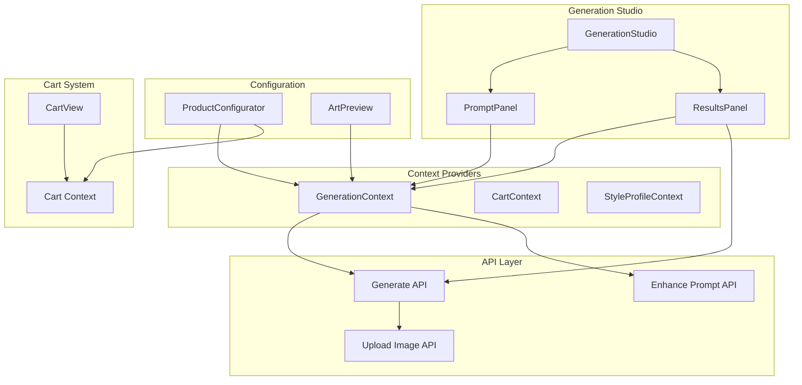
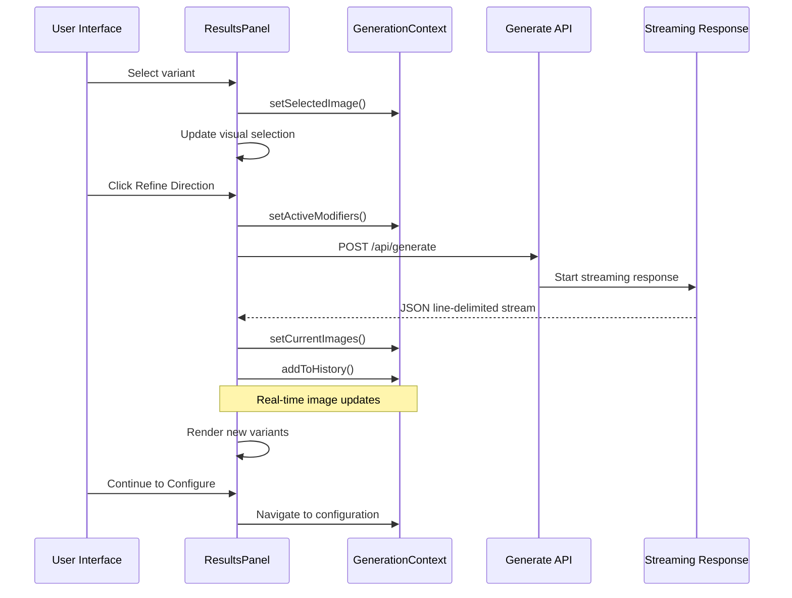
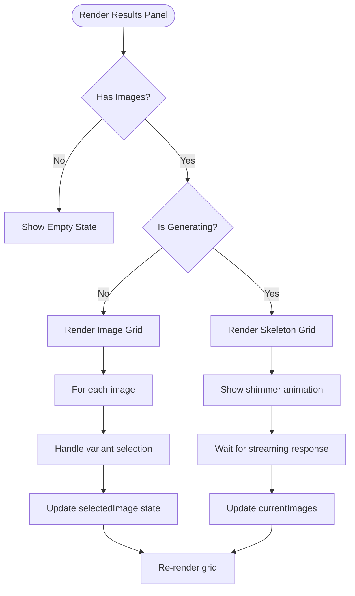
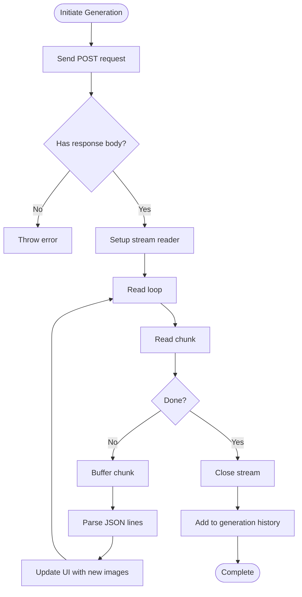
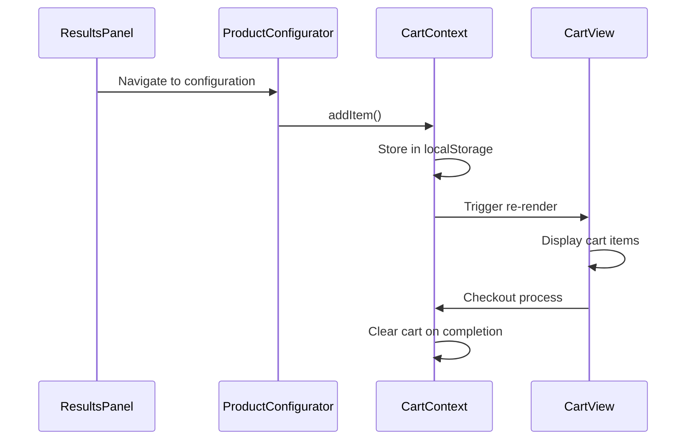
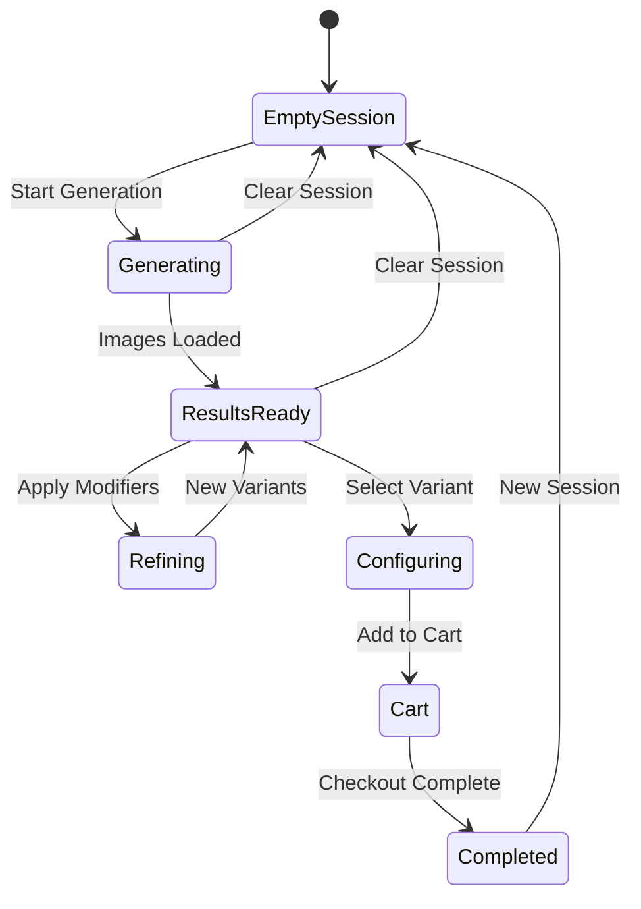
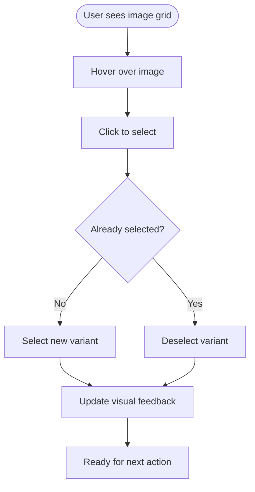

# Results Management

<cite>
**Referenced Files in This Document**
- [results-panel.tsx](file://components/create/results-panel.tsx)
- [generation-studio.tsx](file://components/create/generation-studio.tsx)
- [types.ts](file://lib/types.ts)
- [contexts.tsx](file://lib/contexts.tsx)
- [prompt-panel.tsx](file://components/create/prompt-panel.tsx)
- [product-configurator.tsx](file://components/configure/product-configurator.tsx)
- [art-preview.tsx](file://components/configure/art-preview.tsx)
- [cart-view.tsx](file://components/cart/cart-view.tsx)
- [route.ts](file://app/api/generate/route.ts)
- [index.ts](file://lib/mock-data/index.ts)
- [route.ts](file://app/api/upload-image/route.ts)
</cite>

## Table of Contents
1. [Introduction](#introduction)
2. [Project Structure](#project-structure)
3. [Core Components](#core-components)
4. [Architecture Overview](#architecture-overview)
5. [Detailed Component Analysis](#detailed-component-analysis)
6. [Integration with Cart Functionality](#integration-with-cart-functionality)
7. [State Management and Persistence](#state-management-and-persistence)
8. [User Interaction Patterns](#user-interaction-patterns)
9. [Performance Considerations](#performance-considerations)
10. [Troubleshooting Guide](#troubleshooting-guide)
11. [Conclusion](#conclusion)

## Introduction

The Results Management functionality within the Generation Studio handles the display, selection, refinement, and ordering of AI-generated artwork. This system provides users with an intuitive interface to browse generated variants, refine results based on direction tags, compare different generations, and ultimately order their preferred artwork through the integrated cart system.

The results panel serves as the central hub for managing generated artwork, featuring a responsive image grid display, variant selection mechanisms, refinement controls, and seamless integration with the product configurator for ordering.

## Project Structure

The results management system is organized around several key components that work together to provide a comprehensive AI art generation experience:

**Diagram sources**
- [generation-studio.tsx:8-34](file://components/create/generation-studio.tsx#L8-L34)
- [contexts.tsx:116-158](file://lib/contexts.tsx#L116-L158)

**Section sources**
- [generation-studio.tsx:1-35](file://components/create/generation-studio.tsx#L1-L35)
- [contexts.tsx:1-255](file://lib/contexts.tsx#L1-L255)

## Core Components

The results management system consists of several interconnected components that handle different aspects of the generation and selection workflow:

### Results Panel Component
The Results Panel serves as the primary interface for displaying generated artwork variants. It features:
- Responsive 2-column image grid layout
- Interactive variant selection with visual feedback
- Real-time refinement controls
- Generation history navigation
- Loading states and skeleton screens

### Generation Context Management
The Generation Context provides centralized state management for:
- Current generation session data
- Selected variants and preferences
- Active refinement modifiers
- Generation history tracking
- Session clearing capabilities

### API Integration Layer
The system integrates with external APIs for:
- AI image generation with streaming responses
- Prompt enhancement and optimization
- Image upload and storage
- Mock data fallback for development

**Section sources**
- [results-panel.tsx:24-301](file://components/create/results-panel.tsx#L24-L301)
- [contexts.tsx:71-158](file://lib/contexts.tsx#L71-L158)
- [route.ts:19-145](file://app/api/generate/route.ts#L19-L145)

## Architecture Overview

The results management architecture follows a reactive pattern with real-time updates and streaming responses:

**Diagram sources**
- [results-panel.tsx:38-122](file://components/create/results-panel.tsx#L38-L122)
- [route.ts:66-113](file://app/api/generate/route.ts#L66-L113)

The architecture employs several key design patterns:

1. **Streaming Response Pattern**: Images are streamed as JSON lines for immediate display
2. **State Management Pattern**: Centralized context for all generation-related state
3. **Component Composition Pattern**: Modular components with clear separation of concerns
4. **Provider Pattern**: Context providers for cross-component state sharing

## Detailed Component Analysis

### Results Panel Implementation

The Results Panel component provides the primary interface for managing generated artwork:

#### Image Grid Display
The component renders a responsive 2-column grid layout that adapts to different screen sizes:

**Diagram sources**
- [results-panel.tsx:147-204](file://components/create/results-panel.tsx#L147-L204)

#### Variant Selection Mechanism
Users can select variants by clicking on images, with visual feedback through:
- Border highlighting with accent color
- Checkmark indicator for selected variants
- Hover effects for better UX
- Single-click selection behavior

#### Refinement Controls
The refinement system allows users to improve results through direction tags:

| Direction Tag | Modifier Description |
|---------------|---------------------|
| warmer | Adds golden orange and coral tones |
| cooler | Introduces blue and teal undertones |
| more-dramatic | Increases contrast and lighting |
| more-subtle | Softens and reduces intensity |
| more-detailed | Enhances texture and detail |
| more-abstract | Moves toward non-literal style |
| brighter | Increases luminosity and highlights |
| darker | Deepens shadows and creates mood |

#### Generation History Navigation
Users can navigate between different generation batches through:
- Thumbnail previews of recent generations
- Horizontal scrolling interface
- Batch selection to restore previous results

**Section sources**
- [results-panel.tsx:13-22](file://components/create/results-panel.tsx#L13-L22)
- [results-panel.tsx:165-202](file://components/create/results-panel.tsx#L165-L202)
- [results-panel.tsx:263-296](file://components/create/results-panel.tsx#L263-L296)

### Generation Context Management

The Generation Context provides comprehensive state management for the entire generation workflow:

#### State Variables
- `currentImages`: Array of currently displayed images
- `selectedImage`: Currently selected variant
- `generationHistory`: Array of previous generation batches
- `activeModifiers`: Applied refinement directions
- `isGenerating`: Loading state during generation
- `enhancedPrompt`: Optimized prompt for generation
- `aspectRatio`: Image dimensions setting
- `quality`: Resolution quality level

#### Context Methods
- `setCurrentImages()`: Updates the current image array
- `setSelectedImage()`: Manages variant selection
- `addToHistory()`: Stores generation batches
- `setActiveModifiers()`: Tracks refinement directions
- `clearSession()`: Resets all generation state

**Section sources**
- [contexts.tsx:71-158](file://lib/contexts.tsx#L71-L158)
- [types.ts:17-30](file://lib/types.ts#L17-L30)

### API Integration and Streaming

The system integrates with external APIs for AI image generation using streaming responses:

#### Streaming Response Handler
The Results Panel implements sophisticated streaming response handling:

**Diagram sources**
- [results-panel.tsx:74-119](file://components/create/results-panel.tsx#L74-L119)

#### Mock Data Fallback
When the FAL API key is unavailable, the system provides mock data:
- Uses gallery images as placeholders
- Simulates generation delays
- Maintains consistent API response format
- Preserves streaming interface behavior

**Section sources**
- [route.ts:36-64](file://app/api/generate/route.ts#L36-L64)
- [route.ts:117-143](file://app/api/generate/route.ts#L117-L143)

## Integration with Cart Functionality

The results management system seamlessly integrates with the cart functionality for ordering selected artwork:

### Cart Integration Flow

**Diagram sources**
- [product-configurator.tsx:44-69](file://components/configure/product-configurator.tsx#L44-L69)
- [contexts.tsx:185-250](file://lib/contexts.tsx#L185-L250)

### Product Configuration Integration
The Product Configurator receives selected images from the Generation Context and provides:
- Size selection with pricing
- Medium options (paper, canvas, acrylic, metal)
- Frame selection with color options
- Matting options
- Real-time price calculation
- Resolution validation

**Section sources**
- [product-configurator.tsx:19-86](file://components/configure/product-configurator.tsx#L19-L86)
- [art-preview.tsx:86-354](file://components/configure/art-preview.tsx#L86-L354)

## State Management and Persistence

The system implements comprehensive state management with persistence across browser sessions:

### Local Storage Integration
Both the Generation Context and Cart Context utilize localStorage for persistence:

#### Generation Session Persistence
- Stores currentImages array
- Persists selectedImage selection
- Maintains generationHistory
- Preserves activeModifiers
- Clears session on demand

#### Cart Persistence
- Stores complete cart state
- Persists across browser sessions
- Handles cart restoration on load
- Manages empty cart state

### Session State Management

**Diagram sources**
- [contexts.tsx:131-138](file://lib/contexts.tsx#L131-L138)
- [contexts.tsx:190-205](file://lib/contexts.tsx#L190-L205)

**Section sources**
- [contexts.tsx:116-158](file://lib/contexts.tsx#L116-L158)
- [contexts.tsx:185-250](file://lib/contexts.tsx#L185-L250)

## User Interaction Patterns

The results management system implements several key user interaction patterns:

### Variant Selection Workflow

**Diagram sources**
- [results-panel.tsx:171-175](file://components/create/results-panel.tsx#L171-L175)

### Refinement Interaction Pattern
Users can refine results through direction tags:
- Click individual direction tags to apply modifiers
- Visual feedback shows active modifiers
- Combined modifiers create cumulative effects
- Reset button clears all modifiers

### Comparison and History Navigation
- Horizontal scrolling history interface
- Thumbnail previews of previous generations
- Instant restoration of previous results
- Visual indication of current generation

### Ordering Integration
- Continue button becomes enabled when variant is selected
- Direct navigation to product configuration
- Seamless cart integration
- Order summary and checkout process

**Section sources**
- [results-panel.tsx:207-296](file://components/create/results-panel.tsx#L207-L296)
- [prompt-panel.tsx:35-124](file://components/create/prompt-panel.tsx#L35-L124)

## Performance Considerations

The results management system implements several performance optimizations:

### Streaming Response Optimization
- Real-time image rendering prevents blocking UI
- Incremental updates reduce memory usage
- Efficient JSON parsing minimizes processing overhead
- Backpressure handling prevents memory accumulation

### Image Loading Optimization
- Lazy loading with Next.js Image component
- Responsive sizing for different viewport widths
- Optimized aspect ratios for consistent layouts
- Unoptimized flag for dynamic URLs

### State Management Efficiency
- Minimal re-renders through selective state updates
- Memoized calculations for price and resolution
- Efficient array operations for history management
- Debounced updates for smooth user experience

### Memory Management
- Automatic cleanup of unused state
- Controlled array growth for generation history
- Efficient image object management
- Proper event listener cleanup

## Troubleshooting Guide

Common issues and their solutions:

### Generation Failures
**Issue**: Images not appearing after generation
**Solution**: Check API key configuration and network connectivity
**Prevention**: Implement proper error boundaries and retry logic

### Streaming Response Issues
**Issue**: Partial images or incomplete streams
**Solution**: Verify server-side streaming implementation
**Prevention**: Add timeout handling and connection monitoring

### State Persistence Problems
**Issue**: Lost session data after refresh
**Solution**: Verify localStorage availability and permissions
**Prevention**: Implement graceful degradation for offline scenarios

### Performance Issues
**Issue**: Slow image loading or rendering
**Solution**: Optimize image sizes and implement lazy loading
**Prevention**: Monitor bundle size and optimize component rendering

**Section sources**
- [route.ts:32-35](file://app/api/generate/route.ts#L32-L35)
- [contexts.tsx:189-205](file://lib/contexts.tsx#L189-L205)

## Conclusion

The Results Management functionality provides a comprehensive solution for AI art generation and selection. Through its modular architecture, real-time streaming capabilities, and seamless integration with the cart system, it delivers an intuitive user experience for creating, refining, and ordering custom artwork.

Key strengths of the implementation include:
- Responsive and accessible user interface
- Efficient state management with persistence
- Real-time streaming for immediate feedback
- Comprehensive refinement capabilities
- Seamless integration with ordering workflow
- Robust error handling and fallback mechanisms

The system successfully balances functionality with performance, providing users with a smooth experience for exploring AI-generated artwork and transforming their favorites into physical prints through the integrated shopping cart system.