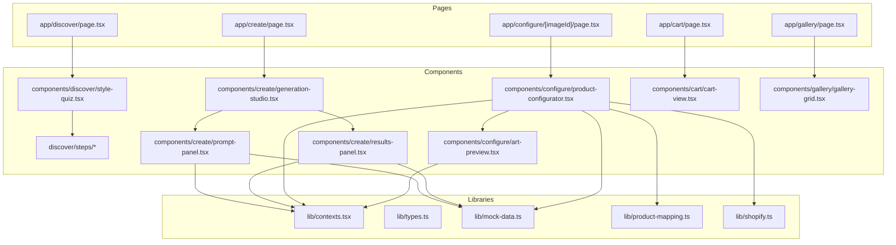
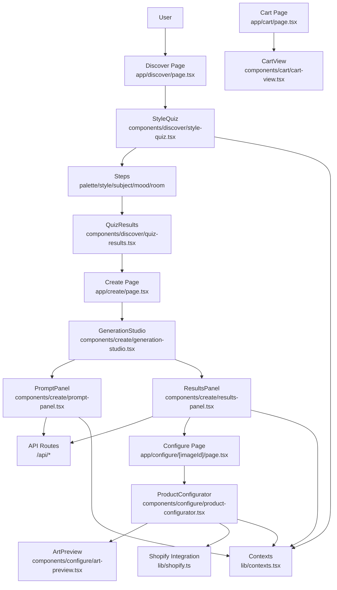
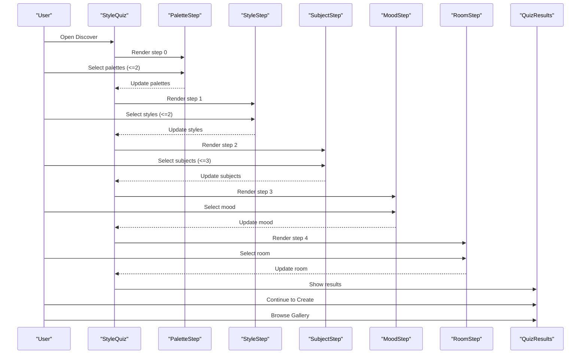
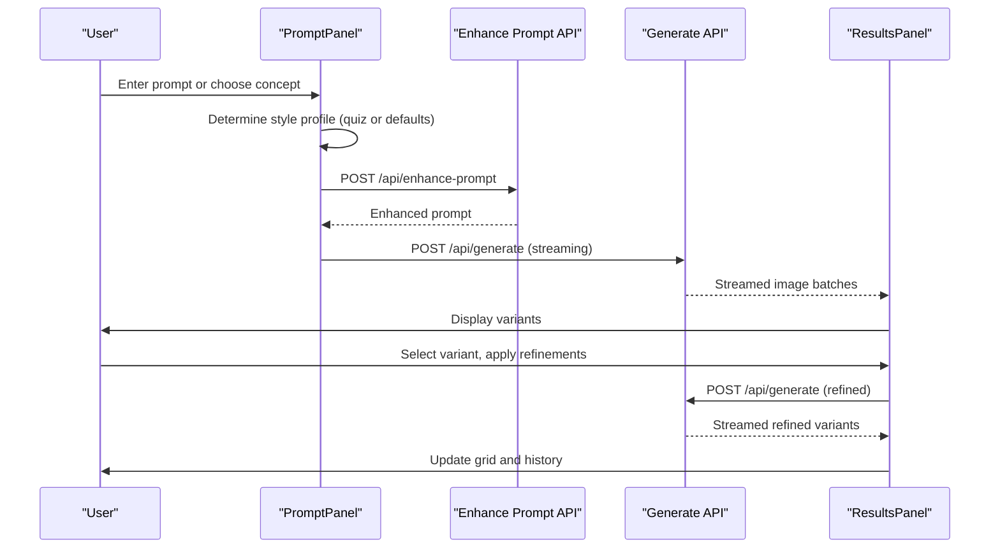
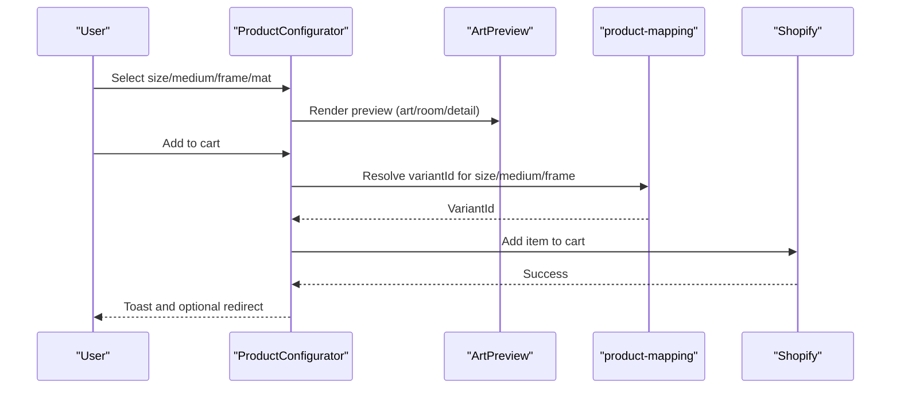
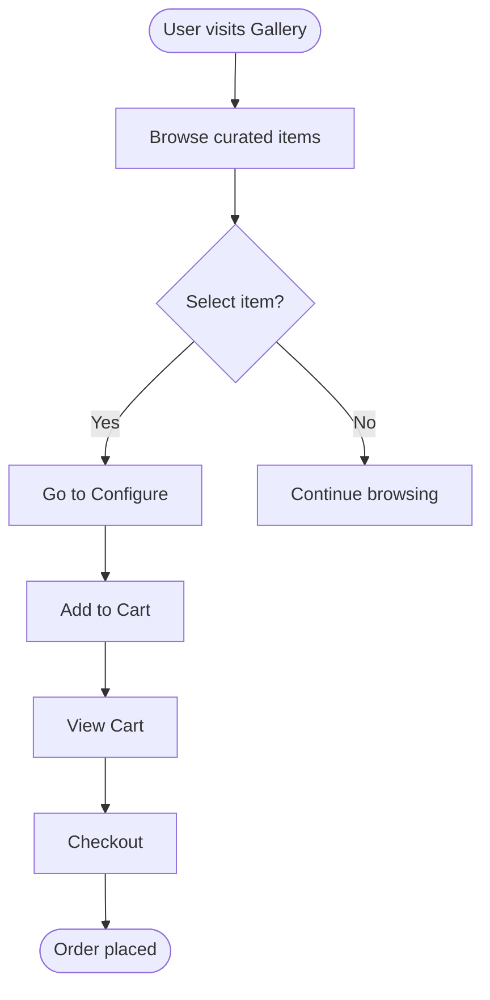
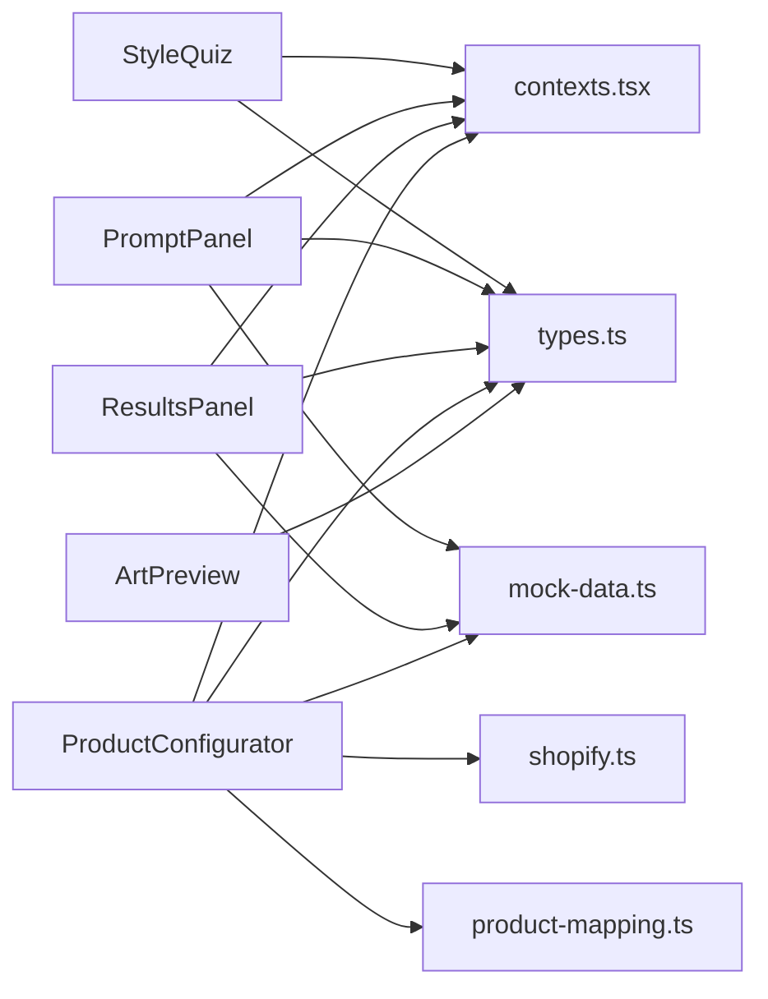

# Core Features

<cite>
**Referenced Files in This Document**
- [app/discover/page.tsx](file://app/discover/page.tsx)
- [components/discover/style-quiz.tsx](file://components/discover/style-quiz.tsx)
- [components/discover/steps/palette-step.tsx](file://components/discover/steps/palette-step.tsx)
- [components/discover/steps/style-step.tsx](file://components/discover/steps/style-step.tsx)
- [components/discover/steps/subject-step.tsx](file://components/discover/steps/subject-step.tsx)
- [components/discover/steps/mood-step.tsx](file://components/discover/steps/mood-step.tsx)
- [components/discover/steps/room-step.tsx](file://components/discover/steps/room-step.tsx)
- [components/discover/quiz-results.tsx](file://components/discover/quiz-results.tsx)
- [app/create/page.tsx](file://app/create/page.tsx)
- [components/create/generation-studio.tsx](file://components/create/generation-studio.tsx)
- [components/create/prompt-panel.tsx](file://components/create/prompt-panel.tsx)
- [components/create/results-panel.tsx](file://components/create/results-panel.tsx)
- [app/configure/[imageId]/page.tsx](file://app/configure/[imageId]/page.tsx)
- [components/configure/product-configurator.tsx](file://components/configure/product-configurator.tsx)
- [components/configure/art-preview.tsx](file://components/configure/art-preview.tsx)
- [lib/contexts.tsx](file://lib/contexts.tsx)
- [lib/types.ts](file://lib/types.ts)
- [lib/mock-data.ts](file://lib/mock-data.ts)
- [lib/product-mapping.ts](file://lib/product-mapping.ts)
- [app/cart/page.tsx](file://app/cart/page.tsx)
- [components/cart/cart-view.tsx](file://components/cart/cart-view.tsx)
- [app/gallery/page.tsx](file://app/gallery/page.tsx)
- [components/gallery/gallery-grid.tsx](file://components/gallery/gallery-grid.tsx)
- [lib/shopify.ts](file://lib/shopify.ts)
- [lib/shopify-admin.ts](file://lib/shopify-admin.ts)
</cite>

## Table of Contents
1. [Introduction](#introduction)
2. [Project Structure](#project-structure)
3. [Core Components](#core-components)
4. [Architecture Overview](#architecture-overview)
5. [Detailed Component Analysis](#detailed-component-analysis)
6. [Dependency Analysis](#dependency-analysis)
7. [Performance Considerations](#performance-considerations)
8. [Troubleshooting Guide](#troubleshooting-guide)
9. [Conclusion](#conclusion)
10. [Appendices](#appendices)

## Introduction
This document explains the core user-facing features of the Muse AI wall art platform, focusing on:
- The 5-step style discovery quiz (palette, style, subject, mood, room)
- The AI generation studio (prompt enhancement, streaming image variants, refinement)
- The product configurator (size, medium, frame, mat with live preview)
- The curated gallery and shopping cart system
It also covers user workflows, component interactions, state management patterns, practical examples, and integration guidelines.

## Project Structure
The application is a Next.js app with a clear separation between pages and shared components:
- Pages define routes and metadata for SEO
- Components encapsulate reusable UI and logic
- Shared libraries provide types, contexts, and mock data
- API routes under app/api connect to external services (e.g., image generation, prompt enhancement)

**Diagram sources**
- [app/discover/page.tsx:1-11](file://app/discover/page.tsx#L1-L11)
- [components/discover/style-quiz.tsx:1-145](file://components/discover/style-quiz.tsx#L1-L145)
- [components/discover/steps/palette-step.tsx:1-60](file://components/discover/steps/palette-step.tsx#L1-L60)
- [components/discover/steps/style-step.tsx:1-62](file://components/discover/steps/style-step.tsx#L1-L62)
- [components/discover/steps/subject-step.tsx:1-62](file://components/discover/steps/subject-step.tsx#L1-L62)
- [components/discover/steps/mood-step.tsx:1-52](file://components/discover/steps/mood-step.tsx#L1-L52)
- [components/discover/steps/room-step.tsx:1-52](file://components/discover/steps/room-step.tsx#L1-L52)
- [app/create/page.tsx:1-11](file://app/create/page.tsx#L1-L11)
- [components/create/generation-studio.tsx:1-35](file://components/create/generation-studio.tsx#L1-L35)
- [components/create/prompt-panel.tsx:1-242](file://components/create/prompt-panel.tsx#L1-L242)
- [components/create/results-panel.tsx:1-301](file://components/create/results-panel.tsx#L1-L301)
- [app/configure/[imageId]/page.tsx](file://app/configure/[imageId]/page.tsx#L1-L12)
- [components/configure/product-configurator.tsx:1-279](file://components/configure/product-configurator.tsx#L1-L279)
- [components/configure/art-preview.tsx:1-354](file://components/configure/art-preview.tsx#L1-L354)
- [app/cart/page.tsx](file://app/cart/page.tsx)
- [components/cart/cart-view.tsx](file://components/cart/cart-view.tsx)
- [app/gallery/page.tsx](file://app/gallery/page.tsx)
- [components/gallery/gallery-grid.tsx](file://components/gallery/gallery-grid.tsx)
- [lib/contexts.tsx](file://lib/contexts.tsx)
- [lib/types.ts](file://lib/types.ts)
- [lib/mock-data.ts](file://lib/mock-data.ts)
- [lib/product-mapping.ts](file://lib/product-mapping.ts)
- [lib/shopify.ts](file://lib/shopify.ts)

**Section sources**
- [app/discover/page.tsx:1-11](file://app/discover/page.tsx#L1-L11)
- [app/create/page.tsx:1-11](file://app/create/page.tsx#L1-L11)
- [app/configure/[imageId]/page.tsx](file://app/configure/[imageId]/page.tsx#L1-L12)
- [app/cart/page.tsx](file://app/cart/page.tsx)
- [app/gallery/page.tsx](file://app/gallery/page.tsx)

## Core Components
This section outlines the primary features and their responsibilities.

- Style Discovery Quiz
  - Provides a guided 5-step selection flow for palette, style, subject, mood, and room
  - Aggregates selections into a style profile stored in a React context
  - Renders step-specific UI components and navigates to results

- AI Generation Studio
  - Prompt panel with starting concepts, optional user prompt, aspect ratio, and quality controls
  - Results panel with streaming image grid, refinement controls, and history
  - Integrates with API endpoints for prompt enhancement and image generation

- Product Configurator
  - Allows selecting size, medium, frame, and mat
  - Live preview showing the art alone, in a room, or in detail
  - Adds configured items to the cart via Shopify integration

- Curated Gallery and Shopping Cart
  - Gallery page displays curated items for browsing
  - Cart view manages selected items and checkout flow

**Section sources**
- [components/discover/style-quiz.tsx:1-145](file://components/discover/style-quiz.tsx#L1-L145)
- [components/create/generation-studio.tsx:1-35](file://components/create/generation-studio.tsx#L1-L35)
- [components/create/prompt-panel.tsx:1-242](file://components/create/prompt-panel.tsx#L1-L242)
- [components/create/results-panel.tsx:1-301](file://components/create/results-panel.tsx#L1-L301)
- [components/configure/product-configurator.tsx:1-279](file://components/configure/product-configurator.tsx#L1-L279)
- [components/configure/art-preview.tsx:1-354](file://components/configure/art-preview.tsx#L1-L354)
- [app/gallery/page.tsx](file://app/gallery/page.tsx)
- [components/gallery/gallery-grid.tsx](file://components/gallery/gallery-grid.tsx)
- [app/cart/page.tsx](file://app/cart/page.tsx)
- [components/cart/cart-view.tsx](file://components/cart/cart-view.tsx)

## Architecture Overview
The system follows a React client-side architecture with server-rendered pages and client-side state management. Shared contexts coordinate state across components. API routes handle prompt enhancement and image generation, while product configuration integrates with Shopify.

**Diagram sources**
- [app/discover/page.tsx:1-11](file://app/discover/page.tsx#L1-L11)
- [components/discover/style-quiz.tsx:1-145](file://components/discover/style-quiz.tsx#L1-L145)
- [components/discover/steps/palette-step.tsx:1-60](file://components/discover/steps/palette-step.tsx#L1-L60)
- [components/discover/steps/style-step.tsx:1-62](file://components/discover/steps/style-step.tsx#L1-L62)
- [components/discover/steps/subject-step.tsx:1-62](file://components/discover/steps/subject-step.tsx#L1-L62)
- [components/discover/steps/mood-step.tsx:1-52](file://components/discover/steps/mood-step.tsx#L1-L52)
- [components/discover/steps/room-step.tsx:1-52](file://components/discover/steps/room-step.tsx#L1-L52)
- [components/discover/quiz-results.tsx:1-98](file://components/discover/quiz-results.tsx#L1-L98)
- [app/create/page.tsx:1-11](file://app/create/page.tsx#L1-L11)
- [components/create/generation-studio.tsx:1-35](file://components/create/generation-studio.tsx#L1-L35)
- [components/create/prompt-panel.tsx:1-242](file://components/create/prompt-panel.tsx#L1-L242)
- [components/create/results-panel.tsx:1-301](file://components/create/results-panel.tsx#L1-L301)
- [app/configure/[imageId]/page.tsx](file://app/configure/[imageId]/page.tsx#L1-L12)
- [components/configure/product-configurator.tsx:1-279](file://components/configure/product-configurator.tsx#L1-L279)
- [components/configure/art-preview.tsx:1-354](file://components/configure/art-preview.tsx#L1-L354)
- [app/cart/page.tsx](file://app/cart/page.tsx)
- [components/cart/cart-view.tsx](file://components/cart/cart-view.tsx)
- [lib/contexts.tsx](file://lib/contexts.tsx)
- [lib/shopify.ts](file://lib/shopify.ts)

## Detailed Component Analysis

### Style Discovery Quiz
The quiz is a multi-step wizard that collects user preferences and produces a style profile.

**Diagram sources**
- [components/discover/style-quiz.tsx:1-145](file://components/discover/style-quiz.tsx#L1-L145)
- [components/discover/steps/palette-step.tsx:1-60](file://components/discover/steps/palette-step.tsx#L1-L60)
- [components/discover/steps/style-step.tsx:1-62](file://components/discover/steps/style-step.tsx#L1-L62)
- [components/discover/steps/subject-step.tsx:1-62](file://components/discover/steps/subject-step.tsx#L1-L62)
- [components/discover/steps/mood-step.tsx:1-52](file://components/discover/steps/mood-step.tsx#L1-L52)
- [components/discover/steps/room-step.tsx:1-52](file://components/discover/steps/room-step.tsx#L1-L52)
- [components/discover/quiz-results.tsx:1-98](file://components/discover/quiz-results.tsx#L1-L98)

Key behaviors:
- State management per step with validation to enable Continue
- Progress bar and step labels
- On completion, stores the style profile in the shared context and navigates to results

Practical example:
- A user selects two palettes, two styles, three subjects, one mood, and one room. The profile is saved and used later in the generation studio.

Integration guidelines:
- Extend the style profile type in [lib/types.ts](file://lib/types.ts) if adding new attributes
- Add new step components under [components/discover/steps/](file://components/discover/steps/) and wire them in [components/discover/style-quiz.tsx:1-145](file://components/discover/style-quiz.tsx#L1-L145)

**Section sources**
- [components/discover/style-quiz.tsx:1-145](file://components/discover/style-quiz.tsx#L1-L145)
- [components/discover/steps/palette-step.tsx:1-60](file://components/discover/steps/palette-step.tsx#L1-L60)
- [components/discover/steps/style-step.tsx:1-62](file://components/discover/steps/style-step.tsx#L1-L62)
- [components/discover/steps/subject-step.tsx:1-62](file://components/discover/steps/subject-step.tsx#L1-L62)
- [components/discover/steps/mood-step.tsx:1-52](file://components/discover/steps/mood-step.tsx#L1-L52)
- [components/discover/steps/room-step.tsx:1-52](file://components/discover/steps/room-step.tsx#L1-L52)
- [components/discover/quiz-results.tsx:1-98](file://components/discover/quiz-results.tsx#L1-L98)
- [lib/types.ts](file://lib/types.ts)
- [lib/contexts.tsx](file://lib/contexts.tsx)

### AI Generation Studio
The studio enables users to describe desired art, enhance prompts, generate variants, and refine directionally.

**Diagram sources**
- [components/create/prompt-panel.tsx:1-242](file://components/create/prompt-panel.tsx#L1-L242)
- [components/create/results-panel.tsx:1-301](file://components/create/results-panel.tsx#L1-L301)
- [lib/contexts.tsx](file://lib/contexts.tsx)

Key behaviors:
- Streaming response parsing updates the UI incrementally
- Uses the style profile when present; otherwise falls back to default profile
- Refinement builds upon the enhanced prompt with directional modifiers
- History tracks previous generations for quick reversion

Practical example:
- A user starts with a concept, generates four variants, selects one, and applies a "more dramatic" refinement to produce a second batch.

Integration guidelines:
- Extend direction tags in [components/create/results-panel.tsx:13-22](file://components/create/results-panel.tsx#L13-L22) to add new refinement directions
- Adjust aspect ratios and quality options in [lib/mock-data.ts](file://lib/mock-data.ts)

**Section sources**
- [components/create/generation-studio.tsx:1-35](file://components/create/generation-studio.tsx#L1-L35)
- [components/create/prompt-panel.tsx:1-242](file://components/create/prompt-panel.tsx#L1-L242)
- [components/create/results-panel.tsx:1-301](file://components/create/results-panel.tsx#L1-L301)
- [lib/contexts.tsx](file://lib/contexts.tsx)
- [lib/mock-data.ts](file://lib/mock-data.ts)

### Product Configurator
The configurator allows users to tailor prints with size, medium, frame, and mat, and see a live preview.

**Diagram sources**
- [components/configure/product-configurator.tsx:1-279](file://components/configure/product-configurator.tsx#L1-L279)
- [components/configure/art-preview.tsx:1-354](file://components/configure/art-preview.tsx#L1-L354)
- [lib/product-mapping.ts](file://lib/product-mapping.ts)
- [lib/shopify.ts](file://lib/shopify.ts)

Key behaviors:
- Live preview adapts to selected size, medium, frame, and mat
- When a frame is selected, mat options become available
- Pricing is computed dynamically and formatted
- Adds a standardized item to the cart with variantId resolved via product mapping

Practical example:
- A user selects a 16x20 print on canvas with a black frame and white mat. The preview shows the art in a living room setting, and the item is added to the cart.

Integration guidelines:
- Update pricing and availability in [lib/mock-data.ts](file://lib/mock-data.ts)
- Extend frame and mat options in [lib/mock-data.ts](file://lib/mock-data.ts) and ensure mapping coverage in [lib/product-mapping.ts](file://lib/product-mapping.ts)

**Section sources**
- [components/configure/product-configurator.tsx:1-279](file://components/configure/product-configurator.tsx#L1-L279)
- [components/configure/art-preview.tsx:1-354](file://components/configure/art-preview.tsx#L1-L354)
- [lib/mock-data.ts](file://lib/mock-data.ts)
- [lib/product-mapping.ts](file://lib/product-mapping.ts)
- [lib/shopify.ts](file://lib/shopify.ts)

### Curated Gallery and Shopping Cart
The gallery presents curated items for inspiration, and the cart manages selected items.

**Diagram sources**
- [app/gallery/page.tsx](file://app/gallery/page.tsx)
- [components/gallery/gallery-grid.tsx](file://components/gallery/gallery-grid.tsx)
- [app/cart/page.tsx](file://app/cart/page.tsx)
- [components/cart/cart-view.tsx](file://components/cart/cart-view.tsx)

Practical example:
- A user browses the gallery, selects an item, configures size and framing, adds to cart, reviews items, and proceeds to checkout.

Integration guidelines:
- Populate gallery items in [lib/mock-data.ts](file://lib/mock-data.ts) and render them in [components/gallery/gallery-grid.tsx](file://components/gallery/gallery-grid.tsx)
- Manage cart state in [lib/contexts.tsx](file://lib/contexts.tsx) and render in [components/cart/cart-view.tsx](file://components/cart/cart-view.tsx)

**Section sources**
- [app/gallery/page.tsx](file://app/gallery/page.tsx)
- [components/gallery/gallery-grid.tsx](file://components/gallery/gallery-grid.tsx)
- [app/cart/page.tsx](file://app/cart/page.tsx)
- [components/cart/cart-view.tsx](file://components/cart/cart-view.tsx)
- [lib/contexts.tsx](file://lib/contexts.tsx)
- [lib/mock-data.ts](file://lib/mock-data.ts)

## Dependency Analysis
The following diagram highlights key dependencies among components and libraries.

**Diagram sources**
- [components/discover/style-quiz.tsx:1-145](file://components/discover/style-quiz.tsx#L1-L145)
- [components/create/prompt-panel.tsx:1-242](file://components/create/prompt-panel.tsx#L1-L242)
- [components/create/results-panel.tsx:1-301](file://components/create/results-panel.tsx#L1-L301)
- [components/configure/product-configurator.tsx:1-279](file://components/configure/product-configurator.tsx#L1-L279)
- [components/configure/art-preview.tsx:1-354](file://components/configure/art-preview.tsx#L1-L354)
- [lib/contexts.tsx](file://lib/contexts.tsx)
- [lib/types.ts](file://lib/types.ts)
- [lib/mock-data.ts](file://lib/mock-data.ts)
- [lib/product-mapping.ts](file://lib/product-mapping.ts)
- [lib/shopify.ts](file://lib/shopify.ts)

**Section sources**
- [lib/contexts.tsx](file://lib/contexts.tsx)
- [lib/types.ts](file://lib/types.ts)
- [lib/mock-data.ts](file://lib/mock-data.ts)
- [lib/product-mapping.ts](file://lib/product-mapping.ts)
- [lib/shopify.ts](file://lib/shopify.ts)

## Performance Considerations
- Streaming image generation
  - The prompt panel and results panel read streaming responses and update the UI progressively. This reduces perceived latency and improves interactivity.
  - Ensure robust error handling and buffer management during streaming reads.
- Preview rendering
  - The art preview scales based on size and conditionally renders frames and mats. Keep DOM updates minimal and avoid unnecessary reflows.
- Context state updates
  - Batch state updates where possible to reduce re-renders. Memoize derived values (e.g., total price) to prevent expensive recalculations.
- API round trips
  - Prompt enhancement and generation are separate calls. Consider combining them if supported by the backend to reduce latency.

[No sources needed since this section provides general guidance]

## Troubleshooting Guide
Common issues and resolutions:
- Generation fails silently
  - Verify network connectivity and API endpoint availability. Check console logs for errors during streaming reads.
  - Confirm that the enhanced prompt and generation requests include required fields (e.g., aspect ratio, quality).
- Selected image not appearing in configurator
  - Ensure the image exists in the generation context or gallery fallback. Validate the imageId passed to the configure page.
- Cart item not added
  - Confirm variantId resolution via product mapping and that the Shopify integration is reachable. Check for toast notifications indicating success or failure.
- Preview not updating
  - Ensure state updates for size, medium, frame, and mat propagate to the preview component. Verify that frame selection toggles mat visibility.

**Section sources**
- [components/create/prompt-panel.tsx:115-124](file://components/create/prompt-panel.tsx#L115-L124)
- [components/create/results-panel.tsx:74-122](file://components/create/results-panel.tsx#L74-L122)
- [components/configure/product-configurator.tsx:44-69](file://components/configure/product-configurator.tsx#L44-L69)
- [components/configure/art-preview.tsx:99-115](file://components/configure/art-preview.tsx#L99-L115)

## Conclusion
The Muse AI platform combines a guided style discovery, an AI generation studio with refinement, and a configurable product setup with live preview. Shared contexts unify state across components, while API routes and Shopify integration power the generation and commerce flows. The modular component architecture supports easy extension and maintenance.

[No sources needed since this section summarizes without analyzing specific files]

## Appendices

### User Workflows and Examples
- Style discovery to creation
  - Take the quiz, review results, and proceed to the generation studio
  - Example path: Discover → Quiz Results → Create
- From generation to configuration
  - Generate variants, select a preferred image, and configure print options
  - Example path: Create → Select Image → Configure → Add to Cart
- Gallery browsing to cart
  - Browse curated items, configure, and add to cart
  - Example path: Gallery → Configure → Add to Cart

[No sources needed since this section provides general guidance]