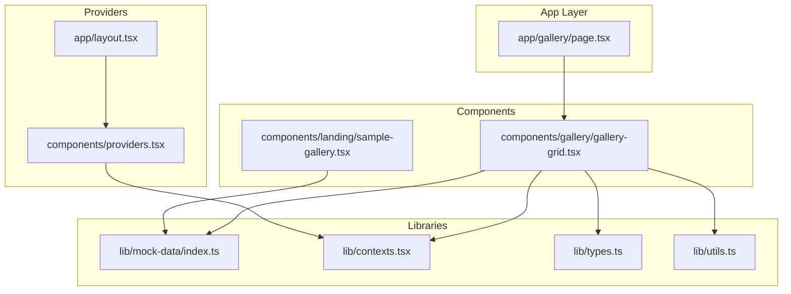
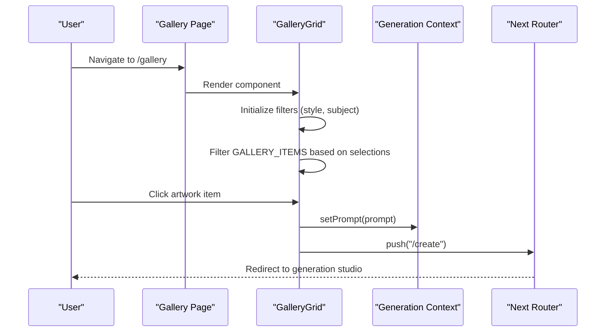
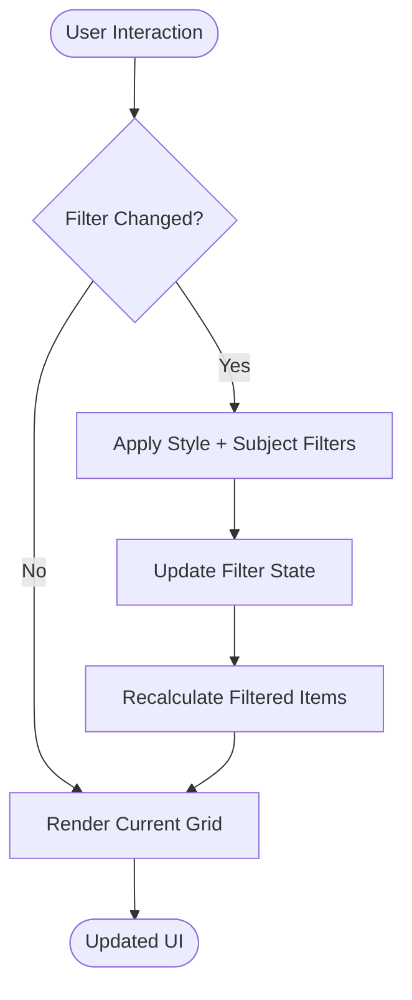
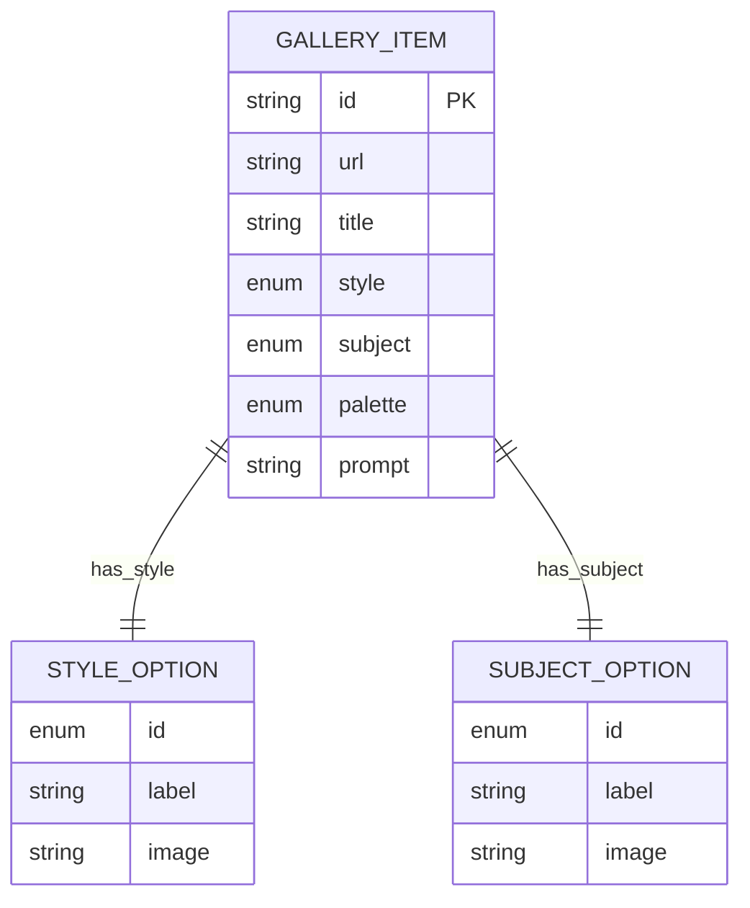
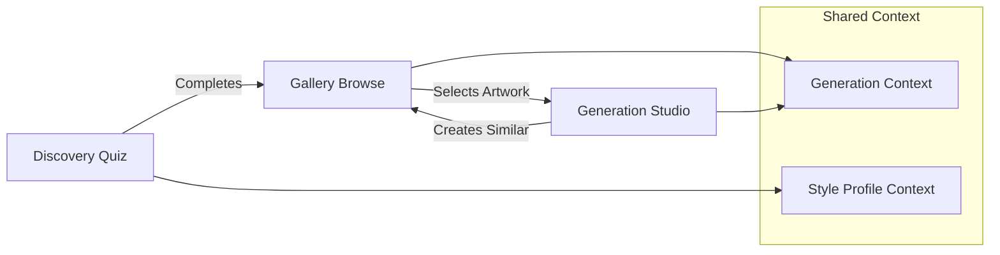
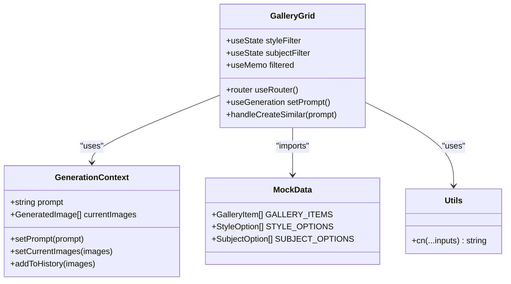

# Gallery System

<cite>
**Referenced Files in This Document**
- [gallery-grid.tsx](file://components/gallery/gallery-grid.tsx)
- [page.tsx](file://app/gallery/page.tsx)
- [index.ts](file://lib/mock-data/index.ts)
- [types.ts](file://lib/types.ts)
- [contexts.tsx](file://lib/contexts.tsx)
- [providers.tsx](file://components/providers.tsx)
- [layout.tsx](file://app/layout.tsx)
- [sample-gallery.tsx](file://components/landing/sample-gallery.tsx)
- [utils.ts](file://lib/utils.ts)
</cite>

## Table of Contents
1. [Introduction](#introduction)
2. [Project Structure](#project-structure)
3. [Core Components](#core-components)
4. [Architecture Overview](#architecture-overview)
5. [Detailed Component Analysis](#detailed-component-analysis)
6. [Dependency Analysis](#dependency-analysis)
7. [Performance Considerations](#performance-considerations)
8. [Troubleshooting Guide](#troubleshooting-guide)
9. [Conclusion](#conclusion)

## Introduction
The Gallery System is a curated digital showcase for AI-generated wall art, designed to inspire users and facilitate seamless transitions from discovery to creation. It features a responsive grid layout, intelligent filtering by artistic style and subject matter, and interactive browsing that enables users to tap any piece to generate similar artwork. The system integrates with the broader application ecosystem, connecting gallery browsing with the discovery quiz and generation studio workflows.

## Project Structure
The Gallery System is organized around a dedicated page component that renders a responsive grid of curated artwork items. The implementation leverages Next.js app routing, client-side state management, and shared mock data for demonstration purposes.

**Diagram sources**
- [page.tsx:1-11](file://app/gallery/page.tsx#L1-L11)
- [gallery-grid.tsx:1-156](file://components/gallery/gallery-grid.tsx#L1-L156)
- [index.ts:1-315](file://lib/mock-data/index.ts#L1-L315)
- [contexts.tsx:1-255](file://lib/contexts.tsx#L1-L255)
- [providers.tsx:1-14](file://components/providers.tsx#L1-L14)
- [layout.tsx:1-43](file://app/layout.tsx#L1-L43)
- [sample-gallery.tsx:1-65](file://components/landing/sample-gallery.tsx#L1-L65)

**Section sources**
- [page.tsx:1-11](file://app/gallery/page.tsx#L1-L11)
- [gallery-grid.tsx:1-156](file://components/gallery/gallery-grid.tsx#L1-L156)
- [index.ts:1-315](file://lib/mock-data/index.ts#L1-L315)
- [contexts.tsx:1-255](file://lib/contexts.tsx#L1-L255)
- [providers.tsx:1-14](file://components/providers.tsx#L1-L14)
- [layout.tsx:1-43](file://app/layout.tsx#L1-L43)

## Core Components
The Gallery System centers on a single-page component that orchestrates filtering, responsive grid rendering, and user interactions. Key responsibilities include:
- Rendering a responsive grid of curated artwork items
- Managing style and subject filters with visual feedback
- Handling user interactions to initiate artwork generation
- Integrating with the generation context to pass prompts seamlessly

**Section sources**
- [gallery-grid.tsx:30-156](file://components/gallery/gallery-grid.tsx#L30-L156)

## Architecture Overview
The Gallery System follows a layered architecture with clear separation of concerns:
- Presentation Layer: GalleryGrid component handles UI rendering and user interactions
- Data Layer: Mock data provides curated artwork items with consistent structure
- State Management: Generation context coordinates prompt passing and navigation
- Integration Layer: Layout and providers establish global state and routing

**Diagram sources**
- [page.tsx:8-10](file://app/gallery/page.tsx#L8-L10)
- [gallery-grid.tsx:30-47](file://components/gallery/gallery-grid.tsx#L30-L47)
- [contexts.tsx:160-162](file://lib/contexts.tsx#L160-L162)

## Detailed Component Analysis

### GalleryGrid Component
The GalleryGrid component serves as the primary interface for browsing curated artwork. It implements:
- Responsive grid layout using Tailwind CSS grid classes
- Interactive filtering system for style and subject categories
- Hover animations and visual feedback for enhanced UX
- Keyboard accessibility support for screen readers

#### Filtering System
The component maintains two independent filter states:
- Style filters: abstract, realistic, illustrated, surreal, minimal, all
- Subject filters: landscapes, florals, geometric, space, still-life, all

**Diagram sources**
- [gallery-grid.tsx:36-42](file://components/gallery/gallery-grid.tsx#L36-L42)

#### Responsive Grid Implementation
The grid adapts across breakpoints:
- Mobile: Single column with aspect ratio 4:5
- Tablet: Two columns with improved spacing
- Desktop: Three columns with enhanced visual density
- Large screens: Four columns maximizing content area

#### User Interaction Patterns
- Click/tap artwork to initiate generation with similar prompt
- Keyboard navigation support (Enter/Space keys)
- Visual feedback through hover states and animations
- Clear filter indicators with active state styling

**Section sources**
- [gallery-grid.tsx:12-28](file://components/gallery/gallery-grid.tsx#L12-L28)
- [gallery-grid.tsx:30-47](file://components/gallery/gallery-grid.tsx#L30-L47)
- [gallery-grid.tsx:110-144](file://components/gallery/gallery-grid.tsx#L110-L144)

### Mock Data Structure
The system relies on a centralized mock data structure that defines:
- Gallery items with consistent attributes (id, url, title, style, subject, palette, prompt)
- Supporting arrays for style and subject options
- Integration points for future API connectivity

**Diagram sources**
- [index.ts:83-169](file://lib/mock-data/index.ts#L83-L169)
- [index.ts:249-267](file://lib/mock-data/index.ts#L249-L267)

**Section sources**
- [index.ts:83-169](file://lib/mock-data/index.ts#L83-L169)
- [types.ts:113-121](file://lib/types.ts#L113-L121)

### Integration with Discovery and Generation
The Gallery System seamlessly connects with the broader application ecosystem:
- Discovery quiz completion routes users to gallery browsing
- Gallery interactions trigger generation studio navigation
- Shared context ensures consistent prompt flow across components

**Diagram sources**
- [contexts.tsx:71-158](file://lib/contexts.tsx#L71-L158)
- [contexts.tsx:1-255](file://lib/contexts.tsx#L1-L255)

**Section sources**
- [contexts.tsx:71-158](file://lib/contexts.tsx#L71-L158)
- [layout.tsx:34-36](file://app/layout.tsx#L34-L36)

## Dependency Analysis
The Gallery System exhibits strong cohesion within its component boundaries while maintaining loose coupling with external dependencies.

**Diagram sources**
- [gallery-grid.tsx:30-47](file://components/gallery/gallery-grid.tsx#L30-L47)
- [contexts.tsx:71-158](file://lib/contexts.tsx#L71-L158)
- [index.ts:83-169](file://lib/mock-data/index.ts#L83-L169)
- [utils.ts:4-6](file://lib/utils.ts#L4-L6)

**Section sources**
- [gallery-grid.tsx:3-10](file://components/gallery/gallery-grid.tsx#L3-L10)
- [contexts.tsx:71-158](file://lib/contexts.tsx#L71-L158)
- [index.ts:1-9](file://lib/mock-data/index.ts#L1-L9)

## Performance Considerations
The Gallery System implements several performance optimizations:
- Memoized filtering to prevent unnecessary re-renders
- Lazy loading through Next.js Image component with automatic optimization
- Responsive image sizing with appropriate breakpoints
- Efficient grid layout using CSS Grid for optimal rendering
- Minimal DOM manipulation with hover effects handled via CSS transitions

Key performance features:
- Filter calculations cached via useMemo
- Image optimization through Next.js Image component
- Responsive breakpoints for efficient rendering across devices
- Smooth animations using Framer Motion with optimized timing

**Section sources**
- [gallery-grid.tsx:36-42](file://components/gallery/gallery-grid.tsx#L36-L42)
- [gallery-grid.tsx:125-131](file://components/gallery/gallery-grid.tsx#L125-L131)

## Troubleshooting Guide
Common issues and solutions for the Gallery System:

### Filter Not Working
- Verify filter state updates are triggered correctly
- Check that filter IDs match the expected enum values
- Ensure filtered array computation accounts for both filters

### Image Loading Issues
- Confirm image URLs are accessible and properly formatted
- Verify Next.js Image component configuration
- Check responsive sizing attributes for different breakpoints

### Navigation Problems
- Validate router configuration and route availability
- Ensure prompt context is properly initialized
- Check for navigation blocking during state updates

### Responsive Layout Issues
- Verify Tailwind CSS grid classes are correctly applied
- Test breakpoint configurations across different screen sizes
- Confirm aspect ratio classes maintain consistent proportions

**Section sources**
- [gallery-grid.tsx:36-42](file://components/gallery/gallery-grid.tsx#L36-L42)
- [gallery-grid.tsx:125-131](file://components/gallery/gallery-grid.tsx#L125-L131)

## Conclusion
The Gallery System provides a robust foundation for showcasing AI-generated artwork while maintaining seamless integration with the broader application ecosystem. Its responsive design, efficient filtering system, and smooth user interactions create an engaging browsing experience that naturally transitions users into the generation workflow. The modular architecture and clear separation of concerns enable easy maintenance and future enhancements, including integration with real APIs and expanded filtering capabilities.