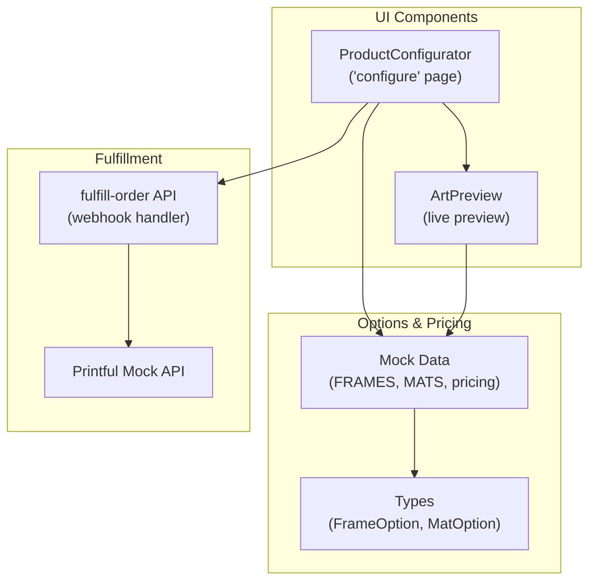
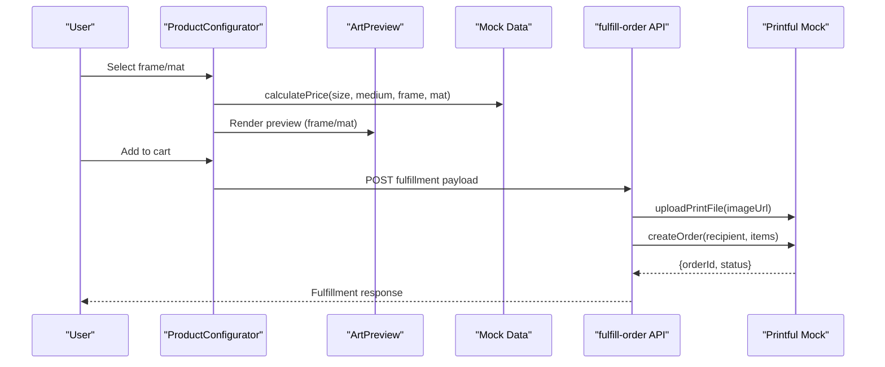
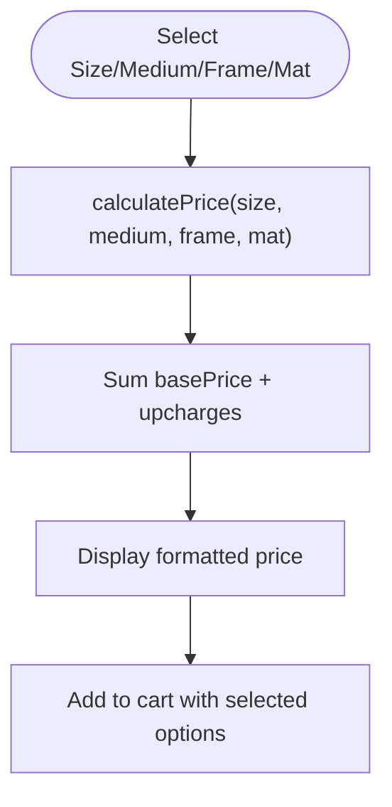
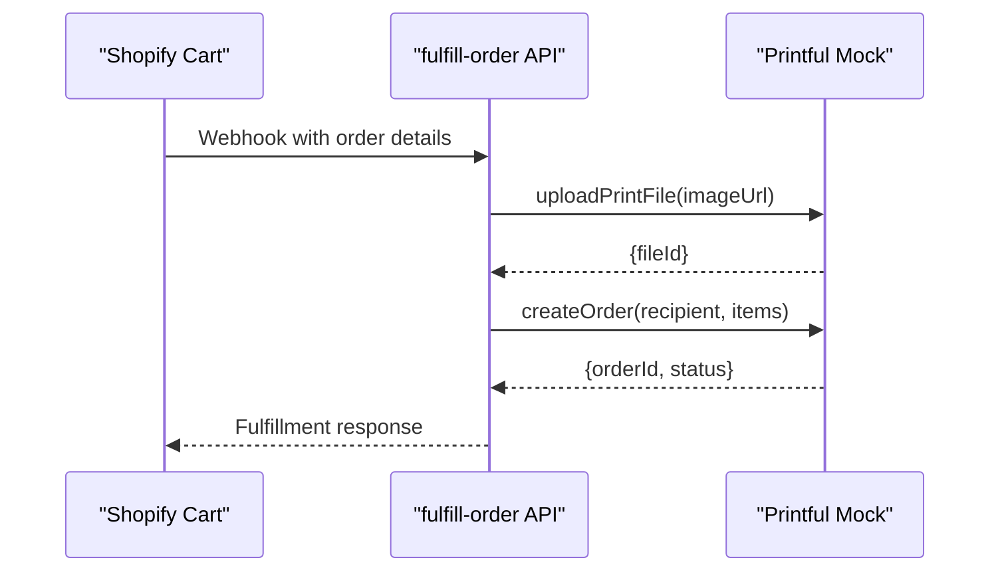
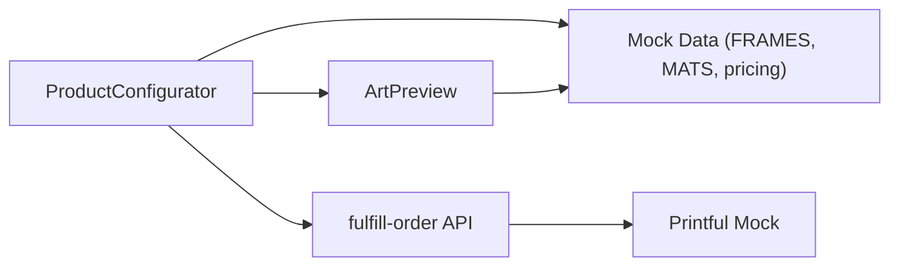

# Frame & Mat Selection

<cite>
**Referenced Files in This Document**
- [product-configurator.tsx](file://components/configure/product-configurator.tsx)
- [art-preview.tsx](file://components/configure/art-preview.tsx)
- [index.ts](file://lib/mock-data/index.ts)
- [types.ts](file://lib/types.ts)
- [route.ts](file://app/api/fulfill-order/route.ts)
- [printful-mock.ts](file://lib/printful-mock.ts)
- [README.md](file://README.md)
</cite>

## Table of Contents
1. [Introduction](#introduction)
2. [Project Structure](#project-structure)
3. [Core Components](#core-components)
4. [Architecture Overview](#architecture-overview)
5. [Detailed Component Analysis](#detailed-component-analysis)
6. [Dependency Analysis](#dependency-analysis)
7. [Performance Considerations](#performance-considerations)
8. [Troubleshooting Guide](#troubleshooting-guide)
9. [Conclusion](#conclusion)

## Introduction
This document explains the Frame and Mat selection system used in the product configurator. It covers available frame styles and materials, mat options and archival quality considerations, pricing tiers, visual impact of combinations, and integration with Printful fulfillment and shipping. It also provides guidance on seasonal trends and customer preference patterns based on the available options.

## Project Structure
The Frame and Mat selection spans three primary areas:
- UI configuration controls and preview rendering
- Static option definitions and pricing logic
- Fulfillment pipeline for print-on-demand orders

**Diagram sources**
- [product-configurator.tsx:186-278](file://components/configure/product-configurator.tsx#L186-L278)
- [art-preview.tsx:44-84](file://components/configure/art-preview.tsx#L44-L84)
- [index.ts:29-44](file://lib/mock-data/index.ts#L29-L44)
- [types.ts:68-79](file://lib/types.ts#L68-L79)
- [route.ts:1-38](file://app/api/fulfill-order/route.ts#L1-L38)
- [printful-mock.ts:1-76](file://lib/printful-mock.ts#L1-L76)

**Section sources**
- [product-configurator.tsx:186-278](file://components/configure/product-configurator.tsx#L186-L278)
- [art-preview.tsx:44-84](file://components/configure/art-preview.tsx#L44-L84)
- [index.ts:29-44](file://lib/mock-data/index.ts#L29-L44)
- [types.ts:68-79](file://lib/types.ts#L68-L79)
- [README.md:136-146](file://README.md#L136-L146)

## Core Components
- Frame selection: Supports six styles with distinct visual characteristics and upcharges.
- Mat selection: Three options (None, White, Off-White) with a modest upcharge.
- Pricing: Dynamic calculation combining base size price, medium upcharge, frame upcharge, and mat upcharge.
- Preview: Real-time visualization of frame and mat effects in three modes (Art Only, Room View, Detail).

Key capabilities:
- Frame styles include color, material feel, and visual depth cues.
- Mat colors provide contrast and separation between artwork and frame.
- Archival quality is indicated by the chosen medium; fine art paper is described as archival.
- Shipping is free in the UI; fulfillment integrates with Printful for print-on-demand.

**Section sources**
- [product-configurator.tsx:186-242](file://components/configure/product-configurator.tsx#L186-L242)
- [art-preview.tsx:44-84](file://components/configure/art-preview.tsx#L44-L84)
- [index.ts:29-44](file://lib/mock-data/index.ts#L29-L44)
- [index.ts:287-294](file://lib/mock-data/index.ts#L287-L294)

## Architecture Overview
The Frame and Mat selection participates in a broader workflow:
- User selects frame and mat in the configurator.
- The configurator computes total price and prepares cart data.
- On checkout, a fulfillment webhook triggers Printful integration for print and shipping.

**Diagram sources**
- [product-configurator.tsx:44-69](file://components/configure/product-configurator.tsx#L44-L69)
- [index.ts:287-294](file://lib/mock-data/index.ts#L287-L294)
- [art-preview.tsx:44-84](file://components/configure/art-preview.tsx#L44-L84)
- [route.ts:11-37](file://app/api/fulfill-order/route.ts#L11-L37)
- [printful-mock.ts:38-61](file://lib/printful-mock.ts#L38-L61)

## Detailed Component Analysis

### Frame Styles, Materials, Colors, and Upcharges
Available frames:
- None: No frame; lowest cost option.
- Black: Modern, sleek appearance with dark tone.
- White: Clean, bright look for light walls.
- Natural Wood: Wood-grain aesthetic with earthy tone.
- Walnut: Rich, dark wood tone for contemporary spaces.
- Gallery Float: Shadow gap effect for modern display.

Visual characteristics:
- Each frame defines border width, border color, and optional background gradient.
- Floating frame style uses a specialized border radius and spacing.

Pricing:
- Each frame has an associated upcharge applied to the base size price.
- Selection updates the total price and preview accordingly.

Integration note:
- Selecting "None" frame automatically disables mat selection.

**Section sources**
- [index.ts:29-37](file://lib/mock-data/index.ts#L29-L37)
- [art-preview.tsx:44-84](file://components/configure/art-preview.tsx#L44-L84)
- [product-configurator.tsx:186-215](file://components/configure/product-configurator.tsx#L186-L215)

### Mat Selection: Colors, Widths, and Archival Quality
Available mats:
- None: Direct-to-wall presentation.
- White: Classic, high-contrast mat.
- Off-White: Subtly softer contrast than white.

Visual impact:
- Mats create a buffer between the artwork and frame, emphasizing the piece.
- White and Off-White provide different tonal contrasts depending on wall color and lighting.

Archival quality:
- Archival quality is determined by the chosen medium (e.g., Fine Art Paper).
- The mat itself does not alter archival properties; focus the archival choice on the medium.

Pricing:
- Mats incur a small upcharge above the base price.

Constraints:
- Mat selection is only enabled when a frame is selected.

**Section sources**
- [index.ts:39-44](file://lib/mock-data/index.ts#L39-L44)
- [product-configurator.tsx:217-242](file://components/configure/product-configurator.tsx#L217-L242)
- [art-preview.tsx:163-194](file://components/configure/art-preview.tsx#L163-L194)

### Pricing Tiers and Calculation
Pricing model:
- Total = Base size price + Medium upcharge + Frame upcharge + Mat upcharge.
- Prices are stored internally in cents and formatted for display.

Examples (from mock data):
- Size base prices range from small to large formats.
- Mediums include Fine Art Paper (archival), Canvas, Acrylic, and Metal with increasing upcharges.
- Frames add incremental premiums based on material and style.
- Mats add a modest premium.

**Diagram sources**
- [index.ts:287-294](file://lib/mock-data/index.ts#L287-L294)
- [product-configurator.tsx:38-39](file://components/configure/product-configurator.tsx#L38-L39)

**Section sources**
- [index.ts:287-294](file://lib/mock-data/index.ts#L287-L294)
- [product-configurator.tsx:244-272](file://components/configure/product-configurator.tsx#L244-L272)

### Visual Impact of Frame and Mat Combinations
Preview modes:
- Art Only: Focus on the framed artwork at various sizes.
- Room View: Art displayed on a mock wall in a room setting.
- Detail: Close-up view of the frame and mat edges.

Frame and mat effects:
- Black and Walnut frames provide strong contrast against light mats.
- White and Off-White mats brighten dark frames.
- Natural Wood frames pair well with neutral or white mats for a warm, organic look.
- Gallery Float creates a modern, elevated presentation with visible spacing behind the artwork.

Size scaling:
- Larger sizes are proportionally scaled for realistic preview sizing.

**Section sources**
- [art-preview.tsx:118-351](file://components/configure/art-preview.tsx#L118-L351)
- [art-preview.tsx:44-84](file://components/configure/art-preview.tsx#L44-L84)

### Examples of Popular Combinations and Trends
Recommended combinations:
- Classic white frame with white mat on Fine Art Paper for traditional, gallery-like presentation.
- Black frame with off-white mat for contemporary contrast in modern interiors.
- Natural Wood frame with off-white mat for a warm, organic balance.
- Walnut frame with white mat for rich contrast in contemporary spaces.
- Gallery Float with Fine Art Paper for a minimalist, elevated look.

Seasonal considerations:
- Lighter frames and mats (white/off-white) tend to suit spring/summer aesthetics.
- Darker frames (black/walnut) complement fall/winter decor.
- Natural wood tones offer year-round versatility across seasons.

Customer preference patterns:
- Traditional customers often prefer white frames and white mats.
- Modern customers frequently choose black or walnut frames with off-white mats.
- Eco-conscious customers may emphasize archival Fine Art Paper regardless of frame choice.

[No sources needed since this section synthesizes patterns from the available options]

### Integration with Printful Fulfillment and Shipping
Fulfillment flow:
- On checkout, the fulfillment endpoint receives the image URL, recipient, variant ID, and retail price.
- The system uploads the print-ready file to Printful and creates an order.
- Printful handles printing, packaging, shipping, and tracking.

Shipping:
- The UI indicates free shipping for the configured item.
- Fulfillment via Printful manages domestic and international shipping according to Printful’s service tiers.

**Diagram sources**
- [route.ts:11-37](file://app/api/fulfill-order/route.ts#L11-L37)
- [printful-mock.ts:38-61](file://lib/printful-mock.ts#L38-L61)

**Section sources**
- [route.ts:1-38](file://app/api/fulfill-order/route.ts#L1-L38)
- [printful-mock.ts:1-76](file://lib/printful-mock.ts#L1-L76)
- [product-configurator.tsx:258-261](file://components/configure/product-configurator.tsx#L258-L261)

## Dependency Analysis
Relationships among components:
- ProductConfigurator depends on mock data for options and pricing helpers.
- ArtPreview consumes frame styles and mat colors to render visuals.
- Fulfillment API depends on Printful mock for order creation.

**Diagram sources**
- [product-configurator.tsx:186-278](file://components/configure/product-configurator.tsx#L186-L278)
- [art-preview.tsx:44-84](file://components/configure/art-preview.tsx#L44-L84)
- [index.ts:29-44](file://lib/mock-data/index.ts#L29-L44)
- [route.ts:1-38](file://app/api/fulfill-order/route.ts#L1-L38)
- [printful-mock.ts:1-76](file://lib/printful-mock.ts#L1-L76)

**Section sources**
- [product-configurator.tsx:186-278](file://components/configure/product-configurator.tsx#L186-L278)
- [art-preview.tsx:44-84](file://components/configure/art-preview.tsx#L44-L84)
- [index.ts:29-44](file://lib/mock-data/index.ts#L29-L44)
- [route.ts:1-38](file://app/api/fulfill-order/route.ts#L1-L38)

## Performance Considerations
- Preview rendering uses lightweight CSS transforms and gradients; performance remains responsive across devices.
- Image scaling is handled via aspect ratios and proportional sizing to avoid heavy computations.
- Pricing calculations are constant-time lookups and summations, minimizing overhead.

[No sources needed since this section provides general guidance]

## Troubleshooting Guide
Common issues and resolutions:
- Mat selection disabled: Ensure a frame is selected before enabling mat options.
- Unexpected price changes: Verify the selected size, medium, frame, and mat align with the intended configuration.
- Preview not updating: Confirm the preview mode and selected room are correctly set.
- Fulfillment errors: Check that the image URL is valid and the Printful mock responses are reachable.

**Section sources**
- [product-configurator.tsx:186-242](file://components/configure/product-configurator.tsx#L186-L242)
- [art-preview.tsx:118-351](file://components/configure/art-preview.tsx#L118-L351)
- [route.ts:11-37](file://app/api/fulfill-order/route.ts#L11-L37)

## Conclusion
The Frame and Mat selection system offers a curated set of options designed to enhance artwork presentation while maintaining simplicity and transparency. With clear visual previews, straightforward pricing, and seamless integration with Printful fulfillment, customers can confidently configure their ideal framed or float-mounted prints. By aligning frame and mat choices with room aesthetics and archival priorities, the system supports both traditional and contemporary tastes across seasons.