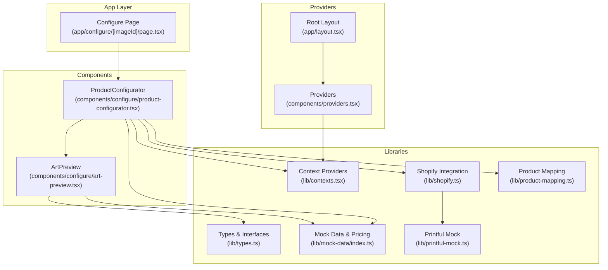
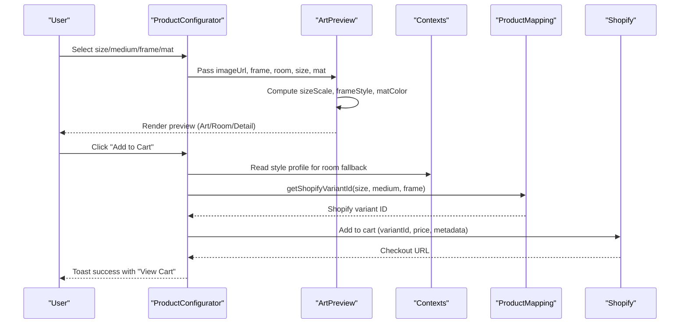
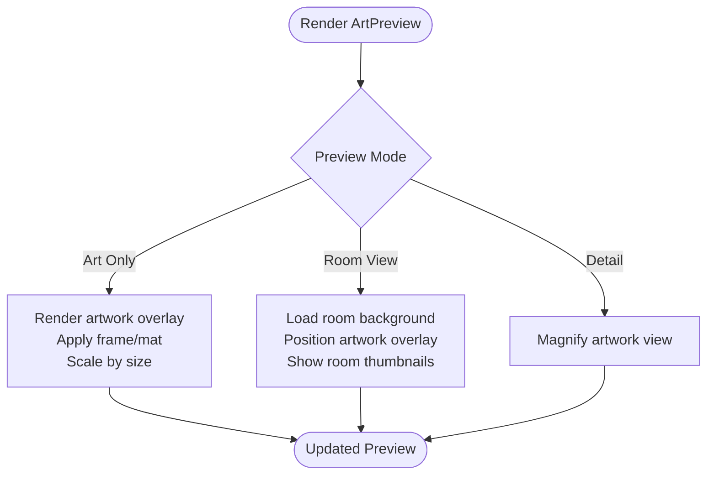
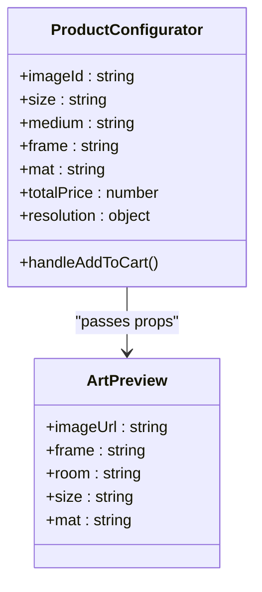
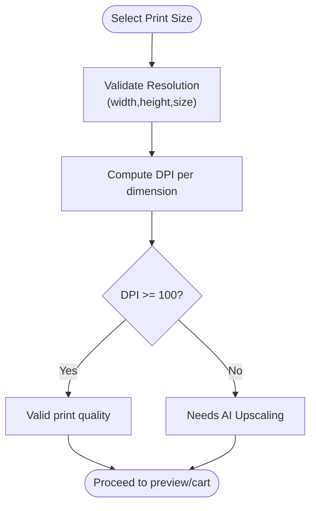
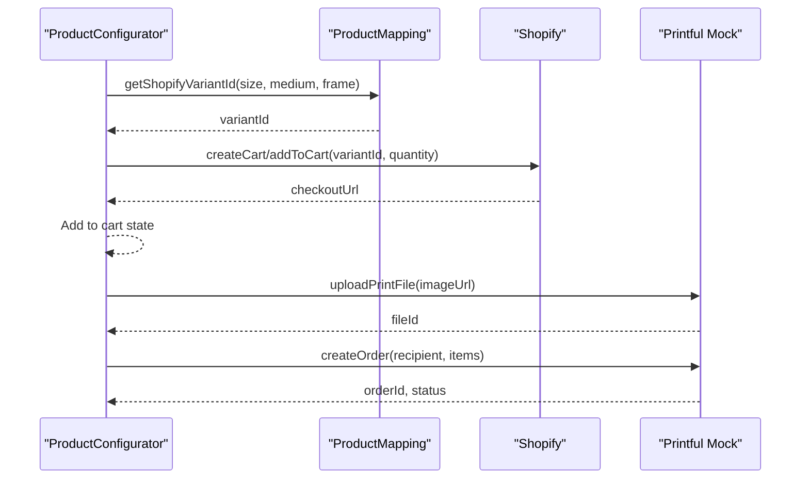
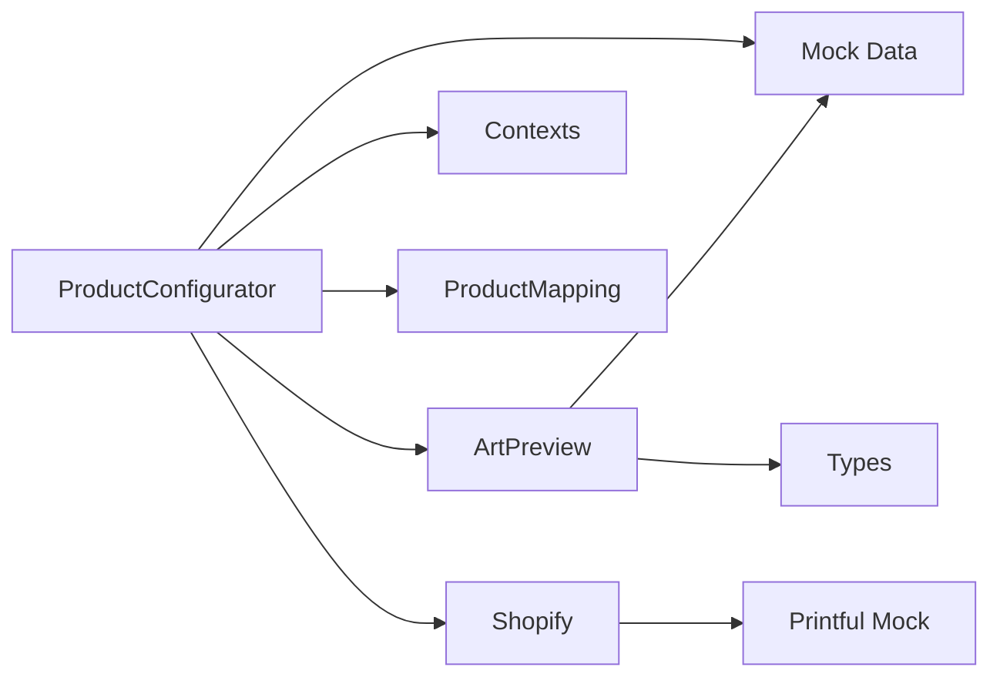

# Live Preview System

<cite>
**Referenced Files in This Document**
- [art-preview.tsx](file://components/configure/art-preview.tsx)
- [product-configurator.tsx](file://components/configure/product-configurator.tsx)
- [page.tsx](file://app/configure/[imageId]/page.tsx)
- [types.ts](file://lib/types.ts)
- [mock-data/index.ts](file://lib/mock-data/index.ts)
- [contexts.tsx](file://lib/contexts.tsx)
- [providers.tsx](file://components/providers.tsx)
- [layout.tsx](file://app/layout.tsx)
- [shopify.ts](file://lib/shopify.ts)
- [product-mapping.ts](file://lib/product-mapping.ts)
- [printful-mock.ts](file://lib/printful-mock.ts)
</cite>

## Table of Contents
1. [Introduction](#introduction)
2. [Project Structure](#project-structure)
3. [Core Components](#core-components)
4. [Architecture Overview](#architecture-overview)
5. [Detailed Component Analysis](#detailed-component-analysis)
6. [Dependency Analysis](#dependency-analysis)
7. [Performance Considerations](#performance-considerations)
8. [Troubleshooting Guide](#troubleshooting-guide)
9. [Conclusion](#conclusion)

## Introduction
This document describes the Live Preview system that enables real-time rendering of artwork configurations. It covers how users can instantly see their selected print size, medium, frame, and matting options applied to their chosen artwork, including mockup room integration and visual feedback mechanisms. The system also documents the preview canvas functionality, image scaling algorithms, positioning logic, and how configuration changes trigger immediate updates. Additionally, it explains integration points with Shopify product data and Printful fulfillment previews, along with loading states and error handling strategies.

## Project Structure
The Live Preview system spans several layers:
- UI components for configuration and preview
- Context providers for global state
- Type definitions and mock data for options and pricing
- Integration libraries for Shopify and Printful

**Diagram sources**
- [page.tsx:1-12](file://app/configure/[imageId]/page.tsx#L1-L12)
- [product-configurator.tsx:1-279](file://components/configure/product-configurator.tsx#L1-L279)
- [art-preview.tsx:1-354](file://components/configure/art-preview.tsx#L1-L354)
- [types.ts:1-132](file://lib/types.ts#L1-L132)
- [mock-data/index.ts:1-315](file://lib/mock-data/index.ts#L1-L315)
- [contexts.tsx:1-255](file://lib/contexts.tsx#L1-L255)
- [providers.tsx:1-14](file://components/providers.tsx#L1-L14)
- [layout.tsx:1-43](file://app/layout.tsx#L1-L43)
- [shopify.ts:1-303](file://lib/shopify.ts#L1-L303)
- [product-mapping.ts:1-68](file://lib/product-mapping.ts#L1-L68)
- [printful-mock.ts:1-77](file://lib/printful-mock.ts#L1-L77)

**Section sources**
- [page.tsx:1-12](file://app/configure/[imageId]/page.tsx#L1-L12)
- [layout.tsx:1-43](file://app/layout.tsx#L1-L43)
- [providers.tsx:1-14](file://components/providers.tsx#L1-L14)

## Core Components
- ArtPreview: Renders the live preview in three modes (Art Only, Room View, Detail), applies frame/mat sizing, and positions the artwork within room mockups.
- ProductConfigurator: Orchestrates configuration selection (size, medium, frame, mat), computes pricing, resolves Shopify variant IDs, and integrates with the preview canvas.
- Context Providers: Manage global state for style profiles, generated images, and cart items.
- Type Definitions and Mock Data: Define option sets, pricing helpers, and product variant mappings.
- Shopify Integration: Provides storefront API client and cart operations for fulfillment.
- Printful Integration: Mock fulfillment service for order creation and status checks.

**Section sources**
- [art-preview.tsx:86-354](file://components/configure/art-preview.tsx#L86-L354)
- [product-configurator.tsx:19-279](file://components/configure/product-configurator.tsx#L19-L279)
- [contexts.tsx:1-255](file://lib/contexts.tsx#L1-L255)
- [types.ts:54-132](file://lib/types.ts#L54-L132)
- [mock-data/index.ts:1-315](file://lib/mock-data/index.ts#L1-L315)
- [shopify.ts:1-303](file://lib/shopify.ts#L1-L303)
- [printful-mock.ts:1-77](file://lib/printful-mock.ts#L1-L77)

## Architecture Overview
The Live Preview system follows a reactive architecture:
- Configuration changes in ProductConfigurator update local state and pass props to ArtPreview.
- ArtPreview renders the appropriate preview mode and applies frame/mat styles and size scaling.
- When adding to cart, ProductConfigurator resolves a Shopify variant ID and dispatches a cart item with the current configuration.
- Shopify integration handles cart creation and checkout, while Printful mock demonstrates fulfillment flow.

**Diagram sources**
- [product-configurator.tsx:44-69](file://components/configure/product-configurator.tsx#L44-L69)
- [art-preview.tsx:86-116](file://components/configure/art-preview.tsx#L86-L116)
- [contexts.tsx:67-69](file://lib/contexts.tsx#L67-L69)
- [product-mapping.ts:37-49](file://lib/product-mapping.ts#L37-L49)
- [shopify.ts:108-157](file://lib/shopify.ts#L108-L157)

## Detailed Component Analysis

### ArtPreview Component
ArtPreview renders the live preview with three modes:
- Art Only: Displays the artwork with optional mat and frame overlays, scaled according to print size.
- Room View: Shows the artwork positioned on a wall mockup of a selected room, with navigation between room thumbnails.
- Detail: Provides a magnified view of the artwork for close inspection.

Key behaviors:
- Preview mode tabs switch between views with animated transitions.
- Size scaling uses predefined scale factors mapped to print sizes.
- Frame styles are applied via computed CSS properties, including borders, shadows, and backgrounds.
- Matting adds a colored layer behind the artwork when applicable.
- Room positioning centers the artwork with a fixed vertical offset for realistic placement.
- Room thumbnails allow quick switching between mockup rooms.

**Diagram sources**
- [art-preview.tsx:86-354](file://components/configure/art-preview.tsx#L86-L354)

**Section sources**
- [art-preview.tsx:86-354](file://components/configure/art-preview.tsx#L86-L354)

### ProductConfigurator Component
ProductConfigurator manages the configuration workflow:
- Resolves the selected image from generation context or gallery fallback.
- Maintains configuration state (size, medium, frame, mat) and recomputes total price and resolution validation.
- Integrates with ArtPreview to reflect real-time changes.
- Adds items to cart with resolved Shopify variant IDs and metadata.
- Provides visual feedback via toast notifications and animated transitions.

**Diagram sources**
- [product-configurator.tsx:19-279](file://components/configure/product-configurator.tsx#L19-L279)
- [art-preview.tsx:86-116](file://components/configure/art-preview.tsx#L86-L116)

**Section sources**
- [product-configurator.tsx:19-279](file://components/configure/product-configurator.tsx#L19-L279)

### Configuration State and Resolution Validation
The system validates image resolution against the selected print size and indicates whether AI upsampling will occur:
- Resolution validation computes DPI in width and height and determines validity and upscaling needs.
- The configurator displays a user-friendly notice when upscaling is required.

**Diagram sources**
- [mock-data/index.ts:300-315](file://lib/mock-data/index.ts#L300-L315)

**Section sources**
- [mock-data/index.ts:300-315](file://lib/mock-data/index.ts#L300-L315)

### Shopify Integration and Printful Fulfillment
- ProductConfigurator resolves a Shopify variant ID based on the current configuration.
- When adding to cart, the system uses the Shopify storefront API to create or update a cart with the variant and metadata.
- Printful mock demonstrates the file upload and order creation flow for fulfillment.

**Diagram sources**
- [product-configurator.tsx:44-69](file://components/configure/product-configurator.tsx#L44-L69)
- [product-mapping.ts:37-49](file://lib/product-mapping.ts#L37-L49)
- [shopify.ts:108-157](file://lib/shopify.ts#L108-L157)
- [printful-mock.ts:38-61](file://lib/printful-mock.ts#L38-L61)

**Section sources**
- [product-mapping.ts:37-49](file://lib/product-mapping.ts#L37-L49)
- [shopify.ts:108-157](file://lib/shopify.ts#L108-L157)
- [printful-mock.ts:38-61](file://lib/printful-mock.ts#L38-L61)

## Dependency Analysis
The Live Preview system exhibits clear separation of concerns:
- UI components depend on mock data and types for configuration options.
- Context providers supply global state to components.
- Integration libraries encapsulate external API interactions.
- The configuration component orchestrates data flow between UI, state, and integrations.

**Diagram sources**
- [product-configurator.tsx:1-279](file://components/configure/product-configurator.tsx#L1-L279)
- [art-preview.tsx:1-354](file://components/configure/art-preview.tsx#L1-L354)
- [mock-data/index.ts:1-315](file://lib/mock-data/index.ts#L1-L315)
- [types.ts:1-132](file://lib/types.ts#L1-L132)
- [contexts.tsx:1-255](file://lib/contexts.tsx#L1-L255)
- [product-mapping.ts:1-68](file://lib/product-mapping.ts#L1-L68)
- [shopify.ts:1-303](file://lib/shopify.ts#L1-L303)
- [printful-mock.ts:1-77](file://lib/printful-mock.ts#L1-L77)

**Section sources**
- [product-configurator.tsx:1-279](file://components/configure/product-configurator.tsx#L1-L279)
- [art-preview.tsx:1-354](file://components/configure/art-preview.tsx#L1-L354)
- [contexts.tsx:1-255](file://lib/contexts.tsx#L1-L255)

## Performance Considerations
- Image rendering: Next.js Image component with fill and sizes ensures responsive, optimized rendering across breakpoints.
- Animation: Framer Motion animations use simple transforms and opacity changes for smooth transitions without heavy recalculations.
- State updates: Local state updates in ProductConfigurator trigger re-renders only for affected components, minimizing unnecessary work.
- Scaling: Size scaling is precomputed and applied via inline styles, avoiding expensive layout shifts.
- Room positioning: Absolute positioning with fixed offsets reduces layout thrashing during mode switches.

[No sources needed since this section provides general guidance]

## Troubleshooting Guide
Common issues and resolutions:
- Missing Shopify credentials: The Shopify client throws explicit errors when required environment variables are missing. Verify domain and storefront access token configuration.
- Unconfigured product variants: Product mapping warns when variant IDs are placeholders and falls back to mock IDs. Replace placeholder IDs with actual Shopify variant IDs.
- Empty image context: If no selected image exists, the configurator prompts the user to generate or browse the gallery.
- Resolution warnings: When DPI is below threshold, the configurator advises AI upscaling; users can choose larger print sizes or higher-resolution source images.

**Section sources**
- [shopify.ts:17-70](file://lib/shopify.ts#L17-L70)
- [product-mapping.ts:37-49](file://lib/product-mapping.ts#L37-L49)
- [product-configurator.tsx:71-86](file://components/configure/product-configurator.tsx#L71-L86)
- [mock-data/index.ts:300-315](file://lib/mock-data/index.ts#L300-L315)

## Conclusion
The Live Preview system delivers a seamless, real-time configuration experience by combining reactive UI updates, precise image scaling, and realistic room mockups. It integrates cleanly with Shopify for cart operations and Printful for fulfillment simulation. The modular architecture, clear state management, and robust error handling ensure maintainability and reliability across preview scenarios.