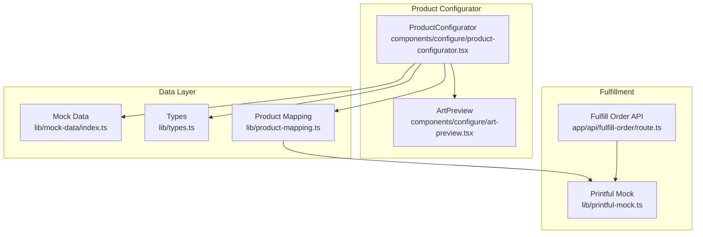
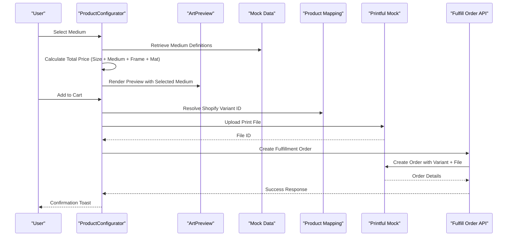
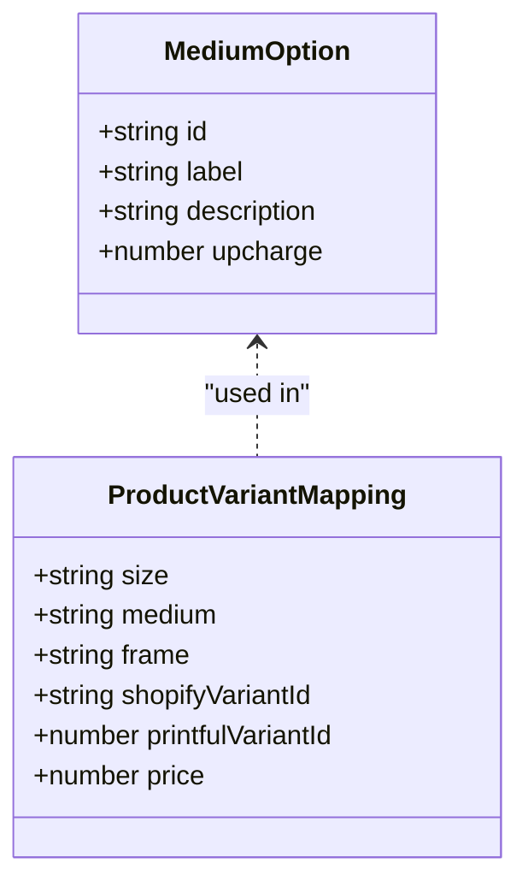
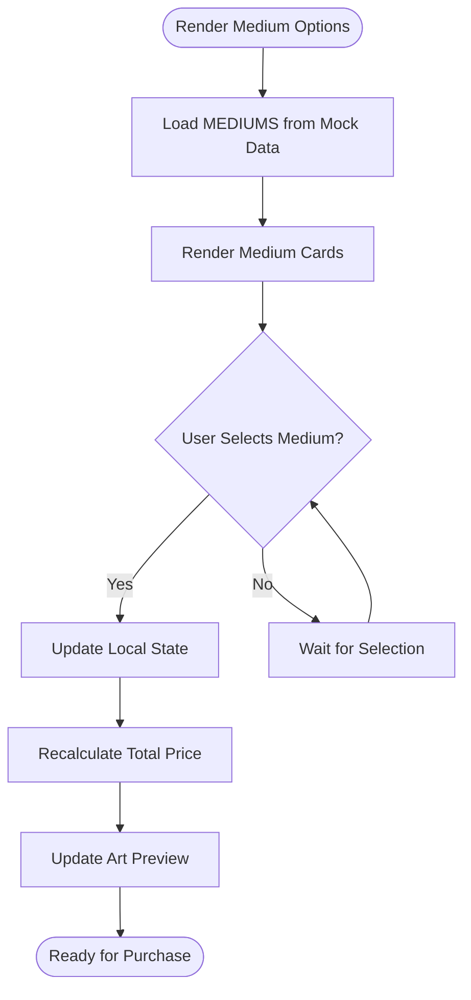
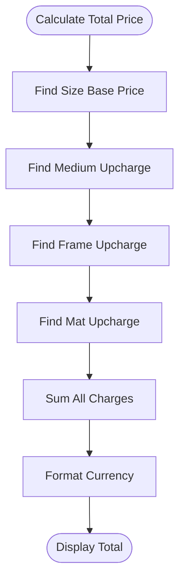
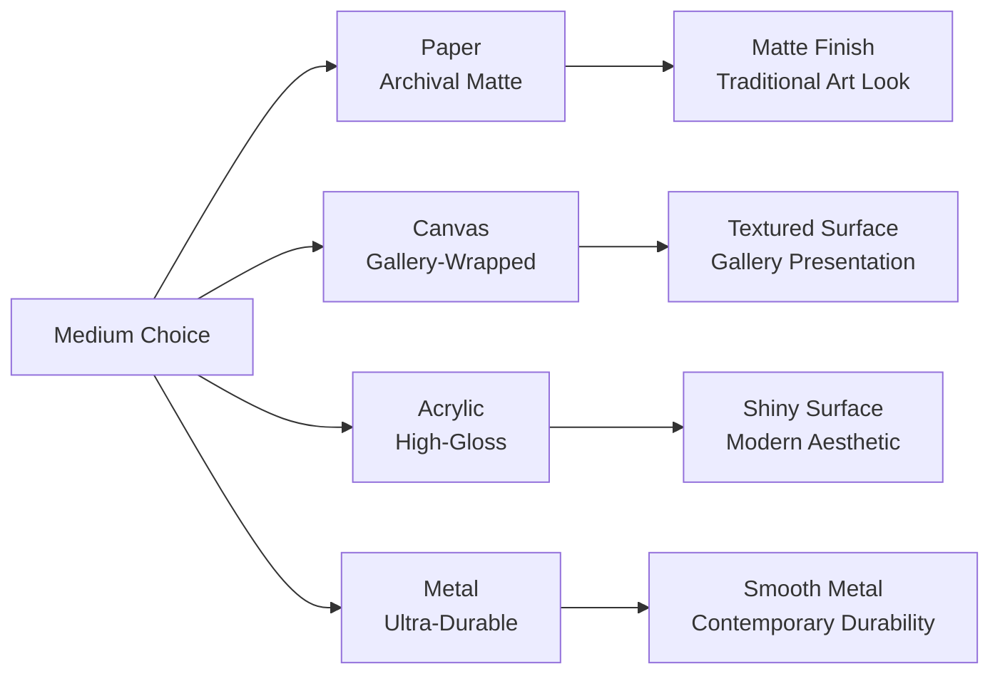
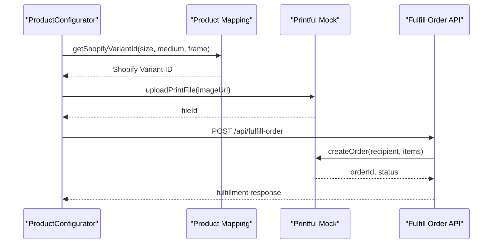
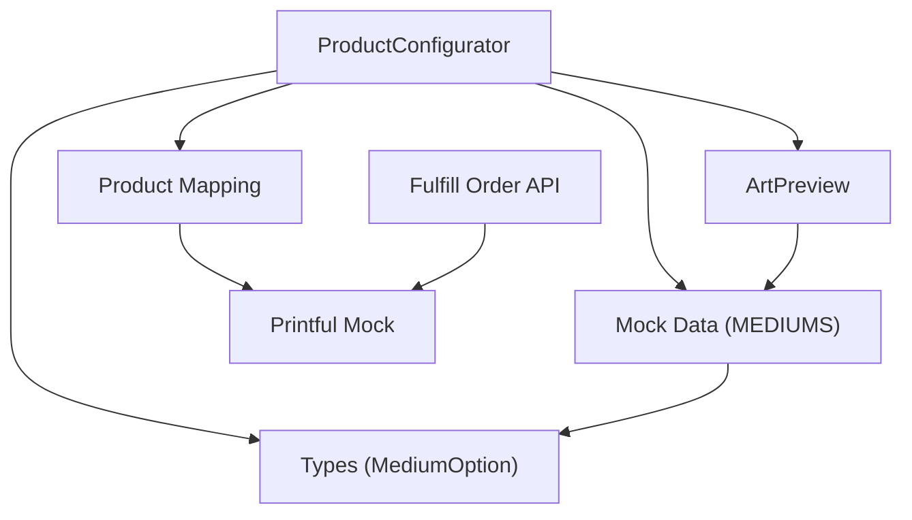

# Medium Options

<cite>
**Referenced Files in This Document**
- [product-configurator.tsx](file://components/configure/product-configurator.tsx)
- [art-preview.tsx](file://components/configure/art-preview.tsx)
- [index.ts](file://lib/mock-data/index.ts)
- [types.ts](file://lib/types.ts)
- [product-mapping.ts](file://lib/product-mapping.ts)
- [printful-mock.ts](file://lib/printful-mock.ts)
- [route.ts](file://app/api/fulfill-order/route.ts)
- [README.md](file://README.md)
</cite>

## Table of Contents
1. [Introduction](#introduction)
2. [Project Structure](#project-structure)
3. [Core Components](#core-components)
4. [Architecture Overview](#architecture-overview)
5. [Detailed Component Analysis](#detailed-component-analysis)
6. [Dependency Analysis](#dependency-analysis)
7. [Performance Considerations](#performance-considerations)
8. [Troubleshooting Guide](#troubleshooting-guide)
9. [Conclusion](#conclusion)

## Introduction
This document provides comprehensive documentation for Medium Options in the Product Configurator. It covers the available printing mediums (Fine Art Paper, Canvas, Acrylic, Metal), their characteristics, pricing differences, and quality specifications. It documents the medium selection logic, availability validation, and how different mediums affect artwork presentation. The guide includes examples of medium-specific features, durability considerations, and customer preferences, along with integration details for the Printful product catalog and inventory validation.

## Project Structure
Medium options are implemented within the Product Configurator component and supporting libraries. The configurator presents medium choices to users, validates selections, and integrates with the Shopify product mapping and Printful fulfillment pipeline.

**Diagram sources**
- [product-configurator.tsx:1-279](file://components/configure/product-configurator.tsx#L1-L279)
- [art-preview.tsx:1-354](file://components/configure/art-preview.tsx#L1-L354)
- [index.ts:1-315](file://lib/mock-data/index.ts#L1-L315)
- [types.ts:54-88](file://lib/types.ts#L54-L88)
- [product-mapping.ts:1-68](file://lib/product-mapping.ts#L1-L68)
- [printful-mock.ts:1-77](file://lib/printful-mock.ts#L1-L77)
- [route.ts:1-38](file://app/api/fulfill-order/route.ts#L1-L38)

**Section sources**
- [product-configurator.tsx:1-279](file://components/configure/product-configurator.tsx#L1-L279)
- [index.ts:21-27](file://lib/mock-data/index.ts#L21-L27)
- [types.ts:61-66](file://lib/types.ts#L61-L66)

## Core Components
Medium options are defined as structured data and rendered in the Product Configurator UI. Each medium includes an identifier, display label, description, and price upcharge.

- Medium definition structure:
  - id: Unique identifier for the medium
  - label: Display name shown to users
  - description: Quality and finish characteristics
  - upcharge: Additional cost in cents

Available mediums:
- Fine Art Paper: Museum-quality archival matte (no upcharge)
- Canvas: Gallery-wrapped, ready to hang (upcharge applies)
- Acrylic: High-gloss modern finish (upcharge applies)
- Metal: Contemporary ultra-durable (upcharge applies)

Medium selection logic:
- Users choose one medium during configuration
- The selected medium contributes to the total price calculation
- The medium affects the visual presentation in the Art Preview component

**Section sources**
- [index.ts:21-27](file://lib/mock-data/index.ts#L21-L27)
- [types.ts:61-66](file://lib/types.ts#L61-L66)
- [product-configurator.tsx:154-184](file://components/configure/product-configurator.tsx#L154-L184)

## Architecture Overview
The medium selection workflow integrates UI configuration, data validation, price calculation, and fulfillment preparation.

**Diagram sources**
- [product-configurator.tsx:44-69](file://components/configure/product-configurator.tsx#L44-L69)
- [index.ts:288-294](file://lib/mock-data/index.ts#L288-L294)
- [art-preview.tsx:86-98](file://components/configure/art-preview.tsx#L86-L98)
- [product-mapping.ts:37-49](file://lib/product-mapping.ts#L37-L49)
- [printful-mock.ts:38-61](file://lib/printful-mock.ts#L38-L61)
- [route.ts:11-38](file://app/api/fulfill-order/route.ts#L11-L38)

## Detailed Component Analysis

### Medium Data Model
Medium options are defined as typed interfaces and exported arrays for use across the application.

**Diagram sources**
- [types.ts:61-66](file://lib/types.ts#L61-L66)
- [types.ts:81-88](file://lib/types.ts#L81-L88)

Key characteristics:
- Fine Art Paper: Archival matte finish, no additional cost
- Canvas: Gallery-wrapped presentation, moderate premium
- Acrylic: High-gloss modern appearance, elevated cost
- Metal: Ultra-durable contemporary option, highest premium

**Section sources**
- [types.ts:61-66](file://lib/types.ts#L61-L66)
- [index.ts:21-27](file://lib/mock-data/index.ts#L21-L27)

### Medium Selection UI
The Product Configurator renders medium options as selectable cards with descriptions and price indicators.

**Diagram sources**
- [product-configurator.tsx:154-184](file://components/configure/product-configurator.tsx#L154-L184)
- [index.ts:21-27](file://lib/mock-data/index.ts#L21-L27)

Medium-specific presentation features:
- Canvas: Gallery-wrapped appearance with ready-to-hang finish
- Acrylic: High-gloss surface finish
- Metal: Contemporary ultra-durable material
- Paper: Archival matte quality

**Section sources**
- [product-configurator.tsx:154-184](file://components/configure/product-configurator.tsx#L154-L184)
- [index.ts:21-27](file://lib/mock-data/index.ts#L21-L27)

### Price Calculation and Validation
Medium pricing integrates with size, frame, and mat options to compute the total cost.

**Diagram sources**
- [index.ts:288-294](file://lib/mock-data/index.ts#L288-L294)

Validation logic ensures image resolution meets minimum standards for chosen print size.

**Section sources**
- [index.ts:288-294](file://lib/mock-data/index.ts#L288-L294)
- [index.ts:300-314](file://lib/mock-data/index.ts#L300-L314)

### Artwork Presentation Impact
Different mediums alter how artwork appears in the preview and final product.

**Diagram sources**
- [art-preview.tsx:11-84](file://components/configure/art-preview.tsx#L11-L84)
- [index.ts:21-27](file://lib/mock-data/index.ts#L21-L27)

Presentation considerations:
- Paper: Best for traditional fine art reproduction
- Canvas: Ideal for gallery-style presentation
- Acrylic: Modern, glossy finish suitable for contemporary spaces
- Metal: Durable option for high-traffic areas

**Section sources**
- [art-preview.tsx:11-84](file://components/configure/art-preview.tsx#L11-L84)
- [index.ts:21-27](file://lib/mock-data/index.ts#L21-L27)

### Printful Integration and Inventory Validation
Medium options integrate with the Printful fulfillment pipeline through product variant mapping.

**Diagram sources**
- [product-mapping.ts:37-49](file://lib/product-mapping.ts#L37-L49)
- [printful-mock.ts:38-61](file://lib/printful-mock.ts#L38-L61)
- [route.ts:11-38](file://app/api/fulfill-order/route.ts#L11-L38)

Inventory validation considerations:
- The mock implementation demonstrates the fulfillment flow
- In production, Printful would validate product availability and variant details
- The system expects valid variant IDs mapped to size-medium-frame combinations

**Section sources**
- [product-mapping.ts:15-49](file://lib/product-mapping.ts#L15-L49)
- [printful-mock.ts:1-77](file://lib/printful-mock.ts#L1-L77)
- [route.ts:1-38](file://app/api/fulfill-order/route.ts#L1-L38)

## Dependency Analysis
Medium options depend on shared data structures and UI components.

**Diagram sources**
- [product-configurator.tsx:10-17](file://components/configure/product-configurator.tsx#L10-L17)
- [index.ts:21-27](file://lib/mock-data/index.ts#L21-L27)
- [types.ts:61-66](file://lib/types.ts#L61-L66)
- [art-preview.tsx:7-9](file://components/configure/art-preview.tsx#L7-L9)
- [product-mapping.ts:15-49](file://lib/product-mapping.ts#L15-L49)
- [printful-mock.ts:1-77](file://lib/printful-mock.ts#L1-L77)
- [route.ts:1-38](file://app/api/fulfill-order/route.ts#L1-L38)

Dependencies:
- ProductConfigurator imports MEDIUMS and MediumOption types
- ArtPreview consumes medium data for visual rendering
- ProductMapping resolves variant IDs for fulfillment
- Printful integration handles order creation and file uploads

**Section sources**
- [product-configurator.tsx:10-17](file://components/configure/product-configurator.tsx#L10-L17)
- [art-preview.tsx:7-9](file://components/configure/art-preview.tsx#L7-L9)
- [product-mapping.ts:15-49](file://lib/product-mapping.ts#L15-L49)

## Performance Considerations
- Medium rendering uses memoization for price calculations and resolution validation
- Preview updates are optimized with animation libraries for smooth transitions
- Mock implementations provide predictable performance for development

## Troubleshooting Guide
Common issues and resolutions:
- Missing medium configuration: Verify medium definitions in mock data
- Incorrect pricing: Check price calculation logic and upcharge values
- Preview inconsistencies: Confirm medium-specific styling and scaling factors
- Fulfillment failures: Validate variant ID mapping and Printful integration

**Section sources**
- [index.ts:288-294](file://lib/mock-data/index.ts#L288-L294)
- [product-mapping.ts:37-49](file://lib/product-mapping.ts#L37-L49)
- [printful-mock.ts:38-61](file://lib/printful-mock.ts#L38-L61)

## Conclusion
Medium Options in the Product Configurator provide users with four distinct printing choices, each offering unique visual and durability characteristics. The implementation integrates seamlessly with the configurator UI, pricing system, and fulfillment pipeline. By leveraging structured data models and clear selection logic, the system delivers a consistent and customizable experience for customers configuring their artwork prints.