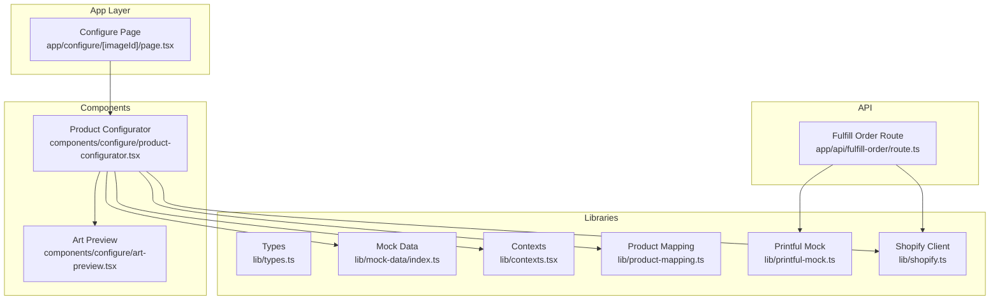
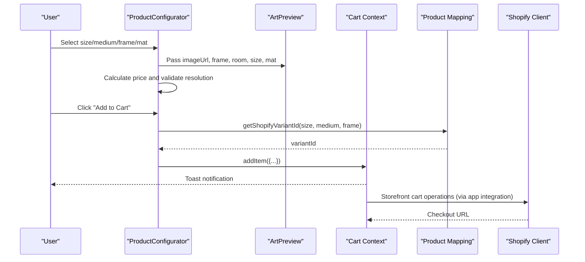
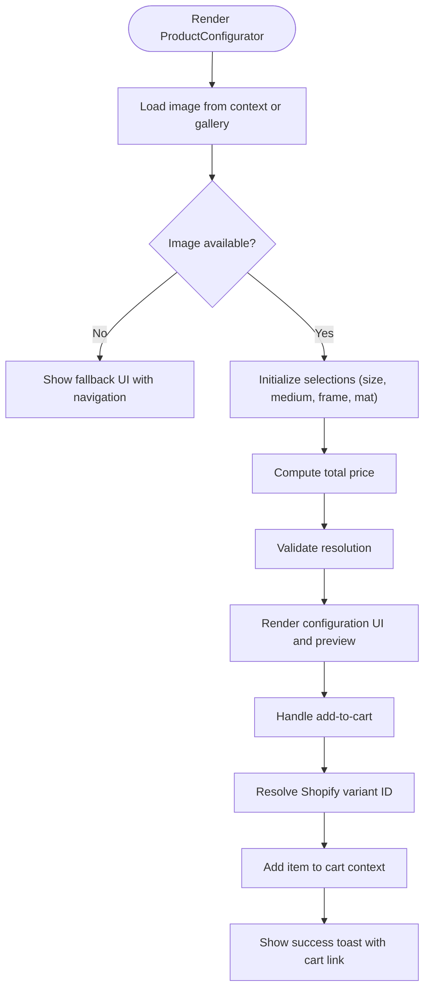
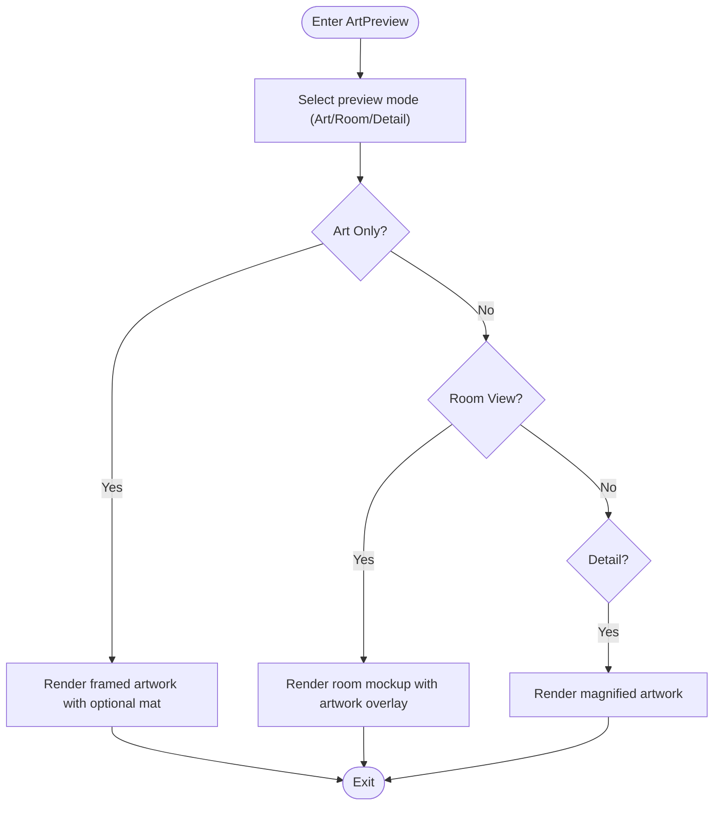
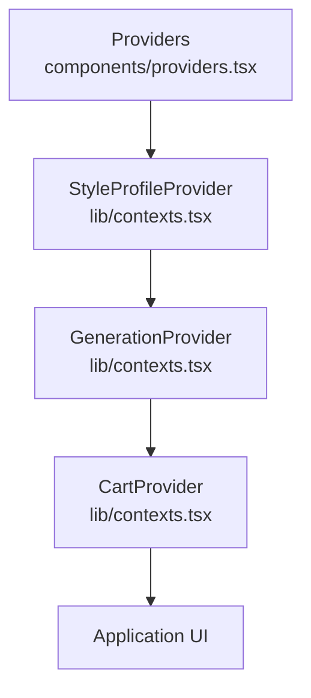
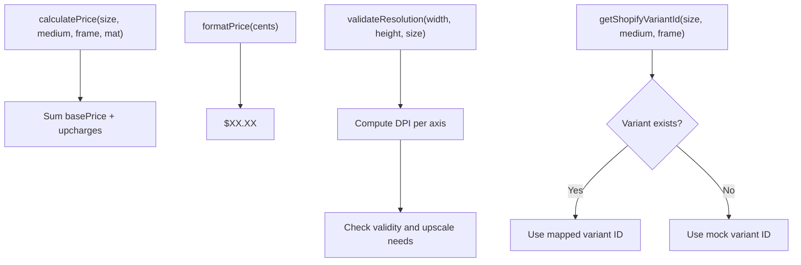
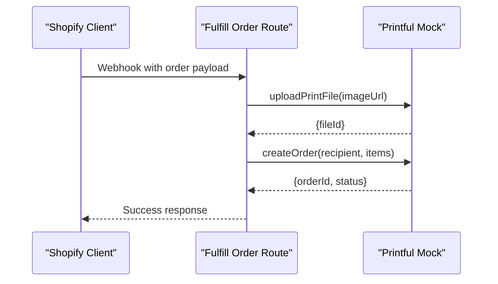
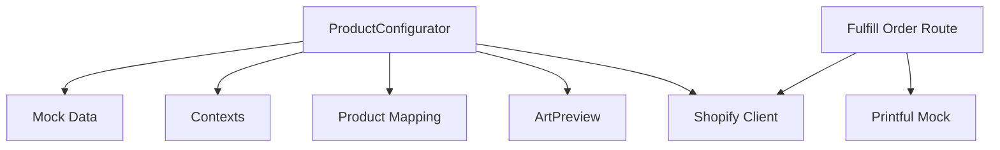

# Product Configurator

<cite>
**Referenced Files in This Document**
- [page.tsx](file://app/configure/[imageId]/page.tsx)
- [product-configurator.tsx](file://components/configure/product-configurator.tsx)
- [art-preview.tsx](file://components/configure/art-preview.tsx)
- [types.ts](file://lib/types.ts)
- [index.ts](file://lib/mock-data/index.ts)
- [contexts.tsx](file://lib/contexts.tsx)
- [product-mapping.ts](file://lib/product-mapping.ts)
- [providers.tsx](file://components/providers.tsx)
- [route.ts](file://app/api/fulfill-order/route.ts)
- [printful-mock.ts](file://lib/printful-mock.ts)
- [shopify.ts](file://lib/shopify.ts)
</cite>

## Table of Contents
1. [Introduction](#introduction)
2. [Project Structure](#project-structure)
3. [Core Components](#core-components)
4. [Architecture Overview](#architecture-overview)
5. [Detailed Component Analysis](#detailed-component-analysis)
6. [Dependency Analysis](#dependency-analysis)
7. [Performance Considerations](#performance-considerations)
8. [Troubleshooting Guide](#troubleshooting-guide)
9. [Conclusion](#conclusion)

## Introduction
The Product Configurator enables users to customize their AI-generated artwork prints by selecting size, medium, frame, and mat options. It provides a live preview of how the configuration affects the final artwork, including an interactive room mockup. The system manages user selections via React state, calculates pricing dynamically, validates image resolution, and integrates with Shopify for product fulfillment and Printful for print-on-demand fulfillment.

## Project Structure
The Product Configurator feature spans several modules:
- Page entry point that renders the configurator with an image context
- Configurator component that handles selection UI, state, and cart integration
- Live preview component that visualizes the artwork with optional framing and room placement
- Type definitions for configuration options and cart items
- Mock data for sizes, mediums, frames, mats, and pricing helpers
- Context providers for generation, cart, and style profile
- Product mapping utilities for Shopify variant IDs
- API route for fulfillment orchestration with Printful
- Printful mock implementation for development
- Shopify client for storefront cart operations

**Diagram sources**
- [page.tsx:1-12](file://app/configure/[imageId]/page.tsx#L1-L12)
- [product-configurator.tsx:1-279](file://components/configure/product-configurator.tsx#L1-L279)
- [art-preview.tsx:1-354](file://components/configure/art-preview.tsx#L1-L354)
- [types.ts:54-88](file://lib/types.ts#L54-L88)
- [index.ts:11-80](file://lib/mock-data/index.ts#L11-L80)
- [contexts.tsx:1-255](file://lib/contexts.tsx#L1-L255)
- [product-mapping.ts:1-68](file://lib/product-mapping.ts#L1-L68)
- [route.ts:1-39](file://app/api/fulfill-order/route.ts#L1-L39)
- [printful-mock.ts:1-77](file://lib/printful-mock.ts#L1-L77)
- [shopify.ts:1-303](file://lib/shopify.ts#L1-L303)

**Section sources**
- [page.tsx:1-12](file://app/configure/[imageId]/page.tsx#L1-L12)
- [product-configurator.tsx:1-279](file://components/configure/product-configurator.tsx#L1-L279)
- [art-preview.tsx:1-354](file://components/configure/art-preview.tsx#L1-L354)
- [types.ts:54-88](file://lib/types.ts#L54-L88)
- [index.ts:11-80](file://lib/mock-data/index.ts#L11-L80)
- [contexts.tsx:1-255](file://lib/contexts.tsx#L1-L255)
- [product-mapping.ts:1-68](file://lib/product-mapping.ts#L1-L68)
- [route.ts:1-39](file://app/api/fulfill-order/route.ts#L1-L39)
- [printful-mock.ts:1-77](file://lib/printful-mock.ts#L1-L77)
- [shopify.ts:1-303](file://lib/shopify.ts#L1-L303)

## Core Components
- Product Configurator: Central UI for size, medium, frame, and mat selection; live preview integration; cart addition; price calculation; resolution validation.
- Art Preview: Interactive preview modes (Art Only, Room View, Detail) with configurable size scaling, frame rendering, and mat overlays; room navigation thumbnails.
- Types: Strongly typed configuration options and cart item structures.
- Mock Data: Static lists of sizes, mediums, frames, mats; pricing calculator; resolution validator; gallery items.
- Contexts: Generation, cart, and style profile providers for cross-component state sharing.
- Product Mapping: Maps configuration combinations to Shopify variant IDs.
- Fulfillment API: Orchestrates Printful order creation after Shopify order webhook.
- Printful Mock: Simulates Printful file upload and order creation for development.
- Shopify Client: Provides Storefront API operations for cart creation and checkout.

**Section sources**
- [product-configurator.tsx:19-279](file://components/configure/product-configurator.tsx#L19-L279)
- [art-preview.tsx:86-354](file://components/configure/art-preview.tsx#L86-L354)
- [types.ts:54-110](file://lib/types.ts#L54-L110)
- [index.ts:11-315](file://lib/mock-data/index.ts#L11-L315)
- [contexts.tsx:164-255](file://lib/contexts.tsx#L164-L255)
- [product-mapping.ts:37-49](file://lib/product-mapping.ts#L37-L49)
- [route.ts:11-39](file://app/api/fulfill-order/route.ts#L11-L39)
- [printful-mock.ts:38-76](file://lib/printful-mock.ts#L38-L76)
- [shopify.ts:108-157](file://lib/shopify.ts#L108-L157)

## Architecture Overview
The configurator composes three primary flows:
- Selection and Preview: Users choose options; the configurator updates state and passes props to the preview component for real-time visualization.
- State Management: Local component state tracks selections; contexts manage cart and generation data; providers wrap the application to share state.
- Fulfillment Integration: On add-to-cart, the configurator resolves a Shopify variant ID and adds the item to the cart. Later, a Shopify webhook triggers the fulfillment route to upload the print file to Printful and create an order.

**Diagram sources**
- [product-configurator.tsx:44-69](file://components/configure/product-configurator.tsx#L44-L69)
- [art-preview.tsx:86-116](file://components/configure/art-preview.tsx#L86-L116)
- [contexts.tsx:207-219](file://lib/contexts.tsx#L207-L219)
- [product-mapping.ts:37-49](file://lib/product-mapping.ts#L37-L49)
- [shopify.ts:108-157](file://lib/shopify.ts#L108-L157)

## Detailed Component Analysis

### Product Configurator Component
Responsibilities:
- Manage local selections for size, medium, frame, and mat
- Compute total price using pricing helpers
- Validate image resolution against print size
- Render live preview with frame and mat overlays
- Integrate with cart context to add items
- Provide responsive UI for selection grids and summary

Key behaviors:
- Selection state initialization and updates
- Memoized price and resolution computation
- Conditional rendering of mat options based on frame selection
- Add-to-cart flow with variant ID resolution and toast feedback

**Diagram sources**
- [product-configurator.tsx:19-86](file://components/configure/product-configurator.tsx#L19-L86)
- [product-configurator.tsx:33-42](file://components/configure/product-configurator.tsx#L33-L42)
- [product-configurator.tsx:44-69](file://components/configure/product-configurator.tsx#L44-L69)
- [index.ts:288-314](file://lib/mock-data/index.ts#L288-L314)

**Section sources**
- [product-configurator.tsx:19-279](file://components/configure/product-configurator.tsx#L19-L279)
- [index.ts:288-314](file://lib/mock-data/index.ts#L288-L314)

### Art Preview Component
Responsibilities:
- Toggle between preview modes: Art Only, Room View, Detail
- Render framed artwork with optional mat layer
- Scale artwork based on selected print size
- Display room mockups and allow switching between rooms
- Provide thumbnail navigation for room selection

Preview modes:
- Art Only: Displays the artwork with frame and optional mat, scaled according to size
- Room View: Places the framed artwork on a room mockup; thumbnails enable room switching
- Detail: Shows a magnified view of the artwork

**Diagram sources**
- [art-preview.tsx:86-116](file://components/configure/art-preview.tsx#L86-L116)
- [art-preview.tsx:118-136](file://components/configure/art-preview.tsx#L118-L136)
- [art-preview.tsx:139-317](file://components/configure/art-preview.tsx#L139-L317)
- [art-preview.tsx:320-350](file://components/configure/art-preview.tsx#L320-L350)

**Section sources**
- [art-preview.tsx:86-354](file://components/configure/art-preview.tsx#L86-L354)

### State Management and Contexts
State management is distributed across:
- Component-local state for selections
- Context providers for cart, generation, and style profile
- Provider hierarchy ensures contexts are available throughout the application

**Diagram sources**
- [providers.tsx:5-13](file://components/providers.tsx#L5-L13)
- [contexts.tsx:30-65](file://lib/contexts.tsx#L30-L65)
- [contexts.tsx:116-158](file://lib/contexts.tsx#L116-L158)
- [contexts.tsx:185-250](file://lib/contexts.tsx#L185-L250)

**Section sources**
- [providers.tsx:1-14](file://components/providers.tsx#L1-L14)
- [contexts.tsx:1-255](file://lib/contexts.tsx#L1-L255)

### Pricing, Resolution Validation, and Inventory Mapping
Pricing:
- Prices are computed from base size costs plus medium, frame, and mat upcharges
- Formatting converts cents to dollar amounts

Resolution validation:
- Ensures minimum DPI thresholds for print quality
- Indicates whether AI upsampling is needed

Inventory mapping:
- Maps size-medium-frame combinations to Shopify variant IDs
- Provides fallback behavior during development

**Diagram sources**
- [index.ts:288-298](file://lib/mock-data/index.ts#L288-L298)
- [index.ts:300-314](file://lib/mock-data/index.ts#L300-L314)
- [product-mapping.ts:37-49](file://lib/product-mapping.ts#L37-L49)

**Section sources**
- [index.ts:288-314](file://lib/mock-data/index.ts#L288-L314)
- [product-mapping.ts:37-49](file://lib/product-mapping.ts#L37-L49)

### Fulfillment Integration with Printful and Shopify
Workflow:
- On add-to-cart, the configurator resolves a Shopify variant ID and adds the item to the cart
- Later, a Shopify webhook triggers the fulfillment route
- The fulfillment route uploads the print file to Printful and creates an order
- Printful handles production and shipping; tracking is logged in mocks

**Diagram sources**
- [route.ts:11-39](file://app/api/fulfill-order/route.ts#L11-L39)
- [printful-mock.ts:38-76](file://lib/printful-mock.ts#L38-L76)
- [shopify.ts:108-157](file://lib/shopify.ts#L108-L157)

**Section sources**
- [route.ts:1-39](file://app/api/fulfill-order/route.ts#L1-L39)
- [printful-mock.ts:1-77](file://lib/printful-mock.ts#L1-L77)
- [shopify.ts:1-303](file://lib/shopify.ts#L1-L303)

## Dependency Analysis
The configurator depends on:
- Mock data for configuration options and pricing helpers
- Contexts for cart and generation state
- Product mapping for variant resolution
- Preview component for live visualization
- API route and Printful mock for fulfillment

**Diagram sources**
- [product-configurator.tsx:9-17](file://components/configure/product-configurator.tsx#L9-L17)
- [index.ts:11-80](file://lib/mock-data/index.ts#L11-L80)
- [contexts.tsx:164-255](file://lib/contexts.tsx#L164-L255)
- [product-mapping.ts:37-49](file://lib/product-mapping.ts#L37-L49)
- [art-preview.tsx:86-116](file://components/configure/art-preview.tsx#L86-L116)
- [route.ts:1-39](file://app/api/fulfill-order/route.ts#L1-L39)
- [printful-mock.ts:1-77](file://lib/printful-mock.ts#L1-L77)
- [shopify.ts:1-303](file://lib/shopify.ts#L1-L303)

**Section sources**
- [product-configurator.tsx:1-279](file://components/configure/product-configurator.tsx#L1-L279)
- [art-preview.tsx:1-354](file://components/configure/art-preview.tsx#L1-L354)
- [index.ts:1-315](file://lib/mock-data/index.ts#L1-L315)
- [contexts.tsx:1-255](file://lib/contexts.tsx#L1-L255)
- [product-mapping.ts:1-68](file://lib/product-mapping.ts#L1-L68)
- [route.ts:1-39](file://app/api/fulfill-order/route.ts#L1-L39)
- [printful-mock.ts:1-77](file://lib/printful-mock.ts#L1-L77)
- [shopify.ts:1-303](file://lib/shopify.ts#L1-L303)

## Performance Considerations
- Memoization: Total price and resolution computations are memoized to avoid unnecessary recalculations when selections change.
- Conditional rendering: Mat options are only shown when a frame is selected, reducing DOM complexity.
- Preview scaling: Size-specific scaling factors minimize layout thrashing during transitions.
- Local state: Keeping selections local reduces prop drilling and improves responsiveness.

## Troubleshooting Guide
Common issues and resolutions:
- Missing Shopify variant mapping: If variant IDs are not configured, the system logs warnings and uses a mock variant ID. Update the mapping with actual Shopify variant IDs.
- Unconfigured Shopify credentials: The Shopify client checks for required environment variables and throws descriptive errors if missing.
- Cart persistence: The cart provider persists to local storage; clearing local storage clears the cart.
- Resolution warnings: If the image DPI is below threshold, the configurator indicates AI upsampling will occur.

**Section sources**
- [product-mapping.ts:41-46](file://lib/product-mapping.ts#L41-L46)
- [shopify.ts:17-20](file://lib/shopify.ts#L17-L20)
- [contexts.tsx:189-205](file://lib/contexts.tsx#L189-L205)
- [index.ts:300-314](file://lib/mock-data/index.ts#L300-L314)

## Conclusion
The Product Configurator provides a seamless experience for customizing artwork prints with live preview, robust state management, and integration with Shopify and Printful. Its modular architecture supports easy extension of options, improved validation, and enhanced fulfillment workflows.