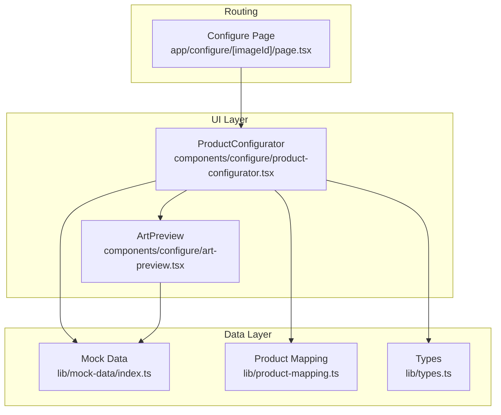
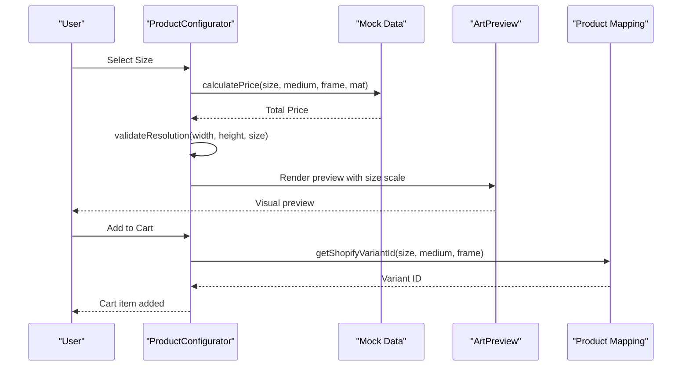
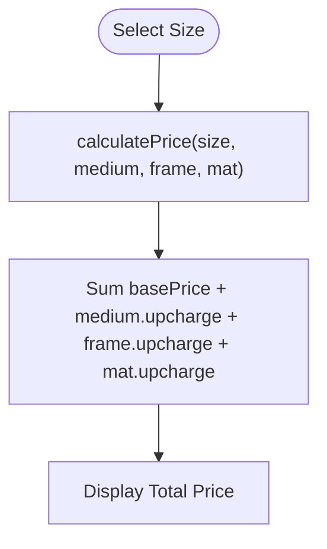
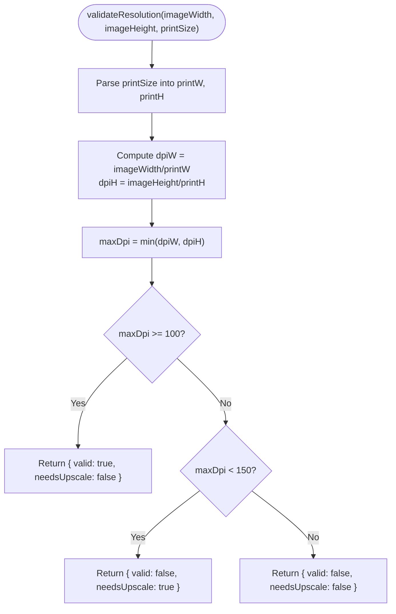
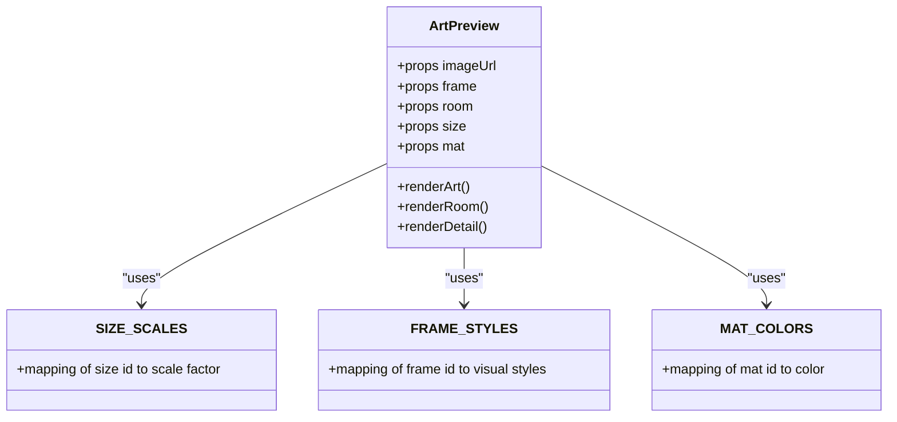
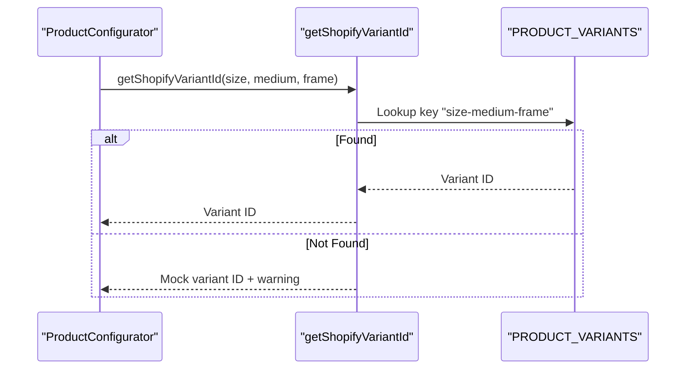
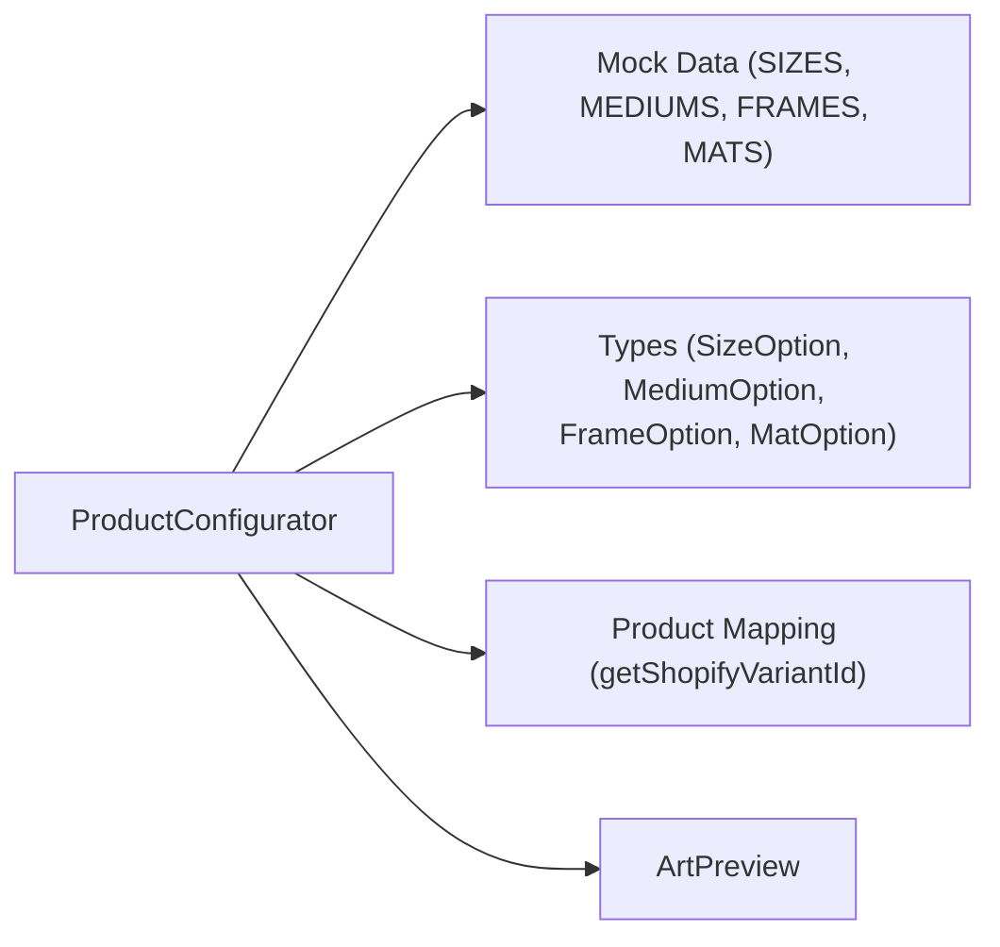

# Size Selection

<cite>
**Referenced Files in This Document**
- [product-configurator.tsx](file://components/configure/product-configurator.tsx)
- [index.ts](file://lib/mock-data/index.ts)
- [types.ts](file://lib/types.ts)
- [product-mapping.ts](file://lib/product-mapping.ts)
- [art-preview.tsx](file://components/configure/art-preview.tsx)
- [page.tsx](file://app/configure/[imageId]/page.tsx)
</cite>

## Table of Contents
1. [Introduction](#introduction)
2. [Project Structure](#project-structure)
3. [Core Components](#core-components)
4. [Architecture Overview](#architecture-overview)
5. [Detailed Component Analysis](#detailed-component-analysis)
6. [Dependency Analysis](#dependency-analysis)
7. [Performance Considerations](#performance-considerations)
8. [Troubleshooting Guide](#troubleshooting-guide)
9. [Conclusion](#conclusion)

## Introduction
This document provides comprehensive technical documentation for the Size Selection component within the Product Configurator. It covers available size options, dimensions, pricing adjustments, aspect ratio considerations, validation logic, custom size input handling, and how size selections affect artwork scaling and cropping. It also explains integration with product mapping for different print mediums and frame options.

## Project Structure
The Size Selection component is part of the Product Configurator, which orchestrates the user's print configuration choices. The configurator integrates with mock data for sizes, mediums, frames, mats, and pricing helpers, and connects to product mapping for Shopify variant resolution.

**Diagram sources**
- [product-configurator.tsx:19-279](file://components/configure/product-configurator.tsx#L19-L279)
- [index.ts:11-44](file://lib/mock-data/index.ts#L11-L44)
- [product-mapping.ts:15-49](file://lib/product-mapping.ts#L15-L49)
- [types.ts:55-79](file://lib/types.ts#L55-L79)
- [art-preview.tsx:86-354](file://components/configure/art-preview.tsx#L86-L354)
- [page.tsx:8-11](file://app/configure/[imageId]/page.tsx#L8-L11)

**Section sources**
- [product-configurator.tsx:19-279](file://components/configure/product-configurator.tsx#L19-L279)
- [index.ts:11-44](file://lib/mock-data/index.ts#L11-L44)
- [product-mapping.ts:15-49](file://lib/product-mapping.ts#L15-L49)
- [types.ts:55-79](file://lib/types.ts#L55-L79)
- [art-preview.tsx:86-354](file://components/configure/art-preview.tsx#L86-L354)
- [page.tsx:8-11](file://app/configure/[imageId]/page.tsx#L8-L11)

## Core Components
- Size Selection Grid: Presents predefined sizes with labels and base prices.
- Resolution Validation: Computes whether the selected size requires AI upscaling based on DPI thresholds.
- Pricing Calculation: Aggregates base size cost plus medium, frame, and mat upcharges.
- Artwork Scaling: Visualizes how the artwork scales across sizes in the preview.
- Product Mapping: Resolves Shopify variant IDs for cart integration.

Key responsibilities:
- Render size options and highlight the currently selected size.
- Display resolution feedback indicating upscaling needs.
- Compute total price considering all configuration options.
- Integrate with product mapping for cart item creation.

**Section sources**
- [product-configurator.tsx:127-152](file://components/configure/product-configurator.tsx#L127-L152)
- [index.ts:288-314](file://lib/mock-data/index.ts#L288-L314)
- [art-preview.tsx:34-41](file://components/configure/art-preview.tsx#L34-L41)

## Architecture Overview
The Size Selection component participates in a multi-layered flow:
- UI rendering and state management in ProductConfigurator.
- Data sourcing from mock-data (sizes, mediums, frames, mats, pricing helpers).
- Preview rendering in ArtPreview with size-dependent scaling.
- Cart integration via product mapping for Shopify variant resolution.

**Diagram sources**
- [product-configurator.tsx:38-69](file://components/configure/product-configurator.tsx#L38-L69)
- [index.ts:288-314](file://lib/mock-data/index.ts#L288-L314)
- [art-preview.tsx:108-112](file://components/configure/art-preview.tsx#L108-L112)
- [product-mapping.ts:37-49](file://lib/product-mapping.ts#L37-L49)

## Detailed Component Analysis

### Size Options and Dimensions
Available sizes are predefined with labels and base prices. Each size defines a width-by-height dimension pair used for resolution validation and preview scaling.

- Standard sizes include:
  - 8×10
  - 12×16
  - 16×20
  - 18×24
  - 24×36
  - 30×40

Each size object includes:
- id: unique identifier used for selection and mapping.
- label: human-readable size label.
- basePrice: base cost in cents for the size tier.

These sizes are rendered in a responsive grid within the Size Selection section.

**Section sources**
- [index.ts:12-19](file://lib/mock-data/index.ts#L12-L19)
- [product-configurator.tsx:131-145](file://components/configure/product-configurator.tsx#L131-L145)

### Pricing Adjustments
The total price is calculated by summing:
- Base price of the selected size.
- Upcharge for the chosen medium.
- Upcharge for the selected frame.
- Upcharge for the selected mat.

This aggregation occurs whenever any configuration option changes, ensuring real-time price updates.

**Diagram sources**
- [index.ts:288-294](file://lib/mock-data/index.ts#L288-L294)
- [product-configurator.tsx:38](file://components/configure/product-configurator.tsx#L38)

**Section sources**
- [index.ts:21-27](file://lib/mock-data/index.ts#L21-L27)
- [index.ts:29-37](file://lib/mock-data/index.ts#L29-L37)
- [index.ts:40-44](file://lib/mock-data/index.ts#L40-L44)
- [index.ts:288-294](file://lib/mock-data/index.ts#L288-L294)

### Aspect Ratio Considerations
Aspect ratios influence the generated artwork dimensions during creation. While the Size Selection component itself does not change aspect ratios, the preview and resolution validation consider the selected print size against the original image dimensions.

- Aspect ratios available for generation:
  - 3:4 (portrait)
  - 1:1 (square)
  - 4:3 (landscape)
  - 16:9 (wide)

These are used during image generation to produce assets that align with the intended print size.

**Section sources**
- [index.ts:47-52](file://lib/mock-data/index.ts#L47-L52)

### Size Validation Logic
The system validates whether the selected print size requires AI upscaling based on DPI thresholds derived from the original image dimensions and the chosen print size.

Validation criteria:
- Maximum DPI computed from width and height.
- Minimum acceptable DPI threshold for validity.
- Threshold for recommending AI upscaling.

The validation result influences UI messaging to inform users about potential AI upscaling.

**Diagram sources**
- [index.ts:300-314](file://lib/mock-data/index.ts#L300-L314)
- [product-configurator.tsx:39-42](file://components/configure/product-configurator.tsx#L39-L42)

**Section sources**
- [index.ts:300-314](file://lib/mock-data/index.ts#L300-L314)
- [product-configurator.tsx:147-151](file://components/configure/product-configurator.tsx#L147-L151)

### Custom Size Input Handling
The current implementation uses predefined sizes only. There is no built-in custom size input field in the Size Selection component. If custom dimensions are required, they would need to be integrated as an additional input mechanism alongside the existing size grid.

Integration considerations:
- Input validation for numeric dimensions.
- Aspect ratio preservation or explicit aspect ratio selection.
- Pricing calculation for non-standard sizes.
- Preview scaling logic for non-standard sizes.

[No sources needed since this section proposes integration requirements not present in the current codebase]

### How Size Selections Affect Artwork Scaling and Cropping
Artwork scaling and cropping are handled in the preview component:
- Size scale factors map each standard size to a visual scale multiplier.
- Frame and mat options alter the visual presentation but do not change the underlying artwork dimensions.
- Cropping is implied by the aspect ratio of the artwork relative to the print size; the preview maintains aspect ratios while scaling.

**Diagram sources**
- [art-preview.tsx:34-84](file://components/configure/art-preview.tsx#L34-L84)
- [art-preview.tsx:86-354](file://components/configure/art-preview.tsx#L86-L354)

**Section sources**
- [art-preview.tsx:34-41](file://components/configure/art-preview.tsx#L34-L41)
- [art-preview.tsx:108-112](file://components/configure/art-preview.tsx#L108-L112)
- [art-preview.tsx:163-194](file://components/configure/art-preview.tsx#L163-L194)
- [art-preview.tsx:231-261](file://components/configure/art-preview.tsx#L231-L261)

### Integration with Product Mapping for Print Mediums and Frames
The configurator integrates with product mapping to resolve Shopify variant IDs for cart integration. The mapping key is constructed from size, medium, and frame, enabling cart items to reference the correct product variant.

Key behaviors:
- Variant ID lookup using size-medium-frame key.
- Fallback to a mock variant ID when mapping is incomplete.
- Warning messages for missing mappings during development.

**Diagram sources**
- [product-configurator.tsx:48](file://components/configure/product-configurator.tsx#L48)
- [product-mapping.ts:37-49](file://lib/product-mapping.ts#L37-L49)
- [product-mapping.ts:15-32](file://lib/product-mapping.ts#L15-L32)

**Section sources**
- [product-configurator.tsx:48](file://components/configure/product-configurator.tsx#L48)
- [product-mapping.ts:37-49](file://lib/product-mapping.ts#L37-L49)
- [product-mapping.ts:15-32](file://lib/product-mapping.ts#L15-L32)

### Examples
- Standard sizes:
  - 8×10: Base price applies; suitable for compact spaces.
  - 16×20: Popular standard size with balanced price and visibility.
  - 24×36: Larger format for prominent wall displays.
  - 30×40: Premium large format for statement pieces.
- Pricing calculation example:
  - Size: 16×20 ($69.00)
  - Medium: Canvas (+$20.00)
  - Frame: Black (+$30.00)
  - Mat: White (+$10.00)
  - Total: $129.00
- Resolution validation example:
  - Original image: 2048×2048 pixels
  - Selected size: 16×20
  - DPI: 128 (valid but close to threshold)
  - Recommendation: No AI upscaling needed

**Section sources**
- [index.ts:12-19](file://lib/mock-data/index.ts#L12-L19)
- [index.ts:21-27](file://lib/mock-data/index.ts#L21-L27)
- [index.ts:29-37](file://lib/mock-data/index.ts#L29-L37)
- [index.ts:40-44](file://lib/mock-data/index.ts#L40-L44)
- [index.ts:288-294](file://lib/mock-data/index.ts#L288-L294)
- [index.ts:300-314](file://lib/mock-data/index.ts#L300-L314)

## Dependency Analysis
The Size Selection component depends on:
- Mock data for sizes, mediums, frames, mats, and pricing helpers.
- Types for strongly-typed configuration options.
- Product mapping for cart integration.
- Art preview for visual feedback.

**Diagram sources**
- [product-configurator.tsx:10-17](file://components/configure/product-configurator.tsx#L10-L17)
- [types.ts:55-79](file://lib/types.ts#L55-L79)
- [product-mapping.ts:37-49](file://lib/product-mapping.ts#L37-L49)
- [art-preview.tsx:86-354](file://components/configure/art-preview.tsx#L86-L354)

**Section sources**
- [product-configurator.tsx:10-17](file://components/configure/product-configurator.tsx#L10-L17)
- [types.ts:55-79](file://lib/types.ts#L55-L79)
- [product-mapping.ts:37-49](file://lib/product-mapping.ts#L37-L49)
- [art-preview.tsx:86-354](file://components/configure/art-preview.tsx#L86-L354)

## Performance Considerations
- Memoization: Total price and resolution validation are memoized to prevent unnecessary recalculations when unrelated state changes occur.
- Rendering: The size grid uses a responsive layout to optimize for mobile and desktop screens.
- Preview scaling: Size scale factors are precomputed to minimize runtime calculations.

[No sources needed since this section provides general guidance]

## Troubleshooting Guide
Common issues and resolutions:
- Missing Shopify variant mapping:
  - Symptom: Warning logs and fallback to mock variant ID.
  - Resolution: Configure actual Shopify variant IDs in product mapping.
- Low-resolution artwork:
  - Symptom: Resolution validation indicates AI upscaling recommendation.
  - Resolution: Use higher-resolution source images or select a smaller print size.
- Unexpected price changes:
  - Symptom: Total price fluctuates with medium/frame/mat selections.
  - Resolution: Verify upcharge values in mock data and ensure correct selection IDs.

**Section sources**
- [product-mapping.ts:41-46](file://lib/product-mapping.ts#L41-L46)
- [index.ts:300-314](file://lib/mock-data/index.ts#L300-L314)

## Conclusion
The Size Selection component provides a robust foundation for configuring print sizes within the Product Configurator. It offers predefined size options with transparent pricing, resolution validation for quality assurance, and seamless integration with product mapping for cart operations. While custom size input is not currently implemented, the modular design allows for future enhancements to support dynamic dimensions and advanced scaling behaviors.