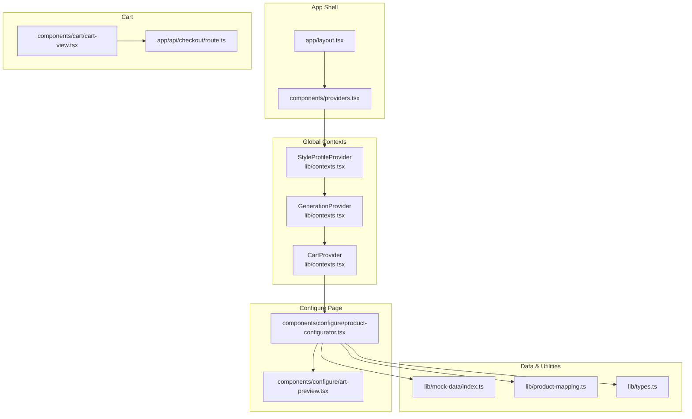
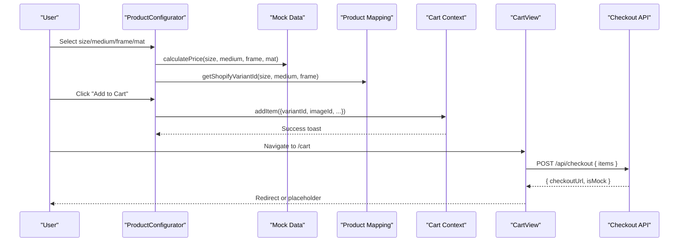
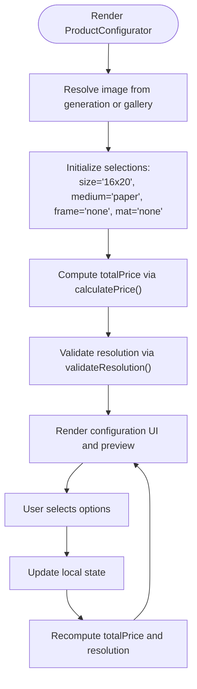
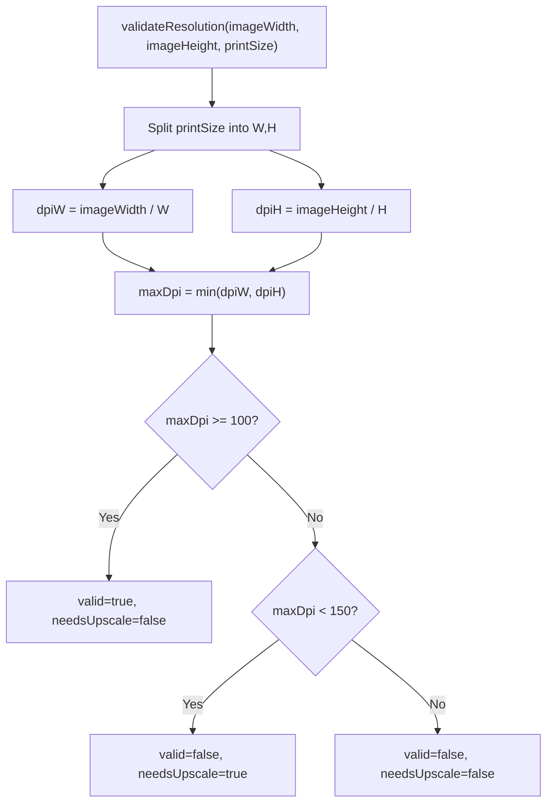
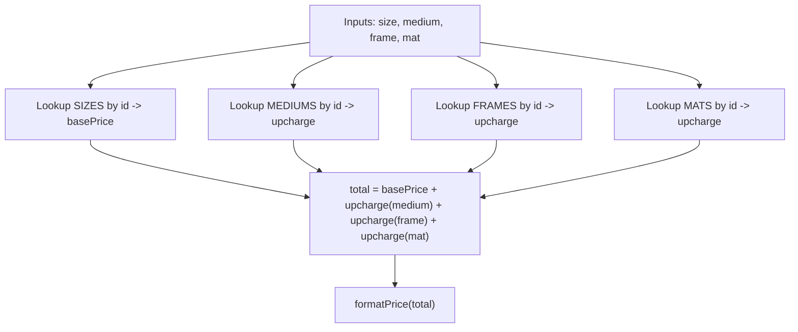
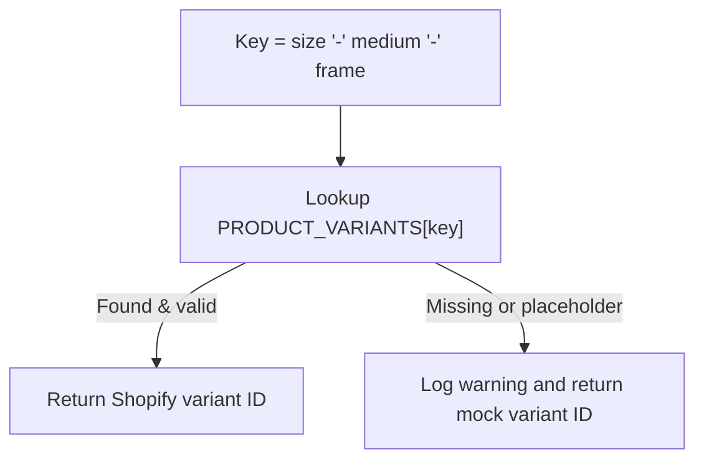
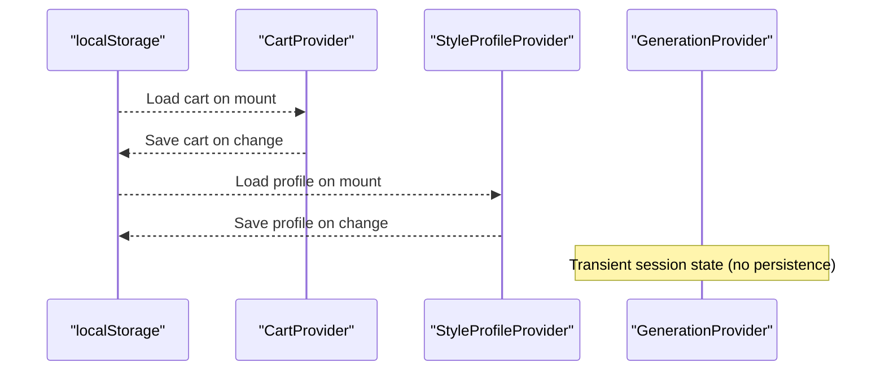
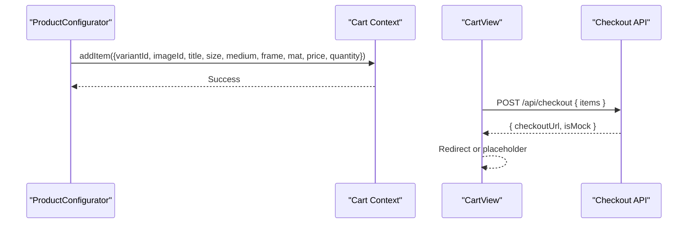
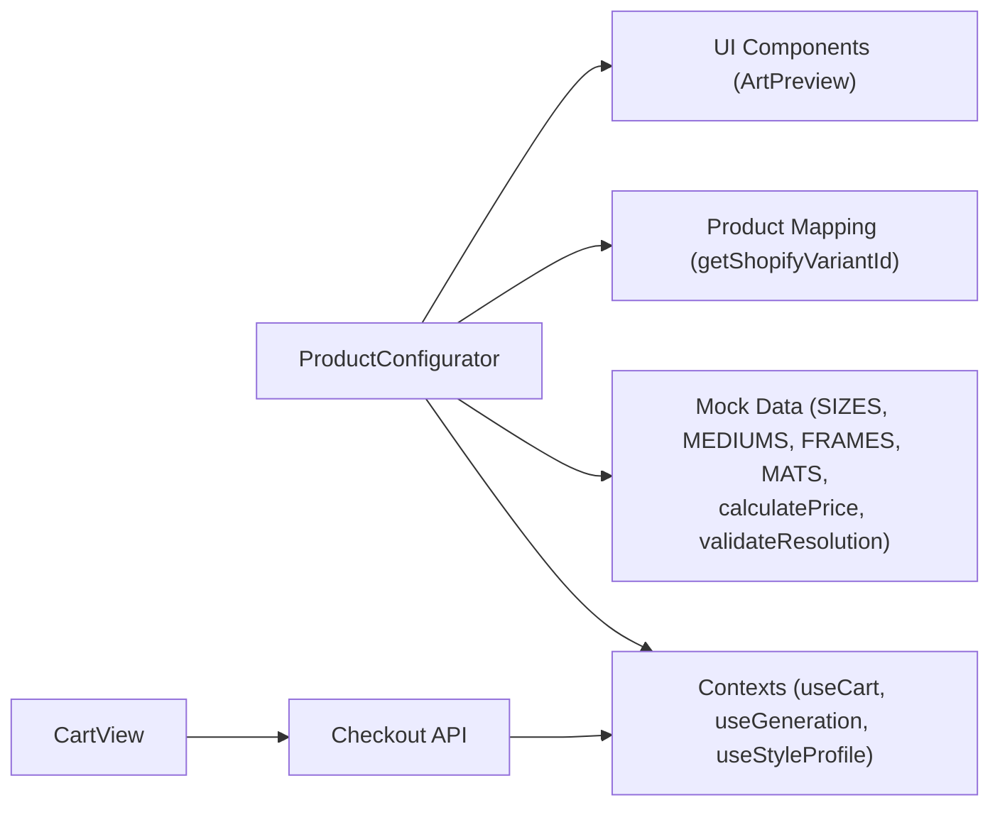

# State Management & Validation

<cite>
**Referenced Files in This Document**
- [page.tsx](file://app/configure/[imageId]/page.tsx)
- [product-configurator.tsx](file://components/configure/product-configurator.tsx)
- [contexts.tsx](file://lib/contexts.tsx)
- [types.ts](file://lib/types.ts)
- [index.ts](file://lib/mock-data/index.ts)
- [product-mapping.ts](file://lib/product-mapping.ts)
- [art-preview.tsx](file://components/configure/art-preview.tsx)
- [providers.tsx](file://components/providers.tsx)
- [layout.tsx](file://app/layout.tsx)
- [cart-view.tsx](file://components/cart/cart-view.tsx)
- [route.ts](file://app/api/checkout/route.ts)
</cite>

## Table of Contents
1. [Introduction](#introduction)
2. [Project Structure](#project-structure)
3. [Core Components](#core-components)
4. [Architecture Overview](#architecture-overview)
5. [Detailed Component Analysis](#detailed-component-analysis)
6. [Dependency Analysis](#dependency-analysis)
7. [Performance Considerations](#performance-considerations)
8. [Troubleshooting Guide](#troubleshooting-guide)
9. [Conclusion](#conclusion)

## Introduction
This document explains the state management and validation logic within the Product Configurator. It covers the configuration state structure, user selection tracking, validation rules for each option, price calculation algorithms, inventory validation, error handling mechanisms, state persistence during navigation, session management, data synchronization, and integration with global application state and cart synchronization.

## Project Structure
The Product Configurator is implemented as a client-side component that integrates with global React Context providers for style profile, generation history, and cart state. The configuration UI allows users to select size, medium, frame, and mat, previews the result in multiple modes, and adds items to the cart.

**Diagram sources**
- [layout.tsx:26-42](file://app/layout.tsx#L26-L42)
- [providers.tsx:5-13](file://components/providers.tsx#L5-L13)
- [contexts.tsx:30-65](file://lib/contexts.tsx#L30-L65)
- [contexts.tsx:116-158](file://lib/contexts.tsx#L116-L158)
- [contexts.tsx:185-250](file://lib/contexts.tsx#L185-L250)
- [product-configurator.tsx:19-278](file://components/configure/product-configurator.tsx#L19-L278)
- [art-preview.tsx:86-354](file://components/configure/art-preview.tsx#L86-L354)
- [index.ts:11-80](file://lib/mock-data/index.ts#L11-L80)
- [product-mapping.ts:15-67](file://lib/product-mapping.ts#L15-L67)
- [types.ts:54-110](file://lib/types.ts#L54-L110)
- [cart-view.tsx:13-221](file://components/cart/cart-view.tsx#L13-L221)
- [route.ts:29-75](file://app/api/checkout/route.ts#L29-L75)

**Section sources**
- [layout.tsx:26-42](file://app/layout.tsx#L26-L42)
- [providers.tsx:5-13](file://components/providers.tsx#L5-L13)
- [contexts.tsx:30-65](file://lib/contexts.tsx#L30-L65)
- [contexts.tsx:116-158](file://lib/contexts.tsx#L116-L158)
- [contexts.tsx:185-250](file://lib/contexts.tsx#L185-L250)

## Core Components
- Global Context Providers
  - StyleProfileProvider: Manages user style profile and persists to local storage.
  - GenerationProvider: Manages generation session state (selected image, current images, modifiers, quality).
  - CartProvider: Manages cart state, persists to local storage, and exposes add/remove/clear operations.
- Product Configurator
  - Tracks configuration selections (size, medium, frame, mat).
  - Computes total price via pricing helpers.
  - Validates resolution and upscales when needed.
  - Integrates with Shopify variant mapping and cart.
- Art Preview
  - Renders art in three modes: art-only, room view, and detail.
  - Supports frame and mat visualization and room navigation.
- Cart View
  - Displays cart contents, computes totals, and initiates checkout via API.

**Section sources**
- [contexts.tsx:30-65](file://lib/contexts.tsx#L30-L65)
- [contexts.tsx:116-158](file://lib/contexts.tsx#L116-L158)
- [contexts.tsx:185-250](file://lib/contexts.tsx#L185-L250)
- [product-configurator.tsx:19-278](file://components/configure/product-configurator.tsx#L19-L278)
- [art-preview.tsx:86-354](file://components/configure/art-preview.tsx#L86-L354)
- [cart-view.tsx:13-221](file://components/cart/cart-view.tsx#L13-L221)

## Architecture Overview
The Product Configurator composes global contexts and local component state to manage configuration and cart interactions. The configuration state is ephemeral per session but integrates with persistent cart state. Resolution validation ensures print quality, and price calculation aggregates base size cost plus medium/frame/mat upcharges.

**Diagram sources**
- [product-configurator.tsx:44-69](file://components/configure/product-configurator.tsx#L44-L69)
- [index.ts:288-294](file://lib/mock-data/index.ts#L288-L294)
- [product-mapping.ts:37-49](file://lib/product-mapping.ts#L37-L49)
- [contexts.tsx:207-219](file://lib/contexts.tsx#L207-L219)
- [cart-view.tsx:18-52](file://components/cart/cart-view.tsx#L18-L52)
- [route.ts:29-75](file://app/api/checkout/route.ts#L29-L75)

## Detailed Component Analysis

### Configuration State Structure
- Local component state
  - size: string (default "16x20")
  - medium: string (default "paper")
  - frame: string (default "none")
  - mat: string (default "none")
- Derived values
  - totalPrice: computed via pricing helpers
  - resolution: validated against image dimensions and selected size
- Context integrations
  - useGeneration(): resolves selected or gallery image
  - useStyleProfile(): reads room preference for preview
  - useCart(): adds configured item to cart

**Diagram sources**
- [product-configurator.tsx:19-42](file://components/configure/product-configurator.tsx#L19-L42)
- [index.ts:288-314](file://lib/mock-data/index.ts#L288-L314)

**Section sources**
- [product-configurator.tsx:33-42](file://components/configure/product-configurator.tsx#L33-L42)
- [index.ts:11-80](file://lib/mock-data/index.ts#L11-L80)
- [types.ts:54-88](file://lib/types.ts#L54-L88)

### Validation Rules and Resolution Logic
- Resolution validation
  - Inputs: image width/height, print size (e.g., "16x20")
  - Calculates DPI along width and height
  - Returns validity threshold and whether upscaling is recommended
- Upscaling behavior
  - If needsUpscale is true, UI indicates AI upscaling will be applied for print quality
- Price calculation
  - Sum of base price (size) + upcharges (medium, frame, mat)
  - Uses predefined lookup tables for options and prices

**Diagram sources**
- [index.ts:300-314](file://lib/mock-data/index.ts#L300-L314)

**Section sources**
- [index.ts:300-314](file://lib/mock-data/index.ts#L300-L314)
- [product-configurator.tsx:147-151](file://components/configure/product-configurator.tsx#L147-L151)

### Price Calculation Algorithm
- Inputs: size, medium, frame, mat identifiers
- Lookup basePrice from sizes and upcharges from mediums/frames/mats
- Sum: basePrice + mediumUpcharge + frameUpcharge + matUpcharge
- Formatting: convert cents to dollars for display

**Diagram sources**
- [index.ts:288-298](file://lib/mock-data/index.ts#L288-L298)

**Section sources**
- [index.ts:288-298](file://lib/mock-data/index.ts#L288-L298)
- [product-configurator.tsx:38-39](file://components/configure/product-configurator.tsx#L38-L39)

### Inventory Validation and Variant Mapping
- Variant mapping
  - getShopifyVariantId(size, medium, frame) constructs a key and returns a Shopify variant ID
  - If not configured, logs warnings and returns a mock variant ID for development
- Configuration checks
  - isProductMappingConfigured() determines if real variants are set up
  - getConfiguredVariants() lists configured keys

**Diagram sources**
- [product-mapping.ts:37-49](file://lib/product-mapping.ts#L37-L49)

**Section sources**
- [product-mapping.ts:15-67](file://lib/product-mapping.ts#L15-L67)
- [product-configurator.tsx:48-48](file://components/configure/product-configurator.tsx#L48-L48)

### State Persistence During Navigation and Session Management
- Local storage persistence
  - CartProvider persists cart to local storage on updates and loads on mount
  - StyleProfileProvider persists style profile to local storage
- Session lifecycle
  - GenerationProvider maintains transient generation session state (prompt, images, selected image, modifiers, quality)
  - clearSession() resets generation state
- Navigation behavior
  - Cart state survives navigation due to local storage persistence
  - Configuration selections are local to the page and reset on page load

**Diagram sources**
- [contexts.tsx:189-205](file://lib/contexts.tsx#L189-L205)
- [contexts.tsx:34-54](file://lib/contexts.tsx#L34-L54)
- [contexts.tsx:131-138](file://lib/contexts.tsx#L131-L138)

**Section sources**
- [contexts.tsx:189-205](file://lib/contexts.tsx#L189-L205)
- [contexts.tsx:34-54](file://lib/contexts.tsx#L34-L54)
- [contexts.tsx:131-138](file://lib/contexts.tsx#L131-L138)

### Data Synchronization and Cart Integration
- Adding to cart
  - ProductConfigurator collects configuration and image data
  - Calls addItem with variantId, image info, and formatted options
  - Triggers a success toast and optional navigation to cart
- Checkout flow
  - CartView posts cart items to /api/checkout
  - API creates a Shopify draft order and returns checkout URL
  - If mock mode, redirects to a placeholder page

**Diagram sources**
- [product-configurator.tsx:50-61](file://components/configure/product-configurator.tsx#L50-L61)
- [contexts.tsx:207-219](file://lib/contexts.tsx#L207-L219)
- [cart-view.tsx:26-52](file://components/cart/cart-view.tsx#L26-L52)
- [route.ts:29-75](file://app/api/checkout/route.ts#L29-L75)

**Section sources**
- [product-configurator.tsx:44-69](file://components/configure/product-configurator.tsx#L44-L69)
- [contexts.tsx:207-219](file://lib/contexts.tsx#L207-L219)
- [cart-view.tsx:18-52](file://components/cart/cart-view.tsx#L18-L52)
- [route.ts:29-75](file://app/api/checkout/route.ts#L29-L75)

### Error Handling Mechanisms
- Variant mapping warnings
  - getShopifyVariantId logs warnings when variant IDs are placeholders
- Checkout errors
  - CartView catches network or server errors and displays user-friendly alerts
  - API route returns structured error responses with stack traces for debugging
- UI fallbacks
  - If no image is resolved, renders a friendly message with navigation to creation

**Section sources**
- [product-mapping.ts:41-46](file://lib/product-mapping.ts#L41-L46)
- [cart-view.tsx:47-51](file://components/cart/cart-view.tsx#L47-L51)
- [route.ts:64-74](file://app/api/checkout/route.ts#L64-L74)
- [product-configurator.tsx:71-86](file://components/configure/product-configurator.tsx#L71-L86)

### Examples of State Transitions, Validation Failures, and Recovery
- State transitions
  - Selection change: size → recalculation of totalPrice and resolution
  - Frame selection → enabling mat options and potential price change
  - Adding to cart → cart state update and local storage sync
- Validation failures
  - Low-resolution image at selected size → needsUpscale becomes true; UI informs user
  - Missing Shopify variant mapping → warning logged; mock variant used for development
- Recovery mechanisms
  - Clearing generation session resets prompts and images
  - Clearing cart removes persisted state and empties cart
  - Navigating away preserves cart due to local storage persistence

**Section sources**
- [product-configurator.tsx:193-196](file://components/configure/product-configurator.tsx#L193-L196)
- [contexts.tsx:131-138](file://lib/contexts.tsx#L131-L138)
- [contexts.tsx:234-237](file://lib/contexts.tsx#L234-L237)
- [product-mapping.ts:41-46](file://lib/product-mapping.ts#L41-L46)

## Dependency Analysis
The Product Configurator depends on:
- Global contexts for style profile, generation, and cart
- Mock data for configuration options and pricing helpers
- Product mapping for variant IDs
- UI components for preview and cart operations

**Diagram sources**
- [product-configurator.tsx:9-17](file://components/configure/product-configurator.tsx#L9-L17)
- [index.ts:11-80](file://lib/mock-data/index.ts#L11-L80)
- [product-mapping.ts:37-49](file://lib/product-mapping.ts#L37-L49)
- [cart-view.tsx:15-221](file://components/cart/cart-view.tsx#L15-L221)
- [route.ts:29-75](file://app/api/checkout/route.ts#L29-L75)

**Section sources**
- [product-configurator.tsx:9-17](file://components/configure/product-configurator.tsx#L9-L17)
- [index.ts:11-80](file://lib/mock-data/index.ts#L11-L80)
- [product-mapping.ts:37-49](file://lib/product-mapping.ts#L37-L49)
- [cart-view.tsx:15-221](file://components/cart/cart-view.tsx#L15-L221)
- [route.ts:29-75](file://app/api/checkout/route.ts#L29-L75)

## Performance Considerations
- Memoization
  - useMemo is used for totalPrice and resolution to avoid recomputation on re-renders
- Local computation
  - Pricing and resolution calculations are lightweight and suitable for client-side rendering
- Local storage
  - Cart and profile persistence avoids repeated server requests but may cause hydration mismatches if not handled carefully; the providers guard loading with a flag

[No sources needed since this section provides general guidance]

## Troubleshooting Guide
- Cart appears empty after refresh
  - Confirm local storage entries exist and are parseable; check provider loading flag
- Variant ID warnings during development
  - Ensure product variants are configured in Shopify and mapped in product-mapping.ts
- Checkout fails
  - Verify API response handling and error messages; confirm cart items payload is correct
- Image not found in configurator
  - Ensure image is present in generation context or gallery fallback

**Section sources**
- [contexts.tsx:189-205](file://lib/contexts.tsx#L189-L205)
- [product-mapping.ts:41-46](file://lib/product-mapping.ts#L41-L46)
- [cart-view.tsx:47-51](file://components/cart/cart-view.tsx#L47-L51)
- [product-configurator.tsx:71-86](file://components/configure/product-configurator.tsx#L71-L86)

## Conclusion
The Product Configurator combines local component state with global contexts to deliver a responsive configuration experience. Validation ensures print quality, pricing is computed accurately, and cart synchronization persists across navigation. The design supports graceful development workflows with mock integrations while providing clear pathways to production-ready Shopify and Printful integrations.