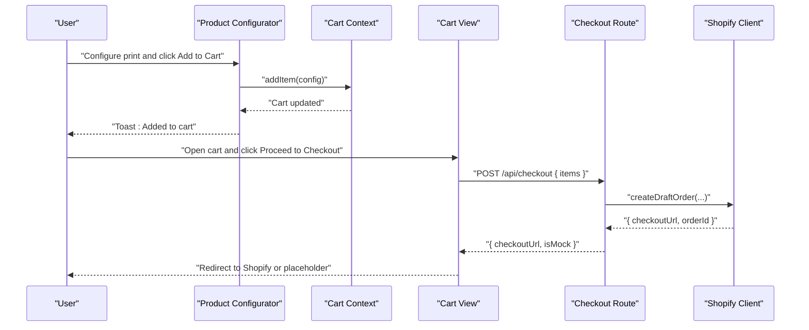
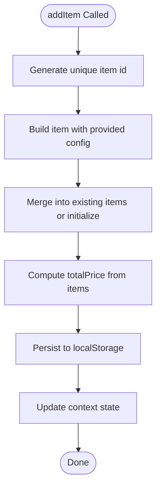
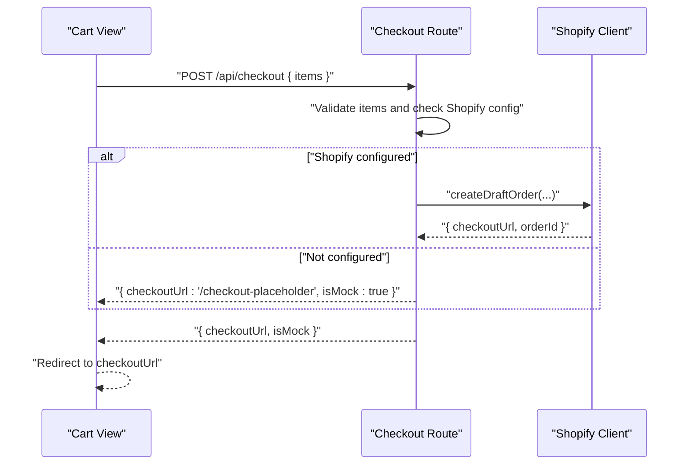
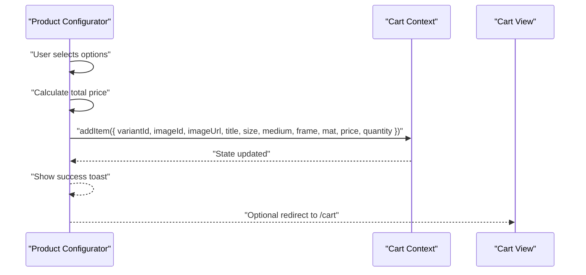
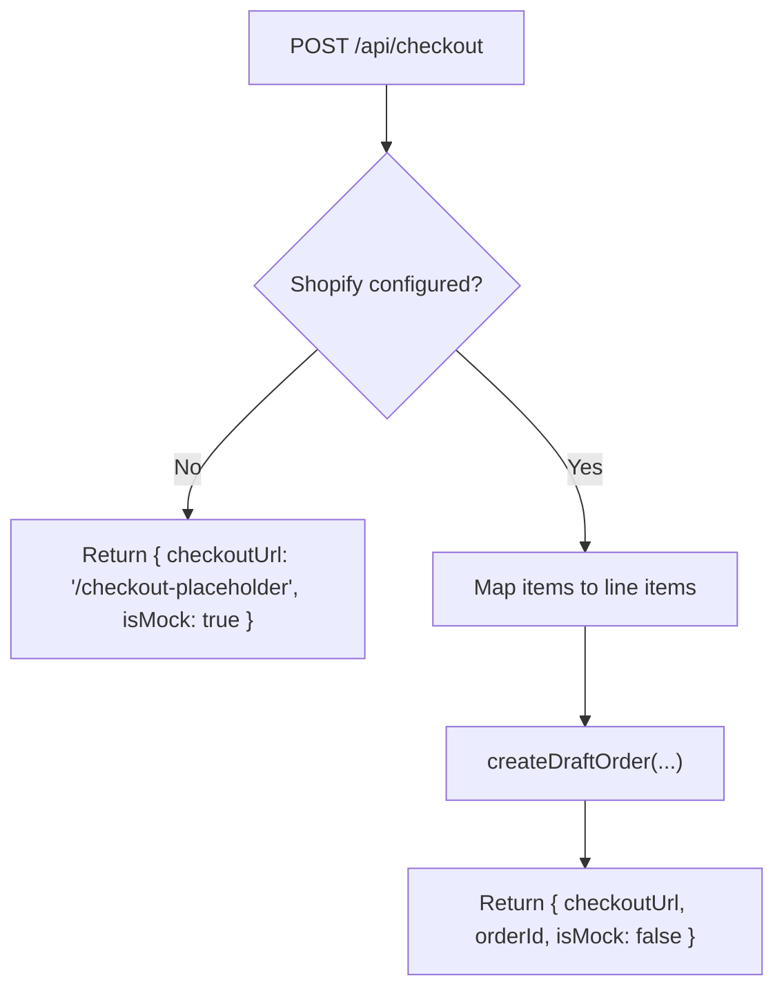
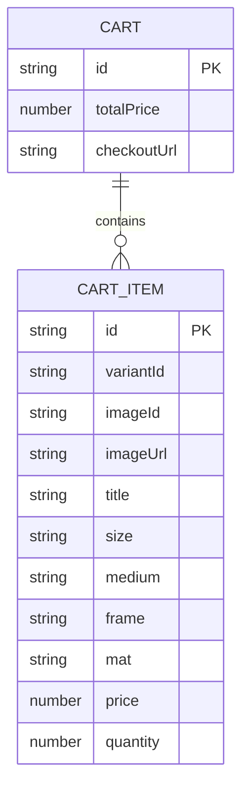
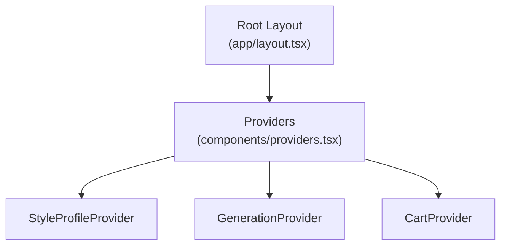
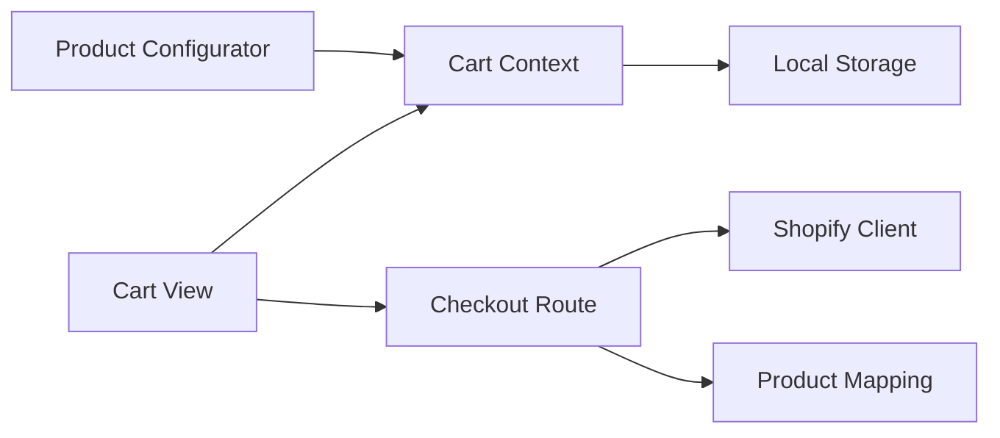

# Shopping Cart

<cite>
**Referenced Files in This Document**
- [app/cart/page.tsx](file://app/cart/page.tsx)
- [components/cart/cart-view.tsx](file://components/cart/cart-view.tsx)
- [lib/contexts.tsx](file://lib/contexts.tsx)
- [lib/types.ts](file://lib/types.ts)
- [lib/shopify.ts](file://lib/shopify.ts)
- [app/api/checkout/route.ts](file://app/api/checkout/route.ts)
- [components/providers.tsx](file://components/providers.tsx)
- [app/layout.tsx](file://app/layout.tsx)
- [components/configure/product-configurator.tsx](file://components/configure/product-configurator.tsx)
- [lib/product-mapping.ts](file://lib/product-mapping.ts)
- [lib/shopify-mock.ts](file://lib/shopify-mock.ts)
</cite>

## Table of Contents
1. [Introduction](#introduction)
2. [Project Structure](#project-structure)
3. [Core Components](#core-components)
4. [Architecture Overview](#architecture-overview)
5. [Detailed Component Analysis](#detailed-component-analysis)
6. [Dependency Analysis](#dependency-analysis)
7. [Performance Considerations](#performance-considerations)
8. [Troubleshooting Guide](#troubleshooting-guide)
9. [Conclusion](#conclusion)

## Introduction
This document provides comprehensive documentation for the Shopping Cart feature. It covers cart state management, item addition and removal, quantity adjustments, price calculations, persistence and session management, and the checkout workflow integrating with Shopify. It also documents the cart view components, component architecture, context providers, and state synchronization patterns. Practical examples demonstrate adding items via the product configurator and initiating checkout through the cart view.

## Project Structure
The Shopping Cart feature spans several layers:
- UI pages and views: cart page and cart view component
- Context providers: cart, generation, and style profile providers
- Types and interfaces: cart item and cart model definitions
- Backend API: checkout route handling order creation and redirect
- Shopify integration: storefront client and mock implementations
- Product configuration: product configurator that adds items to the cart

```mermaid
graph TB
subgraph "UI Layer"
CP["Cart Page<br/>(app/cart/page.tsx)"]
CV["Cart View<br/>(components/cart/cart-view.tsx)"]
PC["Product Configurator<br/>(components/configure/product-configurator.tsx)"]
end
subgraph "State Layer"
PR["Providers Wrapper<br/>(components/providers.tsx)"]
CTX["Cart Context<br/>(lib/contexts.tsx)"]
LAYOUT["Root Layout<br/>(app/layout.tsx)"]
end
subgraph "Types & Models"
TYPES["Types & Interfaces<br/>(lib/types.ts)"]
end
subgraph "Backend API"
API["Checkout Route<br/>(app/api/checkout/route.ts)"]
end
subgraph "Shopify Integration"
SF["Shopify Client<br/>(lib/shopify.ts)"]
MOCK["Shopify Mock<br/>(lib/shopify-mock.ts)"]
MAP["Product Mapping<br/>(lib/product-mapping.ts)"]
end
CP --> CV
PR --> CTX
LAYOUT --> PR
PC --> CTX
CV --> API
API --> SF
API --> MAP
CTX --> CV
CTX --> PC
TYPES -. defines .-> CTX
TYPES -. defines .-> API
```

**Diagram sources**
- [app/cart/page.tsx:1-11](file://app/cart/page.tsx#L1-L11)
- [components/cart/cart-view.tsx:1-221](file://components/cart/cart-view.tsx#L1-L221)
- [components/providers.tsx:1-14](file://components/providers.tsx#L1-L14)
- [lib/contexts.tsx:1-255](file://lib/contexts.tsx#L1-L255)
- [app/layout.tsx:1-43](file://app/layout.tsx#L1-L43)
- [lib/types.ts:1-132](file://lib/types.ts#L1-L132)
- [app/api/checkout/route.ts:1-76](file://app/api/checkout/route.ts#L1-L76)
- [lib/shopify.ts:1-303](file://lib/shopify.ts#L1-L303)
- [lib/shopify-mock.ts:1-74](file://lib/shopify-mock.ts#L1-L74)
- [lib/product-mapping.ts:1-68](file://lib/product-mapping.ts#L1-L68)
- [components/configure/product-configurator.tsx:1-279](file://components/configure/product-configurator.tsx#L1-L279)

**Section sources**
- [app/cart/page.tsx:1-11](file://app/cart/page.tsx#L1-L11)
- [components/cart/cart-view.tsx:1-221](file://components/cart/cart-view.tsx#L1-L221)
- [lib/contexts.tsx:1-255](file://lib/contexts.tsx#L1-L255)
- [lib/types.ts:1-132](file://lib/types.ts#L1-L132)
- [app/api/checkout/route.ts:1-76](file://app/api/checkout/route.ts#L1-L76)
- [lib/shopify.ts:1-303](file://lib/shopify.ts#L1-L303)
- [components/providers.tsx:1-14](file://components/providers.tsx#L1-L14)
- [app/layout.tsx:1-43](file://app/layout.tsx#L1-L43)
- [components/configure/product-configurator.tsx:1-279](file://components/configure/product-configurator.tsx#L1-L279)
- [lib/product-mapping.ts:1-68](file://lib/product-mapping.ts#L1-L68)
- [lib/shopify-mock.ts:1-74](file://lib/shopify-mock.ts#L1-L74)

## Core Components
- Cart Context: Provides cart state, add/remove item operations, item count, total price, and clear cart. Persists to local storage and exposes a checkout URL.
- Cart View: Renders cart items, order summary, and handles checkout initiation. Integrates with the backend checkout API.
- Product Configurator: Allows users to configure size, medium, frame, and mat; calculates price; and adds items to the cart.
- Checkout Route: Creates a Shopify draft order or returns a mock checkout URL when Shopify is not configured.
- Shopify Client: Implements Storefront API calls for cart operations and draft order creation.
- Providers Wrapper: Wraps the app with context providers to enable global state access.

Key responsibilities:
- State management: Centralized in Cart Context with local storage persistence.
- Item lifecycle: Add, remove, and compute totals.
- Price calculation: Derived from configuration selections and validated resolution.
- Checkout flow: Calls backend API and redirects to Shopify or placeholder checkout.

**Section sources**
- [lib/contexts.tsx:164-255](file://lib/contexts.tsx#L164-L255)
- [components/cart/cart-view.tsx:13-221](file://components/cart/cart-view.tsx#L13-L221)
- [components/configure/product-configurator.tsx:19-279](file://components/configure/product-configurator.tsx#L19-L279)
- [app/api/checkout/route.ts:5-76](file://app/api/checkout/route.ts#L5-L76)
- [lib/shopify.ts:108-303](file://lib/shopify.ts#L108-L303)
- [components/providers.tsx:5-13](file://components/providers.tsx#L5-L13)

## Architecture Overview
The cart feature follows a layered architecture:
- UI layer: Pages and components render cart state and collect user actions.
- State layer: Context providers manage global state and persistence.
- Business logic layer: Types define data contracts; calculators and validators support configuration.
- Integration layer: Backend API orchestrates Shopify order creation; Shopify client handles API requests.

**Diagram sources**
- [components/configure/product-configurator.tsx:44-69](file://components/configure/product-configurator.tsx#L44-L69)
- [lib/contexts.tsx:207-237](file://lib/contexts.tsx#L207-L237)
- [components/cart/cart-view.tsx:18-52](file://components/cart/cart-view.tsx#L18-L52)
- [app/api/checkout/route.ts:5-76](file://app/api/checkout/route.ts#L5-L76)
- [lib/shopify.ts:108-157](file://lib/shopify.ts#L108-L157)

## Detailed Component Analysis

### Cart Context and State Management
The Cart Context manages:
- Cart state: id, items array, computed total price, and checkout URL.
- Operations: addItem, removeItem, clearCart.
- Persistence: loads from and saves to local storage.
- Derived values: itemCount and totalPrice computed from items.

Implementation highlights:
- addItem generates a unique item id and updates total price by summing unit prices multiplied by quantities.
- removeItem filters out the specified item; clears local storage when cart becomes empty.
- clearCart resets state and removes persisted data.
- itemCount sums quantities across items; totalPrice reflects the aggregated price.

**Diagram sources**
- [lib/contexts.tsx:207-219](file://lib/contexts.tsx#L207-L219)

**Section sources**
- [lib/contexts.tsx:164-255](file://lib/contexts.tsx#L164-L255)
- [lib/types.ts:90-110](file://lib/types.ts#L90-L110)

### Cart View Component
Responsibilities:
- Render empty state and cart items with animated transitions.
- Display item details: image, title, configuration, and price.
- Provide remove action per item.
- Show order summary with subtotal, shipping, and total.
- Initiate checkout by calling the backend API and handling responses.

Checkout flow:
- Validates non-empty cart.
- Sends items to /api/checkout.
- On success, checks isMock flag to decide redirect to Shopify or placeholder.
- Handles errors with alerts and disables checkout button during processing.

**Diagram sources**
- [components/cart/cart-view.tsx:18-52](file://components/cart/cart-view.tsx#L18-L52)
- [app/api/checkout/route.ts:5-76](file://app/api/checkout/route.ts#L5-L76)
- [lib/shopify.ts:108-157](file://lib/shopify.ts#L108-L157)

**Section sources**
- [components/cart/cart-view.tsx:13-221](file://components/cart/cart-view.tsx#L13-L221)

### Product Configurator Integration
The configurator:
- Selects size, medium, frame, and optional mat.
- Calculates total price based on selections.
- Validates resolution against chosen size.
- Adds a configured item to the cart via Cart Context.
- Provides immediate feedback with a toast and optional navigation to the cart.

**Diagram sources**
- [components/configure/product-configurator.tsx:33-69](file://components/configure/product-configurator.tsx#L33-L69)
- [lib/contexts.tsx:207-219](file://lib/contexts.tsx#L207-L219)

**Section sources**
- [components/configure/product-configurator.tsx:19-279](file://components/configure/product-configurator.tsx#L19-L279)

### Checkout Workflow and Shopify Integration
Backend checkout route:
- Validates presence of items.
- Checks if Shopify is configured; if not, returns a mock checkout URL and marks isMock.
- Converts cart items to line items for Shopify draft order creation.
- Creates a draft order and returns checkout URL and order id.
- Returns structured error responses on failure.

Shopify client:
- Provides typed functions for cart operations and draft order creation.
- Handles authentication, endpoint construction, and error parsing.
- Exposes helpers to check configuration status.

**Diagram sources**
- [app/api/checkout/route.ts:5-76](file://app/api/checkout/route.ts#L5-L76)
- [lib/shopify.ts:108-157](file://lib/shopify.ts#L108-L157)

**Section sources**
- [app/api/checkout/route.ts:5-76](file://app/api/checkout/route.ts#L5-L76)
- [lib/shopify.ts:17-70](file://lib/shopify.ts#L17-L70)

### Data Models and Type Contracts
The cart data model is defined by types:
- CartItem: id, variantId, image identifiers, title, configuration attributes, unit price, and quantity.
- Cart: id, items array, totalPrice, and checkoutUrl.

These types ensure consistent serialization and deserialization across components and API boundaries.

**Diagram sources**
- [lib/types.ts:90-110](file://lib/types.ts#L90-L110)

**Section sources**
- [lib/types.ts:90-110](file://lib/types.ts#L90-L110)

### Component Architecture and Provider Setup
The application initializes providers at the root level:
- Providers wraps StyleProfileProvider, GenerationProvider, and CartProvider.
- Root layout renders Providers around the entire app, ensuring global availability of cart and other contexts.

**Diagram sources**
- [app/layout.tsx:34-38](file://app/layout.tsx#L34-L38)
- [components/providers.tsx:5-13](file://components/providers.tsx#L5-L13)

**Section sources**
- [app/layout.tsx:26-42](file://app/layout.tsx#L26-L42)
- [components/providers.tsx:1-14](file://components/providers.tsx#L1-L14)

## Dependency Analysis
The cart feature exhibits clear separation of concerns:
- UI depends on Cart Context for state and operations.
- Cart Context persists state locally and computes derived values.
- Product Configurator depends on Cart Context to add items.
- Cart View depends on Cart Context and calls the backend checkout API.
- Backend checkout route depends on Shopify client and product mapping.
- Shopify client encapsulates API communication and error handling.

Potential circular dependencies:
- None observed among cart-related modules; dependencies flow unidirectionally from UI to state to backend.

External dependencies:
- Next.js routing and server actions for API endpoints.
- Shopify Storefront API for cart and order operations.
- Local storage for persistence.

**Diagram sources**
- [components/cart/cart-view.tsx:15-52](file://components/cart/cart-view.tsx#L15-L52)
- [lib/contexts.tsx:185-250](file://lib/contexts.tsx#L185-L250)
- [components/configure/product-configurator.tsx:22-69](file://components/configure/product-configurator.tsx#L22-L69)
- [app/api/checkout/route.ts:5-76](file://app/api/checkout/route.ts#L5-L76)
- [lib/shopify.ts:108-157](file://lib/shopify.ts#L108-L157)
- [lib/product-mapping.ts:37-49](file://lib/product-mapping.ts#L37-L49)

**Section sources**
- [components/cart/cart-view.tsx:13-221](file://components/cart/cart-view.tsx#L13-L221)
- [lib/contexts.tsx:164-255](file://lib/contexts.tsx#L164-L255)
- [components/configure/product-configurator.tsx:19-279](file://components/configure/product-configurator.tsx#L19-L279)
- [app/api/checkout/route.ts:5-76](file://app/api/checkout/route.ts#L5-L76)
- [lib/shopify.ts:108-157](file://lib/shopify.ts#L108-L157)
- [lib/product-mapping.ts:1-68](file://lib/product-mapping.ts#L1-L68)

## Performance Considerations
- Local storage persistence: Cart state is serialized and deserialized on mount and on each change. Keep cart items reasonably sized to minimize storage overhead.
- Computation of totals: Summation occurs on state updates; avoid unnecessary re-renders by using memoization for derived values where appropriate.
- API calls: The checkout route performs network operations; cache results where feasible and provide loading states to improve UX.
- Image rendering: Cart items display optimized images; ensure image sizes match intended display dimensions to reduce bandwidth.

## Troubleshooting Guide
Common issues and resolutions:
- Empty cart or missing items:
  - Verify addItem is called with valid configuration and that local storage is accessible.
  - Confirm Cart Context is wrapped by Providers and initialized in the root layout.
- Checkout fails:
  - Check Shopify configuration flags and tokens; ensure environment variables are set.
  - Review backend error responses for detailed messages.
- Mock vs real checkout:
  - When Shopify is not configured, the system returns a mock checkout URL. Configure Shopify to enable real checkout redirection.
- Product variant mapping:
  - Ensure variant IDs are correctly mapped for the selected size, medium, and frame. Unconfigured mappings log warnings and use mock IDs.

**Section sources**
- [lib/contexts.tsx:189-205](file://lib/contexts.tsx#L189-L205)
- [app/api/checkout/route.ts:17-27](file://app/api/checkout/route.ts#L17-L27)
- [lib/shopify.ts:18-20](file://lib/shopify.ts#L18-L20)
- [lib/product-mapping.ts:41-46](file://lib/product-mapping.ts#L41-L46)

## Conclusion
The Shopping Cart feature integrates UI components, context providers, and backend services to deliver a seamless shopping experience. Cart state is managed centrally with persistence, while the checkout workflow leverages Shopify for order processing. The product configurator provides a smooth path to add items, and the cart view offers a clear summary and checkout initiation. Proper configuration of Shopify and product mappings ensures end-to-end functionality, while mock implementations facilitate development and testing.