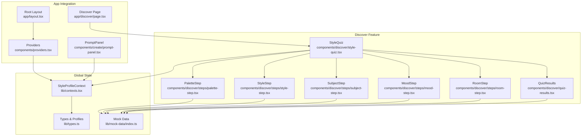
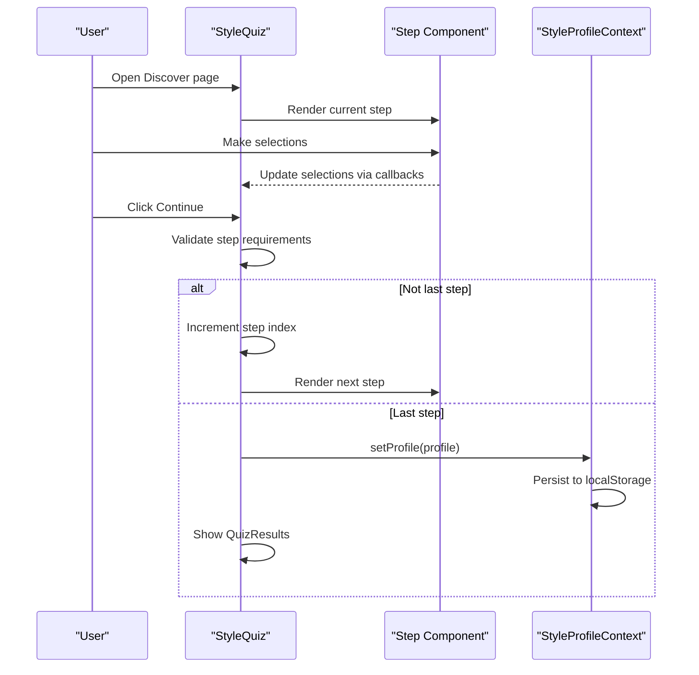
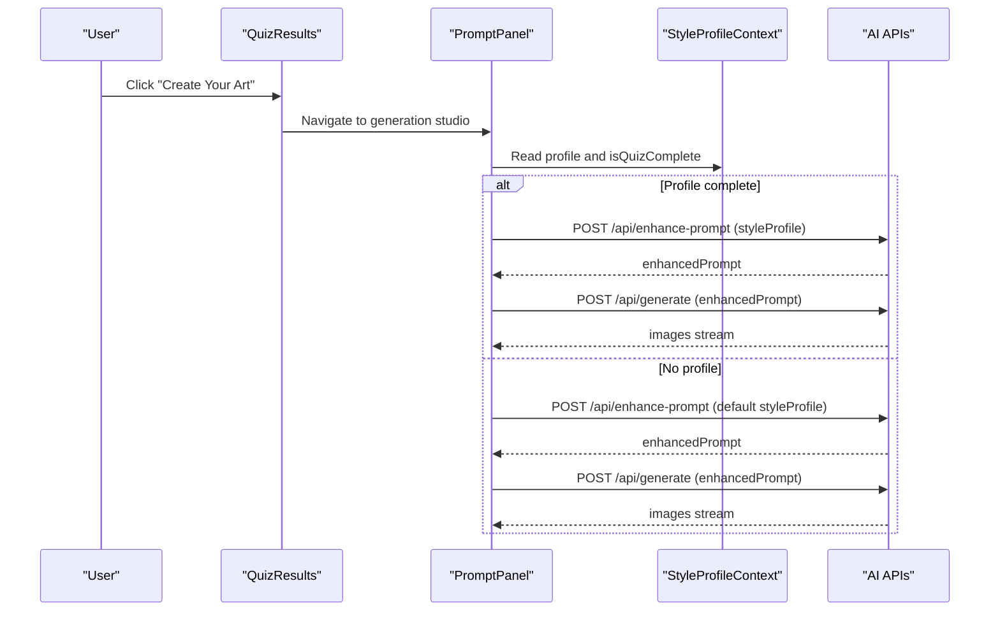
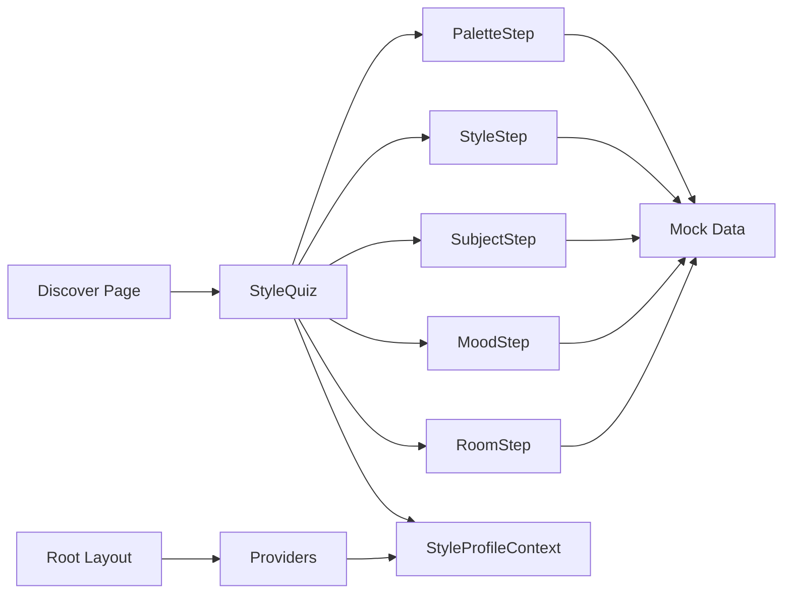

# Quiz Overview & Workflow

<cite>
**Referenced Files in This Document**
- [style-quiz.tsx](file://components/discover/style-quiz.tsx)
- [quiz-results.tsx](file://components/discover/quiz-results.tsx)
- [mood-step.tsx](file://components/discover/steps/mood-step.tsx)
- [palette-step.tsx](file://components/discover/steps/palette-step.tsx)
- [room-step.tsx](file://components/discover/steps/room-step.tsx)
- [style-step.tsx](file://components/discover/steps/style-step.tsx)
- [subject-step.tsx](file://components/discover/steps/subject-step.tsx)
- [contexts.tsx](file://lib/contexts.tsx)
- [types.ts](file://lib/types.ts)
- [index.ts](file://lib/mock-data/index.ts)
- [page.tsx](file://app/discover/page.tsx)
- [layout.tsx](file://app/layout.tsx)
- [providers.tsx](file://components/providers.tsx)
- [prompt-panel.tsx](file://components/create/prompt-panel.tsx)
- [generation-studio.tsx](file://components/create/generation-studio.tsx)
</cite>

## Table of Contents
1. [Introduction](#introduction)
2. [Project Structure](#project-structure)
3. [Core Components](#core-components)
4. [Architecture Overview](#architecture-overview)
5. [Detailed Component Analysis](#detailed-component-analysis)
6. [Dependency Analysis](#dependency-analysis)
7. [Performance Considerations](#performance-considerations)
8. [Troubleshooting Guide](#troubleshooting-guide)
9. [Conclusion](#conclusion)

## Introduction
This document explains the Style Discovery Quiz: its five-step architecture, navigation flow, state management, and user experience. It also documents how quiz results integrate with the AI generation system to influence artwork recommendations and starting concepts.

## Project Structure
The quiz lives under the discover feature and is composed of:
- A main quiz component orchestrating steps and transitions
- Five step components for palette, style, subject, mood, and room
- A results screen summarizing the profile and offering next actions
- A global style profile context for persistence and cross-component sharing
- Mock data for quiz options and starting concepts

**Diagram sources**
- [style-quiz.tsx:17-144](file://components/discover/style-quiz.tsx#L17-L144)
- [quiz-results.tsx:9-97](file://components/discover/quiz-results.tsx#L9-L97)
- [palette-step.tsx:7-59](file://components/discover/steps/palette-step.tsx#L7-L59)
- [style-step.tsx:8-61](file://components/discover/steps/style-step.tsx#L8-L61)
- [subject-step.tsx:8-61](file://components/discover/steps/subject-step.tsx#L8-L61)
- [mood-step.tsx:8-51](file://components/discover/steps/mood-step.tsx#L8-L51)
- [room-step.tsx:8-51](file://components/discover/steps/room-step.tsx#L8-L51)
- [contexts.tsx:30-69](file://lib/contexts.tsx#L30-L69)
- [types.ts:1-132](file://lib/types.ts#L1-L132)
- [index.ts:239-285](file://lib/mock-data/index.ts#L239-L285)
- [layout.tsx:34-38](file://app/layout.tsx#L34-L38)
- [page.tsx:8-10](file://app/discover/page.tsx#L8-L10)
- [providers.tsx:5-13](file://components/providers.tsx#L5-L13)
- [prompt-panel.tsx:20-34](file://components/create/prompt-panel.tsx#L20-L34)

**Section sources**
- [layout.tsx:34-38](file://app/layout.tsx#L34-L38)
- [providers.tsx:5-13](file://components/providers.tsx#L5-L13)
- [page.tsx:8-10](file://app/discover/page.tsx#L8-L10)

## Core Components
- StyleQuiz: Orchestrates the five-step quiz, manages current step, collects selections, validates progression, and renders either the current step or the results screen.
- Step components: PaletteStep, StyleStep, SubjectStep, MoodStep, RoomStep encapsulate selection logic and UI for each step.
- QuizResults: Displays the synthesized style profile, visual palette strip, and action buttons to create art or browse the gallery.
- StyleProfileContext: Provides a persisted style profile across sessions, exposes a completion flag, and persists to local storage.

Key behaviors:
- Navigation: Next/back buttons advance or regress through steps; the last step saves the profile and shows results.
- Validation: Each step enforces minimum selections (e.g., 1 palette, 1 style, 1 subject; 1 mood and 1 room respectively).
- State: Local component state holds selections per step; on completion, the profile is written to the global context and persisted.

**Section sources**
- [style-quiz.tsx:17-144](file://components/discover/style-quiz.tsx#L17-L144)
- [quiz-results.tsx:9-97](file://components/discover/quiz-results.tsx#L9-L97)
- [contexts.tsx:30-69](file://lib/contexts.tsx#L30-L69)

## Architecture Overview
The quiz is a client-side flow controlled by a single component with five distinct step views. At completion, the profile is saved to a React context provider and persisted to local storage. The same profile is later consumed by the AI generation panel to tailor prompts and starting concepts.

**Diagram sources**
- [style-quiz.tsx:29-48](file://components/discover/style-quiz.tsx#L29-L48)
- [contexts.tsx:46-49](file://lib/contexts.tsx#L46-L49)

## Detailed Component Analysis

### StyleQuiz: Main Orchestrator
Responsibilities:
- Track current step index and whether results are shown
- Maintain selections for palettes, styles, subjects, mood, and room
- Validate readiness to proceed per step
- Transition to results on final step and persist the profile
- Render animated step transitions and progress bar

Navigation and validation:
- canProceed checks current step’s requirements
- handleNext increments step or finalizes profile
- handleBack decrements step

Results rendering:
- On completion, renders QuizResults with callbacks to navigate to creation or gallery

Progress UI:
- Displays step number and label
- Animated progress bar reflects current step

**Section sources**
- [style-quiz.tsx:17-144](file://components/discover/style-quiz.tsx#L17-L144)

### Step Components: Selection Logic and UX
Each step component:
- Receives selected values and an update callback
- Renders a grid of options with visual feedback
- Enforces maximum selections per step (2 for palette/style/subject; 1 for mood/room)
- Uses shared mock data for labels, images, and color arrays

PaletteStep:
- Toggles selection up to a maximum
- Visualizes color swatches per palette

StyleStep, SubjectStep:
- Toggle selection with hover and selection states
- Display associated images and labels

MoodStep, RoomStep:
- Single-select grids with prominent imagery and overlay labels

**Section sources**
- [palette-step.tsx:7-59](file://components/discover/steps/palette-step.tsx#L7-L59)
- [style-step.tsx:8-61](file://components/discover/steps/style-step.tsx#L8-L61)
- [subject-step.tsx:8-61](file://components/discover/steps/subject-step.tsx#L8-L61)
- [mood-step.tsx:8-51](file://components/discover/steps/mood-step.tsx#L8-L51)
- [room-step.tsx:8-51](file://components/discover/steps/room-step.tsx#L8-L51)
- [index.ts:239-285](file://lib/mock-data/index.ts#L239-L285)

### QuizResults: Completion Screen
Displays:
- A headline confirming the profile is ready
- A horizontal palette strip built from selected palettes
- Tag badges for styles, subjects, mood, and room
- Two primary actions: Create Your Art (navigate to generation) and Browse Gallery

**Section sources**
- [quiz-results.tsx:9-97](file://components/discover/quiz-results.tsx#L9-L97)
- [index.ts:239-247](file://lib/mock-data/index.ts#L239-L247)

### State Management: StyleProfileContext
Provides:
- profile: current style profile or null
- setProfile: updates state and persists to localStorage
- clearProfile: clears state and removes from localStorage
- isQuizComplete: computed flag indicating whether all required fields are present

Persistence:
- Loads profile from localStorage on mount
- Saves on every setProfile call

Integration:
- Used by StyleQuiz to finalize and persist the profile
- Consumed by PromptPanel to tailor AI generation

**Section sources**
- [contexts.tsx:30-69](file://lib/contexts.tsx#L30-L69)
- [types.ts:1-8](file://lib/types.ts#L1-L8)

### Types and Mock Data
Types define the shape of the style profile and related requests/responses. Mock data provides:
- Option lists for palettes, styles, subjects, moods, rooms
- Starting concepts used by the generation studio
- Gallery items for browsing

These enable the quiz to render meaningful choices and inform downstream generation.

**Section sources**
- [types.ts:1-132](file://lib/types.ts#L1-L132)
- [index.ts:239-285](file://lib/mock-data/index.ts#L239-L285)

### Integration with AI Generation
When the user navigates to the generation studio:
- PromptPanel reads the current style profile from the context
- If a complete profile exists, it is used to enhance prompts and seed starting concepts
- If not, a default profile is applied to ensure generation can proceed

**Diagram sources**
- [quiz-results.tsx:56-60](file://components/discover/quiz-results.tsx#L56-L60)
- [prompt-panel.tsx:33-61](file://components/create/prompt-panel.tsx#L33-L61)
- [contexts.tsx:56-56](file://lib/contexts.tsx#L56-L56)

**Section sources**
- [prompt-panel.tsx:33-61](file://components/create/prompt-panel.tsx#L33-L61)
- [generation-studio.tsx:8-34](file://components/create/generation-studio.tsx#L8-L34)

## Dependency Analysis
The quiz depends on:
- Step components for rendering and collecting selections
- StyleProfileContext for persistence and completion detection
- Mock data for option sets and visuals
- Global providers wiring the context into the app shell

**Diagram sources**
- [style-quiz.tsx:8-12](file://components/discover/style-quiz.tsx#L8-L12)
- [contexts.tsx:30-69](file://lib/contexts.tsx#L30-L69)
- [providers.tsx:5-13](file://components/providers.tsx#L5-L13)
- [layout.tsx:34-38](file://app/layout.tsx#L34-L38)
- [page.tsx:8-10](file://app/discover/page.tsx#L8-L10)

**Section sources**
- [style-quiz.tsx:8-12](file://components/discover/style-quiz.tsx#L8-L12)
- [contexts.tsx:30-69](file://lib/contexts.tsx#L30-L69)
- [providers.tsx:5-13](file://components/providers.tsx#L5-L13)
- [layout.tsx:34-38](file://app/layout.tsx#L34-L38)
- [page.tsx:8-10](file://app/discover/page.tsx#L8-L10)

## Performance Considerations
- Client-side state: All quiz state is held locally in the main component and the context, minimizing server round-trips during the quiz.
- Rendering: Steps are rendered conditionally and animated with Framer Motion; keep animations minimal to avoid jank on lower-end devices.
- Persistence: LocalStorage writes occur only on profile completion; batch writes to reduce contention.
- Images: Step components rely on preloaded images; ensure lazy loading and proper sizing to avoid layout shifts.

## Troubleshooting Guide
Common issues and resolutions:
- Cannot proceed to next step
  - Cause: Selection requirements not met for the current step
  - Resolution: Ensure required selections are made (minimum counts per step)
  - Reference: [style-quiz.tsx:29-38](file://components/discover/style-quiz.tsx#L29-L38)

- Profile not persisting
  - Cause: LocalStorage errors or context not mounted
  - Resolution: Verify Providers wrap the app; check browser storage permissions
  - References: [providers.tsx:5-13](file://components/providers.tsx#L5-L13), [contexts.tsx:34-49](file://lib/contexts.tsx#L34-L49)

- Results not appearing after completing quiz
  - Cause: Final step logic not triggered or profile not saved
  - Resolution: Confirm selections meet final step requirements and setProfile is invoked
  - References: [style-quiz.tsx:40-48](file://components/discover/style-quiz.tsx#L40-L48), [contexts.tsx:46-49](file://lib/contexts.tsx#L46-L49)

- AI generation not using profile
  - Cause: Profile incomplete or context not read
  - Resolution: Ensure isQuizComplete is true; verify PromptPanel reads the context
  - References: [contexts.tsx:56-56](file://lib/contexts.tsx#L56-L56), [prompt-panel.tsx:30-33](file://components/create/prompt-panel.tsx#L30-L33)

## Conclusion
The Style Discovery Quiz is a streamlined, five-step journey that captures user preferences and persists them for future AI-assisted creation. Its modular step components, robust validation, and seamless integration with the global style profile context deliver a smooth user experience. Upon completion, the profile influences prompt enhancement and starting concepts, guiding users toward personalized artwork recommendations and efficient generation workflows.