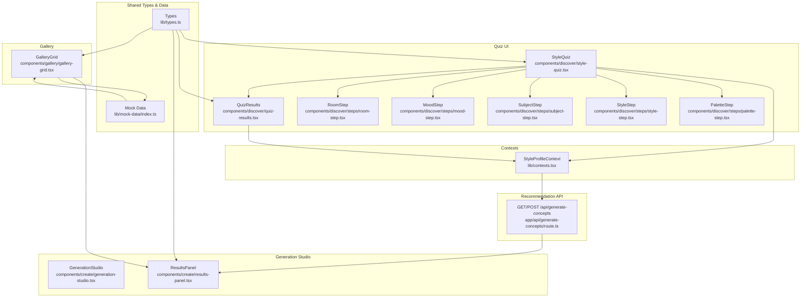
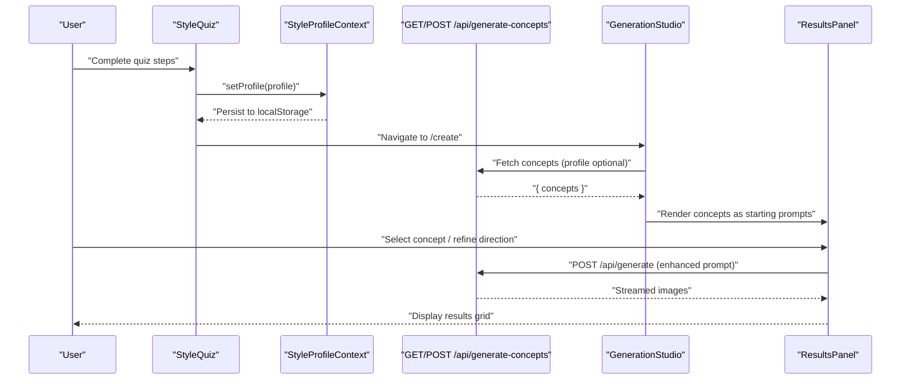
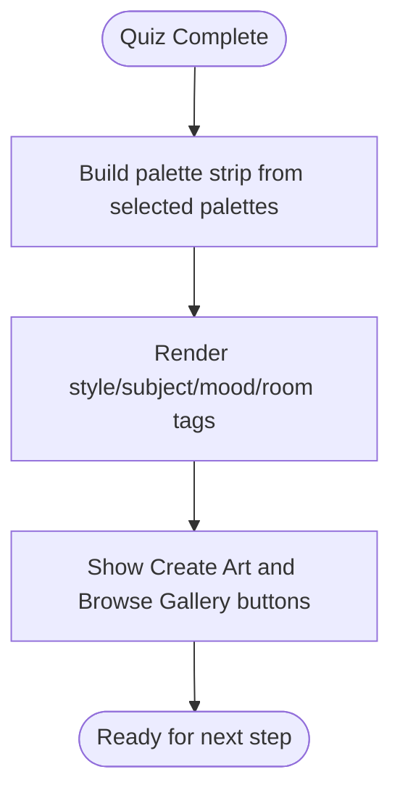
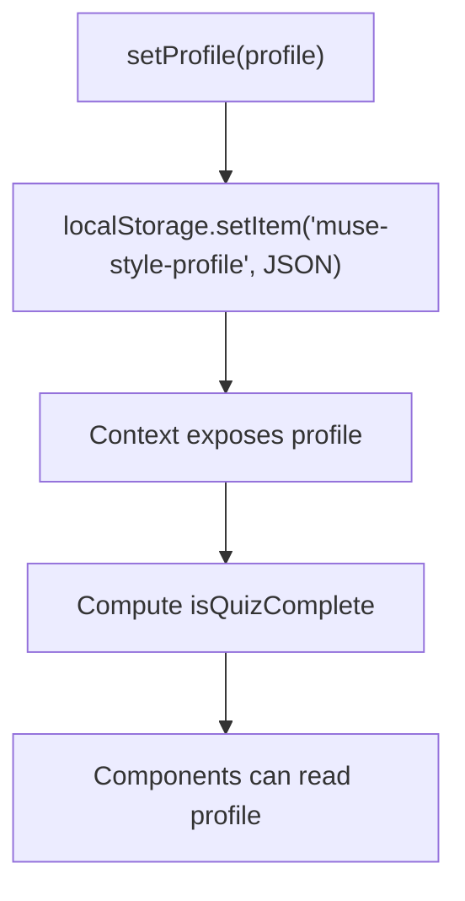
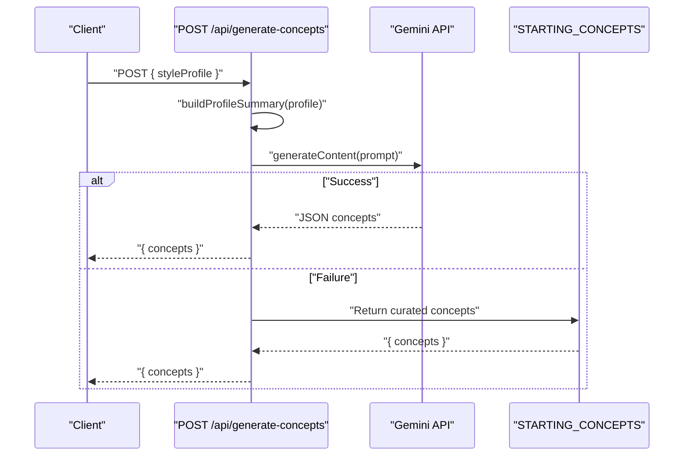
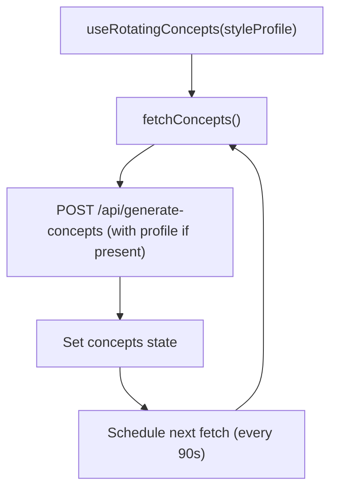
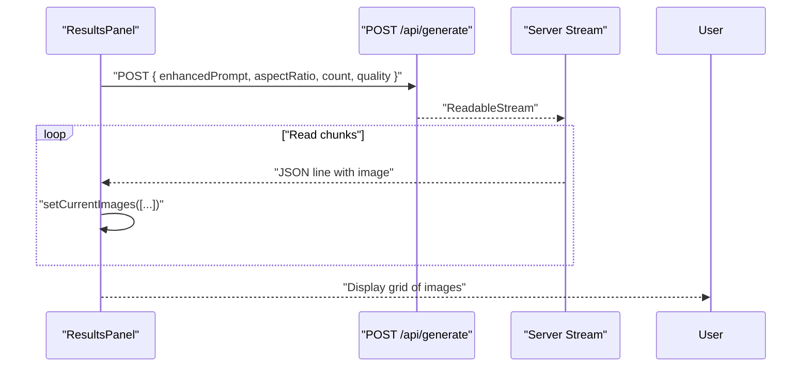
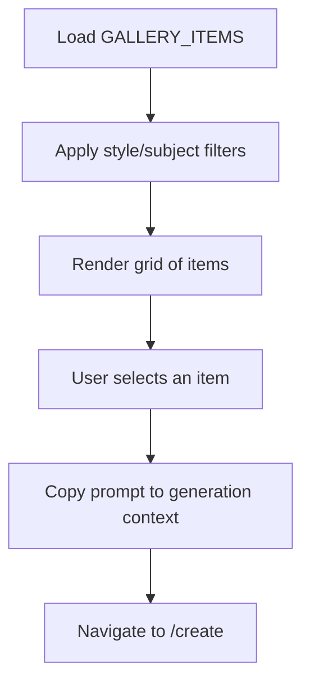
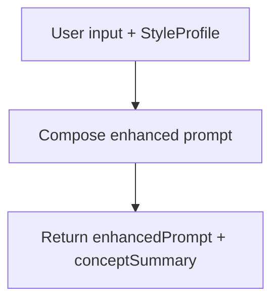
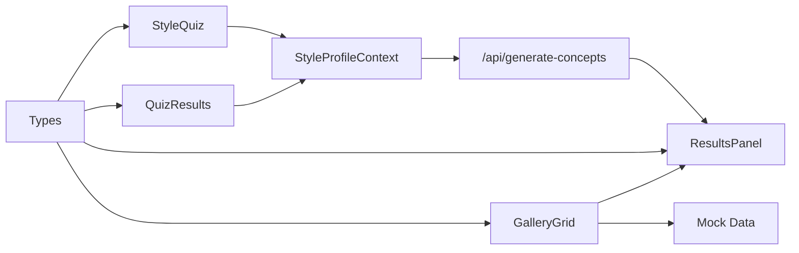

# Quiz Results & Recommendations

<cite>
**Referenced Files in This Document**
- [style-quiz.tsx](file://components/discover/style-quiz.tsx)
- [quiz-results.tsx](file://components/discover/quiz-results.tsx)
- [discover/page.tsx](file://app/discover/page.tsx)
- [types.ts](file://lib/types.ts)
- [mock-data/index.ts](file://lib/mock-data/index.ts)
- [contexts.tsx](file://lib/contexts.tsx)
- [generate-concepts/route.ts](file://app/api/generate-concepts/route.ts)
- [use-rotating-concepts.ts](file://lib/hooks/use-rotating-concepts.ts)
- [generation-studio.tsx](file://components/create/generation-studio.tsx)
- [results-panel.tsx](file://components/create/results-panel.tsx)
- [gallery-grid.tsx](file://components/gallery/gallery-grid.tsx)
- [gallery/page.tsx](file://app/gallery/page.tsx)
- [enhance-prompt/route.ts](file://app/api/enhance-prompt/route.ts)
</cite>

## Table of Contents
1. [Introduction](#introduction)
2. [Project Structure](#project-structure)
3. [Core Components](#core-components)
4. [Architecture Overview](#architecture-overview)
5. [Detailed Component Analysis](#detailed-component-analysis)
6. [Dependency Analysis](#dependency-analysis)
7. [Performance Considerations](#performance-considerations)
8. [Troubleshooting Guide](#troubleshooting-guide)
9. [Conclusion](#conclusion)

## Introduction
This document explains the quiz results and recommendation system that powers personalized AI art discovery. It covers how quiz responses are captured and transformed into a style profile, how that profile is used to generate starting concepts, and how the results are presented across the quiz completion screen, the generation studio, and the gallery. It also documents the recommendation pipeline, filtering and sorting mechanisms, and integration points with the generation and gallery systems. Finally, it outlines performance considerations and caching strategies for recommendation processing.

## Project Structure
The recommendation system spans UI components, shared types, contexts, and server-side APIs:
- Quiz and results UI: Style quiz, step components, and results presentation
- Shared types and mock data: Style profile, concepts, and option sets
- Contexts: Persistent style profile storage and generation session state
- APIs: Concept generation and prompt enhancement
- Generation studio: Results panel with refinement controls
- Gallery: Filtering and browsing curated artwork

**Diagram sources**
- [style-quiz.tsx:17-62](file://components/discover/style-quiz.tsx#L17-L62)
- [quiz-results.tsx:9-17](file://components/discover/quiz-results.tsx#L9-L17)
- [palette-step.tsx:7-22](file://components/discover/steps/palette-step.tsx#L7-L22)
- [style-step.tsx:8-23](file://components/discover/steps/style-step.tsx#L8-L23)
- [subject-step.tsx:8-23](file://components/discover/steps/subject-step.tsx#L8-L23)
- [mood-step.tsx:8-27](file://components/discover/steps/mood-step.tsx#L8-L27)
- [room-step.tsx:8-27](file://components/discover/steps/room-step.tsx#L8-L27)
- [types.ts:1-132](file://lib/types.ts#L1-L132)
- [mock-data/index.ts:240-286](file://lib/mock-data/index.ts#L240-L286)
- [contexts.tsx:30-65](file://lib/contexts.tsx#L30-L65)
- [generate-concepts/route.ts:141-156](file://app/api/generate-concepts/route.ts#L141-L156)
- [generation-studio.tsx:8-34](file://components/create/generation-studio.tsx#L8-L34)
- [results-panel.tsx:24-36](file://components/create/results-panel.tsx#L24-L36)
- [gallery-grid.tsx:30-47](file://components/gallery/gallery-grid.tsx#L30-L47)

**Section sources**
- [style-quiz.tsx:17-62](file://components/discover/style-quiz.tsx#L17-L62)
- [quiz-results.tsx:9-17](file://components/discover/quiz-results.tsx#L9-L17)
- [types.ts:1-132](file://lib/types.ts#L1-L132)
- [mock-data/index.ts:240-286](file://lib/mock-data/index.ts#L240-L286)
- [contexts.tsx:30-65](file://lib/contexts.tsx#L30-L65)
- [generate-concepts/route.ts:141-156](file://app/api/generate-concepts/route.ts#L141-L156)
- [generation-studio.tsx:8-34](file://components/create/generation-studio.tsx#L8-L34)
- [results-panel.tsx:24-36](file://components/create/results-panel.tsx#L24-L36)
- [gallery-grid.tsx:30-47](file://components/gallery/gallery-grid.tsx#L30-L47)

## Core Components
- Style quiz and results:
  - The quiz collects palette, style, subject, mood, and room preferences and renders a results summary with visual palette strips and tag chips.
- Style profile context:
  - Stores the profile in local storage and exposes a flag indicating quiz completion.
- Recommendation API:
  - Generates starting concepts tailored to the user’s style profile or returns fallback concepts.
- Generation studio:
  - Presents generated images and allows refinement via direction tags and history navigation.
- Gallery:
  - Provides filtering by style and subject and integrates with the generation flow.

**Section sources**
- [style-quiz.tsx:17-62](file://components/discover/style-quiz.tsx#L17-L62)
- [quiz-results.tsx:9-17](file://components/discover/quiz-results.tsx#L9-L17)
- [contexts.tsx:30-65](file://lib/contexts.tsx#L30-L65)
- [generate-concepts/route.ts:141-156](file://app/api/generate-concepts/route.ts#L141-L156)
- [results-panel.tsx:24-36](file://components/create/results-panel.tsx#L24-L36)
- [gallery-grid.tsx:30-47](file://components/gallery/gallery-grid.tsx#L30-L47)

## Architecture Overview
The recommendation pipeline begins when the user completes the quiz. Their style profile is persisted and used to request AI-generated starting concepts. The generation studio displays these concepts and supports iterative refinement. Users can browse curated gallery items and trigger generation from a selected piece.

**Diagram sources**
- [style-quiz.tsx:44-46](file://components/discover/style-quiz.tsx#L44-L46)
- [contexts.tsx:46-49](file://lib/contexts.tsx#L46-L49)
- [generate-concepts/route.ts:141-156](file://app/api/generate-concepts/route.ts#L141-L156)
- [generation-studio.tsx:8-34](file://components/create/generation-studio.tsx#L8-L34)
- [results-panel.tsx:24-36](file://components/create/results-panel.tsx#L24-L36)

## Detailed Component Analysis

### Quiz Results Presentation
The quiz results component displays:
- A visual palette strip derived from selected palette options
- Tag chips for styles, subjects, mood, and room
- Call-to-action buttons to create art or browse the gallery

**Diagram sources**
- [quiz-results.tsx:18-69](file://components/discover/quiz-results.tsx#L18-L69)

**Section sources**
- [quiz-results.tsx:9-17](file://components/discover/quiz-results.tsx#L9-L17)
- [quiz-results.tsx:18-69](file://components/discover/quiz-results.tsx#L18-L69)

### Style Profile Context and Persistence
The style profile context persists the user’s choices locally and exposes:
- setProfile: writes to localStorage
- clearProfile: removes from localStorage
- isQuizComplete: computed flag based on presence of selections

**Diagram sources**
- [contexts.tsx:46-56](file://lib/contexts.tsx#L46-L56)

**Section sources**
- [contexts.tsx:30-65](file://lib/contexts.tsx#L30-L65)

### Concept Generation API
The API endpoint builds a profile summary from the style profile and requests AI concepts. It falls back to curated concepts when the AI request fails or the API key is missing.

**Diagram sources**
- [generate-concepts/route.ts:62-80](file://app/api/generate-concepts/route.ts#L62-L80)
- [generate-concepts/route.ts:158-189](file://app/api/generate-concepts/route.ts#L158-L189)
- [mock-data/index.ts:171-237](file://lib/mock-data/index.ts#L171-L237)

**Section sources**
- [generate-concepts/route.ts:62-80](file://app/api/generate-concepts/route.ts#L62-L80)
- [generate-concepts/route.ts:158-189](file://app/api/generate-concepts/route.ts#L158-L189)
- [mock-data/index.ts:171-237](file://lib/mock-data/index.ts#L171-L237)

### Recommendation Hook and Rotation
A client hook fetches concepts periodically and refetches on demand. It respects the presence of a style profile to tailor suggestions.

**Diagram sources**
- [use-rotating-concepts.ts:9-43](file://lib/hooks/use-rotating-concepts.ts#L9-L43)
- [generate-concepts/route.ts:158-189](file://app/api/generate-concepts/route.ts#L158-L189)

**Section sources**
- [use-rotating-concepts.ts:9-43](file://lib/hooks/use-rotating-concepts.ts#L9-L43)

### Generation Studio and Results Panel
The results panel streams generated images and supports:
- Directional refinement via preset tags
- History navigation to previous batches
- Selection of an image to continue to configuration

**Diagram sources**
- [results-panel.tsx:38-122](file://components/create/results-panel.tsx#L38-L122)
- [results-panel.tsx:147-299](file://components/create/results-panel.tsx#L147-L299)

**Section sources**
- [results-panel.tsx:24-36](file://components/create/results-panel.tsx#L24-L36)
- [results-panel.tsx:38-122](file://components/create/results-panel.tsx#L38-L122)
- [results-panel.tsx:147-299](file://components/create/results-panel.tsx#L147-L299)

### Gallery Integration and Filtering
The gallery presents curated artwork and supports:
- Style filter: abstract, realistic, illustrated, surreal, minimal
- Subject filter: landscapes, florals, geometric, space, still-life
- Action: clicking an item copies its prompt into the generation panel

**Diagram sources**
- [gallery-grid.tsx:30-47](file://components/gallery/gallery-grid.tsx#L30-L47)
- [gallery-grid.tsx:110-143](file://components/gallery/gallery-grid.tsx#L110-L143)
- [mock-data/index.ts:82-169](file://lib/mock-data/index.ts#L82-L169)

**Section sources**
- [gallery-grid.tsx:30-47](file://components/gallery/gallery-grid.tsx#L30-L47)
- [gallery-grid.tsx:110-143](file://components/gallery/gallery-grid.tsx#L110-L143)
- [mock-data/index.ts:82-169](file://lib/mock-data/index.ts#L82-L169)

### Prompt Enhancement Integration
While not part of the quiz results per se, the prompt enhancement API composes an enhanced prompt from user input and the style profile, which the generation flow consumes.

**Diagram sources**
- [enhance-prompt/route.ts:82-99](file://app/api/enhance-prompt/route.ts#L82-L99)

**Section sources**
- [enhance-prompt/route.ts:82-99](file://app/api/enhance-prompt/route.ts#L82-L99)

## Dependency Analysis
- Quiz depends on:
  - Step components for palette, style, subject, mood, and room selection
  - Style profile context for persistence and completion flag
- Results depend on:
  - Palette options for visual palette strip
  - Style profile for rendering tags
- Recommendation API depends on:
  - Style profile for tailored generation
  - Gemini API for concept generation
  - Curated fallback concepts when AI is unavailable
- Generation studio depends on:
  - Results panel for displaying and refining images
  - Generation context for prompt and state
- Gallery depends on:
  - Curated items and filters
  - Generation context to copy prompts

**Diagram sources**
- [style-quiz.tsx:17-62](file://components/discover/style-quiz.tsx#L17-L62)
- [quiz-results.tsx:9-17](file://components/discover/quiz-results.tsx#L9-L17)
- [contexts.tsx:30-65](file://lib/contexts.tsx#L30-L65)
- [generate-concepts/route.ts:141-156](file://app/api/generate-concepts/route.ts#L141-L156)
- [results-panel.tsx:24-36](file://components/create/results-panel.tsx#L24-L36)
- [gallery-grid.tsx:30-47](file://components/gallery/gallery-grid.tsx#L30-L47)
- [types.ts:1-132](file://lib/types.ts#L1-L132)
- [mock-data/index.ts:82-169](file://lib/mock-data/index.ts#L82-L169)

**Section sources**
- [style-quiz.tsx:17-62](file://components/discover/style-quiz.tsx#L17-L62)
- [quiz-results.tsx:9-17](file://components/discover/quiz-results.tsx#L9-L17)
- [contexts.tsx:30-65](file://lib/contexts.tsx#L30-L65)
- [generate-concepts/route.ts:141-156](file://app/api/generate-concepts/route.ts#L141-L156)
- [results-panel.tsx:24-36](file://components/create/results-panel.tsx#L24-L36)
- [gallery-grid.tsx:30-47](file://components/gallery/gallery-grid.tsx#L30-L47)
- [types.ts:1-132](file://lib/types.ts#L1-L132)
- [mock-data/index.ts:82-169](file://lib/mock-data/index.ts#L82-L169)

## Performance Considerations
- Concept rotation:
  - Concepts are fetched on mount and every 90 seconds. This reduces cold-start latency for returning users while keeping suggestions fresh.
- Streaming generation:
  - Images are streamed and progressively rendered, improving perceived responsiveness during long-running generations.
- Local storage:
  - Style profile and cart are cached locally to avoid re-fetching on subsequent visits.
- Filtering:
  - Gallery filtering is client-side and memoized to minimize re-computation on rapid toggles.
- API resilience:
  - The concept generation API falls back to curated concepts when the AI service is unavailable, ensuring continuity.

[No sources needed since this section provides general guidance]

## Troubleshooting Guide
- Quiz completion not recognized:
  - Ensure all required selections are made and the context indicates completion.
- No concepts shown:
  - Verify the API key is configured; otherwise, the endpoint returns curated fallback concepts.
- Generation stalls:
  - Confirm the generation endpoint is reachable and the stream is being consumed properly.
- Gallery empty after filtering:
  - Adjust filters; the UI informs users to try different combinations.

**Section sources**
- [contexts.tsx:56-56](file://lib/contexts.tsx#L56-L56)
- [generate-concepts/route.ts:142-155](file://app/api/generate-concepts/route.ts#L142-L155)
- [results-panel.tsx:74-119](file://components/create/results-panel.tsx#L74-L119)
- [gallery-grid.tsx:146-151](file://components/gallery/gallery-grid.tsx#L146-L151)

## Conclusion
The quiz results and recommendation system integrates user preferences captured in the style quiz with AI-generated concepts and curated gallery content. The style profile is persisted locally and used to tailor concept generation, while the generation studio provides an iterative refinement experience. The gallery offers filtering and inspiration, linking back into the generation flow. Together, these components deliver a cohesive, personalized discovery and creation journey.