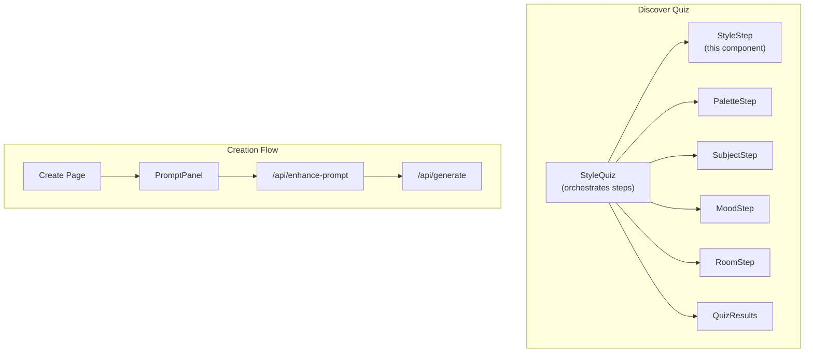
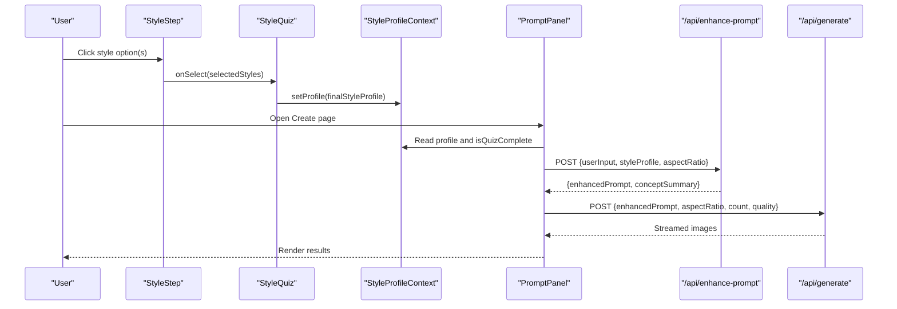
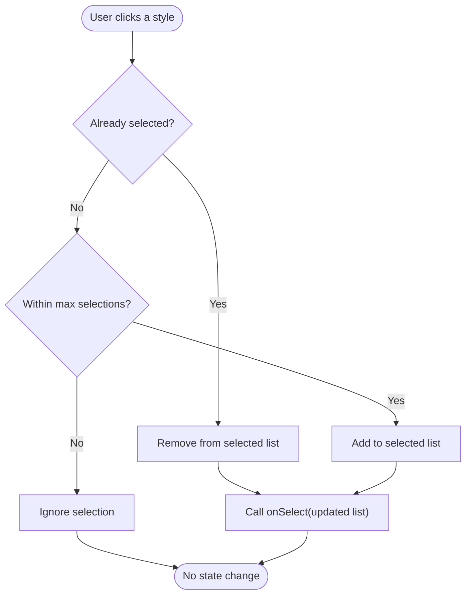
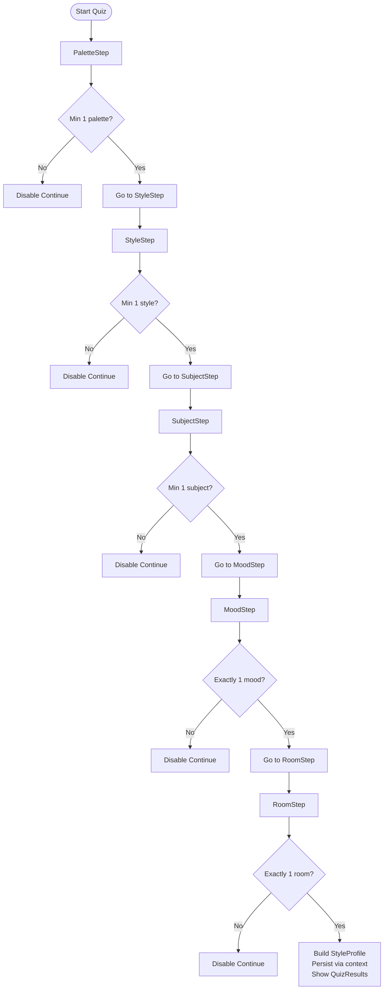
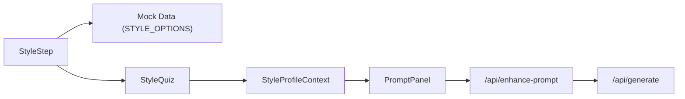

# Artistic Style Step

<cite>
**Referenced Files in This Document**
- [style-step.tsx](file://components/discover/steps/style-step.tsx)
- [style-quiz.tsx](file://components/discover/style-quiz.tsx)
- [types.ts](file://lib/types.ts)
- [index.ts](file://lib/mock-data/index.ts)
- [contexts.tsx](file://lib/contexts.tsx)
- [prompt-panel.tsx](file://components/create/prompt-panel.tsx)
- [enhance-prompt/route.ts](file://app/api/enhance-prompt/route.ts)
- [generate/route.ts](file://app/api/generate/route.ts)
- [use-rotating-concepts.ts](file://lib/hooks/use-rotating-concepts.ts)
- [quiz-results.tsx](file://components/discover/quiz-results.tsx)
- [page.tsx](file://app/create/page.tsx)
</cite>

## Table of Contents
1. [Introduction](#introduction)
2. [Project Structure](#project-structure)
3. [Core Components](#core-components)
4. [Architecture Overview](#architecture-overview)
5. [Detailed Component Analysis](#detailed-component-analysis)
6. [Dependency Analysis](#dependency-analysis)
7. [Performance Considerations](#performance-considerations)
8. [Troubleshooting Guide](#troubleshooting-guide)
9. [Conclusion](#conclusion)

## Introduction
This document explains the Artistic Style Selection Step component used in the discovery flow to capture user preferences for artistic styles. It covers how users choose preferred styles, how selections are presented and validated, and how those choices influence downstream AI prompt enhancement and image generation. It also documents the component’s props, internal state management, integration with the broader recommendation system, and practical examples of how different styles shape the generated artwork.

## Project Structure
The Artistic Style Step is part of a multi-step style quiz that progressively collects user preferences. The quiz orchestrates multiple steps, including color palettes, subjects, moods, and room context, before presenting curated results and guiding the user into the creation flow.

**Diagram sources**
- [style-quiz.tsx:17-144](file://components/discover/style-quiz.tsx#L17-L144)
- [style-step.tsx:8-61](file://components/discover/steps/style-step.tsx#L8-L61)
- [page.tsx:8-10](file://app/create/page.tsx#L8-L10)
- [prompt-panel.tsx:20-241](file://components/create/prompt-panel.tsx#L20-L241)
- [enhance-prompt/route.ts:9-101](file://app/api/enhance-prompt/route.ts#L9-L101)
- [generate/route.ts:19-144](file://app/api/generate/route.ts#L19-L144)

**Section sources**
- [style-quiz.tsx:17-144](file://components/discover/style-quiz.tsx#L17-L144)
- [style-step.tsx:8-61](file://components/discover/steps/style-step.tsx#L8-L61)

## Core Components
- StyleStep: Presents a grid of artistic style options with visual thumbnails and handles multi-selection with a maximum cap.
- StyleQuiz: Manages the quiz lifecycle, maintains per-step state, enforces minimum selections, and persists the final StyleProfile.
- Types: Defines StyleOption and StyleProfile types used across the system.
- Mock Data: Provides STYLE_OPTIONS with identifiers, labels, and image URLs.
- Contexts: Stores and persists the StyleProfile in local storage and exposes completion status.
- PromptPanel: Uses the StyleProfile to enhance prompts and drive generation.
- API Routes: Transform the StyleProfile into an optimized prompt and generate images.

Key integration points:
- StyleStep emits updates to StyleQuiz via onSelect.
- StyleQuiz aggregates selections into a StyleProfile and stores it via a context provider.
- PromptPanel reads the StyleProfile to enrich the generation pipeline.
- API routes consume StyleProfile to build enhanced prompts and generate images.

**Section sources**
- [style-step.tsx:8-61](file://components/discover/steps/style-step.tsx#L8-L61)
- [style-quiz.tsx:17-144](file://components/discover/style-quiz.tsx#L17-L144)
- [types.ts:10-14](file://lib/types.ts#L10-L14)
- [index.ts:249-256](file://lib/mock-data/index.ts#L249-L256)
- [contexts.tsx:30-69](file://lib/contexts.tsx#L30-L69)
- [prompt-panel.tsx:20-241](file://components/create/prompt-panel.tsx#L20-L241)
- [enhance-prompt/route.ts:9-101](file://app/api/enhance-prompt/route.ts#L9-L101)

## Architecture Overview
The StyleStep participates in a five-step quiz. On the “Art Style” step, users select one or more styles. The quiz enforces a minimum selection and persists the StyleProfile. Later, the PromptPanel uses this profile to enhance prompts, which are then sent to the generation API.

**Diagram sources**
- [style-step.tsx:17-23](file://components/discover/steps/style-step.tsx#L17-L23)
- [style-quiz.tsx:44-47](file://components/discover/style-quiz.tsx#L44-L47)
- [contexts.tsx:46-54](file://lib/contexts.tsx#L46-L54)
- [prompt-panel.tsx:35-124](file://components/create/prompt-panel.tsx#L35-L124)
- [enhance-prompt/route.ts:9-101](file://app/api/enhance-prompt/route.ts#L9-L101)
- [generate/route.ts:19-144](file://app/api/generate/route.ts#L19-L144)

## Detailed Component Analysis

### StyleStep Component
Purpose:
- Allow users to pick one or more artistic styles from a curated grid.
- Enforce a maximum selection limit.
- Provide visual feedback for selected items.

Props:
- selected: StyleOption[] — currently selected styles.
- onSelect: (StyleOption[]) => void — callback to update selections.
- maxSelections: number — maximum allowed selections.

Behavior:
- Toggle selection when clicking a style tile.
- Prevent adding selections beyond maxSelections.
- Reflect selection state with visual indicators.

Presentation:
- Grid layout with thumbnail images and labels.
- Hover and selection states change borders and overlays.

Impact on recommendations:
- Selected styles blend into the enhanced prompt, influencing the generated artwork’s aesthetic direction.

**Diagram sources**
- [style-step.tsx:17-23](file://components/discover/steps/style-step.tsx#L17-L23)

**Section sources**
- [style-step.tsx:8-61](file://components/discover/steps/style-step.tsx#L8-L61)
- [index.ts:249-256](file://lib/mock-data/index.ts#L249-L256)

### StyleQuiz Orchestration
Role:
- Manages step progression and validates minimum selections per step.
- Aggregates selections into a StyleProfile.
- Persists the profile and transitions to results.

Key logic:
- Minimum selections:
  - PaletteStep requires at least 1.
  - StyleStep requires at least 1.
  - SubjectStep requires at least 1.
  - MoodStep and RoomStep require exactly 1.
- Finalization:
  - On the last step, constructs StyleProfile and sets it via context.
  - Switches to QuizResults view.

**Diagram sources**
- [style-quiz.tsx:29-48](file://components/discover/style-quiz.tsx#L29-L48)

**Section sources**
- [style-quiz.tsx:17-144](file://components/discover/style-quiz.tsx#L17-L144)
- [types.ts:2-8](file://lib/types.ts#L2-L8)

### StyleProfile Context and Persistence
- Stores the StyleProfile in local storage for continuity across sessions.
- Exposes isQuizComplete to enable/disable dependent UI and flows.
- Clears the profile when needed.

Integration:
- PromptPanel checks isQuizComplete to decide whether to use the profile or fall back to defaults.
- QuizResults displays the aggregated profile.

**Section sources**
- [contexts.tsx:30-69](file://lib/contexts.tsx#L30-L69)
- [prompt-panel.tsx:33-34](file://components/create/prompt-panel.tsx#L33-L34)
- [quiz-results.tsx:9-17](file://components/discover/quiz-results.tsx#L9-L17)

### Prompt Enhancement and Generation Impact
How StyleProfile influences AI generation:
- The API endpoint composes an enhanced prompt by mapping:
  - Palettes → descriptive color phrases
  - Styles → stylistic descriptors
  - Subjects → thematic content
  - Mood → atmospheric tone
  - Room → display context
  - Aspect ratio → composition orientation
- These mappings are concatenated into a single, rich prompt passed to the generator.

Examples of style influence:
- Realistic style emphasizes photographic detail and natural lighting.
- Abstract style introduces expressive, non-representational forms.
- Minimal style focuses on clean lines and negative space.
- Surreal style evokes dreamlike, fantastical compositions.
- Illustrated style suggests illustrative textures and soft edges.
- Retro style adds vintage poster aesthetics.

These choices are reflected in the generated artwork’s composition, lighting, color saturation, and thematic coherence.

**Section sources**
- [enhance-prompt/route.ts:17-76](file://app/api/enhance-prompt/route.ts#L17-L76)
- [enhance-prompt/route.ts:82-99](file://app/api/enhance-prompt/route.ts#L82-L99)
- [prompt-panel.tsx:44-52](file://components/create/prompt-panel.tsx#L44-L52)

### Integration with Recommendation Hooks
- The rotating concepts hook fetches starting concepts tailored to the StyleProfile.
- When a profile exists, the hook posts the profile to a concepts API; otherwise, it falls back to static concepts.
- This ensures the starting concepts align with the user’s style preferences.

**Section sources**
- [use-rotating-concepts.ts:15-34](file://lib/hooks/use-rotating-concepts.ts#L15-L34)

## Dependency Analysis
- StyleStep depends on:
  - Mock data for style options (ids, labels, images).
  - Parent container (StyleQuiz) for state and callbacks.
- StyleQuiz depends on:
  - StyleStep and other step components.
  - Context provider for persistence.
- PromptPanel depends on:
  - StyleProfile context for prompt enrichment.
  - API routes for enhancement and generation.
- API routes depend on:
  - StyleProfile mappings to construct prompts.
  - External image generation service (with mock fallback).

**Diagram sources**
- [style-step.tsx:4](file://components/discover/steps/style-step.tsx#L4)
- [index.ts:249-256](file://lib/mock-data/index.ts#L249-L256)
- [style-quiz.tsx:19-27](file://components/discover/style-quiz.tsx#L19-L27)
- [contexts.tsx:46-54](file://lib/contexts.tsx#L46-L54)
- [prompt-panel.tsx:30-31](file://components/create/prompt-panel.tsx#L30-L31)
- [enhance-prompt/route.ts:9-11](file://app/api/enhance-prompt/route.ts#L9-L11)
- [generate/route.ts:19-21](file://app/api/generate/route.ts#L19-L21)

**Section sources**
- [style-step.tsx:4-6](file://components/discover/steps/style-step.tsx#L4-L6)
- [style-quiz.tsx:19-27](file://components/discover/style-quiz.tsx#L19-L27)
- [contexts.tsx:46-54](file://lib/contexts.tsx#L46-L54)
- [prompt-panel.tsx:30-31](file://components/create/prompt-panel.tsx#L30-L31)
- [enhance-prompt/route.ts:9-11](file://app/api/enhance-prompt/route.ts#L9-L11)
- [generate/route.ts:19-21](file://app/api/generate/route.ts#L19-L21)

## Performance Considerations
- Selection toggling is O(n) per click due to array filtering and spread; acceptable for small lists.
- Debounce or batch updates if the number of options grows substantially.
- Local storage reads/writes occur on profile changes; keep payload minimal.
- Prompt construction is constant-time string concatenation; ensure mappings remain compact.
- Streaming generation reduces perceived latency; maintain chunked parsing robustness.

## Troubleshooting Guide
Common issues and resolutions:
- No selections allowed after reaching max:
  - Ensure maxSelections is configured correctly in the parent step.
  - Verify the selection logic does not permit exceeding the cap.
- Missing profile in generation:
  - Confirm the quiz reached the final step and set the profile.
  - Check local storage for the presence of the profile key.
- Empty or generic prompts:
  - Validate that the StyleProfile contains at least one style.
  - Confirm the prompt enhancement route receives the profile and mappings.
- Images not streaming:
  - Verify the generation API is reachable and returns a streaming response.
  - Check for API key configuration when using external services.

**Section sources**
- [style-step.tsx:17-23](file://components/discover/steps/style-step.tsx#L17-L23)
- [style-quiz.tsx:44-47](file://components/discover/style-quiz.tsx#L44-L47)
- [contexts.tsx:46-54](file://lib/contexts.tsx#L46-L54)
- [prompt-panel.tsx:35-124](file://components/create/prompt-panel.tsx#L35-L124)
- [generate/route.ts:32-64](file://app/api/generate/route.ts#L32-L64)

## Conclusion
The Artistic Style Selection Step is a focused, multi-select UI that captures user preferences and integrates tightly with the broader recommendation and generation pipeline. By combining style choices with palettes, subjects, moods, and room context, the system produces enriched prompts that guide AI-generated artwork toward the user’s desired aesthetic. The component’s simplicity, clear constraints, and strong integration with contexts and APIs make it a reliable foundation for personalized creative outcomes.