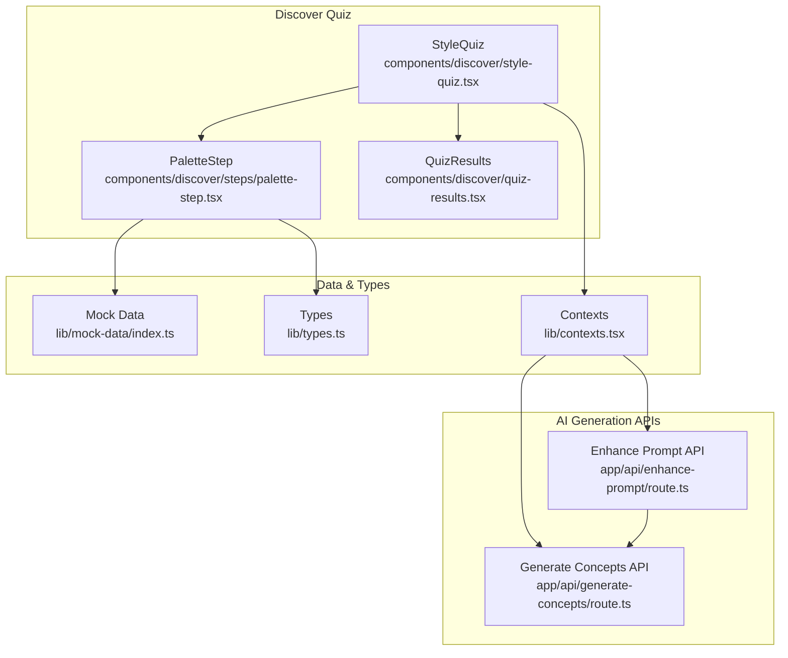
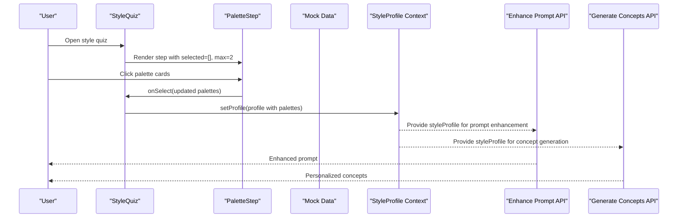
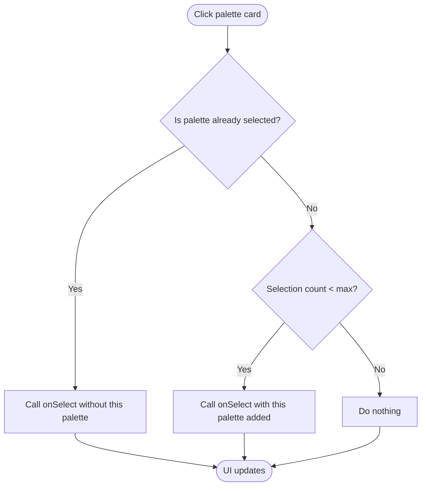
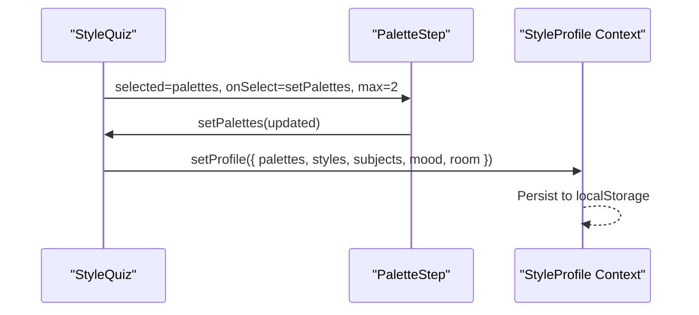
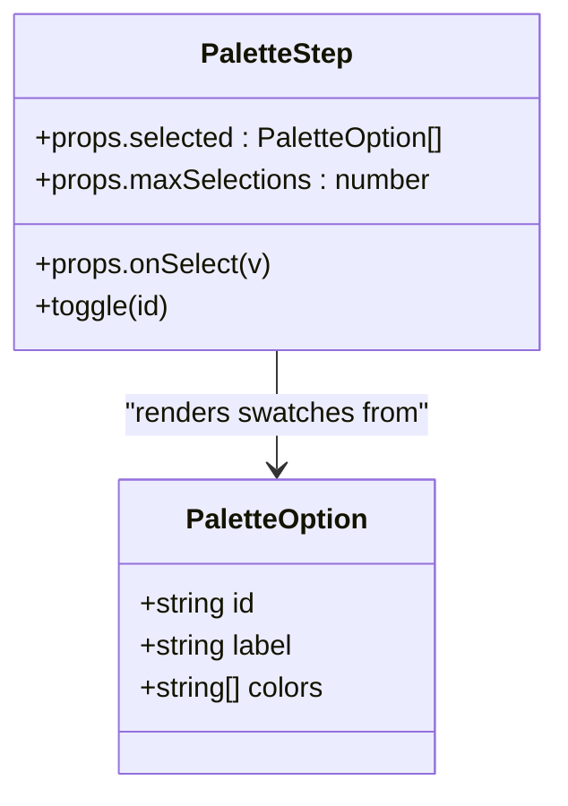
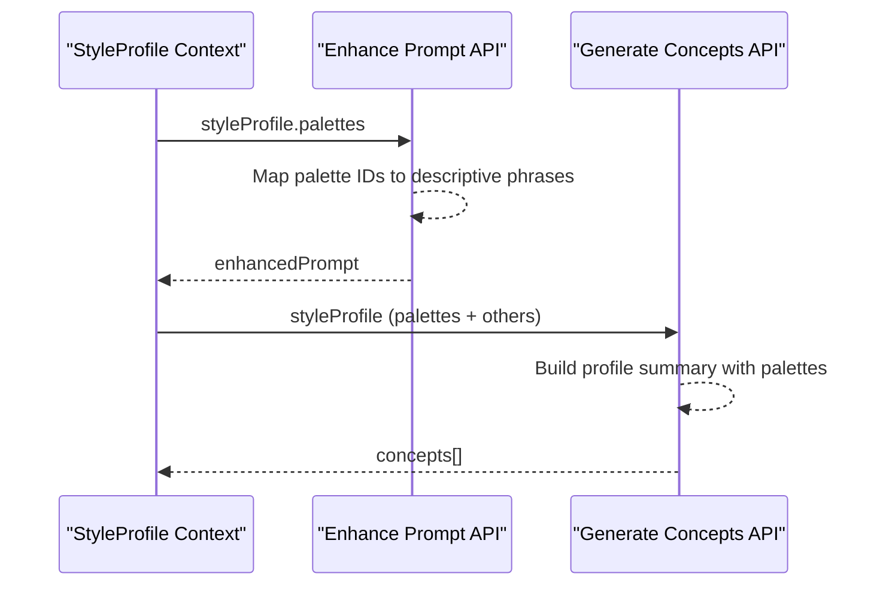
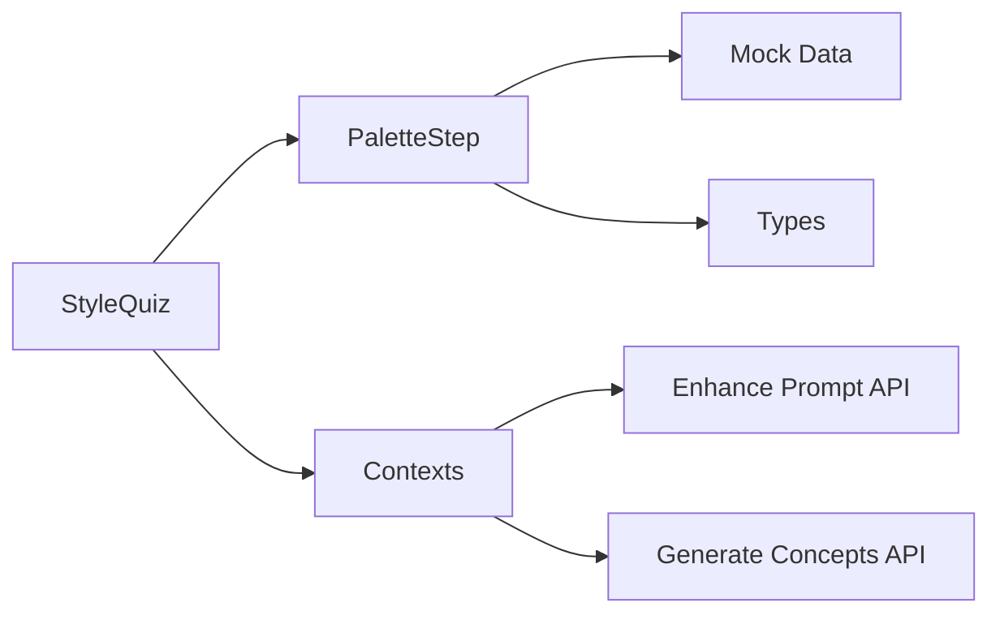

# Color Palette Step

<cite>
**Referenced Files in This Document**
- [palette-step.tsx](file://components/discover/steps/palette-step.tsx)
- [style-quiz.tsx](file://components/discover/style-quiz.tsx)
- [index.ts](file://lib/mock-data/index.ts)
- [types.ts](file://lib/types.ts)
- [contexts.tsx](file://lib/contexts.tsx)
- [enhance-prompt/route.ts](file://app/api/enhance-prompt/route.ts)
- [generate-concepts/route.ts](file://app/api/generate-concepts/route.ts)
- [quiz-results.tsx](file://components/discover/quiz-results.tsx)
</cite>

## Table of Contents
1. [Introduction](#introduction)
2. [Project Structure](#project-structure)
3. [Core Components](#core-components)
4. [Architecture Overview](#architecture-overview)
5. [Detailed Component Analysis](#detailed-component-analysis)
6. [Dependency Analysis](#dependency-analysis)
7. [Performance Considerations](#performance-considerations)
8. [Troubleshooting Guide](#troubleshooting-guide)
9. [Conclusion](#conclusion)

## Introduction
This document explains the Color Palette Selection Step component used in the style quiz flow. It covers how users choose color schemes through visual palette representations, the component's props and state management, visual presentation of color swatches, interaction patterns, selection feedback, and integration with the AI art generation system. It also demonstrates how palette choices influence generated artwork recommendations and contribute to the final creative output.

## Project Structure
The Color Palette Step is part of a multi-step style quiz that helps users define a personal style profile. The palette step appears as the first step, allowing users to select up to two color palettes. Selected palettes are combined with other style choices to generate personalized artwork concepts and refine prompts for AI image generation.

**Diagram sources**
- [style-quiz.tsx:17-144](file://components/discover/style-quiz.tsx#L17-L144)
- [palette-step.tsx:1-59](file://components/discover/steps/palette-step.tsx#L1-L59)
- [index.ts:240-247](file://lib/mock-data/index.ts#L240-L247)
- [types.ts:1-14](file://lib/types.ts#L1-L14)
- [contexts.tsx:30-69](file://lib/contexts.tsx#L30-L69)
- [enhance-prompt/route.ts:9-101](file://app/api/enhance-prompt/route.ts#L9-L101)
- [generate-concepts/route.ts:158-189](file://app/api/generate-concepts/route.ts#L158-L189)

**Section sources**
- [style-quiz.tsx:17-144](file://components/discover/style-quiz.tsx#L17-L144)
- [palette-step.tsx:1-59](file://components/discover/steps/palette-step.tsx#L1-L59)
- [index.ts:240-247](file://lib/mock-data/index.ts#L240-L247)
- [types.ts:1-14](file://lib/types.ts#L1-L14)
- [contexts.tsx:30-69](file://lib/contexts.tsx#L30-L69)
- [enhance-prompt/route.ts:9-101](file://app/api/enhance-prompt/route.ts#L9-L101)
- [generate-concepts/route.ts:158-189](file://app/api/generate-concepts/route.ts#L158-L189)

## Core Components
- PaletteStep: Renders a grid of palette cards with color swatches and handles selection with a controlled toggle mechanism. Props include selected palettes, an update callback, and a maximum selection limit.
- StyleQuiz: Orchestrates the quiz flow, maintains step state, and passes palette state to PaletteStep.
- Mock Data: Provides predefined palette options with labeled IDs and arrays of hex color values.
- Types: Defines the PaletteOption union and StyleProfile shape used across the system.
- Contexts: Stores the style profile in local storage and exposes it to other components.
- APIs: Enhance Prompt and Generate Concepts APIs consume the style profile to tailor AI prompts and concepts.

**Section sources**
- [palette-step.tsx:7-15](file://components/discover/steps/palette-step.tsx#L7-L15)
- [style-quiz.tsx:17-48](file://components/discover/style-quiz.tsx#L17-L48)
- [index.ts:240-247](file://lib/mock-data/index.ts#L240-L247)
- [types.ts:2-8](file://lib/types.ts#L2-L8)
- [contexts.tsx:30-69](file://lib/contexts.tsx#L30-L69)

## Architecture Overview
The palette selection influences downstream AI generation in two key ways:
- Enhanced Prompt API: Converts the style profile (including palettes) into a structured prompt for image generation.
- Generate Concepts API: Uses the style profile to produce curated starting concepts aligned with the user’s preferences.

**Diagram sources**
- [style-quiz.tsx:23-48](file://components/discover/style-quiz.tsx#L23-L48)
- [palette-step.tsx:16-22](file://components/discover/steps/palette-step.tsx#L16-L22)
- [index.ts:240-247](file://lib/mock-data/index.ts#L240-L247)
- [contexts.tsx:46-49](file://lib/contexts.tsx#L46-L49)
- [enhance-prompt/route.ts:9-101](file://app/api/enhance-prompt/route.ts#L9-L101)
- [generate-concepts/route.ts:158-189](file://app/api/generate-concepts/route.ts#L158-L189)

## Detailed Component Analysis

### PaletteStep Component
- Purpose: Allow users to visually select up to a configured number of color palettes.
- Props:
  - selected: PaletteOption[] — currently selected palette IDs
  - onSelect: (PaletteOption[]) => void — callback to update selection
  - maxSelections: number — maximum allowed selections
- Behavior:
  - Toggle selection when a palette card is clicked.
  - Prevent adding a selection beyond maxSelections.
  - Remove selection if already present.
- Visual Presentation:
  - Grid layout with cards displaying horizontal color swatches and a readable label.
  - Active state indicated by accent border/background and subtle shadow.
- Interaction Feedback:
  - Immediate state update via onSelect.
  - Disabled Continue until minimum selections are met in the parent quiz.

**Diagram sources**
- [palette-step.tsx:16-22](file://components/discover/steps/palette-step.tsx#L16-L22)

**Section sources**
- [palette-step.tsx:7-15](file://components/discover/steps/palette-step.tsx#L7-L15)
- [palette-step.tsx:32-56](file://components/discover/steps/palette-step.tsx#L32-L56)

### State Management and Integration
- StyleQuiz manages step progression and maintains palette state locally.
- On completion, StyleQuiz constructs a StyleProfile and persists it via the context provider.
- The context stores the profile in local storage for persistence across sessions.

**Diagram sources**
- [style-quiz.tsx:23-48](file://components/discover/style-quiz.tsx#L23-L48)
- [contexts.tsx:46-49](file://lib/contexts.tsx#L46-L49)

**Section sources**
- [style-quiz.tsx:23-48](file://components/discover/style-quiz.tsx#L23-L48)
- [contexts.tsx:30-69](file://lib/contexts.tsx#L30-L69)

### Visual Presentation of Color Swatches
- Each palette card displays a horizontal strip of color swatches derived from the palette’s color array.
- The card’s active state is visually distinct with an accent border and background tint.
- Labels provide semantic meaning to each palette choice.

**Diagram sources**
- [palette-step.tsx:32-56](file://components/discover/steps/palette-step.tsx#L32-L56)
- [index.ts:240-247](file://lib/mock-data/index.ts#L240-L247)

**Section sources**
- [palette-step.tsx:44-53](file://components/discover/steps/palette-step.tsx#L44-L53)
- [index.ts:240-247](file://lib/mock-data/index.ts#L240-L247)

### Integration with AI Art Generation
- Enhanced Prompt API: Translates palette choices into descriptive phrases appended to the base prompt for image generation.
- Generate Concepts API: Builds a profile summary including palettes and uses it to guide concept generation.

**Diagram sources**
- [enhance-prompt/route.ts:17-24](file://app/api/enhance-prompt/route.ts#L17-L24)
- [enhance-prompt/route.ts:71-92](file://app/api/enhance-prompt/route.ts#L71-L92)
- [generate-concepts/route.ts:62-80](file://app/api/generate-concepts/route.ts#L62-L80)
- [generate-concepts/route.ts:176-178](file://app/api/generate-concepts/route.ts#L176-L178)

**Section sources**
- [enhance-prompt/route.ts:17-24](file://app/api/enhance-prompt/route.ts#L17-L24)
- [enhance-prompt/route.ts:71-92](file://app/api/enhance-prompt/route.ts#L71-L92)
- [generate-concepts/route.ts:62-80](file://app/api/generate-concepts/route.ts#L62-L80)
- [generate-concepts/route.ts:176-178](file://app/api/generate-concepts/route.ts#L176-L178)

### Example: How Palette Choices Influence Recommendations
- Warm Sunset palette contributes descriptors like “warm golden, coral, and amber tones” to the prompt and concept generation.
- Cool Ocean palette contributes “cool blues, teals, and aqua tones.”
- These descriptors guide the AI toward specific tonalities and moods, shaping both the visual style and thematic direction of suggested concepts.

**Section sources**
- [enhance-prompt/route.ts:17-24](file://app/api/enhance-prompt/route.ts#L17-L24)
- [generate-concepts/route.ts:19-26](file://app/api/generate-concepts/route.ts#L19-L26)

## Dependency Analysis
- PaletteStep depends on:
  - Mock palette options for rendering swatches.
  - Type definitions for palette IDs.
  - Utility functions for conditional class names.
- StyleQuiz composes PaletteStep and manages state transitions.
- Contexts persist the style profile for use by APIs.
- APIs consume the style profile to tailor prompts and concepts.

**Diagram sources**
- [palette-step.tsx:3-5](file://components/discover/steps/palette-step.tsx#L3-L5)
- [index.ts:240-247](file://lib/mock-data/index.ts#L240-L247)
- [types.ts:10-14](file://lib/types.ts#L10-L14)
- [style-quiz.tsx:17-144](file://components/discover/style-quiz.tsx#L17-L144)
- [contexts.tsx:30-69](file://lib/contexts.tsx#L30-L69)
- [enhance-prompt/route.ts:9-101](file://app/api/enhance-prompt/route.ts#L9-L101)
- [generate-concepts/route.ts:158-189](file://app/api/generate-concepts/route.ts#L158-L189)

**Section sources**
- [palette-step.tsx:3-5](file://components/discover/steps/palette-step.tsx#L3-L5)
- [style-quiz.tsx:17-144](file://components/discover/style-quiz.tsx#L17-L144)
- [contexts.tsx:30-69](file://lib/contexts.tsx#L30-L69)

## Performance Considerations
- Rendering cost: Palette cards render a small fixed number of color swatches per card; performance impact is negligible.
- State updates: Controlled toggling prevents unnecessary re-renders; keep selection arrays shallow for efficient comparisons.
- Persistence: Local storage usage is minimal and occurs only on profile changes.

## Troubleshooting Guide
- Issue: Cannot select more than the allowed number of palettes.
  - Cause: maxSelections limit enforced in PaletteStep toggle logic.
  - Resolution: Reduce selections before adding more or adjust maxSelections if appropriate.
- Issue: Selected palettes do not persist after refresh.
  - Cause: Context relies on local storage; missing or corrupted storage entry.
  - Resolution: Clear browser storage or re-complete the quiz to repopulate.
- Issue: AI concepts do not reflect palette choices.
  - Cause: Enhance Prompt or Generate Concepts API may be disabled due to missing API keys.
  - Resolution: Verify environment configuration; the system falls back to mock concepts when keys are absent.

**Section sources**
- [palette-step.tsx:19-21](file://components/discover/steps/palette-step.tsx#L19-L21)
- [contexts.tsx:34-54](file://lib/contexts.tsx#L34-L54)
- [enhance-prompt/route.ts:9-14](file://app/api/enhance-prompt/route.ts#L9-L14)
- [generate-concepts/route.ts:141-156](file://app/api/generate-concepts/route.ts#L141-L156)

## Conclusion
The Color Palette Step provides a simple, visual way for users to express their color preferences. Its controlled selection logic, clear feedback, and tight integration with the style profile enable downstream AI systems to generate more personalized prompts and concepts. Together with other quiz steps, it forms the foundation for a tailored creative workflow.