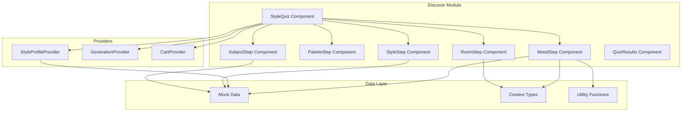
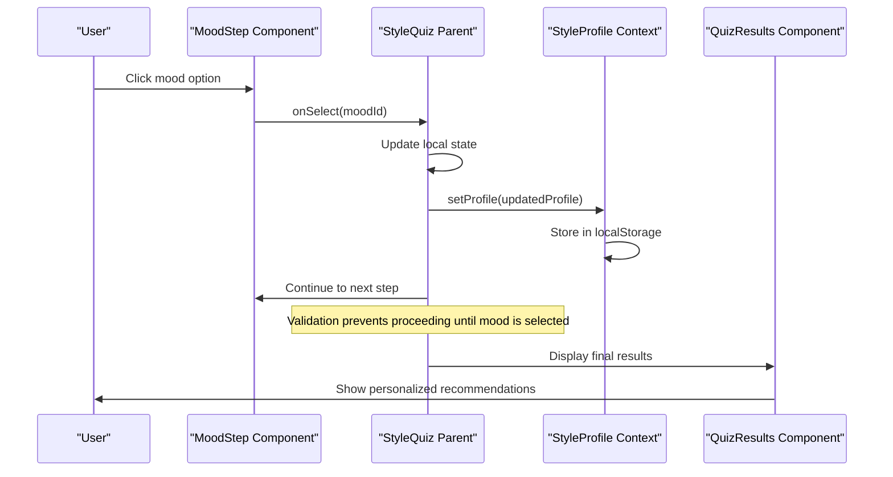
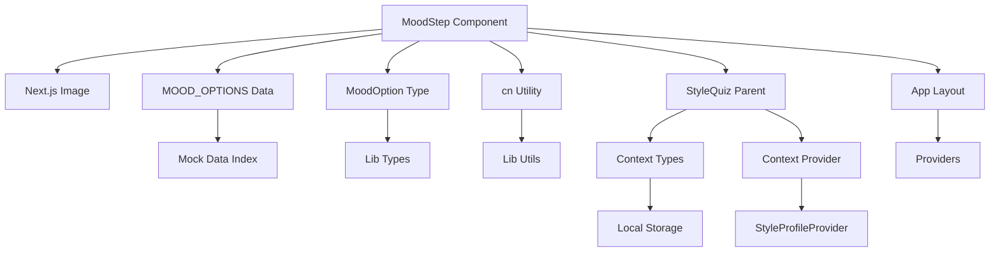

# Mood Selection Step

<cite>
**Referenced Files in This Document**
- [mood-step.tsx](file://components/discover/steps/mood-step.tsx)
- [style-quiz.tsx](file://components/discover/style-quiz.tsx)
- [index.ts](file://lib/mock-data/index.ts)
- [types.ts](file://lib/types.ts)
- [utils.ts](file://lib/utils.ts)
- [quiz-results.tsx](file://components/discover/quiz-results.tsx)
- [layout.tsx](file://app/layout.tsx)
- [providers.tsx](file://components/providers.tsx)
</cite>

## Table of Contents
1. [Introduction](#introduction)
2. [Project Structure](#project-structure)
3. [Core Components](#core-components)
4. [Architecture Overview](#architecture-overview)
5. [Detailed Component Analysis](#detailed-component-analysis)
6. [Dependency Analysis](#dependency-analysis)
7. [Performance Considerations](#performance-considerations)
8. [Troubleshooting Guide](#troubleshooting-guide)
9. [Conclusion](#conclusion)

## Introduction
The Mood Selection Step component enables users to choose the desired emotional tone for their artwork through an intuitive image-based interface. This component presents six distinct mood options, each represented by a carefully curated image that visually communicates the emotional character. Users select exactly one mood option, which becomes part of their comprehensive style profile used throughout the recommendation system.

The component integrates seamlessly with the broader style quiz experience, serving as a crucial decision point that influences subsequent AI art generation and personalization workflows. The implementation emphasizes accessibility, responsive design, and visual feedback to create an engaging user experience.

## Project Structure
The Mood Selection Step is part of a larger style discovery system within the Muse AI Art Store application. The component follows a modular architecture pattern where individual quiz steps are organized as separate components that collectively build user style profiles.



**Diagram sources**
- [style-quiz.tsx:17-144](file://components/discover/style-quiz.tsx#L17-L144)
- [mood-step.tsx:1-52](file://components/discover/steps/mood-step.tsx#L1-L52)
- [providers.tsx:1-14](file://components/providers.tsx#L1-L14)

**Section sources**
- [style-quiz.tsx:17-144](file://components/discover/style-quiz.tsx#L17-L144)
- [mood-step.tsx:1-52](file://components/discover/steps/mood-step.tsx#L1-L52)

## Core Components
The Mood Selection Step component consists of several key elements that work together to provide an intuitive mood selection experience:

### Component Props
The component accepts two primary props that define its behavior and state management:

- **selected**: Type `MoodOption | null` - Represents the currently selected mood option or null if none is selected
- **onSelect**: Type `(v: MoodOption) => void` - Callback function triggered when a user selects a mood option

### MOOD_OPTIONS Data Structure
The component relies on a predefined set of six mood options, each containing:
- **id**: Unique identifier for the mood option
- **label**: Human-readable description of the mood
- **image**: Path to the representative image for visual selection

The six available moods are:
- Calm & Serene
- Bold & Dramatic  
- Warm & Cozy
- Fresh & Energetic
- Elegant & Refined
- Playful & Whimsical

### Interactive Grid Layout
The component renders a responsive grid layout that adapts to different screen sizes:
- Mobile: 2-column grid
- Tablet: 3-column grid  
- Desktop: 3-column grid with increased spacing

Each grid item is designed as a square button with proportional image sizing and overlay text.

**Section sources**
- [mood-step.tsx:8-14](file://components/discover/steps/mood-step.tsx#L8-L14)
- [index.ts:269-276](file://lib/mock-data/index.ts#L269-L276)
- [types.ts:13](file://lib/types.ts#L13)

## Architecture Overview
The Mood Selection Step participates in a multi-step style quiz that builds comprehensive user preferences for AI art generation. The component follows a unidirectional data flow pattern where parent components manage state and pass down props to child components.



**Diagram sources**
- [style-quiz.tsx:115-117](file://components/discover/style-quiz.tsx#L115-L117)
- [mood-step.tsx:27](file://components/discover/steps/mood-step.tsx#L27)
- [contexts.tsx:46-49](file://lib/contexts.tsx#L46-L49)

## Detailed Component Analysis

### Visual Feedback System
The component implements a sophisticated visual feedback system that provides clear indication of selection states and user interactions:

#### Border Styling System
- **Default State**: Subtle border with `border-border` class
- **Hover State**: Enhanced accent border with `hover:border-accent/30`
- **Selected State**: Prominent accent border with `border-accent` and ring effect (`ring-2 ring-accent/20`)

#### Hover Effects
The component utilizes smooth transitions and scaling effects:
- `transition-all` for smooth property changes
- `group-hover:scale-105` for subtle image zoom on hover
- `duration-500` for gradual transform animations

#### Selection Highlighting
Selected items receive immediate visual reinforcement through:
- Accent border color change
- Ring effect creation around the selection
- Consistent styling across all selected states

### Image Handling with Next.js Image Component
The component leverages Next.js Image optimization for optimal performance and user experience:

#### Responsive Image Loading
- Uses `fill` prop for automatic container filling
- Implements `sizes` attribute with breakpoints: `(max-width: 640px) 50vw, 33vw`
- Automatic format detection and optimization

#### Image Overlay System
- Semi-transparent foreground overlay (`bg-foreground/40`) for improved text readability
- Centered white text overlay with serif typography for mood labels
- Smooth transition effects during hover states

### Accessibility Features
The component incorporates several accessibility best practices:

#### Semantic HTML Structure
- Uses semantic `<button>` elements for interactive elements
- Proper heading hierarchy with descriptive labels
- Logical tab order and focus management

#### Screen Reader Support
- Alt text on all images describing the mood
- Descriptive step labels and instructions
- Clear visual indicators for selection states

#### Keyboard Navigation
- Full keyboard accessibility for all interactive elements
- Focus indicators for navigation assistance
- Standard button behavior for screen readers

### Responsive Grid Layout
The component adapts its layout based on viewport size:

#### Breakpoint Behavior
- Mobile (default): 2 columns with compact spacing
- Tablet and larger: 3 columns with increased gap
- Consistent aspect ratio maintenance across devices

#### Grid Implementation
- CSS Grid with `grid-cols-2` and `sm:grid-cols-3` classes
- Gap spacing controlled via `gap-4` and responsive variants
- Aspect ratio maintained through `aspect-[4/3]` classes

**Section sources**
- [mood-step.tsx:23-47](file://components/discover/steps/mood-step.tsx#L23-L47)

### Integration with Recommendation System
The mood selection integrates deeply with the application's recommendation engine:

#### Style Profile Construction
The selected mood becomes part of a comprehensive style profile:
- Combined with palette choices, style preferences, and subject interests
- Stored in local storage for session persistence
- Used to generate personalized AI art concepts

#### Workflow Integration
The component participates in a five-step progression:
1. Color Palette Selection
2. Art Style Selection  
3. Subject Matter Selection
4. **Mood Selection** *(this component)*
5. Room Setting Selection

#### Validation and Navigation
The parent component enforces mandatory mood selection:
- Navigation buttons disabled until a mood is selected
- Progress tracking reflects completion of this step
- Final results page displays all collected preferences

### Example Integration Scenarios

#### Basic Mood Selection Flow
```typescript
// Parent component state management
const [mood, setMood] = useState<MoodOption | null>(null);

// Pass to component
<MoodStep 
  selected={mood} 
  onSelect={setMood} 
/>

// Validation in parent
const canProceed = () => {
  switch (step) {
    case 3: return mood !== null; // Mood is required
    default: return true;
  }
};
```

#### Personalized Concept Generation
The selected mood influences AI concept generation:
- Calm moods lead to serene landscape concepts
- Bold moods generate dramatic architectural compositions  
- Playful moods produce whimsical abstract designs

**Section sources**
- [style-quiz.tsx:29-48](file://components/discover/style-quiz.tsx#L29-L48)
- [quiz-results.tsx:18-69](file://components/discover/quiz-results.tsx#L18-L69)

## Dependency Analysis
The Mood Selection Step component has well-defined dependencies that support its functionality and integration within the larger application ecosystem.



**Diagram sources**
- [mood-step.tsx:3-6](file://components/discover/steps/mood-step.tsx#L3-L6)
- [style-quiz.tsx:17-144](file://components/discover/style-quiz.tsx#L17-L144)
- [providers.tsx:1-14](file://components/providers.tsx#L1-L14)

### External Dependencies
- **Next.js Image**: Provides optimized image loading and responsive sizing
- **Tailwind CSS**: Enables utility-first styling and responsive design
- **Framer Motion**: Supports smooth animations and transitions
- **Lucide React**: Provides iconography for visual elements

### Internal Dependencies
- **MOOD_OPTIONS**: Centralized data source for mood options
- **MoodOption Type**: Strongly typed interface for mood data
- **cn Utility**: Class merging utility for conditional styling
- **StyleProfile Context**: Manages persistent user preferences

**Section sources**
- [mood-step.tsx:3-6](file://components/discover/steps/mood-step.tsx#L3-L6)
- [index.ts:269-276](file://lib/mock-data/index.ts#L269-L276)
- [types.ts:13](file://lib/types.ts#L13)

## Performance Considerations
The component is designed with several performance optimizations:

### Image Optimization
- Next.js Image component handles automatic format conversion and compression
- Responsive sizing reduces bandwidth usage across devices
- Lazy loading implementation prevents unnecessary resource consumption

### CSS Optimization  
- Utility-first Tailwind classes minimize CSS bundle size
- Conditional class application reduces runtime computation
- Hardware-accelerated transitions for smooth animations

### State Management Efficiency
- Minimal re-renders through focused prop passing
- Local state management prevents unnecessary context updates
- Efficient grid layout with CSS Grid for optimal rendering

## Troubleshooting Guide

### Common Issues and Solutions

#### Mood Selection Not Persisting
**Problem**: Selected mood disappears after navigation
**Solution**: Verify that the parent component properly manages state and passes it back to the component

#### Images Not Loading
**Problem**: Mood images fail to display
**Solution**: Check image paths in the MOOD_OPTIONS data structure and ensure files exist in the public directory

#### Responsive Layout Issues  
**Problem**: Grid layout breaks on mobile devices
**Solution**: Verify Tailwind breakpoint classes are correctly applied and CSS Grid is supported

#### Accessibility Concerns
**Problem**: Screen reader issues or keyboard navigation problems
**Solution**: Ensure proper alt text attributes and maintain focus order in the component structure

**Section sources**
- [mood-step.tsx:35-45](file://components/discover/steps/mood-step.tsx#L35-L45)
- [index.ts:269-276](file://lib/mock-data/index.ts#L269-L276)

## Conclusion
The Mood Selection Step component exemplifies modern React development practices with its clean separation of concerns, robust type safety, and comprehensive accessibility features. The component successfully balances aesthetic appeal with functional usability, providing users with an intuitive way to express their desired artistic mood.

Through its integration with the broader style quiz system, the component contributes valuable data to the recommendation engine, enabling personalized AI art generation that aligns with user preferences. The implementation demonstrates best practices in component architecture, state management, and user experience design.

The component's responsive design ensures consistent performance across devices, while its accessibility features make the mood selection process inclusive for all users. The thoughtful visual feedback system creates clear affordances for user interaction, enhancing the overall quality of the style discovery experience.