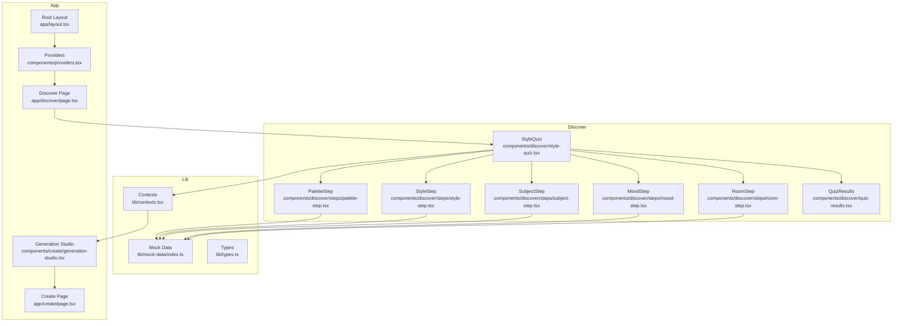
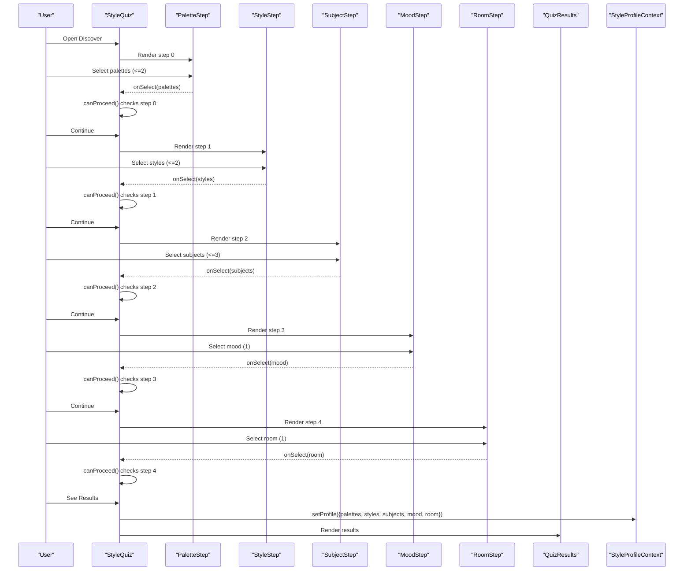
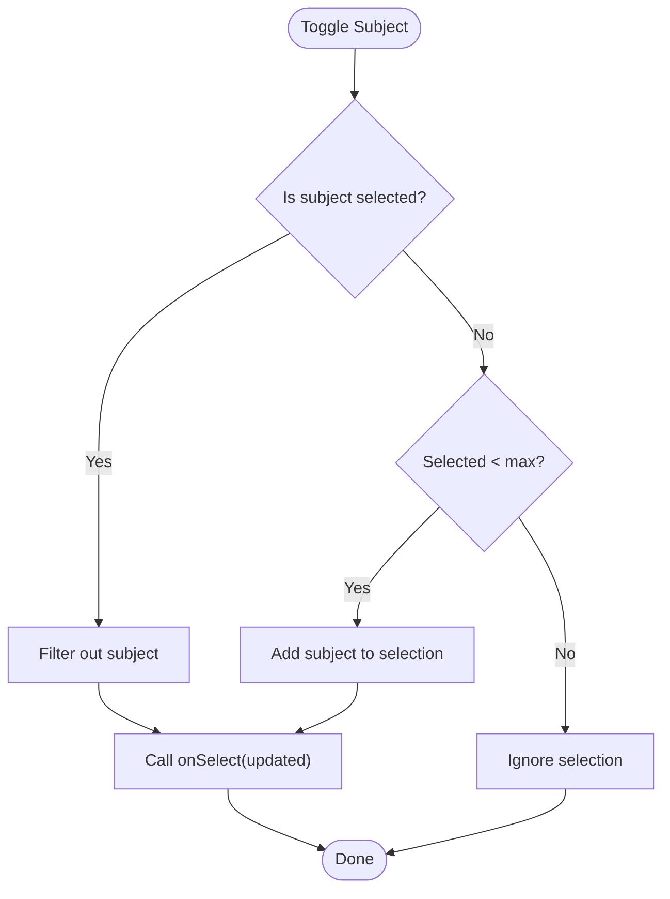
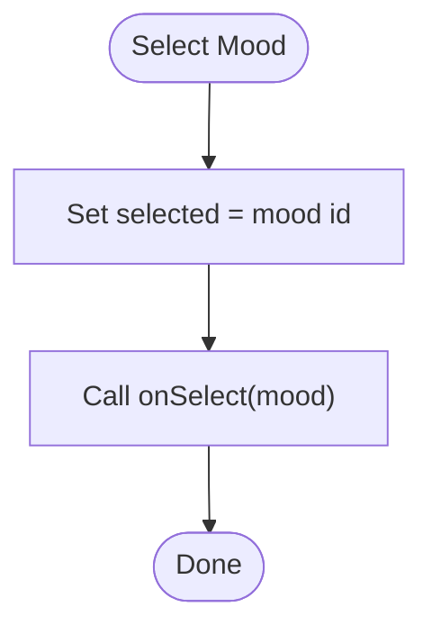
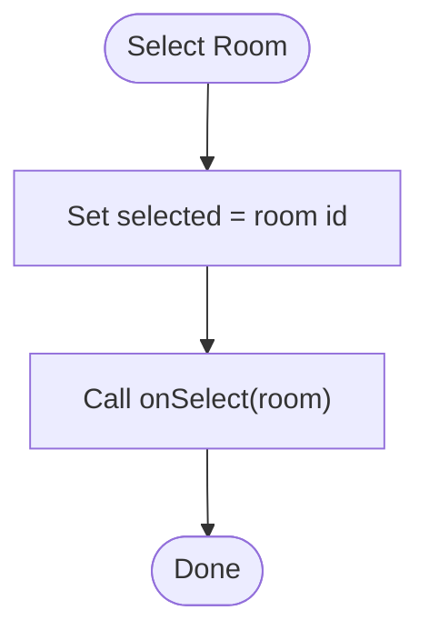
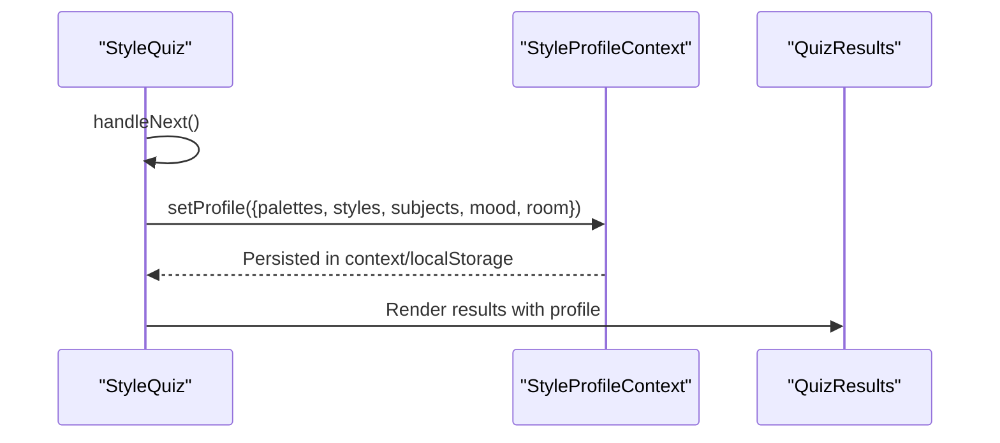
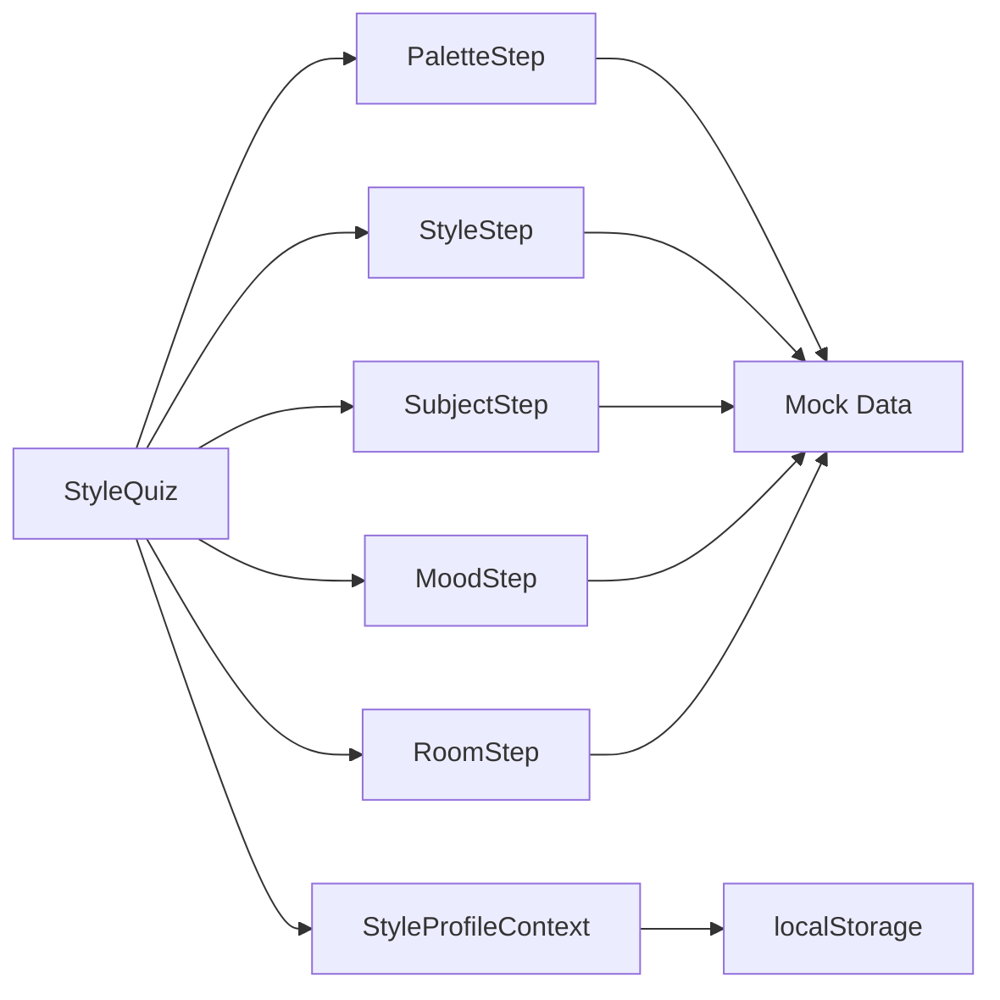

# Quiz Step Components

<cite>
**Referenced Files in This Document**
- [style-quiz.tsx](file://components/discover/style-quiz.tsx)
- [palette-step.tsx](file://components/discover/steps/palette-step.tsx)
- [style-step.tsx](file://components/discover/steps/style-step.tsx)
- [subject-step.tsx](file://components/discover/steps/subject-step.tsx)
- [mood-step.tsx](file://components/discover/steps/mood-step.tsx)
- [room-step.tsx](file://components/discover/steps/room-step.tsx)
- [index.ts](file://lib/mock-data/index.ts)
- [types.ts](file://lib/types.ts)
- [quiz-results.tsx](file://components/discover/quiz-results.tsx)
- [contexts.tsx](file://lib/contexts.tsx)
- [providers.tsx](file://components/providers.tsx)
- [layout.tsx](file://app/layout.tsx)
- [page.tsx](file://app/discover/page.tsx)
- [page.tsx](file://app/create/page.tsx)
- [generation-studio.tsx](file://components/create/generation-studio.tsx)
</cite>

## Table of Contents
1. [Introduction](#introduction)
2. [Project Structure](#project-structure)
3. [Core Components](#core-components)
4. [Architecture Overview](#architecture-overview)
5. [Detailed Component Analysis](#detailed-component-analysis)
6. [Dependency Analysis](#dependency-analysis)
7. [Performance Considerations](#performance-considerations)
8. [Troubleshooting Guide](#troubleshooting-guide)
9. [Conclusion](#conclusion)

## Introduction
This document provides comprehensive technical documentation for the five quiz step components that guide users through a visual style discovery process. The quiz collects user preferences across:
- Palette selection
- Style preferences
- Subject choices
- Mood selection
- Room context

Each step component manages user input, enforces validation rules, and updates shared state. Upon completion, the collected StyleProfile is persisted and used to inform subsequent AI art generation workflows.

## Project Structure
The quiz is implemented as a standalone interactive flow under the Discover section, integrated into the application via routing and context providers. The UI components are organized by step, while shared data types and mock options reside in dedicated modules.

**Diagram sources**
- [style-quiz.tsx:17-144](file://components/discover/style-quiz.tsx#L17-L144)
- [palette-step.tsx:1-60](file://components/discover/steps/palette-step.tsx#L1-L60)
- [style-step.tsx:1-62](file://components/discover/steps/style-step.tsx#L1-L62)
- [subject-step.tsx:1-62](file://components/discover/steps/subject-step.tsx#L1-L62)
- [mood-step.tsx:1-52](file://components/discover/steps/mood-step.tsx#L1-L52)
- [room-step.tsx:1-52](file://components/discover/steps/room-step.tsx#L1-L52)
- [quiz-results.tsx:1-98](file://components/discover/quiz-results.tsx#L1-L98)
- [index.ts:240-285](file://lib/mock-data/index.ts#L240-L285)
- [types.ts:1-132](file://lib/types.ts#L1-L132)
- [contexts.tsx:30-69](file://lib/contexts.tsx#L30-L69)
- [layout.tsx:34-38](file://app/layout.tsx#L34-L38)
- [page.tsx:1-11](file://app/discover/page.tsx#L1-L11)
- [page.tsx:1-11](file://app/create/page.tsx#L1-L11)
- [generation-studio.tsx:1-35](file://components/create/generation-studio.tsx#L1-L35)
- [providers.tsx:1-14](file://components/providers.tsx#L1-L14)

**Section sources**
- [layout.tsx:31-38](file://app/layout.tsx#L31-L38)
- [providers.tsx:5-12](file://components/providers.tsx#L5-L12)
- [page.tsx:8-10](file://app/discover/page.tsx#L8-L10)
- [style-quiz.tsx:17-144](file://components/discover/style-quiz.tsx#L17-L144)

## Core Components
This section documents each quiz step component, including props, event handlers, validation logic, and state updates.

- PaletteStep
  - Purpose: Allows selecting up to two color palettes.
  - Props:
    - selected: PaletteOption[]
    - onSelect: (v: PaletteOption[]) => void
    - maxSelections: number
  - Behavior:
    - Toggle selection of a palette.
    - Enforce maximum selections via length check.
  - Validation: At least one selection required to proceed to next step.
  - Accessibility: Uses semantic buttons with clear focus states and hover feedback.
  - Responsive: Grid layout adapts from 2 to 3 columns based on viewport.

- StyleStep
  - Purpose: Selects up to two art styles with visual thumbnails.
  - Props:
    - selected: StyleOption[]
    - onSelect: (v: StyleOption[]) => void
    - maxSelections: number
  - Behavior:
    - Toggle selection of a style.
    - Enforce maximum selections via length check.
  - Validation: At least one selection required to proceed to next step.
  - Accessibility: Alt text from label; focus-visible ring; hover scale effect.
  - Responsive: Grid layout adapts from 2 to 3 columns.

- SubjectStep
  - Purpose: Chooses up to three subjects with square thumbnails.
  - Props:
    - selected: SubjectOption[]
    - onSelect: (v: SubjectOption[]) => void
    - maxSelections: number
  - Behavior:
    - Toggle selection of a subject.
    - Enforce maximum selections via length check.
  - Validation: At least one selection required to proceed to next step.
  - Accessibility: Alt text from label; focus-visible ring; hover scale effect.
  - Responsive: Grid layout adapts from 2 to 4 columns.

- MoodStep
  - Purpose: Picks a single mood.
  - Props:
    - selected: MoodOption | null
    - onSelect: (v: MoodOption) => void
  - Behavior:
    - Set a single mood selection.
  - Validation: Non-null selection required to proceed to next step.
  - Accessibility: Alt text from label; focus-visible ring; hover scale effect.
  - Responsive: Grid layout adapts from 2 to 3 columns.

- RoomStep
  - Purpose: Selects the room context where the art will live.
  - Props:
    - selected: RoomOption | null
    - onSelect: (v: RoomOption) => void
  - Behavior:
    - Set a single room selection.
  - Validation: Non-null selection required to proceed to next step.
  - Accessibility: Alt text from label; focus-visible ring; hover scale effect.
  - Responsive: Grid layout adapts from 2 to 3 columns.

**Section sources**
- [palette-step.tsx:7-22](file://components/discover/steps/palette-step.tsx#L7-L22)
- [style-step.tsx:8-23](file://components/discover/steps/style-step.tsx#L8-L23)
- [subject-step.tsx:8-23](file://components/discover/steps/subject-step.tsx#L8-L23)
- [mood-step.tsx:8-14](file://components/discover/steps/mood-step.tsx#L8-L14)
- [room-step.tsx:8-14](file://components/discover/steps/room-step.tsx#L8-L14)

## Architecture Overview
The quiz orchestrates navigation, validation, and state persistence. It composes individual step components and renders a results screen upon completion. The StyleProfile is stored in a context provider and persisted to local storage.

**Diagram sources**
- [style-quiz.tsx:29-48](file://components/discover/style-quiz.tsx#L29-L48)
- [palette-step.tsx:16-22](file://components/discover/steps/palette-step.tsx#L16-L22)
- [style-step.tsx:17-23](file://components/discover/steps/style-step.tsx#L17-L23)
- [subject-step.tsx:17-23](file://components/discover/steps/subject-step.tsx#L17-L23)
- [mood-step.tsx:27-27](file://components/discover/steps/mood-step.tsx#L27-L27)
- [room-step.tsx:27-27](file://components/discover/steps/room-step.tsx#L27-L27)
- [quiz-results.tsx:9-17](file://components/discover/quiz-results.tsx#L9-L17)
- [contexts.tsx:46-49](file://lib/contexts.tsx#L46-L49)

**Section sources**
- [style-quiz.tsx:17-62](file://components/discover/style-quiz.tsx#L17-L62)
- [quiz-results.tsx:9-17](file://components/discover/quiz-results.tsx#L9-L17)
- [contexts.tsx:46-49](file://lib/contexts.tsx#L46-L49)

## Detailed Component Analysis

### Palette Selection Step
- Implementation pattern:
  - Stateless component receiving selected array and onSelect callback.
  - Toggle logic handles adding/removing items and enforcing maxSelections.
- Props and events:
  - selected: PaletteOption[]
  - onSelect: (v: PaletteOption[]) => void
  - maxSelections: number
- Validation:
  - Step requires at least one selection to enable Continue.
- State updates:
  - Updates parent state via onSelect with filtered or extended array.
- UI patterns:
  - Grid of cards with color swatches and labels.
  - Visual feedback for selected state with accent borders and subtle shadows.
- Accessibility:
  - Buttons with clear labels; hover/focus states for keyboard navigation.
- Responsive design:
  - Responsive grid columns adjust based on viewport.

**Diagram sources**
- [palette-step.tsx:16-22](file://components/discover/steps/palette-step.tsx#L16-L22)

**Section sources**
- [palette-step.tsx:7-22](file://components/discover/steps/palette-step.tsx#L7-L22)
- [style-quiz.tsx:29-38](file://components/discover/style-quiz.tsx#L29-L38)

### Style Preferences Step
- Implementation pattern:
  - Stateless component rendering styled cards with image overlays.
  - Toggle logic mirrors palette step with maxSelections enforcement.
- Props and events:
  - selected: StyleOption[]
  - onSelect: (v: StyleOption[]) => void
  - maxSelections: number
- Validation:
  - Requires at least one selection to proceed.
- State updates:
  - Updates parent state via onSelect with filtered or extended array.
- UI patterns:
  - Aspect-ratio constrained cards with gradient overlays and hover scaling.
- Accessibility:
  - Alt text from label; focus-visible ring; hover scale effect.
- Responsive design:
  - Responsive grid columns adapt to viewport.

**Diagram sources**
- [style-step.tsx:17-23](file://components/discover/steps/style-step.tsx#L17-L23)

**Section sources**
- [style-step.tsx:8-23](file://components/discover/steps/style-step.tsx#L8-L23)
- [style-quiz.tsx:29-38](file://components/discover/style-quiz.tsx#L29-L38)

### Subject Choices Step
- Implementation pattern:
  - Stateless component rendering square cards with image overlays.
  - Toggle logic enforces maxSelections for up to three subjects.
- Props and events:
  - selected: SubjectOption[]
  - onSelect: (v: SubjectOption[]) => void
  - maxSelections: number
- Validation:
  - Requires at least one selection to proceed.
- State updates:
  - Updates parent state via onSelect with filtered or extended array.
- UI patterns:
  - Square aspect ratio cards with gradient overlays and hover scaling.
- Accessibility:
  - Alt text from label; focus-visible ring; hover scale effect.
- Responsive design:
  - Responsive grid columns adapt to viewport.

**Diagram sources**
- [subject-step.tsx:17-23](file://components/discover/steps/subject-step.tsx#L17-L23)

**Section sources**
- [subject-step.tsx:8-23](file://components/discover/steps/subject-step.tsx#L8-L23)
- [style-quiz.tsx:29-38](file://components/discover/style-quiz.tsx#L29-L38)

### Mood Selection Step
- Implementation pattern:
  - Stateless component rendering cards with a single selection model.
- Props and events:
  - selected: MoodOption | null
  - onSelect: (v: MoodOption) => void
- Validation:
  - Requires a non-null selection to proceed.
- State updates:
  - Updates parent state via onSelect with the chosen mood.
- UI patterns:
  - Aspect-ratio constrained cards with overlay text and hover scaling.
- Accessibility:
  - Alt text from label; focus-visible ring; hover scale effect.
- Responsive design:
  - Responsive grid columns adapt to viewport.

**Diagram sources**
- [mood-step.tsx:27-27](file://components/discover/steps/mood-step.tsx#L27-L27)

**Section sources**
- [mood-step.tsx:8-14](file://components/discover/steps/mood-step.tsx#L8-L14)
- [style-quiz.tsx:29-38](file://components/discover/style-quiz.tsx#L29-L38)

### Room Context Step
- Implementation pattern:
  - Stateless component rendering cards representing room contexts.
- Props and events:
  - selected: RoomOption | null
  - onSelect: (v: RoomOption) => void
- Validation:
  - Requires a non-null selection to proceed.
- State updates:
  - Updates parent state via onSelect with the chosen room.
- UI patterns:
  - Aspect-ratio constrained cards with gradient overlays and hover scaling.
- Accessibility:
  - Alt text from label; focus-visible ring; hover scale effect.
- Responsive design:
  - Responsive grid columns adapt to viewport.

**Diagram sources**
- [room-step.tsx:27-27](file://components/discover/steps/room-step.tsx#L27-L27)

**Section sources**
- [room-step.tsx:8-14](file://components/discover/steps/room-step.tsx#L8-L14)
- [style-quiz.tsx:29-38](file://components/discover/style-quiz.tsx#L29-L38)

### Quiz Navigation and Completion
- Navigation:
  - Next/Back buttons control step progression.
  - canProceed() enforces step-specific validation rules.
- Completion:
  - On last step, StyleProfile is assembled and passed to QuizResults.
  - Profile is persisted via StyleProfileContext.setProfile.
- Results:
  - QuizResults displays a palette strip and tag-based summary.
  - Provides actions to navigate to creation or gallery.

**Diagram sources**
- [style-quiz.tsx:40-48](file://components/discover/style-quiz.tsx#L40-L48)
- [contexts.tsx:46-49](file://lib/contexts.tsx#L46-L49)
- [quiz-results.tsx:9-17](file://components/discover/quiz-results.tsx#L9-L17)

**Section sources**
- [style-quiz.tsx:29-62](file://components/discover/style-quiz.tsx#L29-L62)
- [quiz-results.tsx:9-17](file://components/discover/quiz-results.tsx#L9-L17)
- [contexts.tsx:46-49](file://lib/contexts.tsx#L46-L49)

## Dependency Analysis
- Component coupling:
  - StyleQuiz composes all step components and manages cross-step state.
  - Steps are decoupled and self-contained, receiving props and callbacks.
- Data flow:
  - Mock data drives step options; types define option sets and StyleProfile shape.
  - Context persists StyleProfile across sessions.
- External dependencies:
  - Next.js routing and Framer Motion for animations.
  - Tailwind CSS for responsive layouts and styling.

**Diagram sources**
- [style-quiz.tsx:94-120](file://components/discover/style-quiz.tsx#L94-L120)
- [palette-step.tsx:3-4](file://components/discover/steps/palette-step.tsx#L3-L4)
- [style-step.tsx:3-4](file://components/discover/steps/style-step.tsx#L3-L4)
- [subject-step.tsx:3-4](file://components/discover/steps/subject-step.tsx#L3-L4)
- [mood-step.tsx:3-4](file://components/discover/steps/mood-step.tsx#L3-L4)
- [room-step.tsx:3-4](file://components/discover/steps/room-step.tsx#L3-L4)
- [contexts.tsx:30-69](file://lib/contexts.tsx#L30-L69)
- [index.ts:240-285](file://lib/mock-data/index.ts#L240-L285)

**Section sources**
- [style-quiz.tsx:94-120](file://components/discover/style-quiz.tsx#L94-L120)
- [types.ts:1-132](file://lib/types.ts#L1-L132)
- [index.ts:240-285](file://lib/mock-data/index.ts#L240-L285)
- [contexts.tsx:30-69](file://lib/contexts.tsx#L30-L69)

## Performance Considerations
- Rendering:
  - Steps use AnimatePresence and motion for smooth transitions; keep animation durations reasonable.
- State updates:
  - Toggle logic filters/extends arrays; ensure maxSelections prevents excessive re-renders.
- Images:
  - Steps render Next.js Image components with fill and sizes; ensure appropriate aspect ratios and lazy loading.
- Local storage:
  - Context writes StyleProfile on completion; batch writes to avoid frequent disk I/O.

## Troubleshooting Guide
- Navigation disabled unexpectedly:
  - Verify canProceed() matches the current step’s validation rules.
- Selection not updating:
  - Confirm onSelect prop is correctly bound and that maxSelections is not preventing additions.
- Results not appearing:
  - Ensure StyleProfile is set via setProfile and that showResults flag is toggled on last step.
- Context not persisting:
  - Check localStorage availability and that setProfile is invoked after assembling StyleProfile.

**Section sources**
- [style-quiz.tsx:29-48](file://components/discover/style-quiz.tsx#L29-L48)
- [contexts.tsx:46-49](file://lib/contexts.tsx#L46-L49)

## Conclusion
The quiz step components provide a cohesive, accessible, and responsive pathway for collecting user preferences. Each step encapsulates its selection logic and integrates seamlessly with shared state and context. The resulting StyleProfile informs downstream AI generation and personalization workflows, ensuring a smooth transition from discovery to creation.