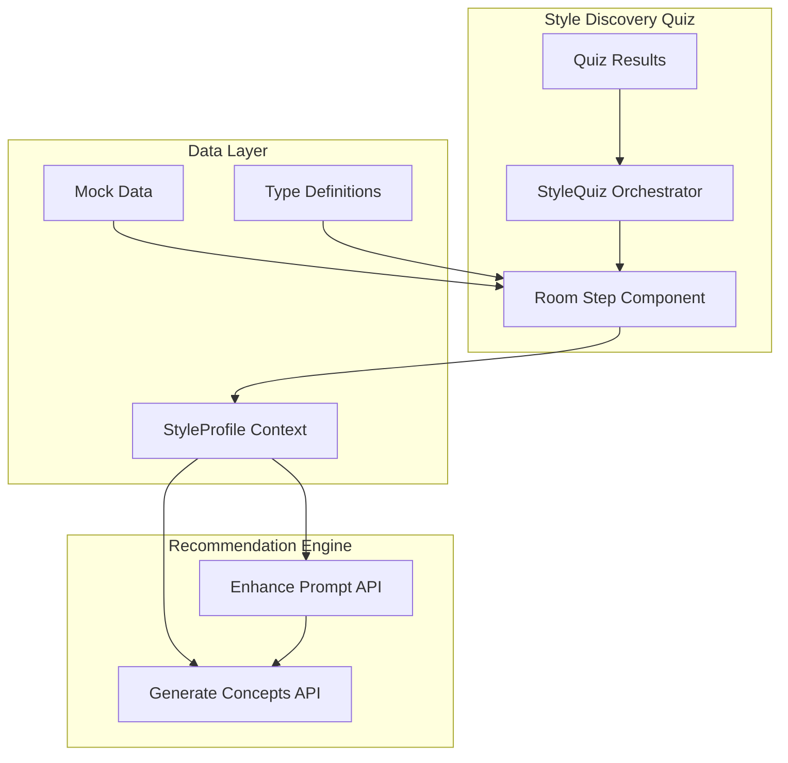
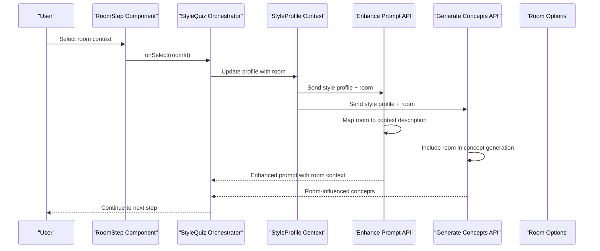
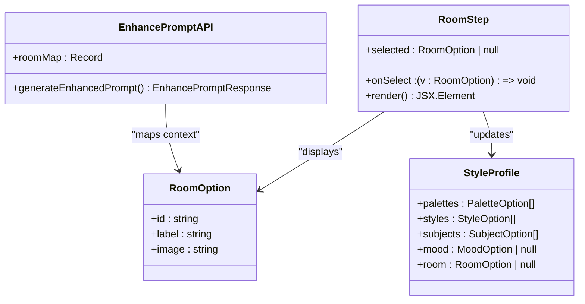
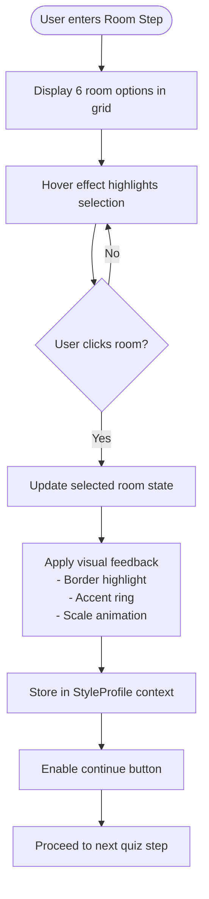
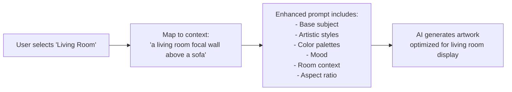
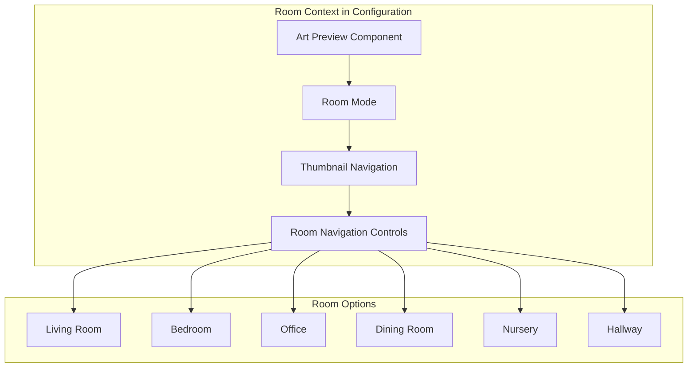
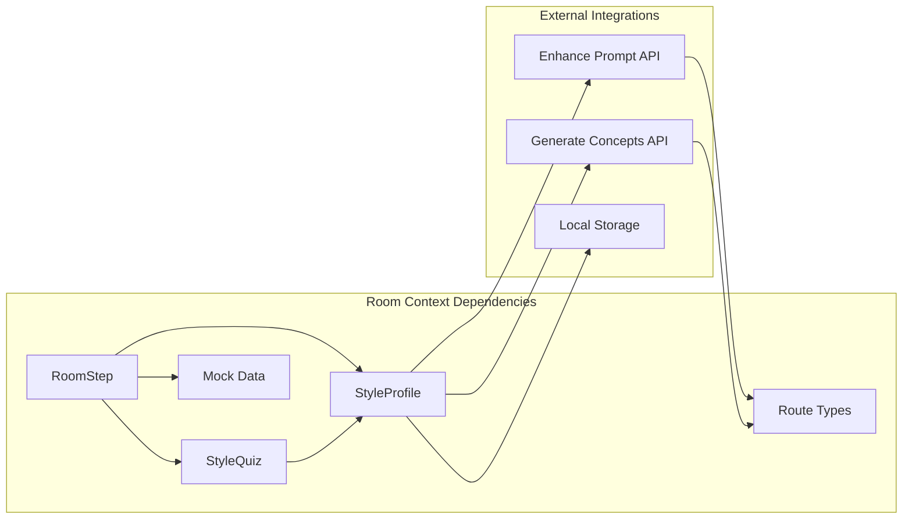

# Room Context Step

<cite>
**Referenced Files in This Document**
- [room-step.tsx](file://components/discover/steps/room-step.tsx)
- [style-quiz.tsx](file://components/discover/style-quiz.tsx)
- [quiz-results.tsx](file://components/discover/quiz-results.tsx)
- [index.ts](file://lib/mock-data/index.ts)
- [types.ts](file://lib/types.ts)
- [contexts.tsx](file://lib/contexts.tsx)
- [route.ts](file://app/api/enhance-prompt/route.ts)
- [route.ts](file://app/api/generate-concepts/route.ts)
- [art-preview.tsx](file://components/configure/art-preview.tsx)
</cite>

## Table of Contents
1. [Introduction](#introduction)
2. [Project Structure](#project-structure)
3. [Core Components](#core-components)
4. [Architecture Overview](#architecture-overview)
5. [Detailed Component Analysis](#detailed-component-analysis)
6. [Dependency Analysis](#dependency-analysis)
7. [Performance Considerations](#performance-considerations)
8. [Troubleshooting Guide](#troubleshooting-guide)
9. [Conclusion](#conclusion)

## Introduction
The Room Context Step is the fifth and final step in the Muse AI style discovery quiz. This component enables users to specify the room or space where their artwork will be displayed, providing crucial contextual information that influences the recommendation engine's suggestions for artistic style and composition. The room selection serves as a bridge between personal aesthetic preferences and practical placement considerations, ensuring that generated artwork aligns with both visual taste and physical space constraints.

## Project Structure
The Room Context Step is part of a five-step style discovery process that progressively builds a comprehensive style profile. The component integrates seamlessly with the broader recommendation system through shared data structures and API endpoints.

**Diagram sources**
- [style-quiz.tsx:17-144](file://components/discover/style-quiz.tsx#L17-L144)
- [room-step.tsx:8-51](file://components/discover/steps/room-step.tsx#L8-L51)
- [contexts.tsx:30-69](file://lib/contexts.tsx#L30-L69)

**Section sources**
- [style-quiz.tsx:17-144](file://components/discover/style-quiz.tsx#L17-L144)
- [room-step.tsx:8-51](file://components/discover/steps/room-step.tsx#L8-L51)

## Core Components
The Room Context Step consists of several interconnected components that work together to capture user preferences and integrate with the recommendation system.

### RoomStep Component
The RoomStep component presents users with six distinct room options through an intuitive grid interface. Each option displays a representative image with overlaid text labeling and interactive hover effects.

### StyleProfile Integration
The component integrates with the global StyleProfile context, storing the selected room as part of the user's comprehensive style profile. This integration ensures that room context influences all subsequent recommendation decisions.

### Recommendation Engine Integration
Room context directly impacts two key recommendation systems:
- Enhanced prompt generation for AI image creation
- Starting concept generation for initial inspiration

**Section sources**
- [room-step.tsx:8-51](file://components/discover/steps/room-step.tsx#L8-L51)
- [contexts.tsx:30-69](file://lib/contexts.tsx#L30-L69)
- [types.ts:1-8](file://lib/types.ts#L1-L8)

## Architecture Overview
The Room Context Step operates within a sophisticated recommendation architecture that transforms user preferences into personalized AI-generated artwork suggestions.

**Diagram sources**
- [room-step.tsx:24-47](file://components/discover/steps/room-step.tsx#L24-L47)
- [style-quiz.tsx:118-120](file://components/discover/style-quiz.tsx#L118-L120)
- [contexts.tsx:46-49](file://lib/contexts.tsx#L46-L49)
- [route.ts:55-80](file://app/api/enhance-prompt/route.ts#L55-L80)
- [route.ts:176-178](file://app/api/generate-concepts/route.ts#L176-L178)

## Detailed Component Analysis

### Room Selection Interface
The RoomStep component provides an immersive visual selection experience through carefully curated room imagery and responsive design patterns.

**Diagram sources**
- [room-step.tsx:8-14](file://components/discover/steps/room-step.tsx#L8-L14)
- [types.ts:10-14](file://lib/types.ts#L10-L14)
- [contexts.tsx:8-21](file://lib/contexts.tsx#L8-L21)
- [route.ts:55-62](file://app/api/enhance-prompt/route.ts#L55-L62)

### Room Type Options and Visual Representation
The system offers six distinct room categories, each with specific visual characteristics and recommendation implications:

| Room Type | Visual Characteristics | Recommendation Impact | Placement Considerations |
|-----------|----------------------|----------------------|-------------------------|
| Living Room | Central focal point above sofa | Balanced composition, social gathering aesthetics | Horizontal orientation, moderate scale, warm lighting |
| Bedroom | Calming setting above headboard | Serene, intimate compositions | Vertical orientation, soft colors, comfortable scale |
| Office | Professional home office backdrop | Clean, focused compositions | Balanced proportions, professional colors |
| Dining Room | Feature wall in formal space | Bold, statement compositions | Large scale, dramatic impact |
| Nursery | Soft, comforting space | Gentle, nurturing compositions | Rounded forms, child-safe scale |
| Hallway | Gallery wall in entryway | Cohesive series compositions | Linear arrangement, varied heights |

**Section sources**
- [index.ts:278-285](file://lib/mock-data/index.ts#L278-L285)
- [route.ts:55-62](file://app/api/enhance-prompt/route.ts#L55-L62)

### Selection Mechanism and User Experience
The room selection mechanism employs a sophisticated grid interface designed for optimal user engagement and accessibility.

**Diagram sources**
- [room-step.tsx:23-48](file://components/discover/steps/room-step.tsx#L23-L48)
- [style-quiz.tsx:29-38](file://components/discover/style-quiz.tsx#L29-L38)

### Integration with Recommendation Engine
Room context significantly influences both prompt enhancement and concept generation processes.

#### Enhanced Prompt Generation
The recommendation engine transforms raw room selections into descriptive context statements that guide AI image generation:

**Diagram sources**
- [route.ts:75-80](file://app/api/enhance-prompt/route.ts#L75-L80)
- [route.ts:55-62](file://app/api/enhance-prompt/route.ts#L55-L62)

#### Starting Concept Generation
The concept generation system incorporates room context to produce relevant initial artwork ideas:

**Section sources**
- [route.ts:55-80](file://app/api/enhance-prompt/route.ts#L55-L80)
- [route.ts:176-178](file://app/api/generate-concepts/route.ts#L176-L178)

### Visual Representation in Product Configuration
Room context extends beyond the quiz stage, influencing the product configuration experience through visual room mockups.

**Diagram sources**
- [art-preview.tsx:265-296](file://components/configure/art-preview.tsx#L265-L296)
- [art-preview.tsx:320-350](file://components/configure/art-preview.tsx#L320-L350)

**Section sources**
- [art-preview.tsx:265-296](file://components/configure/art-preview.tsx#L265-L296)
- [art-preview.tsx:320-350](file://components/configure/art-preview.tsx#L320-L350)

## Dependency Analysis
The Room Context Step maintains loose coupling with surrounding components while serving as a critical integration point for the recommendation system.

**Diagram sources**
- [room-step.tsx:4-6](file://components/discover/steps/room-step.tsx#L4-L6)
- [style-quiz.tsx:6-12](file://components/discover/style-quiz.tsx#L6-L12)
- [contexts.tsx:46-49](file://lib/contexts.tsx#L46-L49)

### Data Flow Dependencies
The room selection data flows through multiple layers of the application architecture, maintaining consistency and enabling downstream processing.

**Section sources**
- [types.ts:1-8](file://lib/types.ts#L1-L8)
- [contexts.tsx:46-49](file://lib/contexts.tsx#L46-L49)
- [index.ts:278-285](file://lib/mock-data/index.ts#L278-L285)

## Performance Considerations
The Room Context Step is designed for optimal performance through efficient rendering and minimal state updates.

### Rendering Optimization
- Grid-based layout with responsive breakpoints
- Efficient image loading with Next.js Image component
- Minimal re-renders through proper state management
- Optimized hover animations using transform properties

### Memory Management
- Room options cached in mock data module
- Efficient state updates through callback functions
- Local storage persistence for session continuity
- Cleanup of unused resources during component unmount

## Troubleshooting Guide
Common issues and solutions for the Room Context Step component.

### Room Selection Issues
**Problem**: Room selection not persisting between steps
**Solution**: Verify StyleProfile context is properly initialized and updated

**Problem**: Incorrect room context in recommendations
**Solution**: Check room mapping in API endpoints and ensure consistent data types

### Visual Display Problems
**Problem**: Room images not displaying correctly
**Solution**: Verify image paths in mock data and ensure proper Next.js Image configuration

**Problem**: Responsive layout issues on mobile devices
**Solution**: Test grid responsiveness and adjust breakpoint configurations

### Integration Challenges
**Problem**: Room context not affecting AI prompts
**Solution**: Verify room context is included in style profile and passed to API endpoints

**Section sources**
- [contexts.tsx:46-49](file://lib/contexts.tsx#L46-L49)
- [route.ts:75-80](file://app/api/enhance-prompt/route.ts#L75-L80)

## Conclusion
The Room Context Step represents a sophisticated integration point in the Muse AI recommendation system, transforming user preferences into actionable context that influences both artistic style and practical placement considerations. Through careful component design, robust data structures, and seamless API integration, the room selection process contributes significantly to the overall user experience and the quality of AI-generated artwork recommendations.

The component's success lies in its ability to balance intuitive user interaction with powerful backend integration, ensuring that room context becomes a meaningful factor in the creative process rather than a simple checkbox. As users progress through the style discovery quiz, the room selection serves as a bridge between personal aesthetic preferences and practical display considerations, ultimately resulting in artwork that is both personally meaningful and visually appropriate for its intended space.