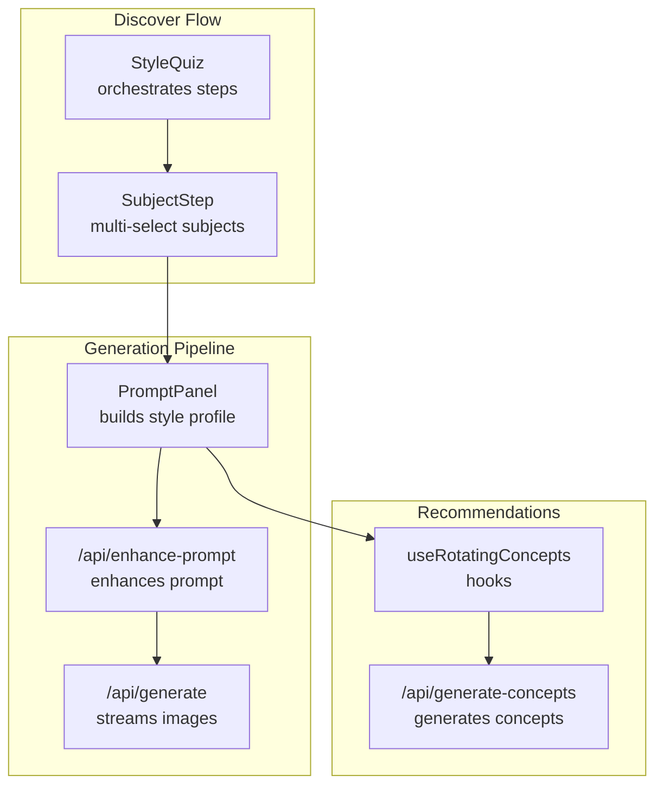
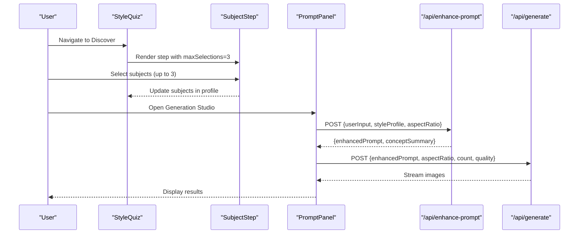
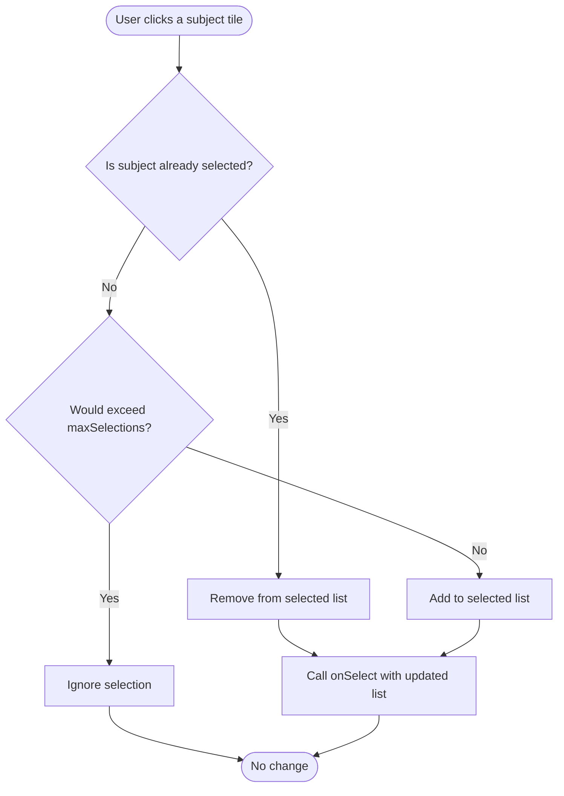
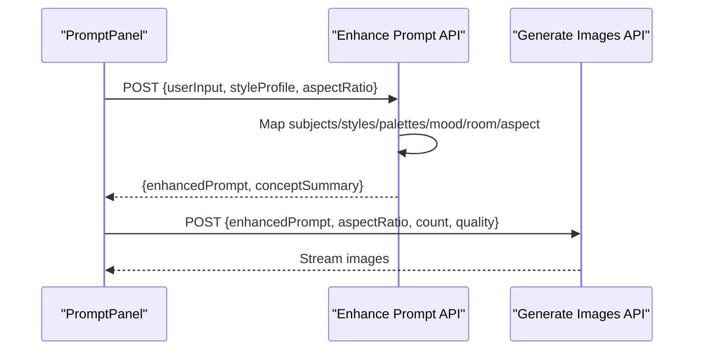
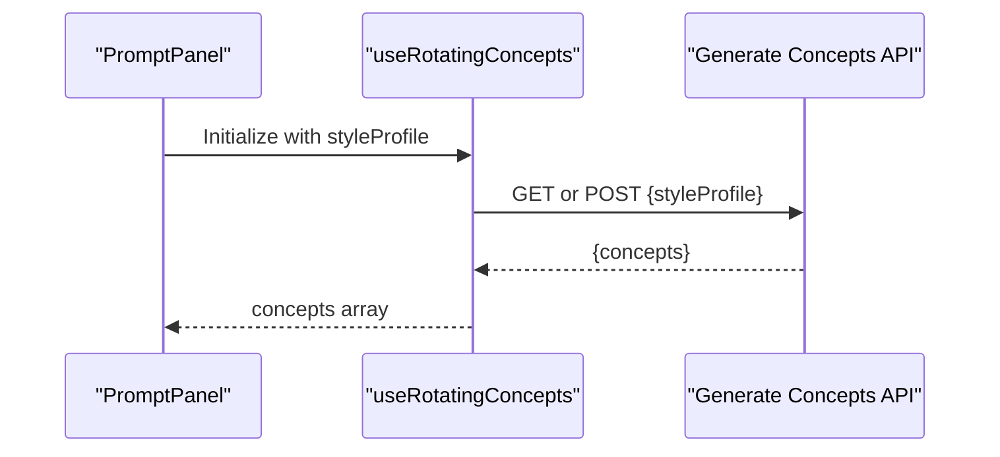
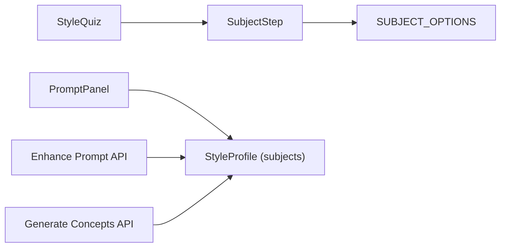

# Subject Matter Step

<cite>
**Referenced Files in This Document**
- [subject-step.tsx](file://components/discover/steps/subject-step.tsx)
- [style-quiz.tsx](file://components/discover/style-quiz.tsx)
- [index.ts](file://lib/mock-data/index.ts)
- [types.ts](file://lib/types.ts)
- [contexts.tsx](file://lib/contexts.tsx)
- [prompt-panel.tsx](file://components/create/prompt-panel.tsx)
- [enhance-prompt/route.ts](file://app/api/enhance-prompt/route.ts)
- [generate-concepts/route.ts](file://app/api/generate-concepts/route.ts)
- [use-rotating-concepts.ts](file://lib/hooks/use-rotating-concepts.ts)
- [gallery-grid.tsx](file://components/gallery/gallery-grid.tsx)
</cite>

## Table of Contents
1. [Introduction](#introduction)
2. [Project Structure](#project-structure)
3. [Core Components](#core-components)
4. [Architecture Overview](#architecture-overview)
5. [Detailed Component Analysis](#detailed-component-analysis)
6. [Dependency Analysis](#dependency-analysis)
7. [Performance Considerations](#performance-considerations)
8. [Troubleshooting Guide](#troubleshooting-guide)
9. [Conclusion](#conclusion)

## Introduction
This document explains the Subject Matter Selection Step component used during the style quiz and how it influences the AI art generation pipeline. It covers how users specify the main subject or theme for their artwork, how subject options are presented and selected, and how those choices integrate with the recommendation engine and the AI prompt enhancement and generation APIs. It also describes how subject matter affects artistic interpretation and composition, and provides examples of how different subjects influence the final artwork creation process.

## Project Structure
The Subject Matter Step is part of the Discover flow and feeds into the generation pipeline:
- The step component renders subject options and manages multi-select behavior.
- The style quiz orchestrates the step sequence and aggregates the style profile.
- The style profile is consumed by the prompt panel to enhance prompts.
- The enhanced prompt is sent to the AI backend to generate images.
- Recommendations (starting concepts) are generated based on the style profile, including subjects.

**Diagram sources**
- [style-quiz.tsx:108-114](file://components/discover/style-quiz.tsx#L108-L114)
- [subject-step.tsx:8-23](file://components/discover/steps/subject-step.tsx#L8-L23)
- [prompt-panel.tsx:20-31](file://components/create/prompt-panel.tsx#L20-L31)
- [enhance-prompt/route.ts:9-11](file://app/api/enhance-prompt/route.ts#L9-L11)
- [generate-concepts/route.ts:158-189](file://app/api/generate-concepts/route.ts#L158-L189)
- [use-rotating-concepts.ts:9-44](file://lib/hooks/use-rotating-concepts.ts#L9-L44)

**Section sources**
- [style-quiz.tsx:108-114](file://components/discover/style-quiz.tsx#L108-L114)
- [subject-step.tsx:1-62](file://components/discover/steps/subject-step.tsx#L1-L62)
- [prompt-panel.tsx:20-31](file://components/create/prompt-panel.tsx#L20-L31)

## Core Components
- SubjectStep: Renders subject tiles with images and labels, supports multi-selection up to a maximum, and toggles selections.
- StyleQuiz: Manages step progression and aggregates the style profile, including subjects.
- SUBJECT_OPTIONS: Provides the curated list of subjects with associated images and labels.
- StyleProfile: Defines the data structure that includes subjects alongside palettes, styles, mood, and room.
- PromptPanel: Consumes the style profile (including subjects) to enhance prompts and trigger generation.
- Recommendation Engine: Uses the style profile to generate starting concepts and rotating suggestions.

**Section sources**
- [subject-step.tsx:8-23](file://components/discover/steps/subject-step.tsx#L8-L23)
- [style-quiz.tsx:108-114](file://components/discover/style-quiz.tsx#L108-L114)
- [index.ts:258-267](file://lib/mock-data/index.ts#L258-L267)
- [types.ts:2-8](file://lib/types.ts#L2-L8)
- [prompt-panel.tsx:20-31](file://components/create/prompt-panel.tsx#L20-L31)
- [generate-concepts/route.ts:62-80](file://app/api/generate-concepts/route.ts#L62-L80)

## Architecture Overview
The Subject Matter Step participates in two major flows:
- Style Quiz: Users select subjects; the quiz aggregates them into a StyleProfile.
- Generation Pipeline: The StyleProfile (including subjects) is passed to the prompt enhancer, which builds a detailed prompt incorporating subject semantics, styles, palettes, mood, room, and aspect ratio. That enhanced prompt drives AI image generation and concept generation.

**Diagram sources**
- [style-quiz.tsx:108-114](file://components/discover/style-quiz.tsx#L108-L114)
- [subject-step.tsx:17-23](file://components/discover/steps/subject-step.tsx#L17-L23)
- [prompt-panel.tsx:35-124](file://components/create/prompt-panel.tsx#L35-L124)
- [enhance-prompt/route.ts:9-11](file://app/api/enhance-prompt/route.ts#L9-L11)
- [generate-concepts/route.ts:158-189](file://app/api/generate-concepts/route.ts#L158-L189)

## Detailed Component Analysis

### SubjectStep Component
Purpose:
- Present subject options as visually appealing tiles with images and labels.
- Allow multi-selection with an upper bound enforced by maxSelections.
- Reflect selection state via visual indicators.

Selection mechanism:
- Toggle adds or removes a subject id from the selected list depending on whether it is already selected.
- Enforces a maximum selection count to encourage focused choices.

Presentation:
- Grid layout adapts to responsive breakpoints.
- Selected items receive accent borders and subtle ring highlights.
- Hover effects scale the underlying image for a polished feel.

Integration:
- Exposes selected subjects to the parent (StyleQuiz) via the onSelect callback.
- Works with SUBJECT_OPTIONS from mock data to render tiles.

**Diagram sources**
- [subject-step.tsx:17-23](file://components/discover/steps/subject-step.tsx#L17-L23)

**Section sources**
- [subject-step.tsx:8-61](file://components/discover/steps/subject-step.tsx#L8-L61)
- [index.ts:258-267](file://lib/mock-data/index.ts#L258-L267)

### StyleQuiz Orchestration
Role:
- Coordinates step progression and enforces minimum selections per step.
- Aggregates subjects into the StyleProfile upon completion.
- Navigates to the generation studio after quiz completion.

Behavior:
- The SubjectStep is configured with maxSelections=3.
- The quiz checks canProceed at each step and enables Continue/See Results appropriately.

**Section sources**
- [style-quiz.tsx:29-48](file://components/discover/style-quiz.tsx#L29-L48)
- [style-quiz.tsx:108-114](file://components/discover/style-quiz.tsx#L108-L114)

### StyleProfile and Types
Structure:
- StyleProfile includes subjects, styles, palettes, mood, and room.
- SubjectOption enumerates supported subjects.

Usage:
- PromptPanel reads the profile to build an enhanced prompt.
- Recommendation APIs consume the profile to tailor starting concepts.

**Section sources**
- [types.ts:2-8](file://lib/types.ts#L2-L8)
- [types.ts](file://lib/types.ts#L12)
- [prompt-panel.tsx:30-31](file://components/create/prompt-panel.tsx#L30-L31)

### Prompt Enhancement and Generation
How subjects influence prompts:
- The enhancer maps subjects to descriptive phrases and incorporates them into the enhanced prompt.
- The enhanced prompt includes style, palette, mood, room context, and aspect ratio for optimal composition.

How subjects influence generation:
- The enhanced prompt guides the AI to produce images aligned with the chosen subjects.
- The concept summary uses the primary subject and style to describe recommended directions.

**Diagram sources**
- [prompt-panel.tsx:54-76](file://components/create/prompt-panel.tsx#L54-L76)
- [enhance-prompt/route.ts:16-92](file://app/api/enhance-prompt/route.ts#L16-L92)

**Section sources**
- [enhance-prompt/route.ts:44-53](file://app/api/enhance-prompt/route.ts#L44-L53)
- [enhance-prompt/route.ts:82-92](file://app/api/enhance-prompt/route.ts#L82-L92)

### Recommendation Engine Integration
How subjects affect recommendations:
- The recommendation hook fetches starting concepts either globally or tailored to the style profile.
- When a profile is present, the server generates concepts that match the selected subjects, styles, palettes, mood, and room.
- The UI rotates concepts periodically to keep suggestions fresh.

**Diagram sources**
- [prompt-panel.tsx:30-31](file://components/create/prompt-panel.tsx#L30-L31)
- [use-rotating-concepts.ts:15-34](file://lib/hooks/use-rotating-concepts.ts#L15-L34)
- [generate-concepts/route.ts:158-189](file://app/api/generate-concepts/route.ts#L158-L189)

**Section sources**
- [use-rotating-concepts.ts:9-44](file://lib/hooks/use-rotating-concepts.ts#L9-L44)
- [generate-concepts/route.ts:62-80](file://app/api/generate-concepts/route.ts#L62-L80)

### Examples: How Different Subjects Influence Artistic Interpretation and Composition
Below are representative scenarios showing how selecting different subjects influences the final artwork creation process. These examples illustrate how subjects feed into the enhanced prompt and subsequent generation.

- Landscapes
  - Interpretation: Expansive natural vistas, horizons, and environmental themes.
  - Composition: Often emphasizes wide or panoramic layouts; may pair with calm or fresh moods and room contexts like living rooms or offices.
  - Prompt influence: The enhancer augments the prompt with descriptive phrases for natural landscapes and suitable orientations.

- Florals
  - Interpretation: Botanical richness, textures, and organic growth.
  - Composition: Balanced, detailed compositions; often paired with warm or cool palettes and illustrated or realistic styles.
  - Prompt influence: Adds lush, detailed florals and botanical descriptions to the prompt.

- Geometric
  - Interpretation: Shapes, lines, and abstract forms.
  - Composition: Clean, structured layouts; commonly paired with minimal or abstract styles.
  - Prompt influence: Incorporates bold geometric shapes and abstract forms into the prompt.

- Animals
  - Interpretation: Expressive portraits or silhouettes of creatures.
  - Composition: Focal, emotive arrangements; often realistic or illustrated.
  - Prompt influence: Includes expressive animal portraits and silhouettes.

- Architecture
  - Interpretation: Built forms, cityscapes, and spatial structures.
  - Composition: Strong lines and depth; often paired with bold or elegant moods.
  - Prompt influence: Adds striking architectural forms and cityscapes.

- Portraits
  - Interpretation: Human figures and expressions.
  - Composition: Intimate framing; often realistic or illustrated.
  - Prompt influence: Emphasizes intimate human portraits and figures.

- Space
  - Interpretation: Cosmic scenes, stars, and nebulae.
  - Composition: Vast, immersive visuals; often paired with cool palettes and surreal or abstract styles.
  - Prompt influence: Incorporates cosmic space scenes with celestial elements.

- Still Life
  - Interpretation: Carefully arranged objects and textures.
  - Composition: Balanced, controlled arrangements; often realistic or illustrative.
  - Prompt influence: Adds carefully composed still life arrangements.

These examples demonstrate how subjects become semantic anchors that guide the AI toward coherent and stylistically appropriate interpretations.

**Section sources**
- [enhance-prompt/route.ts:44-53](file://app/api/enhance-prompt/route.ts#L44-L53)
- [gallery-grid.tsx:21-28](file://components/gallery/gallery-grid.tsx#L21-L28)

## Dependency Analysis
Key relationships:
- SubjectStep depends on SUBJECT_OPTIONS for rendering tiles and on the parent’s onSelect to update selections.
- StyleQuiz composes SubjectStep and enforces maxSelections and step progression.
- PromptPanel consumes the aggregated StyleProfile (including subjects) to construct the enhanced prompt.
- Enhance Prompt API maps subjects to descriptive phrases and merges them into the final prompt.
- Generate Concepts API uses the StyleProfile to tailor concept generation.

**Diagram sources**
- [subject-step.tsx](file://components/discover/steps/subject-step.tsx#L4)
- [style-quiz.tsx:108-114](file://components/discover/style-quiz.tsx#L108-L114)
- [prompt-panel.tsx:30-31](file://components/create/prompt-panel.tsx#L30-L31)
- [enhance-prompt/route.ts:71-76](file://app/api/enhance-prompt/route.ts#L71-L76)
- [generate-concepts/route.ts:62-80](file://app/api/generate-concepts/route.ts#L62-L80)

**Section sources**
- [subject-step.tsx](file://components/discover/steps/subject-step.tsx#L4)
- [style-quiz.tsx:108-114](file://components/discover/style-quiz.tsx#L108-L114)
- [prompt-panel.tsx:30-31](file://components/create/prompt-panel.tsx#L30-L31)
- [enhance-prompt/route.ts:71-76](file://app/api/enhance-prompt/route.ts#L71-L76)
- [generate-concepts/route.ts:62-80](file://app/api/generate-concepts/route.ts#L62-L80)

## Performance Considerations
- Rendering: SubjectStep uses a grid layout with responsive columns; ensure images are appropriately sized to minimize layout shifts.
- Selection logic: The toggle operation is O(n) over the selected list; with small selection counts, this is negligible.
- Recommendations: Concept rotation occurs at a fixed interval; avoid excessive polling and rely on the built-in interval to refresh suggestions.
- Prompt enhancement and generation: Debounce repeated generation requests and avoid redundant enhancements when the profile is unchanged.

## Troubleshooting Guide
Common issues and resolutions:
- No subjects selected: The quiz prevents proceeding from the SubjectStep until at least one subject is chosen. Ensure users understand the multi-select behavior and maxSelections.
- Exceeding max selections: The toggle ignores additions beyond the limit. Inform users about the cap and encourage prioritization.
- Empty or missing recommendations: If the recommendation API fails, the system falls back to static concepts. Verify API keys and network connectivity.
- Incorrect subject mapping: Confirm that SUBJECT_OPTIONS ids align with the enhancer’s subjectMap and that the StyleProfile stores subjects consistently.

**Section sources**
- [style-quiz.tsx:29-38](file://components/discover/style-quiz.tsx#L29-L38)
- [subject-step.tsx:17-23](file://components/discover/steps/subject-step.tsx#L17-L23)
- [use-rotating-concepts.ts:15-34](file://lib/hooks/use-rotating-concepts.ts#L15-L34)
- [generate-concepts/route.ts:172-189](file://app/api/generate-concepts/route.ts#L172-L189)

## Conclusion
The Subject Matter Step is a foundational element that lets users define the thematic core of their artwork. By combining multi-selection with visual tiles, it ensures intuitive choice-making. The subjects selected are integrated into the StyleProfile and subsequently influence the enhanced prompt, guiding the AI to produce coherent compositions. Together with the recommendation engine, subjects help personalize the creative journey, ensuring that suggested concepts and generated images align with user interests and desired artistic outcomes.