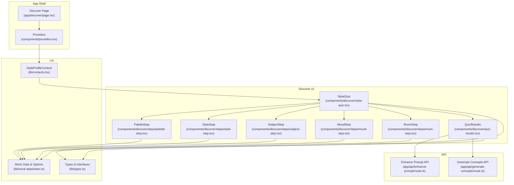
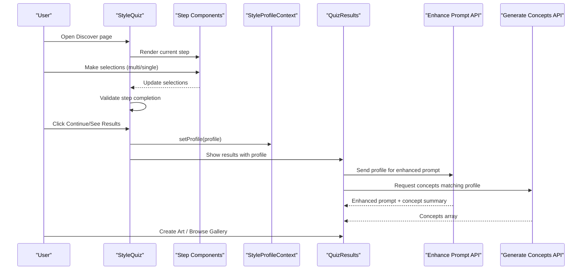
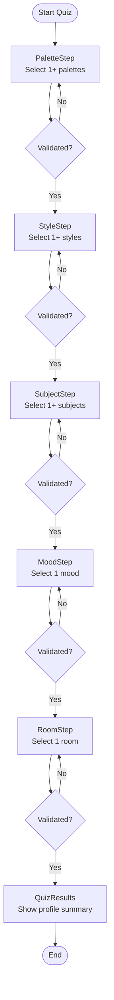
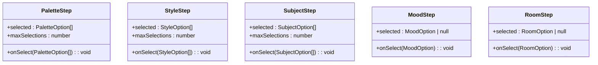
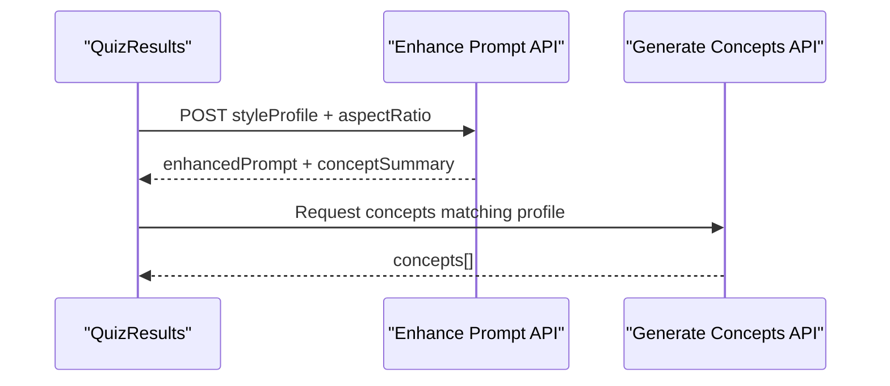
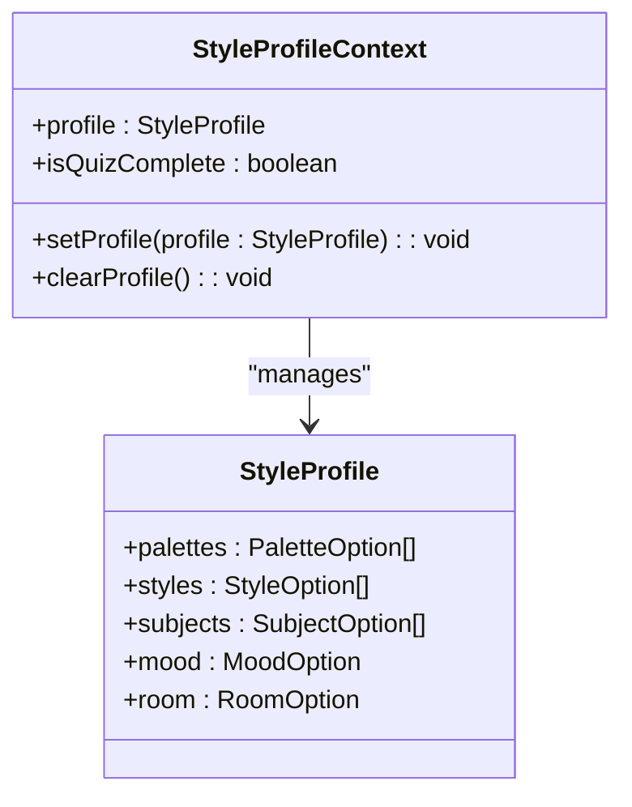
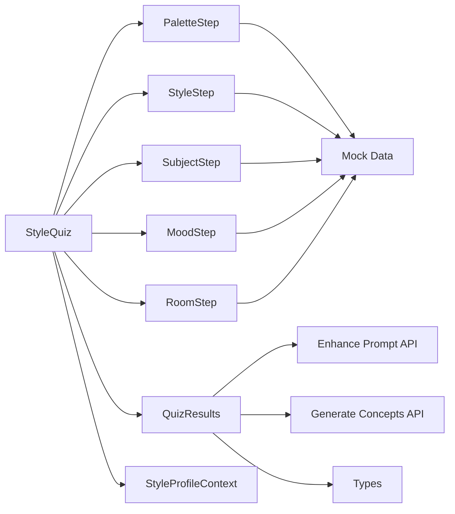

# Style Discovery Quiz

<cite>
**Referenced Files in This Document**
- [style-quiz.tsx](file://components/discover/style-quiz.tsx)
- [quiz-results.tsx](file://components/discover/quiz-results.tsx)
- [palette-step.tsx](file://components/discover/steps/palette-step.tsx)
- [style-step.tsx](file://components/discover/steps/style-step.tsx)
- [subject-step.tsx](file://components/discover/steps/subject-step.tsx)
- [mood-step.tsx](file://components/discover/steps/mood-step.tsx)
- [room-step.tsx](file://components/discover/steps/room-step.tsx)
- [types.ts](file://lib/types.ts)
- [contexts.tsx](file://lib/contexts.tsx)
- [index.ts](file://lib/mock-data/index.ts)
- [route.ts](file://app/api/enhance-prompt/route.ts)
- [route.ts](file://app/api/generate-concepts/route.ts)
- [page.tsx](file://app/discover/page.tsx)
- [providers.tsx](file://components/providers.tsx)
</cite>

## Table of Contents
1. [Introduction](#introduction)
2. [Project Structure](#project-structure)
3. [Core Components](#core-components)
4. [Architecture Overview](#architecture-overview)
5. [Detailed Component Analysis](#detailed-component-analysis)
6. [Dependency Analysis](#dependency-analysis)
7. [Performance Considerations](#performance-considerations)
8. [Troubleshooting Guide](#troubleshooting-guide)
9. [Conclusion](#conclusion)

## Introduction
The Style Discovery Quiz is a guided, five-step interactive experience that helps users define their visual preferences for AI-generated wall art. It captures color palette preferences, artistic styles, subject matters, desired mood, and room context, then presents a personalized summary and directs users to create art or browse curated gallery pieces. The quiz integrates with the AI generation pipeline by feeding the collected preferences into prompt enhancement and concept generation APIs.

## Project Structure
The quiz feature is organized under the discover module with a top-level container orchestrating steps, a results screen, and dedicated step components. Supporting types and contexts manage state and data contracts. Mock data provides visual options and starting concepts. API routes transform the style profile into optimized prompts and generate matching concepts.

**Diagram sources**
- [style-quiz.tsx:17-144](file://components/discover/style-quiz.tsx#L17-L144)
- [quiz-results.tsx:9-97](file://components/discover/quiz-results.tsx#L9-L97)
- [palette-step.tsx:7-59](file://components/discover/steps/palette-step.tsx#L7-L59)
- [style-step.tsx:8-61](file://components/discover/steps/style-step.tsx#L8-L61)
- [subject-step.tsx:8-61](file://components/discover/steps/subject-step.tsx#L8-L61)
- [mood-step.tsx:8-51](file://components/discover/steps/mood-step.tsx#L8-L51)
- [room-step.tsx:8-51](file://components/discover/steps/room-step.tsx#L8-L51)
- [contexts.tsx:30-69](file://lib/contexts.tsx#L30-L69)
- [types.ts:1-132](file://lib/types.ts#L1-L132)
- [index.ts:239-285](file://lib/mock-data/index.ts#L239-L285)
- [route.ts:9-101](file://app/api/enhance-prompt/route.ts#L9-L101)
- [route.ts:1-190](file://app/api/generate-concepts/route.ts#L1-L190)
- [page.tsx:8-10](file://app/discover/page.tsx#L8-L10)
- [providers.tsx:5-13](file://components/providers.tsx#L5-L13)

**Section sources**
- [page.tsx:8-10](file://app/discover/page.tsx#L8-L10)
- [providers.tsx:5-13](file://components/providers.tsx#L5-L13)
- [contexts.tsx:30-69](file://lib/contexts.tsx#L30-L69)

## Core Components
- StyleQuiz: Orchestrates the five-step flow, manages step index, collects selections, validates completion, and renders either the current step or the results screen.
- Step Components: PaletteStep, StyleStep, SubjectStep, MoodStep, RoomStep capture user selections with distinct interaction patterns (multi-select vs single-select) and render visual options from mock data.
- QuizResults: Presents the aggregated style profile, a color palette visualization strip, tag badges for selections, and action buttons to continue creation or browse gallery.
- Types: Defines StyleProfile and option enums, plus request/response contracts for prompt enhancement and concept generation.
- Context: Provides a persistent StyleProfile context with local storage persistence and a computed completion flag.
- Mock Data: Supplies visual options for palettes, styles, subjects, moods, rooms, and starting concepts.
- API Routes: Transform the style profile into an enhanced prompt and generate AI concepts aligned with the user’s preferences.

**Section sources**
- [style-quiz.tsx:17-144](file://components/discover/style-quiz.tsx#L17-L144)
- [palette-step.tsx:7-59](file://components/discover/steps/palette-step.tsx#L7-L59)
- [style-step.tsx:8-61](file://components/discover/steps/style-step.tsx#L8-L61)
- [subject-step.tsx:8-61](file://components/discover/steps/subject-step.tsx#L8-L61)
- [mood-step.tsx:8-51](file://components/discover/steps/mood-step.tsx#L8-L51)
- [room-step.tsx:8-51](file://components/discover/steps/room-step.tsx#L8-L51)
- [quiz-results.tsx:9-97](file://components/discover/quiz-results.tsx#L9-L97)
- [types.ts:1-132](file://lib/types.ts#L1-L132)
- [contexts.tsx:7-69](file://lib/contexts.tsx#L7-L69)
- [index.ts:239-285](file://lib/mock-data/index.ts#L239-L285)
- [route.ts:9-101](file://app/api/enhance-prompt/route.ts#L9-L101)
- [route.ts:158-189](file://app/api/generate-concepts/route.ts#L158-L189)

## Architecture Overview
The quiz follows a client-side state machine with controlled navigation and a results presentation. Selections are validated per step, then aggregated into a StyleProfile. On completion, the profile is persisted via context and presented to the user. The results screen triggers integrations with the AI generation system through API routes.

**Diagram sources**
- [style-quiz.tsx:17-62](file://components/discover/style-quiz.tsx#L17-L62)
- [quiz-results.tsx:9-97](file://components/discover/quiz-results.tsx#L9-L97)
- [contexts.tsx:46-56](file://lib/contexts.tsx#L46-L56)
- [route.ts:9-101](file://app/api/enhance-prompt/route.ts#L9-L101)
- [route.ts:158-189](file://app/api/generate-concepts/route.ts#L158-L189)

## Detailed Component Analysis

### StyleQuiz: Five-Step Workflow and State Management
- State:
  - step: current step index (0–4)
  - showResults: toggles to results view after step 4
  - selections: palettes[], styles[], subjects[], mood, room
- Validation:
  - Each step enforces minimum selections:
    - PaletteStep: at least one palette
    - StyleStep: at least one style
    - SubjectStep: at least one subject
    - MoodStep: exactly one mood
    - RoomStep: exactly one room
- Navigation:
  - Continue advances step until step 4, then aggregates selections into StyleProfile, persists via context, and switches to results.
  - Back decrements step index.
- Rendering:
  - Progress bar reflects current step.
  - Animated presence transitions between steps.
  - Results screen displays palette strip, selection tags, and action buttons.

**Diagram sources**
- [style-quiz.tsx:29-48](file://components/discover/style-quiz.tsx#L29-L48)
- [palette-step.tsx:16-22](file://components/discover/steps/palette-step.tsx#L16-L22)
- [style-step.tsx:17-23](file://components/discover/steps/style-step.tsx#L17-L23)
- [subject-step.tsx:17-23](file://components/discover/steps/subject-step.tsx#L17-L23)
- [mood-step.tsx:27-27](file://components/discover/steps/mood-step.tsx#L27-L27)
- [room-step.tsx:27-27](file://components/discover/steps/room-step.tsx#L27-L27)

**Section sources**
- [style-quiz.tsx:17-144](file://components/discover/style-quiz.tsx#L17-L144)

### Step Components: Interaction Patterns and Props
- PaletteStep
  - Props: selected: PaletteOption[], onSelect: (PaletteOption[]) => void, maxSelections: number
  - Behavior: Toggle selection with multi-select limit; renders swatches from mock data.
- StyleStep
  - Props: selected: StyleOption[], onSelect: (StyleOption[]) => void, maxSelections: number
  - Behavior: Toggle selection with multi-select limit; renders styled cards with images.
- SubjectStep
  - Props: selected: SubjectOption[], onSelect: (SubjectOption[]) => void, maxSelections: number
  - Behavior: Toggle selection with multi-select limit; renders square cards with images.
- MoodStep
  - Props: selected: MoodOption | null, onSelect: (MoodOption) => void
  - Behavior: Single-select; renders cards with overlay labels.
- RoomStep
  - Props: selected: RoomOption | null, onSelect: (RoomOption) => void
  - Behavior: Single-select; renders room imagery with labels.

**Diagram sources**
- [palette-step.tsx:7-15](file://components/discover/steps/palette-step.tsx#L7-L15)
- [style-step.tsx:8-16](file://components/discover/steps/style-step.tsx#L8-L16)
- [subject-step.tsx:8-16](file://components/discover/steps/subject-step.tsx#L8-L16)
- [mood-step.tsx:8-14](file://components/discover/steps/mood-step.tsx#L8-L14)
- [room-step.tsx:8-14](file://components/discover/steps/room-step.tsx#L8-L14)

**Section sources**
- [palette-step.tsx:7-59](file://components/discover/steps/palette-step.tsx#L7-L59)
- [style-step.tsx:8-61](file://components/discover/steps/style-step.tsx#L8-L61)
- [subject-step.tsx:8-61](file://components/discover/steps/subject-step.tsx#L8-L61)
- [mood-step.tsx:8-51](file://components/discover/steps/mood-step.tsx#L8-L51)
- [room-step.tsx:8-51](file://components/discover/steps/room-step.tsx#L8-L51)

### QuizResults: Presentation and Actions
- Displays:
  - A header with icon and title
  - A horizontal palette strip built from selected palettes
  - Tag badges for styles, subjects, mood, and room
  - Descriptive text explaining how the profile informs AI generation
- Actions:
  - Create Your Art: navigates to the creation page
  - Browse Gallery: navigates to the gallery page
- Integration:
  - Triggers prompt enhancement and concept generation APIs using the StyleProfile

**Diagram sources**
- [quiz-results.tsx:9-97](file://components/discover/quiz-results.tsx#L9-L97)
- [route.ts:9-101](file://app/api/enhance-prompt/route.ts#L9-L101)
- [route.ts:158-189](file://app/api/generate-concepts/route.ts#L158-L189)

**Section sources**
- [quiz-results.tsx:9-97](file://components/discover/quiz-results.tsx#L9-L97)

### Types and Context: Data Contracts and Persistence
- StyleProfile: palettes[], styles[], subjects[], mood, room
- Option enums: PaletteOption, StyleOption, SubjectOption, MoodOption, RoomOption
- Context:
  - Stores profile in local storage
  - Exposes setProfile and clearProfile
  - Computes isQuizComplete based on profile completeness
- Integration:
  - StyleQuiz uses context to persist the profile upon quiz completion
  - Other features can read the profile to personalize experiences

**Diagram sources**
- [types.ts:2-8](file://lib/types.ts#L2-L8)
- [contexts.tsx:7-69](file://lib/contexts.tsx#L7-L69)

**Section sources**
- [types.ts:1-132](file://lib/types.ts#L1-L132)
- [contexts.tsx:30-69](file://lib/contexts.tsx#L30-L69)

### Mock Data and Options
- PaletteOptions: six named palettes with associated color arrays
- StyleOptions: six art styles with representative images
- SubjectOptions: eight subjects with images
- MoodOptions: six moods with imagery and labels
- RoomOptions: six room contexts with images
- StartingConcepts: pre-defined concepts for fallback and inspiration

**Section sources**
- [index.ts:239-285](file://lib/mock-data/index.ts#L239-L285)

### API Integrations: Prompt Enhancement and Concept Generation
- Enhance Prompt API:
  - Accepts userInput, styleProfile, and aspectRatio
  - Builds an enhanced prompt combining profile details and optional user input
  - Returns enhancedPrompt and conceptSummary
- Generate Concepts API:
  - Accepts optional styleProfile
  - Generates AI concepts tailored to the profile or returns fallback concepts
  - Uses Gemini with a structured system prompt and JSON response parsing

**Section sources**
- [route.ts:9-101](file://app/api/enhance-prompt/route.ts#L9-L101)
- [route.ts:158-189](file://app/api/generate-concepts/route.ts#L158-L189)

## Dependency Analysis
- Component dependencies:
  - StyleQuiz depends on step components and renders QuizResults when complete.
  - Step components depend on mock data for rendering options.
  - QuizResults depends on types for typing and on API routes for integrations.
- Context and state:
  - StyleQuiz writes to StyleProfileContext; other parts of the app can read the profile.
- External integrations:
  - API routes rely on environment variables for AI service keys.

**Diagram sources**
- [style-quiz.tsx:8-13](file://components/discover/style-quiz.tsx#L8-L13)
- [palette-step.tsx:3-5](file://components/discover/steps/palette-step.tsx#L3-L5)
- [style-step.tsx:4-6](file://components/discover/steps/style-step.tsx#L4-L6)
- [subject-step.tsx:4-6](file://components/discover/steps/subject-step.tsx#L4-L6)
- [mood-step.tsx:4-6](file://components/discover/steps/mood-step.tsx#L4-L6)
- [room-step.tsx:4-6](file://components/discover/steps/room-step.tsx#L4-L6)
- [quiz-results.tsx:6-7](file://components/discover/quiz-results.tsx#L6-L7)
- [contexts.tsx:46-56](file://lib/contexts.tsx#L46-L56)
- [types.ts:32-52](file://lib/types.ts#L32-L52)
- [route.ts:9-11](file://app/api/enhance-prompt/route.ts#L9-L11)
- [route.ts:1-4](file://app/api/generate-concepts/route.ts#L1-L4)

**Section sources**
- [style-quiz.tsx:17-144](file://components/discover/style-quiz.tsx#L17-L144)
- [quiz-results.tsx:9-97](file://components/discover/quiz-results.tsx#L9-L97)
- [contexts.tsx:30-69](file://lib/contexts.tsx#L30-L69)

## Performance Considerations
- Client-side rendering: The quiz runs entirely on the client, minimizing server load during navigation and selection.
- Local storage persistence: Profile is cached locally to avoid re-entry on revisit.
- Image loading: Step components use Next.js Image with responsive sizing; ensure lazy loading and appropriate widths for mobile.
- Animations: Framer Motion animations are lightweight but should be reviewed for low-power devices.
- API latency: Prompt enhancement and concept generation are asynchronous; consider showing loading indicators in future iterations.

## Troubleshooting Guide
- Quiz does not advance:
  - Ensure minimum selections per step are met (at least one palette/style/subject; exactly one mood/room).
- Results not shown:
  - Verify that step 4 is completed and the profile is persisted via context.
- API errors:
  - Confirm environment variables for AI services are configured; the APIs fall back to mock data when keys are missing.
- Navigation issues:
  - Confirm Next.js router is available and routing targets (/create, /gallery) exist.

**Section sources**
- [style-quiz.tsx:29-48](file://components/discover/style-quiz.tsx#L29-L48)
- [contexts.tsx:46-56](file://lib/contexts.tsx#L46-L56)
- [route.ts:9-101](file://app/api/enhance-prompt/route.ts#L9-L101)
- [route.ts:141-156](file://app/api/generate-concepts/route.ts#L141-L156)

## Conclusion
The Style Discovery Quiz provides a streamlined, visually engaging pathway for users to express their preferences. Its modular step components, robust validation, and seamless integration with AI prompt enhancement and concept generation deliver a cohesive user experience. The persistent style profile enables broader personalization across the application, while the clear separation of concerns supports maintainability and extensibility.