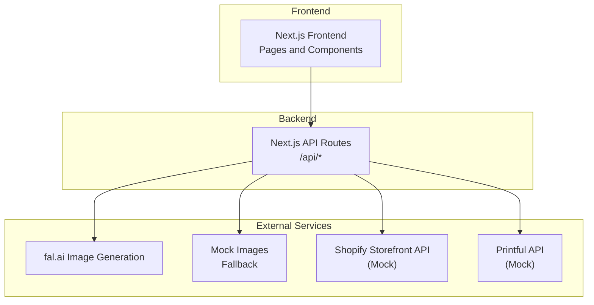

# Getting Started

<cite>
**Referenced Files in This Document**
- [README.md](file://README.md)
- [SETUP.md](file://SETUP.md)
- [package.json](file://package.json)
- [next.config.mjs](file://next.config.mjs)
- [components.json](file://components.json)
- [tsconfig.json](file://tsconfig.json)
- [tailwind.config.ts](file://tailwind.config.ts)
- [app/api/generate/route.ts](file://app/api/generate/route.ts)
- [app/api/test-key/route.ts](file://app/api/test-key/route.ts)
- [lib/types.ts](file://lib/types.ts)
- [lib/mock-data/index.ts](file://lib/mock-data/index.ts)
- [test-gemini.js](file://test-gemini.js)
</cite>

## Table of Contents
1. [Introduction](#introduction)
2. [Prerequisites](#prerequisites)
3. [Installation](#installation)
4. [Environment Configuration](#environment-configuration)
5. [Development Server](#development-server)
6. [Verification](#verification)
7. [Project Structure Overview](#project-structure-overview)
8. [Architecture Overview](#architecture-overview)
9. [Troubleshooting Guide](#troubleshooting-guide)
10. [Conclusion](#conclusion)

## Introduction
This guide helps you set up and run the Muse AI-powered wall art store locally. Muse is a Next.js application featuring an interactive style quiz, AI image generation, a product configurator, and a Shopify-powered storefront. You will configure environment variables, install dependencies, start the development server, and verify that everything works as expected.

## Prerequisites
Before installing, ensure your environment meets the following requirements:
- Node.js 18 or newer
- A package manager (npm or pnpm)
- A fal.ai API key for real image generation (optional; the app will use mock images without it)

**Section sources**
- [README.md:150-155](file://README.md#L150-L155)

## Installation
Install project dependencies using your preferred package manager:
- npm: `npm install`
- pnpm: `pnpm install`

This installs all required dependencies defined in the project configuration.

**Section sources**
- [package.json:5-10](file://package.json#L5-L10)
- [README.md:156-161](file://README.md#L156-L161)

## Environment Configuration
Configure environment variables for local development:
1. Create a local environment file:
   - Copy the example template to `.env.local` in the project root.
2. Add your fal.ai API key:
   - Set the `FAL_KEY` variable with your fal.ai key.

After setting the key, restart the development server so the changes take effect.

**Section sources**
- [README.md:164-173](file://README.md#L164-L173)
- [SETUP.md:14-27](file://SETUP.md#L14-L27)

## Development Server
Start the Next.js development server:
- npm: `npm run dev`
- pnpm: `pnpm dev`

The app will run at http://localhost:3000 with Turbopack enabled for fast refresh.

**Section sources**
- [README.md:174-182](file://README.md#L174-L182)
- [SETUP.md:34-40](file://SETUP.md#L34-L40)

## Verification
Verify your setup by confirming the following:
- The development server starts successfully and is reachable at http://localhost:3000
- The API key is recognized by the backend
- Real AI images are generated when the key is present, or mock images appear otherwise

### Confirm API Key Presence
Call the test endpoint to check if the key is configured:
- Endpoint: GET `/api/test-key`
- Response includes whether the key is present and a helpful message

**Section sources**
- [app/api/test-key/route.ts:1-14](file://app/api/test-key/route.ts#L1-L14)

### Test Image Generation
Optionally, run the test script to validate the Gemini integration:
- Command: `node test-gemini.js`
- The script checks for the presence of the API key, attempts a test generation, and prints success or error details

**Section sources**
- [test-gemini.js:1-107](file://test-gemini.js#L1-L107)

### View Remote Images
The application allows loading images from specific remote hosts. Confirm that Next.js image optimization permits the configured remote patterns.

**Section sources**
- [next.config.mjs:6-19](file://next.config.mjs#L6-L19)

## Project Structure Overview
The project follows a Next.js App Router structure with clear separation of pages, API routes, components, and shared libraries.

```mermaid
graph TB
A["Root"] --> B["app/"]
A --> C["components/"]
A --> D["lib/"]
A --> E["public/"]
A --> F["styles/"]
B --> B1["api/"]
B1 --> B1a["enhance-prompt/"]
B1 --> B1b["generate/"]
B1 --> B1c["fulfill-order/"]
B1 --> B1d["upload-image/"]
B1 --> B1e["test-key/"]
B1 --> B1f["test-shopify/"]
B --> B2["discover/"]
B --> B3["create/"]
B --> B4["configure/[imageId]/"]
B --> B5["gallery/"]
B --> B6["cart/"]
B --> B7["checkout-placeholder/"]
C --> C1["cart/"]
C --> C2["configure/"]
C --> C3["create/"]
C --> C4["discover/"]
C --> C5["gallery/"]
C --> C6["landing/"]
C --> C7["ui/"]
C --> C8["providers.tsx"]
C --> C9["site-header.tsx"]
C --> C10["theme-provider.tsx"]
D --> D1["contexts.tsx"]
D --> D2["mock-data/"]
D --> D3["product-mapping.ts"]
D --> D4["shopify-admin.ts"]
D --> D5["shopify-mock.ts"]
D --> D6["shopify.ts"]
D --> D7["types.ts"]
D --> D8["utils.ts"]
```

**Diagram sources**
- [README.md:69-125](file://README.md#L69-L125)

Key directories and responsibilities:
- app/: Contains Next.js App Router pages and API routes
- components/: Reusable UI components organized by feature
- lib/: Shared logic, types, and mock data
- public/: Static assets used by the application
- styles/: Global CSS and design tokens

**Section sources**
- [README.md:69-125](file://README.md#L69-L125)

## Architecture Overview
The application integrates user-facing features with external services. The backend API routes handle image generation, prompt enhancement, and order fulfillment, while the frontend provides the interactive experience.

**Diagram sources**
- [README.md:7-26](file://README.md#L7-L26)
- [README.md:191-217](file://README.md#L191-L217)

## Troubleshooting Guide
Common setup issues and resolutions:

- Images not generating or still showing mock images
  - Ensure the API key is present in `.env.local` and restart the development server
  - Confirm the file is located in the project root and not inside a subdirectory

- API key invalid or unauthorized
  - Verify the key format and validity
  - Obtain a new key if necessary

- Rate limit or quota errors
  - Check the service dashboard for usage and limits
  - Wait and retry after the cooldown period

- API errors (e.g., 400, 429, 5xx)
  - Validate the prompt and supported aspect ratios
  - Check service status and retry with backoff

- Remote image loading issues
  - Confirm that Next.js image optimization allows the configured remote patterns

**Section sources**
- [SETUP.md:89-123](file://SETUP.md#L89-L123)
- [README.md:191-217](file://README.md#L191-L217)
- [next.config.mjs:6-19](file://next.config.mjs#L6-L19)

## Conclusion
You are now ready to develop and run the Muse AI-powered wall art store locally. With the prerequisites met, dependencies installed, environment configured, and the development server running, you can explore the style quiz, generate AI art, configure products, and simulate the checkout flow. Use the verification steps and troubleshooting tips to resolve common issues quickly.