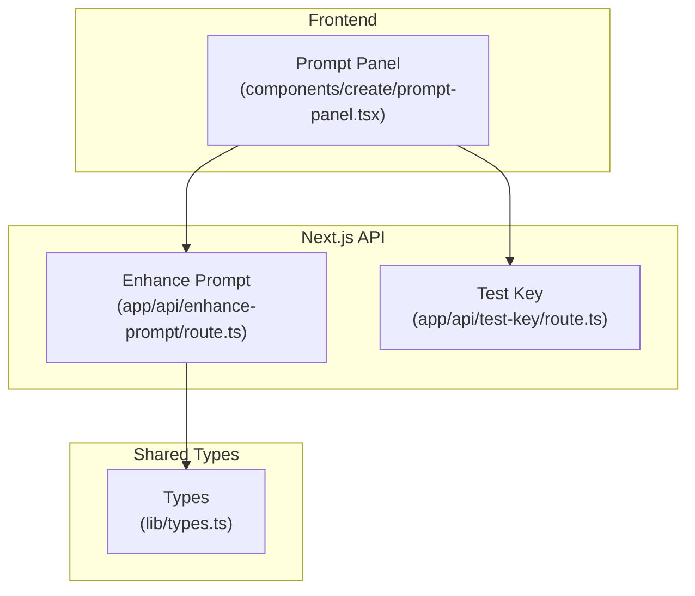
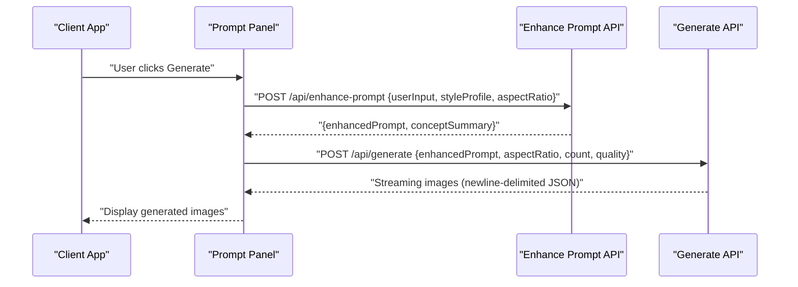
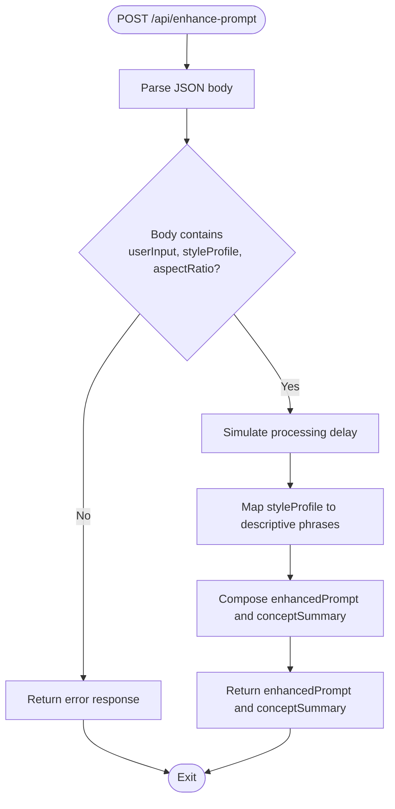
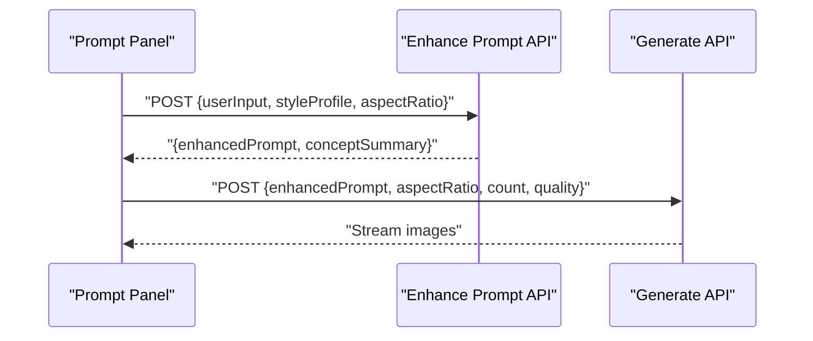
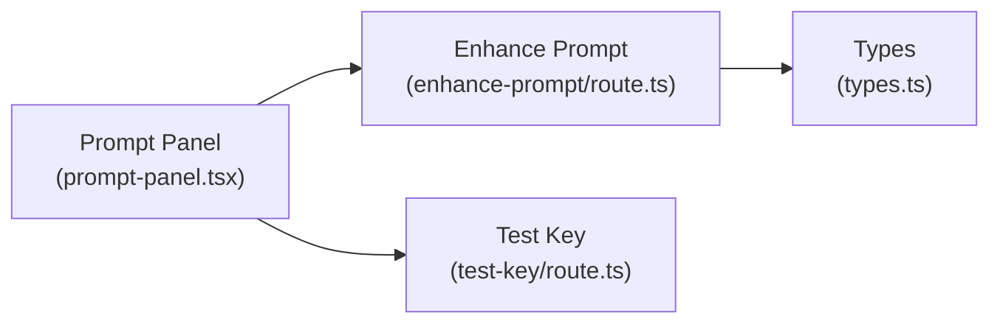

# Anthropic Claude Integration

<cite>
**Referenced Files in This Document**
- [app/api/enhance-prompt/route.ts](file://app/api/enhance-prompt/route.ts)
- [app/api/test-key/route.ts](file://app/api/test-key/route.ts)
- [components/create/prompt-panel.tsx](file://components/create/prompt-panel.tsx)
- [lib/types.ts](file://lib/types.ts)
- [README.md](file://README.md)
- [package.json](file://package.json)
- [.claude/settings.local.json](file://.claude/settings.local.json)
</cite>

## Table of Contents
1. [Introduction](#introduction)
2. [Project Structure](#project-structure)
3. [Core Components](#core-components)
4. [Architecture Overview](#architecture-overview)
5. [Detailed Component Analysis](#detailed-component-analysis)
6. [Dependency Analysis](#dependency-analysis)
7. [Performance Considerations](#performance-considerations)
8. [Troubleshooting Guide](#troubleshooting-guide)
9. [Conclusion](#conclusion)
10. [Appendices](#appendices)

## Introduction
This document describes the optional Anthropic Claude AI integration used to enhance user prompts for improved image generation quality. The current implementation simulates the prompt enhancement process locally and includes placeholders indicating how to integrate with the real Anthropic Claude API. It documents the prompt enhancement API endpoint, configuration, request/response formats, and operational guidance including rate limiting, cost optimization, and fallback strategies.

## Project Structure
The Anthropic Claude integration is primarily implemented in the Next.js API routes and consumed by the frontend generation studio. The key files are:
- API route for prompt enhancement
- API route for key validation
- Frontend component that triggers the enhancement and subsequent generation
- Shared TypeScript types for request/response contracts
- Project documentation and environment variable configuration

**Diagram sources**
- [components/create/prompt-panel.tsx:54-62](file://components/create/prompt-panel.tsx#L54-L62)
- [app/api/enhance-prompt/route.ts:9-11](file://app/api/enhance-prompt/route.ts#L9-L11)
- [app/api/test-key/route.ts:3-12](file://app/api/test-key/route.ts#L3-L12)
- [lib/types.ts:32-41](file://lib/types.ts#L32-L41)

**Section sources**
- [README.md:60-68](file://README.md#L60-L68)
- [lib/types.ts:1-132](file://lib/types.ts#L1-L132)

## Core Components
- Prompt Enhancement API endpoint: Accepts user input, a style profile, and an aspect ratio, then returns an enhanced prompt and a concise concept summary.
- Test Key endpoint: Verifies the presence and basic validity of the configured API key.
- Frontend integration: Calls the enhancement endpoint before invoking the image generation pipeline.

Key behaviors:
- The enhancement endpoint currently simulates processing and constructs an enhanced prompt from style metadata.
- The frontend composes the request payload and parses the response to drive the generation flow.

**Section sources**
- [app/api/enhance-prompt/route.ts:9-101](file://app/api/enhance-prompt/route.ts#L9-L101)
- [components/create/prompt-panel.tsx:54-76](file://components/create/prompt-panel.tsx#L54-L76)
- [lib/types.ts:32-41](file://lib/types.ts#L32-L41)

## Architecture Overview
The prompt enhancement workflow integrates with the broader generation pipeline. The frontend sends a request to the enhancement endpoint, which returns an enhanced prompt. That prompt is then passed to the image generation endpoint, which streams results back to the UI.

**Diagram sources**
- [components/create/prompt-panel.tsx:54-76](file://components/create/prompt-panel.tsx#L54-L76)
- [app/api/enhance-prompt/route.ts:99-100](file://app/api/enhance-prompt/route.ts#L99-L100)
- [app/api/generate/route.ts:58-113](file://app/api/generate/route.ts#L58-L113)

## Detailed Component Analysis

### Prompt Enhancement API Endpoint
Purpose:
- Transform user input and a style profile into a structured, richly descriptive prompt optimized for image generation.

Input contract:
- userInput: free-text prompt provided by the user (optional)
- styleProfile: structured preferences including palettes, styles, subjects, mood, and room
- aspectRatio: target aspect ratio for the generated image

Processing logic:
- The endpoint simulates processing latency.
- It maps style profile keys to descriptive phrases and composes an enhanced prompt string.
- It also produces a concise conceptSummary derived from the style profile.

Output contract:
- enhancedPrompt: the enhanced prompt string suitable for image generation
- conceptSummary: a short summary capturing the core concept

Validation and error handling:
- The endpoint expects a JSON body conforming to the request type.
- On success, it returns a JSON response with the two fields described above.

**Diagram sources**
- [app/api/enhance-prompt/route.ts:9-101](file://app/api/enhance-prompt/route.ts#L9-L101)

**Section sources**
- [app/api/enhance-prompt/route.ts:9-101](file://app/api/enhance-prompt/route.ts#L9-L101)
- [lib/types.ts:32-41](file://lib/types.ts#L32-L41)

### Frontend Integration
The frontend component orchestrates the enhancement and generation flow:
- Builds a styleProfile from quiz results or defaults
- Sends a POST request to /api/enhance-prompt
- Parses the enhanced prompt from the response
- Invokes the generation endpoint with the enhanced prompt and streaming response handling

**Diagram sources**
- [components/create/prompt-panel.tsx:54-76](file://components/create/prompt-panel.tsx#L54-L76)
- [app/api/enhance-prompt/route.ts:99-100](file://app/api/enhance-prompt/route.ts#L99-L100)

**Section sources**
- [components/create/prompt-panel.tsx:42-86](file://components/create/prompt-panel.tsx#L42-L86)

### Test Key Endpoint
Purpose:
- Verify that the Anthropic API key is configured in the environment.

Behavior:
- Reads the configured key from the environment.
- Returns a JSON object indicating whether the key is present, a masked prefix, and a descriptive message.

Notes:
- The current implementation reads a different key variable than the one used by the enhancement endpoint. This is intended to support separate key management for different services.

**Section sources**
- [app/api/test-key/route.ts:3-12](file://app/api/test-key/route.ts#L3-L12)

### Configuration and Environment Variables
Environment variables:
- ANTHROPIC_API_KEY: Used by the enhancement endpoint when integrating with the real Anthropic Claude API.
- FAL_KEY: Used by the image generation service (not the Claude integration).
- NEXT_PUBLIC_SHOPIFY_STORE_DOMAIN, SHOPIFY_STOREFRONT_ACCESS_TOKEN, PRINTFUL_API_KEY: Optional for production integrations.

Package dependencies:
- The project does not currently depend on the official Anthropic SDK. Integration would require adding the appropriate client library.

**Section sources**
- [README.md:215-217](file://README.md#L215-L217)
- [package.json:11-81](file://package.json#L11-L81)

## Dependency Analysis
- The frontend depends on the enhancement endpoint for prompt enrichment.
- The enhancement endpoint relies on shared types for request/response contracts.
- The test key endpoint is independent but useful for validating configuration.

**Diagram sources**
- [components/create/prompt-panel.tsx:54-62](file://components/create/prompt-panel.tsx#L54-L62)
- [app/api/enhance-prompt/route.ts:1-2](file://app/api/enhance-prompt/route.ts#L1-L2)
- [lib/types.ts:32-41](file://lib/types.ts#L32-L41)
- [app/api/test-key/route.ts:1-1](file://app/api/test-key/route.ts#L1-L1)

**Section sources**
- [lib/types.ts:32-41](file://lib/types.ts#L32-L41)
- [components/create/prompt-panel.tsx:54-62](file://components/create/prompt-panel.tsx#L54-L62)

## Performance Considerations
- Current simulation overhead: The endpoint intentionally introduces a small delay to simulate processing time. Remove or reduce this delay when integrating with the real API.
- Network latency: When integrating with Anthropic Claude, latency will depend on network conditions and API response times.
- Throughput: Consider batching enhancements or caching frequently used combinations of style profiles to reduce redundant calls.
- Streaming generation: The downstream generation endpoint streams results; ensure the UI handles partial responses efficiently.

[No sources needed since this section provides general guidance]

## Troubleshooting Guide
Common issues and resolutions:
- API key validation failures:
  - Confirm that the environment variable for the Anthropic key is set and correct.
  - Use the test key endpoint to verify configuration.
- Rate limit exceeded errors:
  - Implement retry logic with exponential backoff.
  - Monitor usage and consider upgrading the account plan if necessary.
- Prompt enhancement quality variations:
  - Adjust the style profile inputs to be more specific.
  - Experiment with different aspect ratios and style combinations.
- Fallback mechanisms:
  - When the Anthropic integration is unavailable, rely on the current local enhancement logic to produce a baseline prompt.
  - Ensure the UI remains functional even if the enhancement endpoint fails.

**Section sources**
- [app/api/test-key/route.ts:3-12](file://app/api/test-key/route.ts#L3-L12)
- [app/api/enhance-prompt/route.ts:4-7](file://app/api/enhance-prompt/route.ts#L4-L7)

## Conclusion
The Anthropic Claude integration is designed to enhance prompts using style profiles and user input, improving the quality and relevance of generated images. While the current implementation simulates the enhancement process, the architecture supports seamless integration with the real Anthropic Claude API. Proper configuration, monitoring, and fallback strategies are essential for reliable operation.

[No sources needed since this section summarizes without analyzing specific files]

## Appendices

### API Definition: Prompt Enhancement
- Endpoint: POST /api/enhance-prompt
- Request body fields:
  - userInput: string
  - styleProfile: object with palettes, styles, subjects, mood, room
  - aspectRatio: string
- Response fields:
  - enhancedPrompt: string
  - conceptSummary: string

**Section sources**
- [lib/types.ts:32-41](file://lib/types.ts#L32-L41)
- [app/api/enhance-prompt/route.ts:99-100](file://app/api/enhance-prompt/route.ts#L99-L100)

### Configuration Options and Best Practices
- API key setup:
  - Set ANTHROPIC_API_KEY in the environment.
  - Use the test key endpoint to verify configuration.
- Model selection:
  - When integrating with the real API, choose an appropriate model for prompt enhancement tasks.
- Prompt engineering best practices:
  - Provide clear, specific user input when available.
  - Select precise style, subject, and palette options in the style profile.
  - Align aspectRatio with the intended composition.
- Cost optimization:
  - Minimize redundant enhancements by caching or reusing previous results.
  - Monitor token usage and adjust prompt complexity accordingly.
- Fallback mechanisms:
  - Continue to support the current local enhancement logic during outages or misconfiguration.

**Section sources**
- [README.md:215-217](file://README.md#L215-L217)
- [app/api/test-key/route.ts:3-12](file://app/api/test-key/route.ts#L3-L12)
- [app/api/enhance-prompt/route.ts:17-76](file://app/api/enhance-prompt/route.ts#L17-L76)

### Example Workflows and Impact
- Example workflow:
  - User completes the style quiz and optionally adds a description.
  - The frontend sends the combined inputs to the enhancement endpoint.
  - The endpoint returns an enhanced prompt tailored to the selected styles and aspect ratio.
  - The generation endpoint uses the enhanced prompt to produce high-quality images.
- Impact on results:
  - Enhanced prompts typically lead to more coherent compositions, accurate color usage, and stronger adherence to requested styles and subjects.

**Section sources**
- [components/create/prompt-panel.tsx:54-76](file://components/create/prompt-panel.tsx#L54-L76)
- [app/api/enhance-prompt/route.ts:82-92](file://app/api/enhance-prompt/route.ts#L82-L92)

### Additional Notes
- The repository includes a local configuration file for a tool named “Claude,” distinct from the Anthropic integration described here. It controls permissions for local development tasks and is unrelated to the AI service configuration.

**Section sources**
- [.claude/settings.local.json:1-14](file://.claude/settings.local.json#L1-L14)