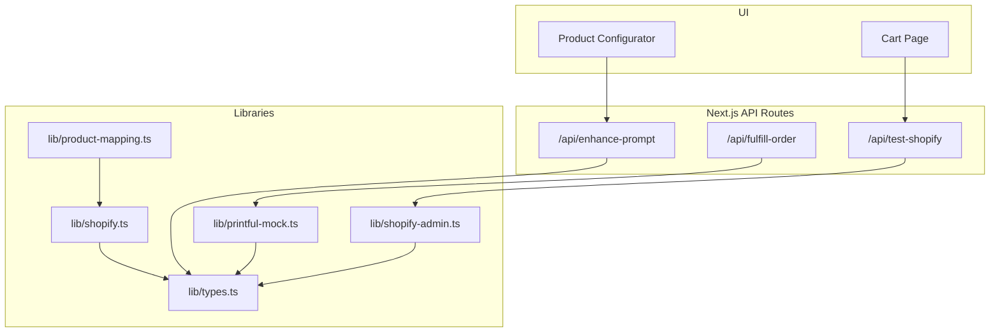
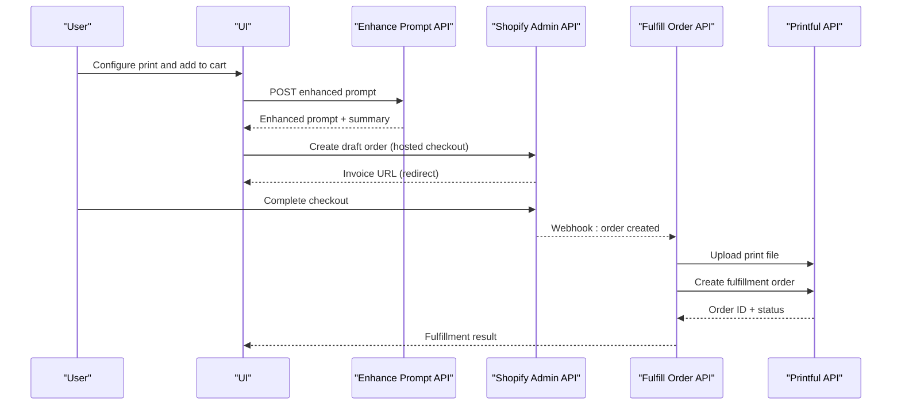
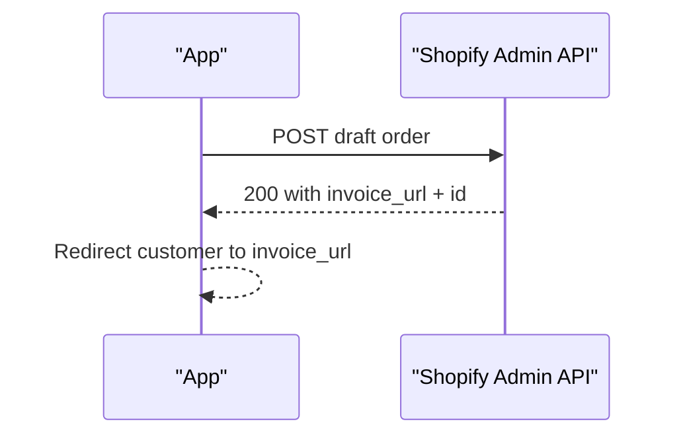
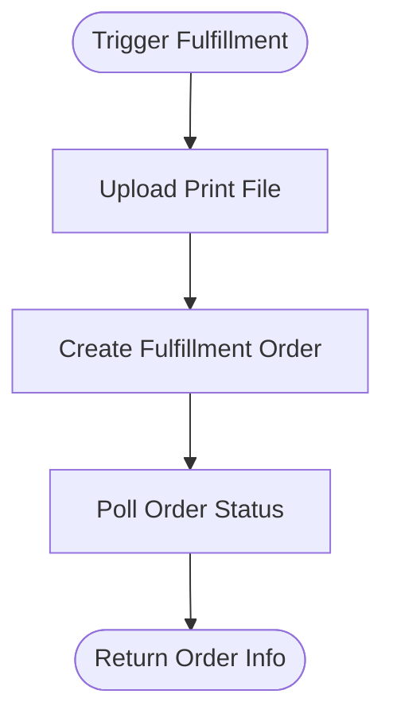
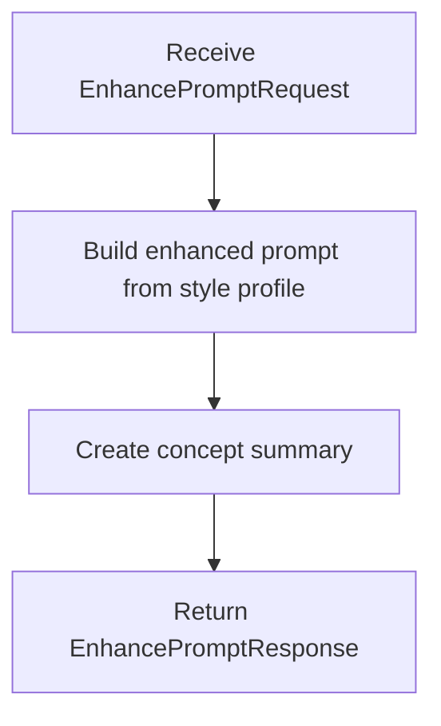
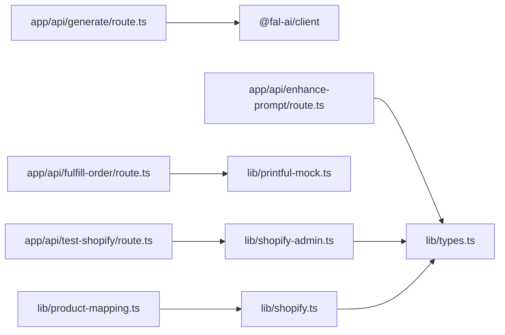

# Integration Guide

<cite>
**Referenced Files in This Document**
- [lib/shopify.ts](file://lib/shopify.ts)
- [lib/shopify-mock.ts](file://lib/shopify-mock.ts)
- [lib/shopify-admin.ts](file://lib/shopify-admin.ts)
- [lib/printful-mock.ts](file://lib/printful-mock.ts)
- [lib/types.ts](file://lib/types.ts)
- [lib/product-mapping.ts](file://lib/product-mapping.ts)
- [app/api/test-shopify/route.ts](file://app/api/test-shopify/route.ts)
- [app/api/enhance-prompt/route.ts](file://app/api/enhance-prompt/route.ts)
- [app/api/fulfill-order/route.ts](file://app/api/fulfill-order/route.ts)
- [SHOPIFY_SETUP.md](file://SHOPIFY_SETUP.md)
- [SHOPIFY_ADMIN_API_SETUP.md](file://SHOPIFY_ADMIN_API_SETUP.md)
- [INTEGRATION_SUMMARY.md](file://INTEGRATION_SUMMARY.md)
- [TROUBLESHOOTING.md](file://TROUBLESHOOTING.md)
- [package.json](file://package.json)
</cite>

## Table of Contents
1. [Introduction](#introduction)
2. [Project Structure](#project-structure)
3. [Core Components](#core-components)
4. [Architecture Overview](#architecture-overview)
5. [Detailed Component Analysis](#detailed-component-analysis)
6. [Dependency Analysis](#dependency-analysis)
7. [Performance Considerations](#performance-considerations)
8. [Troubleshooting Guide](#troubleshooting-guide)
9. [Conclusion](#conclusion)
10. [Appendices](#appendices)

## Introduction
This document provides comprehensive integration documentation for external services used by the AI Art Print storefront:
- Shopify Storefront API (GraphQL) for cart and checkout
- Shopify Admin API for draft orders and hosted checkout
- Printful fulfillment API (mock implementation provided)
- Optional Anthropic Claude prompt enhancement (mock implementation provided)

It covers configuration, authentication, endpoints, request/response schemas, error handling, webhook setup, fulfillment workflows, migration from mock to live APIs, troubleshooting, testing, and production considerations.

## Project Structure
The integration spans client-side UI, Next.js API routes, and service libraries:
- API routes expose endpoints for prompt enhancement, order fulfillment, and Shopify connectivity checks
- Libraries encapsulate Shopify Storefront/Admin clients and Printful mock integrations
- Types define request/response contracts for integrations
- Setup guides describe product configuration and environment variables



**Diagram sources**
- [lib/shopify.ts:1-303](file://lib/shopify.ts#L1-L303)
- [lib/shopify-admin.ts:1-103](file://lib/shopify-admin.ts#L1-L103)
- [lib/printful-mock.ts:1-77](file://lib/printful-mock.ts#L1-L77)
- [lib/types.ts:1-132](file://lib/types.ts#L1-L132)
- [lib/product-mapping.ts:1-68](file://lib/product-mapping.ts#L1-L68)
- [app/api/test-shopify/route.ts:1-91](file://app/api/test-shopify/route.ts#L1-L91)
- [app/api/enhance-prompt/route.ts:1-102](file://app/api/enhance-prompt/route.ts#L1-L102)
- [app/api/fulfill-order/route.ts:1-39](file://app/api/fulfill-order/route.ts#L1-L39)

**Section sources**
- [lib/shopify.ts:1-303](file://lib/shopify.ts#L1-L303)
- [lib/shopify-admin.ts:1-103](file://lib/shopify-admin.ts#L1-L103)
- [lib/printful-mock.ts:1-77](file://lib/printful-mock.ts#L1-L77)
- [lib/types.ts:1-132](file://lib/types.ts#L1-L132)
- [lib/product-mapping.ts:1-68](file://lib/product-mapping.ts#L1-L68)
- [app/api/test-shopify/route.ts:1-91](file://app/api/test-shopify/route.ts#L1-L91)
- [app/api/enhance-prompt/route.ts:1-102](file://app/api/enhance-prompt/route.ts#L1-L102)
- [app/api/fulfill-order/route.ts:1-39](file://app/api/fulfill-order/route.ts#L1-L39)

## Core Components
- Shopify Storefront API client: GraphQL client with typed responses, cart operations, and error handling
- Shopify Admin API client: Draft order creation and hosted checkout redirection
- Printful mock client: File upload, order creation, and status polling
- Prompt enhancement endpoint: Rule-based enhancement (mock) with optional Claude integration
- Product mapping: Maps app configurations to Shopify variant IDs
- API routes: Expose health checks, fulfillment triggers, and prompt enhancement

**Section sources**
- [lib/shopify.ts:1-303](file://lib/shopify.ts#L1-L303)
- [lib/shopify-admin.ts:1-103](file://lib/shopify-admin.ts#L1-L103)
- [lib/printful-mock.ts:1-77](file://lib/printful-mock.ts#L1-L77)
- [app/api/enhance-prompt/route.ts:1-102](file://app/api/enhance-prompt/route.ts#L1-L102)
- [lib/product-mapping.ts:1-68](file://lib/product-mapping.ts#L1-L68)
- [app/api/fulfill-order/route.ts:1-39](file://app/api/fulfill-order/route.ts#L1-L39)

## Architecture Overview
High-level integration flow:
- Prompt enhancement endpoint builds an optimized prompt from user input and style profile
- Product configurator selects a Shopify variant and adds items to cart
- Shopify Admin API creates a draft order and redirects to hosted checkout
- On order creation, fulfillment endpoint uploads the print file to Printful and creates an order



**Diagram sources**
- [app/api/enhance-prompt/route.ts:1-102](file://app/api/enhance-prompt/route.ts#L1-L102)
- [lib/shopify-admin.ts:1-103](file://lib/shopify-admin.ts#L1-L103)
- [app/api/fulfill-order/route.ts:1-39](file://app/api/fulfill-order/route.ts#L1-L39)
- [lib/printful-mock.ts:1-77](file://lib/printful-mock.ts#L1-L77)

## Detailed Component Analysis

### Shopify Storefront API Client
- Purpose: Manage carts and checkout via GraphQL
- Authentication: Header-based storefront access token
- Endpoints: Cart creation, adding/removing lines, retrieving cart, checkout URL
- Error handling: Validates credentials, handles HTTP errors, GraphQL errors, and empty data
- Configuration: Environment variables for domain, token, and API version

```mermaid
classDiagram
class ShopifyClient {
+createCart(lines) Promise~Cart~
+addToCart(cartId, lines) Promise~{success}~
+getCart(cartId) Promise~ShopifyCart~
+removeFromCart(cartId, lineIds) Promise~{success}~
+getCheckoutUrl(cartId) Promise~string~
+isShopifyConfigured() boolean
}
class ShopifyResponse {
+data
+errors
}
ShopifyClient --> ShopifyResponse : "returns"
```

**Diagram sources**
- [lib/shopify.ts:1-303](file://lib/shopify.ts#L1-L303)

**Section sources**
- [lib/shopify.ts:1-303](file://lib/shopify.ts#L1-L303)

### Shopify Admin API Client
- Purpose: Create draft orders and redirect customers to Shopify’s hosted checkout
- Authentication: Admin API access token header
- Endpoints: Draft order creation with line items and custom properties
- Error handling: Validates credentials, handles HTTP errors, logs invoice URL and order ID
- Configuration: Environment variables for domain, token, and API version



**Diagram sources**
- [lib/shopify-admin.ts:1-103](file://lib/shopify-admin.ts#L1-L103)

**Section sources**
- [lib/shopify-admin.ts:1-103](file://lib/shopify-admin.ts#L1-L103)

### Printful Fulfillment API (Mock)
- Purpose: Mock file upload, order creation, and status retrieval
- Endpoints: File upload, order creation, order status
- Schema: Recipient and order item structures
- Behavior: Simulates delays and returns deterministic IDs



**Diagram sources**
- [lib/printful-mock.ts:1-77](file://lib/printful-mock.ts#L1-L77)

**Section sources**
- [lib/printful-mock.ts:1-77](file://lib/printful-mock.ts#L1-L77)

### Prompt Enhancement Endpoint (Mock)
- Purpose: Transform user input and style profile into an optimized prompt
- Method: Rule-based composition using predefined maps
- Optional integration: Replace with Anthropic Claude API call



**Diagram sources**
- [app/api/enhance-prompt/route.ts:1-102](file://app/api/enhance-prompt/route.ts#L1-L102)

**Section sources**
- [app/api/enhance-prompt/route.ts:1-102](file://app/api/enhance-prompt/route.ts#L1-L102)

### Product Mapping
- Purpose: Map app product configurations to Shopify variant IDs
- Behavior: Returns real GIDs when configured; warns and returns mock GID otherwise

**Section sources**
- [lib/product-mapping.ts:1-68](file://lib/product-mapping.ts#L1-L68)

### API Routes
- /api/test-shopify: Validates Admin API configuration and connectivity
- /api/fulfill-order: Receives order payload and triggers Printful fulfillment
- /api/enhance-prompt: Returns enhanced prompt and concept summary

**Section sources**
- [app/api/test-shopify/route.ts:1-91](file://app/api/test-shopify/route.ts#L1-L91)
- [app/api/fulfill-order/route.ts:1-39](file://app/api/fulfill-order/route.ts#L1-L39)
- [app/api/enhance-prompt/route.ts:1-102](file://app/api/enhance-prompt/route.ts#L1-L102)

## Dependency Analysis
External dependencies relevant to integrations:
- @google/generative-ai: Used in related generation flow (contextual for AI image generation)
- @fal-ai/client: Used in generation route (contextual for AI image generation)
- Next.js API routes: Expose integration endpoints



**Diagram sources**
- [app/api/generate/route.ts:1-145](file://app/api/generate/route.ts#L1-L145)
- [app/api/enhance-prompt/route.ts:1-102](file://app/api/enhance-prompt/route.ts#L1-L102)
- [app/api/fulfill-order/route.ts:1-39](file://app/api/fulfill-order/route.ts#L1-L39)
- [app/api/test-shopify/route.ts:1-91](file://app/api/test-shopify/route.ts#L1-L91)
- [lib/shopify.ts:1-303](file://lib/shopify.ts#L1-L303)
- [lib/shopify-admin.ts:1-103](file://lib/shopify-admin.ts#L1-L103)
- [lib/printful-mock.ts:1-77](file://lib/printful-mock.ts#L1-L77)
- [lib/types.ts:1-132](file://lib/types.ts#L1-L132)
- [lib/product-mapping.ts:1-68](file://lib/product-mapping.ts#L1-L68)

**Section sources**
- [package.json:1-81](file://package.json#L1-L81)

## Performance Considerations
- Shopify Admin API: Draft order creation is synchronous; ensure minimal payload and avoid redundant calls
- Printful mock: Delays simulate network latency; replace with asynchronous polling in production
- Prompt enhancement: Rule-based processing is fast; Claude integration may add latency
- Image generation: Parallel processing reduces total wait time; monitor rate limits

[No sources needed since this section provides general guidance]

## Troubleshooting Guide
Common issues and resolutions:
- Missing or invalid Shopify Admin API credentials: Verify environment variables and permissions
- Draft order creation failures: Confirm Admin API scopes and reinstall app
- Storefront API configuration errors: Validate storefront access token and API version
- Printful fulfillment errors: Ensure Printful integration is configured and endpoint is reachable
- Prompt enhancement failures: Confirm mock endpoint is reachable and environment allows outbound calls

**Section sources**
- [app/api/test-shopify/route.ts:1-91](file://app/api/test-shopify/route.ts#L1-L91)
- [SHOPIFY_ADMIN_API_SETUP.md:1-184](file://SHOPIFY_ADMIN_API_SETUP.md#L1-L184)
- [TROUBLESHOOTING.md:1-364](file://TROUBLESHOOTING.md#L1-L364)

## Conclusion
The storefront integrates Shopify Admin API for hosted checkout, with mock implementations for Shopify Storefront and Printful. The prompt enhancement endpoint currently uses a rule-based approach with an optional Claude integration. The provided guides and API routes enable a smooth migration to live services, including product configuration, webhook setup, and fulfillment workflows.

[No sources needed since this section summarizes without analyzing specific files]

## Appendices

### Configuration Requirements
- Shopify Admin API
  - Variables: SHOPIFY_STORE_DOMAIN, SHOPIFY_ACCESS_TOKEN, SHOPIFY_API_VERSION
  - Permissions: write_draft_orders (and read_draft_orders if needed)
  - Endpoint: Admin API base URL constructed from domain and version

- Shopify Storefront API
  - Variables: NEXT_PUBLIC_SHOPIFY_STORE_DOMAIN, NEXT_PUBLIC_SHOPIFY_STOREFRONT_ACCESS_TOKEN, NEXT_PUBLIC_SHOPIFY_API_VERSION
  - Endpoint: GraphQL endpoint at /admin/api/{version}/graphql.json

- Printful
  - Variable: PRINTFUL_API_KEY
  - Base URL: https://api.printful.com/
  - Auth: Bearer token

- Anthropic Claude (Optional)
  - Variable: ANTHROPIC_API_KEY
  - Endpoint: POST https://api.anthropic.com/v1/messages
  - Headers: x-api-key, anthropic-version

**Section sources**
- [lib/shopify-admin.ts:1-103](file://lib/shopify-admin.ts#L1-L103)
- [lib/shopify.ts:1-303](file://lib/shopify.ts#L1-L303)
- [lib/printful-mock.ts:1-77](file://lib/printful-mock.ts#L1-L77)
- [app/api/enhance-prompt/route.ts:1-102](file://app/api/enhance-prompt/route.ts#L1-L102)

### Authentication Methods
- Shopify Admin API: X-Shopify-Access-Token header
- Shopify Storefront API: X-Shopify-Storefront-Access-Token header
- Printful: Authorization: Bearer {PRINTFUL_API_KEY}
- Anthropic Claude: x-api-key header

**Section sources**
- [lib/shopify-admin.ts:1-103](file://lib/shopify-admin.ts#L1-L103)
- [lib/shopify.ts:1-303](file://lib/shopify.ts#L1-L303)
- [lib/printful-mock.ts:1-77](file://lib/printful-mock.ts#L1-L77)
- [app/api/enhance-prompt/route.ts:1-102](file://app/api/enhance-prompt/route.ts#L1-L102)

### API Endpoints and Schemas
- Shopify Admin API
  - Endpoint: POST /admin/api/{version}/draft_orders.json
  - Request: draft_order with email, tags, line_items, use_customer_default_address
  - Response: invoice_url, id

- Shopify Storefront API
  - Endpoint: POST /api/{version}/graphql.json
  - Request: GraphQL mutation/query with variables
  - Responses: Cart operations, checkout URL

- Printful
  - POST /files: Upload print file
  - POST /orders: Create fulfillment order
  - GET /orders/{orderId}: Retrieve order status

- Anthropic Claude (Optional)
  - POST /v1/messages: Send message with API key and version headers

**Section sources**
- [lib/shopify-admin.ts:1-103](file://lib/shopify-admin.ts#L1-L103)
- [lib/shopify.ts:1-303](file://lib/shopify.ts#L1-L303)
- [lib/printful-mock.ts:1-77](file://lib/printful-mock.ts#L1-L77)
- [app/api/enhance-prompt/route.ts:1-102](file://app/api/enhance-prompt/route.ts#L1-L102)

### Error Handling Strategies
- Shopify Admin API: Throws descriptive errors for 401/403/404; logs invoice URL and order ID on success
- Shopify Storefront API: Validates credentials, handles HTTP errors, GraphQL errors, and empty data
- Printful Mock: Simulates delays and returns deterministic IDs; production should implement retries and status polling
- Prompt Enhancement: Returns structured response; production Claude integration should handle rate limits and timeouts

**Section sources**
- [lib/shopify-admin.ts:1-103](file://lib/shopify-admin.ts#L1-L103)
- [lib/shopify.ts:1-303](file://lib/shopify.ts#L1-L303)
- [lib/printful-mock.ts:1-77](file://lib/printful-mock.ts#L1-L77)
- [app/api/enhance-prompt/route.ts:1-102](file://app/api/enhance-prompt/route.ts#L1-L102)

### Webhook Setup and Fulfillment Workflows
- Webhook trigger: Shopify orders/create webhook
- Fulfillment flow:
  1. Receive order payload and image reference
  2. Upload print-ready image to Printful File API
  3. Create Printful fulfillment order
  4. Poll order status and update Shopify order with tracking

**Section sources**
- [app/api/fulfill-order/route.ts:1-39](file://app/api/fulfill-order/route.ts#L1-L39)
- [lib/printful-mock.ts:1-77](file://lib/printful-mock.ts#L1-L77)

### Migration Guides: Mock to Live APIs
- Shopify Admin API
  - Follow Admin API setup guide to configure scopes and install app
  - Update environment variables and test connectivity via /api/test-shopify

- Shopify Storefront API
  - Configure storefront access token and API version
  - Replace mock client with production client and adjust cart operations

- Printful
  - Configure PRINTFUL_API_KEY
  - Replace mock functions with real API calls and implement asynchronous order status polling

- Anthropic Claude
  - Configure ANTHROPIC_API_KEY
  - Replace mock enhancement logic with Claude API call and handle rate limits

**Section sources**
- [SHOPIFY_ADMIN_API_SETUP.md:1-184](file://SHOPIFY_ADMIN_API_SETUP.md#L1-L184)
- [SHOPIFY_SETUP.md:1-247](file://SHOPIFY_SETUP.md#L1-L247)
- [INTEGRATION_SUMMARY.md:1-259](file://INTEGRATION_SUMMARY.md#L1-L259)

### Security Best Practices
- Store secrets in environment variables; avoid committing to version control
- Use HTTPS endpoints and enforce secure headers
- Validate and sanitize inputs for API routes
- Monitor and log integration calls without exposing sensitive data
- Restrict Admin API scopes to least privilege

**Section sources**
- [lib/shopify-admin.ts:1-103](file://lib/shopify-admin.ts#L1-L103)
- [lib/shopify.ts:1-303](file://lib/shopify.ts#L1-L303)
- [lib/printful-mock.ts:1-77](file://lib/printful-mock.ts#L1-L77)

### Monitoring Approaches
- Log API requests and responses with masked tokens
- Track error rates and latency for each integration
- Implement health checks for critical endpoints
- Use observability tools to correlate events across Shopify, Printful, and internal systems

**Section sources**
- [app/api/test-shopify/route.ts:1-91](file://app/api/test-shopify/route.ts#L1-L91)
- [app/api/fulfill-order/route.ts:1-39](file://app/api/fulfill-order/route.ts#L1-L39)