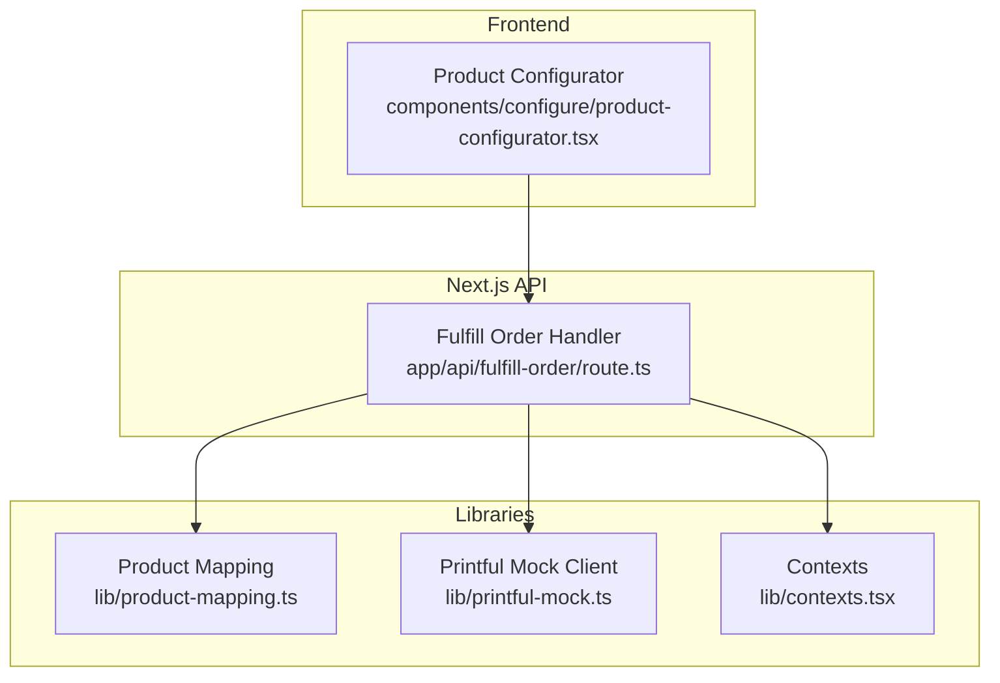
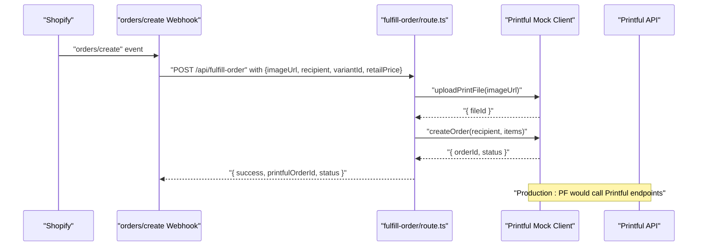
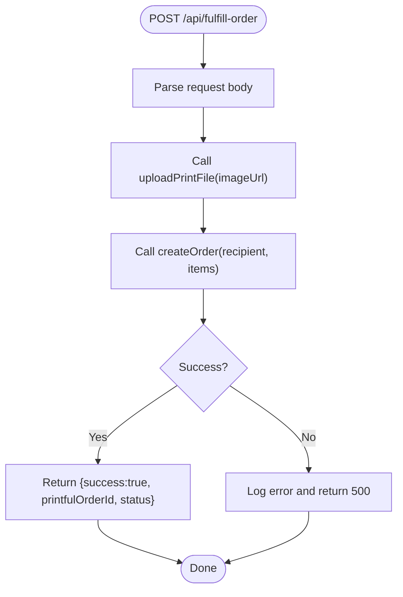
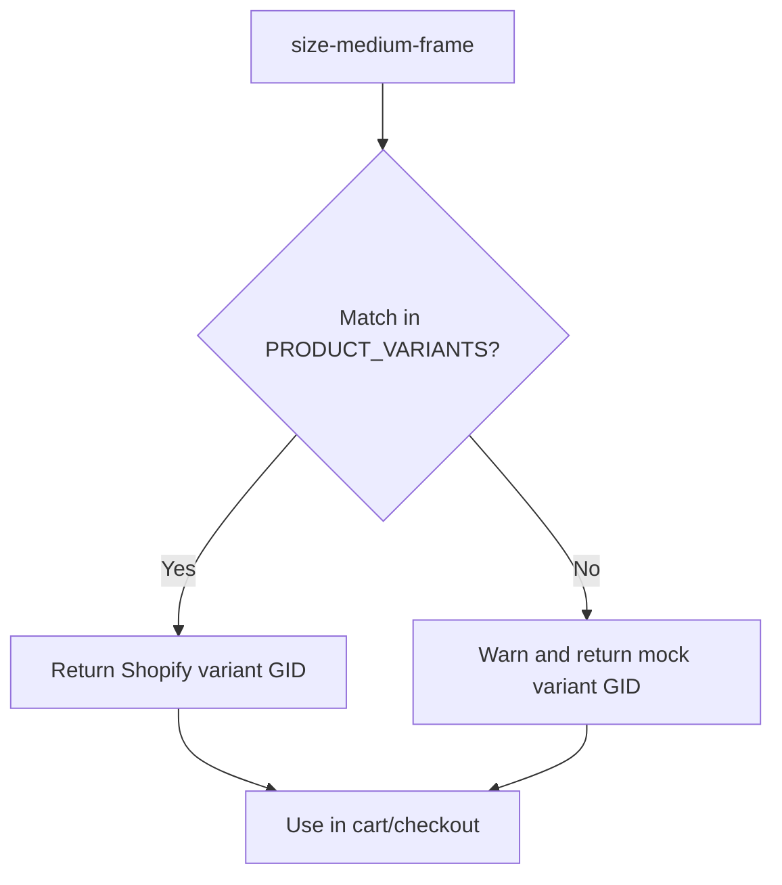
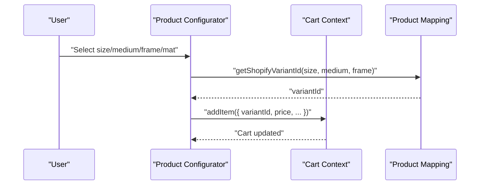
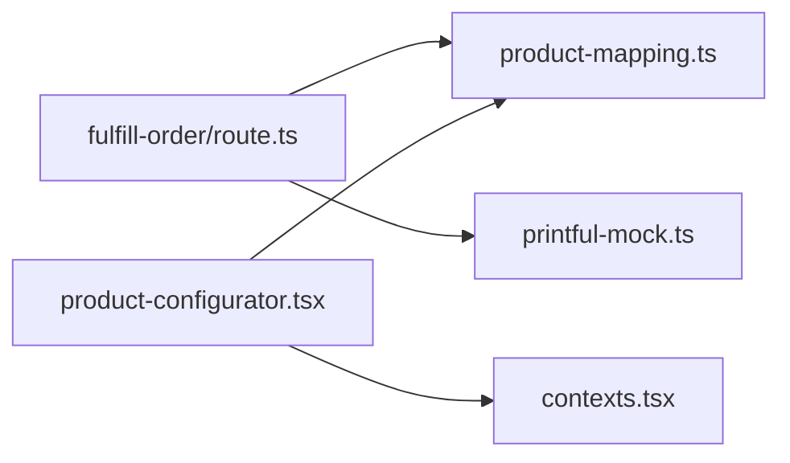

# Printful Integration

<cite>
**Referenced Files in This Document**
- [printful-mock.ts](file://lib/printful-mock.ts)
- [fulfill-order/route.ts](file://app/api/fulfill-order/route.ts)
- [product-mapping.ts](file://lib/product-mapping.ts)
- [types.ts](file://lib/types.ts)
- [README.md](file://README.md)
- [INTEGRATION_SUMMARY.md](file://INTEGRATION_SUMMARY.md)
- [shopify.ts](file://lib/shopify.ts)
- [shopify-admin.ts](file://lib/shopify-admin.ts)
- [shopify-mock.ts](file://lib/shopify-mock.ts)
- [product-configurator.tsx](file://components/configure/product-configurator.tsx)
- [contexts.tsx](file://lib/contexts.tsx)
</cite>

## Table of Contents
1. [Introduction](#introduction)
2. [Project Structure](#project-structure)
3. [Core Components](#core-components)
4. [Architecture Overview](#architecture-overview)
5. [Detailed Component Analysis](#detailed-component-analysis)
6. [Dependency Analysis](#dependency-analysis)
7. [Performance Considerations](#performance-considerations)
8. [Troubleshooting Guide](#troubleshooting-guide)
9. [Conclusion](#conclusion)
10. [Appendices](#appendices)

## Introduction
This document explains the Printful fulfillment integration for the Muse AI Art Store. It covers:
- The mock implementation currently used in development
- Production setup steps and API contract expectations
- Product mapping from Shopify variants to Printful variants
- End-to-end order fulfillment workflow from Shopify order creation to shipping tracking
- API endpoints, request/response schemas, authentication, and error handling
- Configuration examples for different product types
- Testing strategies using the mock implementation and production deployment considerations

## Project Structure
The Printful integration is primarily implemented as a mock module with clear production-ready contracts. The fulfillment endpoint integrates with the mock client to orchestrate file uploads and order creation.



**Diagram sources**
- [fulfill-order/route.ts:1-39](file://app/api/fulfill-order/route.ts#L1-L39)
- [printful-mock.ts:1-77](file://lib/printful-mock.ts#L1-L77)
- [product-mapping.ts:1-68](file://lib/product-mapping.ts#L1-L68)
- [product-configurator.tsx:1-279](file://components/configure/product-configurator.tsx#L1-L279)
- [contexts.tsx:164-255](file://lib/contexts.tsx#L164-L255)

**Section sources**
- [README.md:1-250](file://README.md#L1-L250)
- [INTEGRATION_SUMMARY.md:214-218](file://INTEGRATION_SUMMARY.md#L214-L218)

## Core Components
- Printful Mock Client: Provides upload, order creation, and status retrieval with documented production endpoints and schemas.
- Fulfillment API Route: Orchestrates the end-to-end fulfillment flow using the mock client.
- Product Mapping: Translates product configuration (size, medium, frame) into Shopify variant IDs and provides a mechanism to map to Printful variants.
- Types: Defines request/response shapes for fulfillment and product configuration.

Key responsibilities:
- Mock client simulates Printful API behavior with realistic delays and deterministic outputs.
- Fulfillment route accepts an image URL, recipient, variant ID, and retail price, then uploads the file and creates an order.
- Product mapping resolves the appropriate Shopify variant ID for a given configuration and warns if not configured.

**Section sources**
- [printful-mock.ts:1-77](file://lib/printful-mock.ts#L1-L77)
- [fulfill-order/route.ts:1-39](file://app/api/fulfill-order/route.ts#L1-L39)
- [product-mapping.ts:1-68](file://lib/product-mapping.ts#L1-L68)
- [types.ts:81-88](file://lib/types.ts#L81-L88)

## Architecture Overview
The fulfillment workflow is initiated by a Shopify orders/create webhook. The handler:
1. Receives order payload with image URL and cart attributes
2. Uploads the print-ready image to Printful Files API
3. Creates a Printful order referencing the uploaded file and variant
4. Returns order ID and status to the caller



**Diagram sources**
- [fulfill-order/route.ts:1-39](file://app/api/fulfill-order/route.ts#L1-L39)
- [printful-mock.ts:31-76](file://lib/printful-mock.ts#L31-L76)

## Detailed Component Analysis

### Printful Mock Client
The mock client defines the production contract and behavior:
- Upload print file: POST to Printful Files API with image URL and metadata; returns a file ID.
- Create order: POST to Printful Orders API with recipient, items (variant, quantity, file reference, retail price); returns order ID and status.
- Get order status: GET Printful Orders API by order ID; returns status and optional tracking number.

```mermaid
classDiagram
class PrintfulMock {
+uploadPrintFile(imageUrl) Promise~{fileId : number}~
+createOrder(recipient, items) Promise~{orderId : number,status : string}~
+getOrderStatus(orderId) Promise~{status : string,trackingNumber : string|null}~
}
class PrintfulRecipient {
+string name
+string address1
+string city
+string state_code
+string country_code
+string zip
}
class PrintfulOrderItem {
+number variant_id
+number quantity
+{type : string,id : number}[] files
+string retail_price
}
PrintfulMock --> PrintfulRecipient : "uses"
PrintfulMock --> PrintfulOrderItem : "uses"
```

**Diagram sources**
- [printful-mock.ts:15-29](file://lib/printful-mock.ts#L15-L29)
- [printful-mock.ts:38-76](file://lib/printful-mock.ts#L38-L76)

**Section sources**
- [printful-mock.ts:1-77](file://lib/printful-mock.ts#L1-L77)

### Fulfillment API Route
The route orchestrates the fulfillment flow:
- Parses request body for image URL, recipient, variant ID, and retail price
- Calls uploadPrintFile and createOrder
- Returns success with order details or a 500 error on failure



**Diagram sources**
- [fulfill-order/route.ts:11-38](file://app/api/fulfill-order/route.ts#L11-L38)

**Section sources**
- [fulfill-order/route.ts:1-39](file://app/api/fulfill-order/route.ts#L1-L39)

### Product Mapping System
The mapping system connects product configurations to Shopify variants and supports a future mapping to Printful variants:
- PRODUCT_VARIANTS: A registry keyed by configuration identifiers (e.g., size-medium-frame) to Shopify variant GIDs
- getShopifyVariantId: Resolves a configuration to a Shopify variant GID; emits warnings if not configured
- isProductMappingConfigured and getConfiguredVariants: Utilities to validate and enumerate configured variants
- types.ProductVariantMapping: Defines a structured mapping that includes Printful variant IDs and computed price



**Diagram sources**
- [product-mapping.ts:15-49](file://lib/product-mapping.ts#L15-L49)
- [types.ts:81-88](file://lib/types.ts#L81-L88)

**Section sources**
- [product-mapping.ts:1-68](file://lib/product-mapping.ts#L1-L68)
- [types.ts:81-88](file://lib/types.ts#L81-L88)

### Product Configuration in UI
The Product Configurator component:
- Collects size, medium, frame, and mat selections
- Computes price and validates resolution
- Adds an item to the cart with the resolved Shopify variant ID
- Uses mock data for sizes, mediums, frames, and mats



**Diagram sources**
- [product-configurator.tsx:44-69](file://components/configure/product-configurator.tsx#L44-L69)
- [contexts.tsx:164-255](file://lib/contexts.tsx#L164-L255)
- [product-mapping.ts:37-49](file://lib/product-mapping.ts#L37-L49)

**Section sources**
- [product-configurator.tsx:1-279](file://components/configure/product-configurator.tsx#L1-L279)
- [contexts.tsx:164-255](file://lib/contexts.tsx#L164-L255)

## Dependency Analysis
- The fulfillment route depends on the Printful mock client for file upload and order creation.
- The route does not depend on Shopify Storefront/Admin APIs in this repository snapshot; however, the README indicates these are mock implementations ready for production integration.
- Product mapping is decoupled and used by the UI to resolve variant IDs.



**Diagram sources**
- [fulfill-order/route.ts:1-39](file://app/api/fulfill-order/route.ts#L1-L39)
- [printful-mock.ts:1-77](file://lib/printful-mock.ts#L1-L77)
- [product-mapping.ts:1-68](file://lib/product-mapping.ts#L1-L68)
- [product-configurator.tsx:1-279](file://components/configure/product-configurator.tsx#L1-L279)
- [contexts.tsx:164-255](file://lib/contexts.tsx#L164-L255)

**Section sources**
- [README.md:232-246](file://README.md#L232-L246)
- [INTEGRATION_SUMMARY.md:214-218](file://INTEGRATION_SUMMARY.md#L214-L218)

## Performance Considerations
- The mock client introduces artificial delays to simulate network latency; remove or reduce delays in production.
- Parallelization: The current fulfillment flow performs sequential operations (upload then create). In production, consider optimizing retries and timeouts.
- Caching: Store file IDs and order IDs to avoid redundant uploads and duplicate orders.
- Monitoring: Log request IDs, timing, and error codes for observability.

## Troubleshooting Guide
Common issues and resolutions:
- Product synchronization failures
  - Symptom: Missing or incorrect variant IDs in product mapping
  - Action: Replace placeholder IDs with actual Shopify variant GIDs; verify mapping completeness
- Order processing delays
  - Symptom: Long fulfillment times
  - Action: Confirm Printful API connectivity and credentials; monitor request/response times
- Shipping tracking problems
  - Symptom: Tracking number remains null
  - Action: Verify order status polling and Printful order completion; ensure webhook updates are processed

Operational checks:
- Validate environment variables for Printful and Shopify if integrating production APIs
- Ensure the fulfillment endpoint receives the correct request payload (image URL, recipient, variant ID, retail price)
- Confirm that the product mapping is configured for the selected size/medium/frame combination

**Section sources**
- [product-mapping.ts:41-46](file://lib/product-mapping.ts#L41-L46)
- [fulfill-order/route.ts:11-38](file://app/api/fulfill-order/route.ts#L11-L38)

## Conclusion
The Printful integration is implemented with a clear mock client and a production-ready contract. The fulfillment endpoint orchestrates file upload and order creation, while product mapping bridges the UI configuration to Shopify and prepares the system for Printful variant mapping. With proper environment configuration and production API swaps, the system supports end-to-end print-on-demand fulfillment.

## Appendices

### API Endpoints and Schemas
- Upload Print File
  - Method: POST
  - Endpoint: Printful Files API (production)
  - Request body: { type: "default", url: string, filename: string, options: { dpi: number } }
  - Response: { code: number, result: { id: number, type: string, ... } }
- Create Fulfillment Order
  - Method: POST
  - Endpoint: Printful Orders API (production)
  - Request body: { recipient: Recipient, items: [OrderItem] }
  - Response: { code: number, result: { id: number, status: string, ... } }
- Get Order Status
  - Method: GET
  - Endpoint: Printful Orders API (production)
  - Response: { code: number, result: { id: number, status: string, shipping: { tracking_number: string|null, ... } } }

Recipient schema:
- name: string
- address1: string
- city: string
- state_code: string
- country_code: string
- zip: string

OrderItem schema:
- variant_id: number
- quantity: number
- files: Array<{ type: "default", id: number }>
- retail_price: string

Fulfillment API request schema (from the route):
- imageUrl: string
- recipient: Recipient
- variantId: number
- retailPrice: string

Fulfillment API response schema (from the route):
- success: boolean
- printfulOrderId: number
- status: string

Authentication:
- Printful: Bearer token via Authorization header using PRINTFUL_API_KEY
- Shopify Storefront/Admin: X-Shopify-Storefront-Access-Token or X-Shopify-Access-Token (mock implementations provided)

**Section sources**
- [printful-mock.ts:31-76](file://lib/printful-mock.ts#L31-L76)
- [fulfill-order/route.ts:11-38](file://app/api/fulfill-order/route.ts#L11-L38)

### Configuration Examples
- Product types
  - Sizes: 8x10, 12x16, 16x20, 18x24, 24x36, 30x40
  - Mediums: Fine Art Paper, Canvas, Acrylic, Metal
  - Frames: None, Black, White, Natural Wood, Walnut, Gallery Float
  - Mats: None, White, Off-White
- Fulfillment scenarios
  - Single-item order with one variant and one print file
  - Recipient address must match Printful requirements for shipping eligibility

**Section sources**
- [README.md:136-147](file://README.md#L136-L147)
- [product-configurator.tsx:127-242](file://components/configure/product-configurator.tsx#L127-L242)

### Testing Strategies
- Use the mock implementation locally to validate the fulfillment flow without external dependencies
- Simulate webhook triggers by calling the fulfillment endpoint with representative payloads
- Verify product mapping coverage for all supported configurations
- Monitor console logs for simulated delays and warnings about unconfigured mappings

**Section sources**
- [INTEGRATION_SUMMARY.md:214-218](file://INTEGRATION_SUMMARY.md#L214-L218)
- [printful-mock.ts:11-13](file://lib/printful-mock.ts#L11-L13)

### Production Deployment Considerations
- Replace mock clients with production API clients
- Configure environment variables for Printful and Shopify
- Implement robust error handling, retries, and idempotency for order creation
- Integrate shipping tracking updates back to Shopify
- Securely manage API keys and enforce least-privilege access

**Section sources**
- [README.md:232-246](file://README.md#L232-L246)
- [INTEGRATION_SUMMARY.md:214-218](file://INTEGRATION_SUMMARY.md#L214-L218)