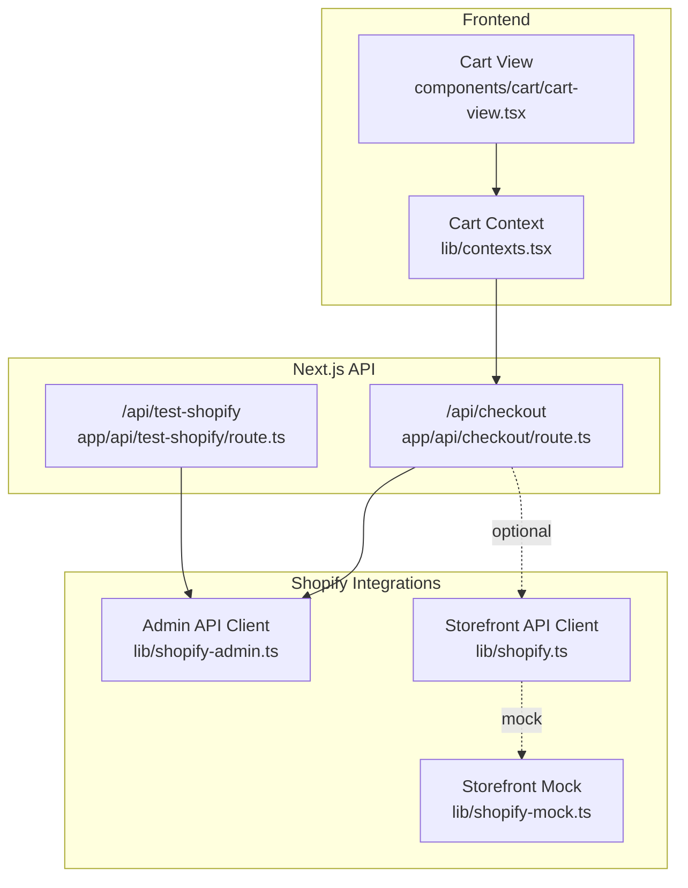
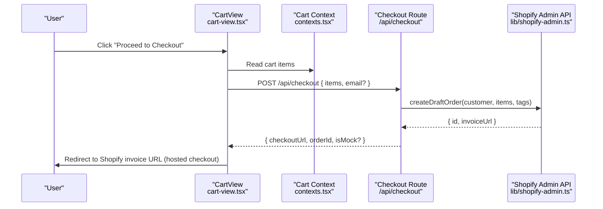
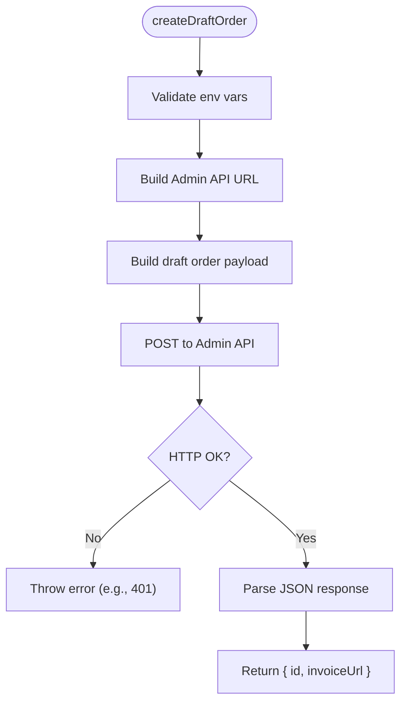
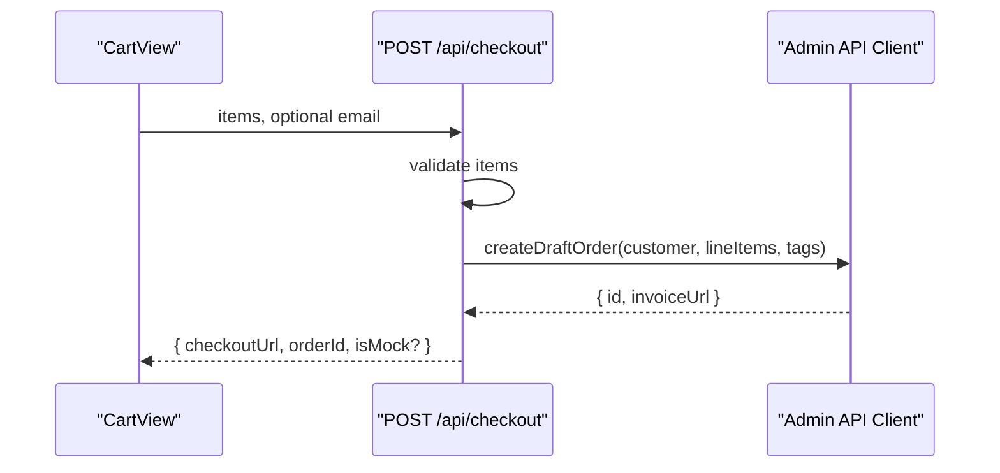
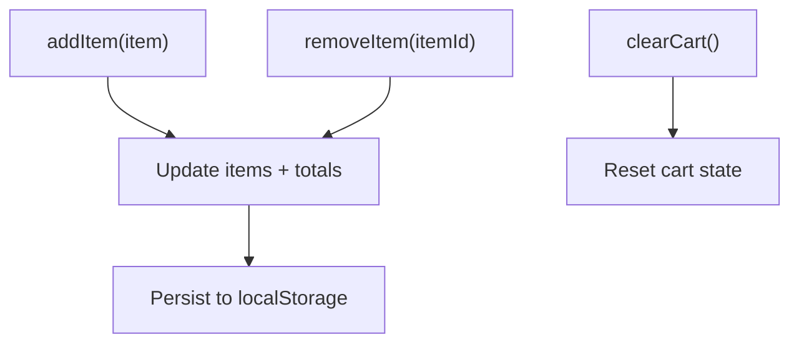
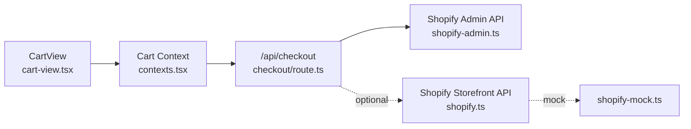

# Shopify Integration

<cite>
**Referenced Files in This Document**
- [lib/shopify.ts](file://lib/shopify.ts)
- [lib/shopify-admin.ts](file://lib/shopify-admin.ts)
- [lib/shopify-mock.ts](file://lib/shopify-mock.ts)
- [app/api/checkout/route.ts](file://app/api/checkout/route.ts)
- [app/api/test-shopify/route.ts](file://app/api/test-shopify/route.ts)
- [components/cart/cart-view.tsx](file://components/cart/cart-view.tsx)
- [lib/contexts.tsx](file://lib/contexts.tsx)
- [lib/types.ts](file://lib/types.ts)
- [SHOPIFY_ADMIN_API_SETUP.md](file://SHOPIFY_ADMIN_API_SETUP.md)
- [SHOPIFY_SETUP.md](file://SHOPIFY_SETUP.md)
- [SHOPIFY_TROUBLESHOOTING.md](file://SHOPIFY_TROUBLESHOOTING.md)
- [.env.example](file://.env.example)
- [README.md](file://README.md)
</cite>

## Table of Contents
1. [Introduction](#introduction)
2. [Project Structure](#project-structure)
3. [Core Components](#core-components)
4. [Architecture Overview](#architecture-overview)
5. [Detailed Component Analysis](#detailed-component-analysis)
6. [Dependency Analysis](#dependency-analysis)
7. [Performance Considerations](#performance-considerations)
8. [Troubleshooting Guide](#troubleshooting-guide)
9. [Conclusion](#conclusion)
10. [Appendices](#appendices)

## Introduction
This document explains the Shopify integration for the AI art store, focusing on both Storefront and Admin API implementations. It covers:
- How the frontend composes cart items and triggers checkout
- How the backend creates Shopify draft orders and redirects to Shopify’s hosted checkout
- Mock implementations for development and testing
- Setup instructions for Shopify Partners Program, custom app creation, and API authentication
- Webhook configuration guidance for order notifications and fulfillment
- Request/response schemas, error handling, rate limiting considerations, and security best practices

## Project Structure
The integration spans the frontend UI, Next.js API routes, and service clients for Shopify and optional Printful integrations. Key areas:
- Frontend cart and checkout flow
- Backend checkout route that creates Shopify draft orders
- Shopify Admin API client for draft order creation
- Shopify Storefront API client (mock-ready)
- Environment configuration and setup guides



**Diagram sources**
- [components/cart/cart-view.tsx:18-52](file://components/cart/cart-view.tsx#L18-L52)
- [lib/contexts.tsx:185-250](file://lib/contexts.tsx#L185-L250)
- [app/api/checkout/route.ts:1-76](file://app/api/checkout/route.ts#L1-L76)
- [app/api/test-shopify/route.ts:1-91](file://app/api/test-shopify/route.ts#L1-L91)
- [lib/shopify-admin.ts:1-103](file://lib/shopify-admin.ts#L1-L103)
- [lib/shopify.ts:1-303](file://lib/shopify.ts#L1-L303)
- [lib/shopify-mock.ts:1-74](file://lib/shopify-mock.ts#L1-L74)

**Section sources**
- [README.md:1-250](file://README.md#L1-L250)
- [lib/contexts.tsx:164-255](file://lib/contexts.tsx#L164-L255)
- [app/api/checkout/route.ts:1-76](file://app/api/checkout/route.ts#L1-L76)
- [lib/shopify-admin.ts:1-103](file://lib/shopify-admin.ts#L1-L103)
- [lib/shopify.ts:1-303](file://lib/shopify.ts#L1-L303)
- [lib/shopify-mock.ts:1-74](file://lib/shopify-mock.ts#L1-L74)

## Core Components
- Storefront API client: Provides cart operations and checkout URL retrieval via GraphQL.
- Admin API client: Creates Shopify draft orders and returns invoice URLs for hosted checkout.
- Checkout API route: Converts local cart items to Shopify line items and invokes Admin API.
- Cart UI and context: Manages cart state, computes totals, and initiates checkout.
- Mock implementations: Allow local development without Shopify credentials.

Key responsibilities:
- Storefront client: Validates credentials, executes GraphQL queries/mutations, and surfaces errors.
- Admin client: Validates credentials, constructs Admin API requests, and parses responses.
- Checkout route: Validates input, converts items, calls Admin API, and returns redirect info.
- Cart context/UI: Adds/removes items, persists to localStorage, and triggers checkout.

**Section sources**
- [lib/shopify.ts:17-70](file://lib/shopify.ts#L17-L70)
- [lib/shopify-admin.ts:25-95](file://lib/shopify-admin.ts#L25-L95)
- [app/api/checkout/route.ts:5-75](file://app/api/checkout/route.ts#L5-L75)
- [lib/contexts.tsx:185-250](file://lib/contexts.tsx#L185-L250)

## Architecture Overview
The checkout flow integrates the frontend cart with Shopify’s hosted checkout via draft orders.



**Diagram sources**
- [components/cart/cart-view.tsx:18-52](file://components/cart/cart-view.tsx#L18-L52)
- [lib/contexts.tsx:185-250](file://lib/contexts.tsx#L185-L250)
- [app/api/checkout/route.ts:5-75](file://app/api/checkout/route.ts#L5-L75)
- [lib/shopify-admin.ts:25-95](file://lib/shopify-admin.ts#L25-L95)

## Detailed Component Analysis

### Storefront API Client
Purpose:
- Create and manage carts via GraphQL mutations and queries.
- Retrieve cart details and checkout URLs.

Capabilities:
- Cart creation with line items
- Add/remove cart lines
- Fetch cart with line items and costs
- Validate configuration and surface errors

Error handling:
- Throws descriptive errors for missing credentials, HTTP errors, GraphQL errors, and empty data.

Data structures:
- CartLine: merchandiseId, quantity, optional attributes
- ShopifyCart: cart identifier, checkoutUrl, lines, cost

```mermaid
classDiagram
class ShopifyClient {
+createCart(lines) Promise~{cartId, checkoutUrl}~
+addToCart(cartId, lines) Promise~{success}~
+getCart(cartId) Promise~ShopifyCart~
+removeFromCart(cartId, lineIds) Promise~{success}~
+getCheckoutUrl(cartId) Promise~string~
+isShopifyConfigured() boolean
}
class ShopifyResponse {
+data
+errors
}
ShopifyClient --> ShopifyResponse : "parses"
```

**Diagram sources**
- [lib/shopify.ts:108-303](file://lib/shopify.ts#L108-L303)

**Section sources**
- [lib/shopify.ts:17-70](file://lib/shopify.ts#L17-L70)
- [lib/shopify.ts:108-303](file://lib/shopify.ts#L108-L303)

### Admin API Client
Purpose:
- Create Shopify draft orders and obtain invoice URLs for hosted checkout.

Behavior:
- Validates environment variables for domain, token, and API version
- Constructs Admin API endpoint and request payload
- Handles HTTP errors and parses response for invoice URL and order ID



**Diagram sources**
- [lib/shopify-admin.ts:25-95](file://lib/shopify-admin.ts#L25-L95)

**Section sources**
- [lib/shopify-admin.ts:25-95](file://lib/shopify-admin.ts#L25-L95)

### Checkout API Route
Responsibilities:
- Validate incoming cart items
- Convert items to Shopify line items (including custom properties)
- Call Admin API to create draft order
- Return checkout URL and order metadata

Mock fallback:
- If Shopify is not configured, returns a placeholder checkout URL and marks as mock



**Diagram sources**
- [app/api/checkout/route.ts:5-75](file://app/api/checkout/route.ts#L5-L75)
- [lib/shopify-admin.ts:25-95](file://lib/shopify-admin.ts#L25-L95)

**Section sources**
- [app/api/checkout/route.ts:5-75](file://app/api/checkout/route.ts#L5-L75)

### Cart UI and Context
Responsibilities:
- Manage cart state in memory and localStorage
- Compute item counts and totals
- Trigger checkout flow and handle mock vs real redirection



**Diagram sources**
- [lib/contexts.tsx:207-237](file://lib/contexts.tsx#L207-L237)

**Section sources**
- [lib/contexts.tsx:185-250](file://lib/contexts.tsx#L185-L250)
- [components/cart/cart-view.tsx:18-52](file://components/cart/cart-view.tsx#L18-L52)

### Mock Shopify Implementation
Purpose:
- Enable development and testing without Shopify credentials
- Simulate cart operations with minimal delays

Capabilities:
- createCart, addToCart, getCart, removeFromCart, getCheckoutUrl
- Returns deterministic identifiers and placeholder URLs

**Section sources**
- [lib/shopify-mock.ts:29-73](file://lib/shopify-mock.ts#L29-L73)

## Dependency Analysis
- The checkout route depends on the Admin API client to create draft orders.
- The UI depends on the cart context to gather items and trigger checkout.
- The Admin API client depends on environment variables for credentials and API version.
- The Storefront API client is mock-ready and can be swapped for production with identical interfaces.



**Diagram sources**
- [components/cart/cart-view.tsx:18-52](file://components/cart/cart-view.tsx#L18-L52)
- [lib/contexts.tsx:185-250](file://lib/contexts.tsx#L185-L250)
- [app/api/checkout/route.ts:1-76](file://app/api/checkout/route.ts#L1-L76)
- [lib/shopify-admin.ts:1-103](file://lib/shopify-admin.ts#L1-L103)
- [lib/shopify.ts:1-303](file://lib/shopify.ts#L1-L303)
- [lib/shopify-mock.ts:1-74](file://lib/shopify-mock.ts#L1-L74)

**Section sources**
- [app/api/checkout/route.ts:1-76](file://app/api/checkout/route.ts#L1-L76)
- [lib/shopify-admin.ts:1-103](file://lib/shopify-admin.ts#L1-L103)
- [lib/shopify.ts:1-303](file://lib/shopify.ts#L1-L303)
- [lib/shopify-mock.ts:1-74](file://lib/shopify-mock.ts#L1-L74)

## Performance Considerations
- Network latency: Admin API calls occur during checkout; keep requests minimal and avoid unnecessary retries.
- Rate limits: Shopify Admin API enforces quotas; batch operations where possible and implement exponential backoff on 429 responses.
- Local caching: Use localStorage for cart persistence to reduce re-computation overhead.
- Mock usage: During development, rely on mock implementations to avoid external network calls.

[No sources needed since this section provides general guidance]

## Troubleshooting Guide
Common issues and resolutions:
- Authentication failures (401):
  - Ensure Admin API token has required scopes and reinstall the app.
  - Confirm environment variables are correct and server has restarted.
- Missing configuration:
  - Verify environment variables for Admin API and API version.
- Store domain errors:
  - Use clean domain format without protocol or trailing slash.
- Testing connectivity:
  - Use the test endpoint to validate Admin API connectivity and permissions.

Setup references:
- Admin API setup and permissions
- Storefront API setup and permissions
- Troubleshooting guide for 401 errors and environment issues

**Section sources**
- [app/api/test-shopify/route.ts:30-89](file://app/api/test-shopify/route.ts#L30-L89)
- [SHOPIFY_ADMIN_API_SETUP.md:97-144](file://SHOPIFY_ADMIN_API_SETUP.md#L97-L144)
- [SHOPIFY_TROUBLESHOOTING.md:1-213](file://SHOPIFY_TROUBLESHOOTING.md#L1-L213)

## Conclusion
The integration leverages Shopify’s hosted checkout via Admin API draft orders, ensuring a seamless customer experience while centralizing order management in Shopify. The frontend and backend components are modular and mock-ready, enabling rapid development and testing. Follow the setup and troubleshooting guides to configure credentials, permissions, and environment variables correctly.

[No sources needed since this section summarizes without analyzing specific files]

## Appendices

### Setup Instructions
- Create a Shopify store and a custom app
- Configure Admin API scopes and install the app
- Obtain Admin API credentials and update environment variables
- For Storefront API (optional), configure Storefront API scopes and credentials
- Restart the development server and test connectivity

Environment variables:
- Admin API: store domain, access token, API version
- Storefront API: store domain, storefront access token, API version

**Section sources**
- [SHOPIFY_ADMIN_API_SETUP.md:12-88](file://SHOPIFY_ADMIN_API_SETUP.md#L12-L88)
- [SHOPIFY_SETUP.md:22-61](file://SHOPIFY_SETUP.md#L22-L61)
- [.env.example:9-13](file://.env.example#L9-L13)

### Webhook Configuration
- Recommended webhooks:
  - Orders: create (to trigger fulfillment)
  - Inventory: adjust (to synchronize stock)
  - Products: update (to reflect product catalog changes)
- Endpoint: Implement a secure endpoint to receive and verify Shopify webhooks
- Verification: Use HMAC signature verification with shared secrets
- Security: Store secrets securely and rotate periodically

[No sources needed since this section provides general guidance]

### Request/Response Schemas

- Admin API: Create Draft Order
  - Method: POST
  - Endpoint: https://{store_domain}/admin/api/{version}/draft_orders.json
  - Headers: X-Shopify-Access-Token, Content-Type: application/json
  - Request body: customer email, line items, tags
  - Response: draft order id, invoice_url

- Storefront API: Cart Operations
  - Methods: GraphQL mutations/queries
  - Endpoint: https://{store_domain}/api/{version}/graphql.json
  - Header: X-Shopify-Storefront-Access-Token
  - Capabilities: cartCreate, cartLinesAdd, cartLinesRemove, cart query

**Section sources**
- [lib/shopify-admin.ts:34-52](file://lib/shopify-admin.ts#L34-L52)
- [lib/shopify.ts:22-36](file://lib/shopify.ts#L22-L36)

### Error Handling Strategies
- Validation: Check environment variables and request payloads before API calls
- HTTP errors: Distinguish 401 (authentication), 403 (permissions), 404 (domain/format), and 429 (rate limit)
- GraphQL errors: Surface user-friendly messages derived from GraphQL errors
- Mock fallback: Return placeholder checkout URL when credentials are missing

**Section sources**
- [lib/shopify-admin.ts:68-77](file://lib/shopify-admin.ts#L68-L77)
- [lib/shopify.ts:40-69](file://lib/shopify.ts#L40-L69)
- [app/api/checkout/route.ts:17-27](file://app/api/checkout/route.ts#L17-L27)

### Rate Limiting Considerations
- Monitor response headers for rate limit indicators
- Implement retry with exponential backoff on 429
- Batch operations where feasible
- Cache responses for read-heavy operations

[No sources needed since this section provides general guidance]

### Security Best Practices
- App secrets and tokens:
  - Store tokens in environment variables, not client-side code
  - Restrict scopes to least privilege
- HMAC verification:
  - Verify webhook signatures using shared secrets
- Token storage:
  - Avoid logging tokens; mask logs appropriately
  - Rotate tokens periodically

**Section sources**
- [SHOPIFY_ADMIN_API_SETUP.md:97-144](file://SHOPIFY_ADMIN_API_SETUP.md#L97-L144)
- [SHOPIFY_TROUBLESHOOTING.md:102-155](file://SHOPIFY_TROUBLESHOOTING.md#L102-L155)