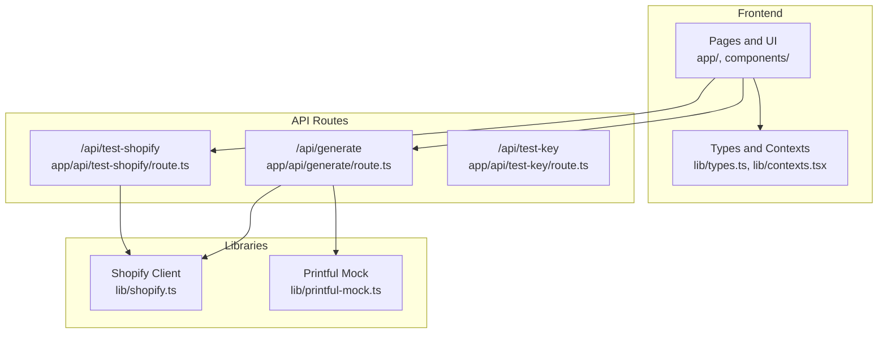
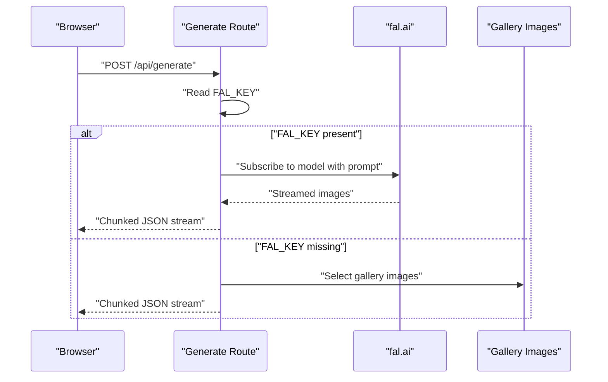
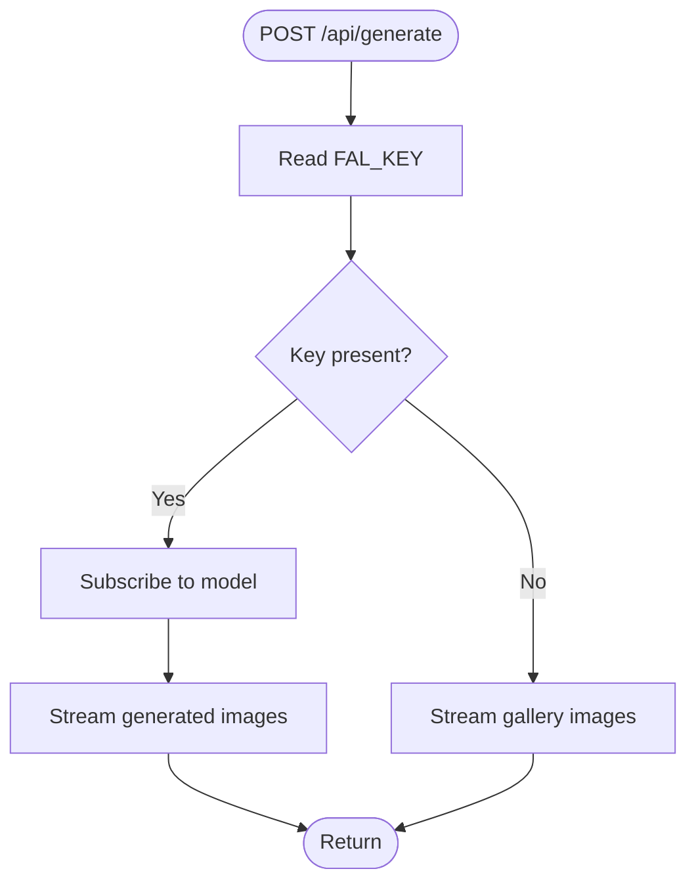
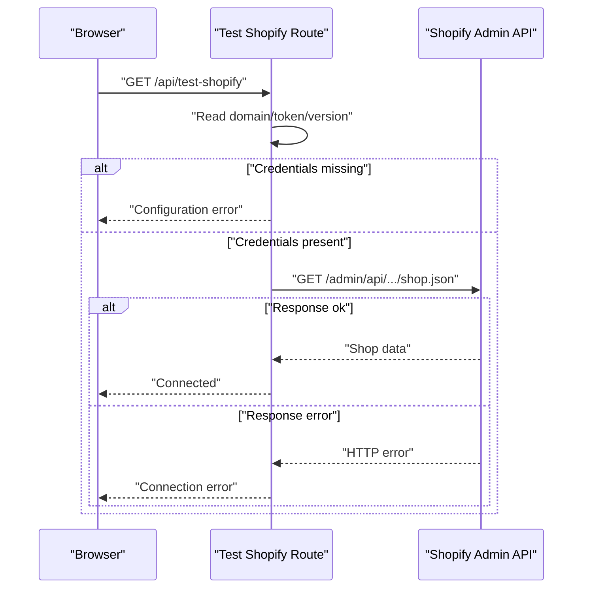
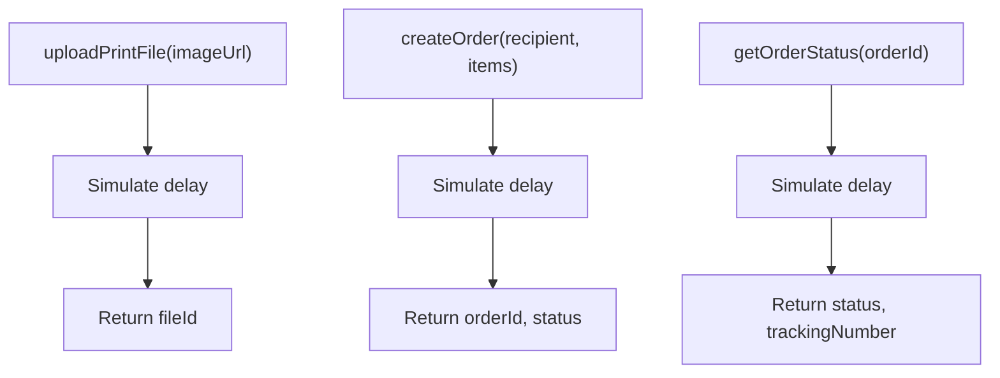
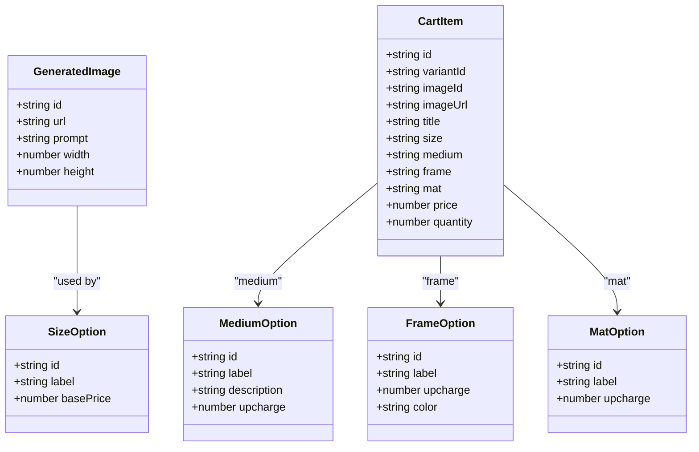
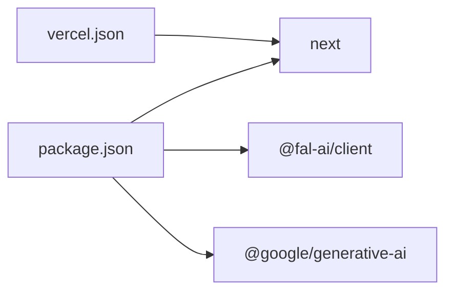

# Troubleshooting & Deployment

<cite>
**Referenced Files in This Document**
- [README.md](file://README.md)
- [TROUBLESHOOTING.md](file://TROUBLESHOOTING.md)
- [SHOPIFY_TROUBLESHOOTING.md](file://SHOPIFY_TROUBLESHOOTING.md)
- [vercel.json](file://vercel.json)
- [package.json](file://package.json)
- [app/api/generate/route.ts](file://app/api/generate/route.ts)
- [app/api/test-key/route.ts](file://app/api/test-key/route.ts)
- [app/api/test-shopify/route.ts](file://app/api/test-shopify/route.ts)
- [lib/shopify.ts](file://lib/shopify.ts)
- [lib/printful-mock.ts](file://lib/printful-mock.ts)
- [lib/types.ts](file://lib/types.ts)
- [lib/contexts.tsx](file://lib/contexts.tsx)
- [test-gemini.js](file://test-gemini.js)
</cite>

## Table of Contents
1. [Introduction](#introduction)
2. [Project Structure](#project-structure)
3. [Core Components](#core-components)
4. [Architecture Overview](#architecture-overview)
5. [Detailed Component Analysis](#detailed-component-analysis)
6. [Dependency Analysis](#dependency-analysis)
7. [Performance Considerations](#performance-considerations)
8. [Troubleshooting Guide](#troubleshooting-guide)
9. [Deployment Configuration](#deployment-configuration)
10. [Security Hardening](#security-hardening)
11. [Maintenance Procedures](#maintenance-procedures)
12. [Rollback Strategies and Emergency Response](#rollback-strategies-and-emergency-response)
13. [Conclusion](#conclusion)

## Introduction
This document provides comprehensive troubleshooting and deployment guidance for the Muse platform. It covers common development issues, API integration problems, and production deployment challenges. It also documents debugging techniques, error diagnosis, and resolution strategies for image generation failures, Shopify connectivity issues, and Printful integration problems. Deployment configuration for Vercel, environment setup, and monitoring approaches are included, along with performance optimization guidelines, security hardening recommendations, maintenance procedures, and rollback strategies.

## Project Structure
The Muse platform is a Next.js 16 application using the App Router. The frontend pages and UI components are organized under app/ and components/, while integration logic resides in lib/. API routes under app/api/ orchestrate image generation, Shopify, and Printful integrations.

**Diagram sources**
- [README.md:60-68](file://README.md#L60-L68)
- [app/api/generate/route.ts:1-145](file://app/api/generate/route.ts#L1-L145)
- [app/api/test-shopify/route.ts:1-91](file://app/api/test-shopify/route.ts#L1-L91)
- [app/api/test-key/route.ts:1-14](file://app/api/test-key/route.ts#L1-L14)
- [lib/shopify.ts:1-303](file://lib/shopify.ts#L1-L303)
- [lib/printful-mock.ts:1-77](file://lib/printful-mock.ts#L1-L77)

**Section sources**
- [README.md:69-125](file://README.md#L69-L125)

## Core Components
- Image generation API: Orchestrates fal.ai image generation with fallback to mock images when the API key is absent.
- Shopify integration: Provides a Storefront API client and a test endpoint to validate configuration and connectivity.
- Printful integration: Includes a mock implementation ready for production integration.
- Type definitions and contexts: Define data contracts and manage global state for style profiles, generation sessions, and cart.

**Section sources**
- [app/api/generate/route.ts:19-144](file://app/api/generate/route.ts#L19-L144)
- [lib/shopify.ts:17-70](file://lib/shopify.ts#L17-L70)
- [lib/printful-mock.ts:1-77](file://lib/printful-mock.ts#L1-L77)
- [lib/types.ts:17-52](file://lib/types.ts#L17-L52)
- [lib/contexts.tsx:71-158](file://lib/contexts.tsx#L71-L158)

## Architecture Overview
The system integrates user-facing pages with backend API routes. The image generation route interacts with fal.ai and falls back to mock images. Shopify and Printful integrations are encapsulated in dedicated modules and routes.

**Diagram sources**
- [app/api/generate/route.ts:25-64](file://app/api/generate/route.ts#L25-L64)
- [app/api/generate/route.ts:74-113](file://app/api/generate/route.ts#L74-L113)

**Section sources**
- [README.md:28-34](file://README.md#L28-L34)
- [README.md:191-217](file://README.md#L191-L217)

## Detailed Component Analysis

### Image Generation API
The generation route reads the fal.ai API key from environment variables, subscribes to a model, and streams generated images. If the key is missing or subscription fails, it falls back to streaming gallery images.

**Diagram sources**
- [app/api/generate/route.ts:19-144](file://app/api/generate/route.ts#L19-L144)

**Section sources**
- [app/api/generate/route.ts:19-144](file://app/api/generate/route.ts#L19-L144)
- [README.md:191-202](file://README.md#L191-L202)

### Shopify Integration
The Shopify client validates credentials, constructs GraphQL requests, and handles errors. The test route checks configuration and attempts an Admin API call to verify connectivity.

**Diagram sources**
- [app/api/test-shopify/route.ts:3-89](file://app/api/test-shopify/route.ts#L3-L89)
- [lib/shopify.ts:17-70](file://lib/shopify.ts#L17-L70)

**Section sources**
- [app/api/test-shopify/route.ts:3-89](file://app/api/test-shopify/route.ts#L3-L89)
- [lib/shopify.ts:17-70](file://lib/shopify.ts#L17-L70)
- [SHOPIFY_TROUBLESHOOTING.md:102-155](file://SHOPIFY_TROUBLESHOOTING.md#L102-L155)

### Printful Integration
The Printful mock simulates file upload, order creation, and status retrieval. Replace the mock with real API calls when moving to production.

**Diagram sources**
- [lib/printful-mock.ts:38-76](file://lib/printful-mock.ts#L38-L76)

**Section sources**
- [lib/printful-mock.ts:1-77](file://lib/printful-mock.ts#L1-L77)
- [README.md:243-245](file://README.md#L243-L245)

### Data Models and Contexts
Type definitions describe the shape of prompts, generated images, product options, cart items, and gallery items. Contexts manage state for style profiles, generation sessions, and cart persistence.

**Diagram sources**
- [lib/types.ts:17-103](file://lib/types.ts#L17-L103)

**Section sources**
- [lib/types.ts:17-103](file://lib/types.ts#L17-L103)
- [lib/contexts.tsx:71-254](file://lib/contexts.tsx#L71-L254)

## Dependency Analysis
- Runtime dependencies include Next.js, @fal-ai/client, and @google/generative-ai.
- The project uses pnpm overrides for type packages.
- Build and framework configuration are defined in package.json and vercel.json.

**Diagram sources**
- [package.json:11-63](file://package.json#L11-L63)
- [vercel.json:1-5](file://vercel.json#L1-L5)

**Section sources**
- [package.json:11-81](file://package.json#L11-L81)
- [vercel.json:1-5](file://vercel.json#L1-L5)

## Performance Considerations
- Image generation latency: Premium quality increases inference steps and guidance scale, resulting in longer generation times. Prefer standard quality for rapid iteration.
- Rate limiting: Free tiers impose strict request quotas; avoid rapid successive generations and monitor usage.
- Streaming responses: The generation route streams newline-delimited JSON for efficient client-side rendering.
- Caching and CDN: Generated image URLs are served via CDN; persist images if long-term retention is required.
- Network stability: Ensure reliable connectivity to external APIs; monitor service health pages.

[No sources needed since this section provides general guidance]

## Troubleshooting Guide

### Image Generation Failures
Symptoms and resolutions:
- Still seeing gallery images after adding the API key:
  - Restart the development server.
  - Verify the environment variable location and format.
  - Confirm the key is visible in the browser console.
- API key invalid or quota exceeded:
  - Obtain a fresh key and test it locally.
  - Monitor rate limits and upgrade quotas if necessary.
- Slow generation or timeouts:
  - Use standard quality, reduce concurrent requests, and check external service status.
- Corrupted or broken images:
  - Inspect browser console and network tab for errors.
  - Clear browser cache and retry with different browsers.

**Section sources**
- [TROUBLESHOOTING.md:5-145](file://TROUBLESHOOTING.md#L5-L145)
- [app/api/generate/route.ts:25-64](file://app/api/generate/route.ts#L25-L64)
- [app/api/test-key/route.ts:4-12](file://app/api/test-key/route.ts#L4-L12)

### Shopify Connectivity Issues
Common issues and fixes:
- 401 Unauthorized:
  - Ensure the app is installed and the token belongs to the Storefront API.
  - Enable required scopes and reinstall the app to regenerate the token.
- Wrong store domain format:
  - Use the exact format: your-store.myshopify.com.
- Environment variables not loading:
  - Confirm .env.local is in the project root and variables match exactly.
- Test endpoint diagnostics:
  - Use the test endpoint to receive structured feedback and troubleshooting hints.

**Section sources**
- [SHOPIFY_TROUBLESHOOTING.md:1-213](file://SHOPIFY_TROUBLESHOOTING.md#L1-L213)
- [app/api/test-shopify/route.ts:3-89](file://app/api/test-shopify/route.ts#L3-L89)
- [lib/shopify.ts:17-70](file://lib/shopify.ts#L17-L70)

### Printful Integration Problems
- Current state:
  - Printful integration is mocked; replace with real API calls using the documented endpoints and headers.
- Migration checklist:
  - Implement uploadPrintFile, createOrder, and getOrderStatus with production endpoints.
  - Use the PRINTFUL_API_KEY for Authorization: Bearer.
  - Validate responses and handle errors consistently.

**Section sources**
- [lib/printful-mock.ts:1-77](file://lib/printful-mock.ts#L1-L77)
- [README.md:243-245](file://README.md#L243-L245)

### Debugging Techniques and Error Diagnosis
- Local testing:
  - Use the test script to validate API keys and basic connectivity.
- Console inspection:
  - Check browser DevTools console and network tab for errors.
- Server logs:
  - Review terminal output for API errors and warnings.
- Environment verification:
  - Confirm environment variables are set and formatted correctly.

**Section sources**
- [test-gemini.js:1-107](file://test-gemini.js#L1-L107)
- [TROUBLESHOOTING.md:280-324](file://TROUBLESHOOTING.md#L280-L324)

## Deployment Configuration

### Vercel Deployment
- Build command and framework are configured in vercel.json.
- Ensure environment variables are set in the Vercel project settings for production features (e.g., Shopify and Printful).

**Section sources**
- [vercel.json:1-5](file://vercel.json#L1-L5)
- [README.md:204-217](file://README.md#L204-L217)

### Environment Setup
- Required for image generation: FAL_KEY.
- Optional for production features: NEXT_PUBLIC_SHOPIFY_STORE_DOMAIN, SHOPIFY_STOREFRONT_ACCESS_TOKEN, SHOPIFY_API_VERSION, PRINTFUL_API_KEY, ANTHROPIC_API_KEY.

**Section sources**
- [README.md:191-217](file://README.md#L191-L217)

### Monitoring Approaches
- Use Vercel logs and monitoring dashboards.
- Implement structured logging in API routes for easier diagnosis.
- Track external service health pages for fal.ai, Shopify, and Printful.

[No sources needed since this section provides general guidance]

## Security Hardening
- Restrict environment variables:
  - Keep API keys out of client-side code; use server-side only for sensitive credentials.
- Token scope minimization:
  - Configure Shopify Storefront API scopes precisely as required.
- Input validation:
  - Sanitize and validate inputs to API routes to prevent injection and misuse.
- HTTPS and CDN:
  - Serve assets over HTTPS; rely on CDN for performance and DDoS resilience.

[No sources needed since this section provides general guidance]

## Maintenance Procedures
- Regular updates:
  - Keep dependencies updated and test builds regularly.
- Health checks:
  - Periodically call test endpoints (/api/test-key, /api/test-shopify) to validate integrations.
- Cleanup:
  - Clear caches and temporary data as needed; monitor disk usage.

**Section sources**
- [TROUBLESHOOTING.md:338-360](file://TROUBLESHOOTING.md#L338-L360)

## Rollback Strategies and Emergency Response
- Rollback:
  - Revert to the previous release tag or commit hash.
  - Swap environment variables back to known-good values.
- Emergency response:
  - Disable problematic integrations temporarily (e.g., comment out Printful calls).
  - Notify stakeholders and monitor incident channels.
  - Document the issue, actions taken, and resolution steps.

[No sources needed since this section provides general guidance]

## Conclusion
This guide consolidates troubleshooting workflows, deployment configuration, and operational best practices for the Muse platform. By following the diagnostic steps, maintaining secure configurations, and applying the recommended performance and maintenance procedures, teams can sustain reliable operation and quickly recover from incidents.