# UI Components

<cite>
**Referenced Files in This Document**
- [button.tsx](file://components/ui/button.tsx)
- [input.tsx](file://components/ui/input.tsx)
- [card.tsx](file://components/ui/card.tsx)
- [dialog.tsx](file://components/ui/dialog.tsx)
- [form.tsx](file://components/ui/form.tsx)
- [select.tsx](file://components/ui/select.tsx)
- [tabs.tsx](file://components/ui/tabs.tsx)
- [badge.tsx](file://components/ui/badge.tsx)
- [avatar.tsx](file://components/ui/avatar.tsx)
- [switch.tsx](file://components/ui/switch.tsx)
- [table.tsx](file://components/ui/table.tsx)
- [alert.tsx](file://components/ui/alert.tsx)
- [toast.tsx](file://components/ui/toast.tsx)
- [skeleton.tsx](file://components/ui/skeleton.tsx)
- [tooltip.tsx](file://components/ui/tooltip.tsx)
</cite>

## Table of Contents
1. [Introduction](#introduction)
2. [Project Structure](#project-structure)
3. [Core Components](#core-components)
4. [Architecture Overview](#architecture-overview)
5. [Detailed Component Analysis](#detailed-component-analysis)
6. [Dependency Analysis](#dependency-analysis)
7. [Performance Considerations](#performance-considerations)
8. [Troubleshooting Guide](#troubleshooting-guide)
9. [Conclusion](#conclusion)
10. [Appendices](#appendices)

## Introduction
This document describes the Muse UI component library built with shadcn/ui and Tailwind CSS. It focuses on the reusable UI primitives and composite components under components/ui, detailing their props, attributes, states, animations, customization, accessibility, and integration patterns. Where applicable, we map animations and transitions to Radix UI primitives and Tailwind utilities. We also provide guidance for responsive design, theming, cross-browser compatibility, and performance.

## Project Structure
The UI components are organized under components/ui and grouped by domain (inputs, overlays, surfaces, feedback, navigation, etc.). Each component is self-contained, composes Tailwind classes via a shared utility, and integrates with Radix UI for accessible behavior.

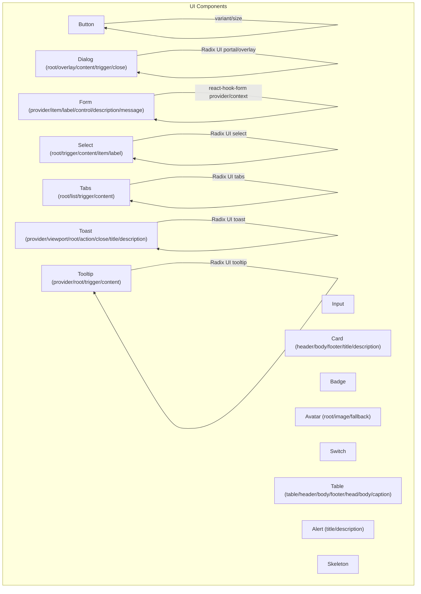

**Diagram sources**
- [button.tsx:1-58](file://components/ui/button.tsx#L1-L58)
- [input.tsx:1-23](file://components/ui/input.tsx#L1-L23)
- [card.tsx:1-80](file://components/ui/card.tsx#L1-L80)
- [dialog.tsx:1-123](file://components/ui/dialog.tsx#L1-L123)
- [form.tsx:1-179](file://components/ui/form.tsx#L1-L179)
- [select.tsx:1-161](file://components/ui/select.tsx#L1-L161)
- [tabs.tsx:1-56](file://components/ui/tabs.tsx#L1-L56)
- [badge.tsx:1-38](file://components/ui/badge.tsx#L1-L38)
- [avatar.tsx:1-51](file://components/ui/avatar.tsx#L1-L51)
- [switch.tsx:1-30](file://components/ui/switch.tsx#L1-L30)
- [table.tsx:1-118](file://components/ui/table.tsx#L1-L118)
- [alert.tsx:1-60](file://components/ui/alert.tsx#L1-L60)
- [toast.tsx:1-130](file://components/ui/toast.tsx#L1-L130)
- [skeleton.tsx:1-16](file://components/ui/skeleton.tsx#L1-L16)
- [tooltip.tsx:1-31](file://components/ui/tooltip.tsx#L1-L31)

**Section sources**
- [button.tsx:1-58](file://components/ui/button.tsx#L1-L58)
- [input.tsx:1-23](file://components/ui/input.tsx#L1-L23)
- [card.tsx:1-80](file://components/ui/card.tsx#L1-L80)
- [dialog.tsx:1-123](file://components/ui/dialog.tsx#L1-L123)
- [form.tsx:1-179](file://components/ui/form.tsx#L1-L179)
- [select.tsx:1-161](file://components/ui/select.tsx#L1-L161)
- [tabs.tsx:1-56](file://components/ui/tabs.tsx#L1-L56)
- [badge.tsx:1-38](file://components/ui/badge.tsx#L1-L38)
- [avatar.tsx:1-51](file://components/ui/avatar.tsx#L1-L51)
- [switch.tsx:1-30](file://components/ui/switch.tsx#L1-L30)
- [table.tsx:1-118](file://components/ui/table.tsx#L1-L118)
- [alert.tsx:1-60](file://components/ui/alert.tsx#L1-L60)
- [toast.tsx:1-130](file://components/ui/toast.tsx#L1-L130)
- [skeleton.tsx:1-16](file://components/ui/skeleton.tsx#L1-L16)
- [tooltip.tsx:1-31](file://components/ui/tooltip.tsx#L1-L31)

## Core Components
This section summarizes the primary UI building blocks and their customization surface.

- Button
  - Purpose: Primary action with variants and sizes.
  - Props: variant (default, destructive, outline, secondary, ghost, link), size (default, sm, lg, icon), asChild (render as child element), plus native button attributes.
  - States: disabled, focus-visible ring, hover states mapped to variant tokens.
  - Accessibility: Inherits native semantics; focus-visible ring for keyboard navigation.
  - Customization: Extend variants/sizes via class variance authority; Tailwind classes merge with defaults.

- Input
  - Purpose: Text, password, email, number inputs.
  - Props: type, plus native input attributes.
  - States: disabled, focus-visible ring, placeholder color.
  - Accessibility: Proper labeling via parent form components recommended.
  - Customization: Tailwind classes override default styles.

- Card
  - Purpose: Content container with header, title, description, content, footer.
  - Composition: Card, CardHeader, CardTitle, CardDescription, CardContent, CardFooter.
  - Props: Standard HTML div attributes; spacing and typography applied internally.
  - Accessibility: Wrap interactive elements inside content/footer as needed.

- Dialog
  - Purpose: Modal overlay with content area and close trigger.
  - Composition: Root, Portal, Overlay, Content, Trigger, Close, Header/Footer, Title, Description.
  - States: open/closed; animated via data-state attributes (fade/zoom/slide).
  - Accessibility: Focus trapping, Escape handling, ARIA roles managed by Radix UI.

- Form
  - Purpose: Integration with react-hook-form for labels, controls, descriptions, and messages.
  - Composition: Form (provider), FormItem, FormLabel, FormControl, FormDescription, FormMessage, FormField.
  - Props: Uses react-hook-form Controller props; aria-* attributes auto-bound.
  - Accessibility: Associates labels, descriptions, and error messages via generated IDs.

- Select
  - Purpose: Dropdown selection with scroll areas and item indicators.
  - Composition: Root, Group, Value, Trigger, Content, ScrollUp/Down buttons, Label, Item, Separator.
  - States: open/closed; popper positioning; scroll indicators.
  - Accessibility: Keyboard navigation, ARIA listbox/option semantics.

- Tabs
  - Purpose: Organize content into selectable sections.
  - Composition: Root, List, Trigger, Content.
  - States: active tab via data-state; focus-visible ring.
  - Accessibility: Keyboard navigation per WAI-ARIA Tabs pattern.

- Badge
  - Purpose: Short labels or indicators.
  - Props: variant (default, secondary, destructive, outline).
  - Customization: Variant-driven styling via class variance authority.

- Avatar
  - Purpose: User or entity image with fallback.
  - Composition: Root, Image, Fallback.
  - Accessibility: Ensure alt text on image when available.

- Switch
  - Purpose: Binary on/off control.
  - Props: Native input attributes; data-state reflects checked/unchecked.
  - States: focus-visible ring; thumb translation indicates state.

- Table
  - Purpose: Present structured data with responsive wrapper.
  - Composition: Table, TableHeader, TableBody, TableFooter, TableRow, TableHead, TableCell, TableCaption.
  - Accessibility: Use proper semantic markup (thead, tbody, th scope).

- Alert
  - Purpose: Convey contextual information.
  - Props: variant (default, destructive).
  - Accessibility: Role set to alert; ensure contrast for destructive variant.

- Toast
  - Purpose: Non-modal notifications with actions and swipe gestures.
  - Composition: Provider, Viewport, Root, Action, Close, Title, Description.
  - States: open/closed; swipe-to-dismiss; destructive variant styling.
  - Animations: Fade/zoom/slide transitions driven by data-state.

- Skeleton
  - Purpose: Visual placeholder during async loading.
  - Props: Standard HTML div attributes.
  - Animation: Pulse animation via Tailwind.

- Tooltip
  - Purpose: Brief help text on hover/focus.
  - Composition: Provider, Root, Trigger, Content.
  - States: open/closed; directional slide animations.

**Section sources**
- [button.tsx:36-55](file://components/ui/button.tsx#L36-L55)
- [input.tsx:5-22](file://components/ui/input.tsx#L5-L22)
- [card.tsx:5-79](file://components/ui/card.tsx#L5-L79)
- [dialog.tsx:9-122](file://components/ui/dialog.tsx#L9-L122)
- [form.tsx:18-178](file://components/ui/form.tsx#L18-L178)
- [select.tsx:9-160](file://components/ui/select.tsx#L9-L160)
- [tabs.tsx:8-55](file://components/ui/tabs.tsx#L8-L55)
- [badge.tsx:26-37](file://components/ui/badge.tsx#L26-L37)
- [avatar.tsx:8-50](file://components/ui/avatar.tsx#L8-L50)
- [switch.tsx:8-29](file://components/ui/switch.tsx#L8-L29)
- [table.tsx:5-117](file://components/ui/table.tsx#L5-L117)
- [alert.tsx:22-59](file://components/ui/alert.tsx#L22-L59)
- [toast.tsx:10-129](file://components/ui/toast.tsx#L10-L129)
- [skeleton.tsx:3-15](file://components/ui/skeleton.tsx#L3-L15)
- [tooltip.tsx:8-30](file://components/ui/tooltip.tsx#L8-L30)

## Architecture Overview
The UI library leverages:
- Radix UI for accessible base behaviors (dialogs, selects, tooltips, toasts, tabs, avatars).
- Class Variance Authority (CVA) for variant/state-driven styling.
- Tailwind CSS for utility-first styling and responsive breakpoints.
- react-hook-form for form composition and validation messaging.

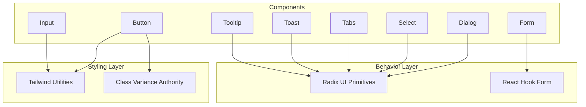

**Diagram sources**
- [button.tsx:7-34](file://components/ui/button.tsx#L7-L34)
- [input.tsx:10-11](file://components/ui/input.tsx#L10-L11)
- [dialog.tsx:17-54](file://components/ui/dialog.tsx#L17-L54)
- [select.tsx:15-100](file://components/ui/select.tsx#L15-L100)
- [form.tsx:1-179](file://components/ui/form.tsx#L1-L179)
- [tabs.tsx:10-38](file://components/ui/tabs.tsx#L10-L38)
- [toast.tsx:12-56](file://components/ui/toast.tsx#L12-L56)
- [tooltip.tsx:14-27](file://components/ui/tooltip.tsx#L14-L27)

## Detailed Component Analysis

### Button
- Props
  - variant: default | destructive | outline | secondary | ghost | link
  - size: default | sm | lg | icon
  - asChild: render underlying element as a child slot
  - Additional button attributes (type, onClick, disabled, etc.)
- States and Animations
  - Hover/focus-visible ring controlled by Tailwind utilities.
  - Disabled state reduces opacity and disables pointer events.
- Accessibility
  - Inherits native button semantics; ensure meaningful text or icon with aria-label.
- Customization
  - Add new variants/sizes via cva; merge className with defaults.

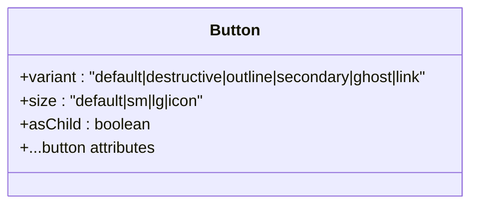

**Diagram sources**
- [button.tsx:36-55](file://components/ui/button.tsx#L36-L55)

**Section sources**
- [button.tsx:7-55](file://components/ui/button.tsx#L7-L55)

### Input
- Props
  - type: text, email, password, number, etc.
  - Additional input attributes (value, onChange, placeholder, etc.)
- States and Animations
  - Focus-visible ring; disabled state handled.
- Accessibility
  - Pair with a label; avoid relying solely on placeholder text.

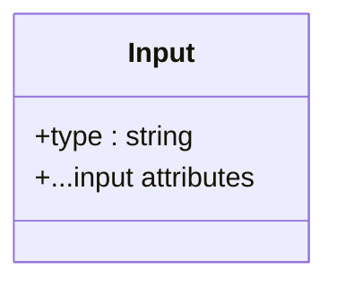

**Diagram sources**
- [input.tsx:5-22](file://components/ui/input.tsx#L5-L22)

**Section sources**
- [input.tsx:5-22](file://components/ui/input.tsx#L5-L22)

### Card
- Composition
  - Card, CardHeader, CardTitle, CardDescription, CardContent, CardFooter
- Props
  - All accept standard HTML div attributes; internal spacing and typography applied.
- Accessibility
  - Structure content with semantic headings and paragraphs.

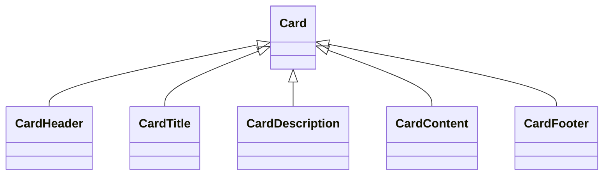

**Diagram sources**
- [card.tsx:5-79](file://components/ui/card.tsx#L5-L79)

**Section sources**
- [card.tsx:5-79](file://components/ui/card.tsx#L5-L79)

### Dialog
- Composition
  - Root, Portal, Overlay, Content, Trigger, Close, Header/Footer, Title, Description
- States and Animations
  - Data-state open/closed drives fade-in/out, zoom-in/zoom-out, and slide-in/slide-out.
- Accessibility
  - Focus management and Escape key handling via Radix UI; ensure content is labeled.

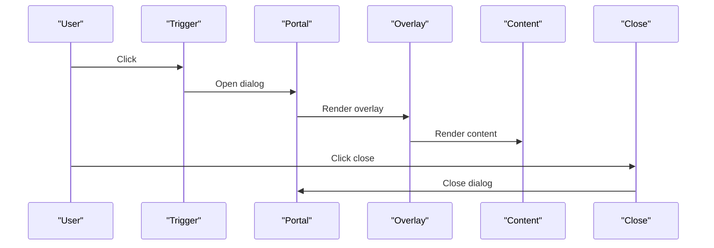

**Diagram sources**
- [dialog.tsx:9-54](file://components/ui/dialog.tsx#L9-L54)

**Section sources**
- [dialog.tsx:9-122](file://components/ui/dialog.tsx#L9-L122)

### Form
- Composition
  - Form (provider), FormItem, FormLabel, FormControl, FormDescription, FormMessage, FormField
- Behavior
  - Provides context for field IDs and error messaging; binds aria-* attributes automatically.
- Accessibility
  - Ensures labels, descriptions, and error messages are associated with controls.

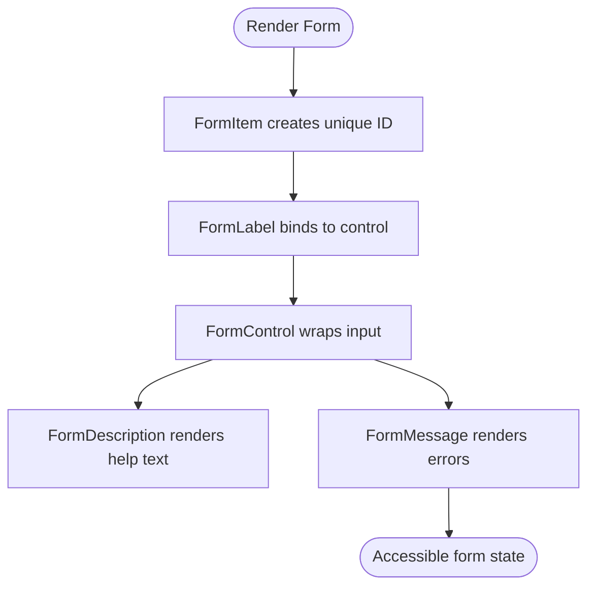

**Diagram sources**
- [form.tsx:75-167](file://components/ui/form.tsx#L75-L167)

**Section sources**
- [form.tsx:18-178](file://components/ui/form.tsx#L18-L178)

### Select
- Composition
  - Root, Trigger, Content, Viewport, ScrollUp/Down buttons, Label, Item, Separator
- States and Animations
  - Position prop supports "popper" placement; content animates open/close with fade/zoom/slide.
- Accessibility
  - Keyboard navigation and ARIA listbox semantics.

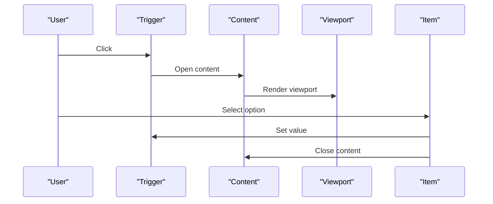

**Diagram sources**
- [select.tsx:15-100](file://components/ui/select.tsx#L15-L100)

**Section sources**
- [select.tsx:9-160](file://components/ui/select.tsx#L9-L160)

### Tabs
- Composition
  - Root, List, Trigger, Content
- States and Animations
  - Active state via data-state; focus-visible ring and transitions.

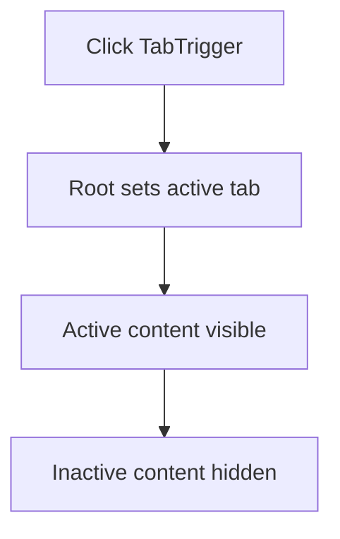

**Diagram sources**
- [tabs.tsx:10-38](file://components/ui/tabs.tsx#L10-L38)

**Section sources**
- [tabs.tsx:8-55](file://components/ui/tabs.tsx#L8-L55)

### Badge
- Props
  - variant: default | secondary | destructive | outline
- Customization
  - Variant-driven styling via cva.

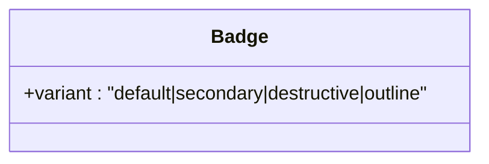

**Diagram sources**
- [badge.tsx:26-37](file://components/ui/badge.tsx#L26-L37)

**Section sources**
- [badge.tsx:6-37](file://components/ui/badge.tsx#L6-L37)

### Avatar
- Composition
  - Root, Image, Fallback
- Accessibility
  - Provide alt text on image when appropriate.

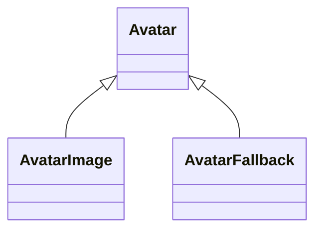

**Diagram sources**
- [avatar.tsx:8-50](file://components/ui/avatar.tsx#L8-L50)

**Section sources**
- [avatar.tsx:1-51](file://components/ui/avatar.tsx#L1-L51)

### Switch
- Props
  - Native input attributes; data-state indicates checked/unchecked.
- States and Animations
  - Thumb translates horizontally; focus-visible ring.

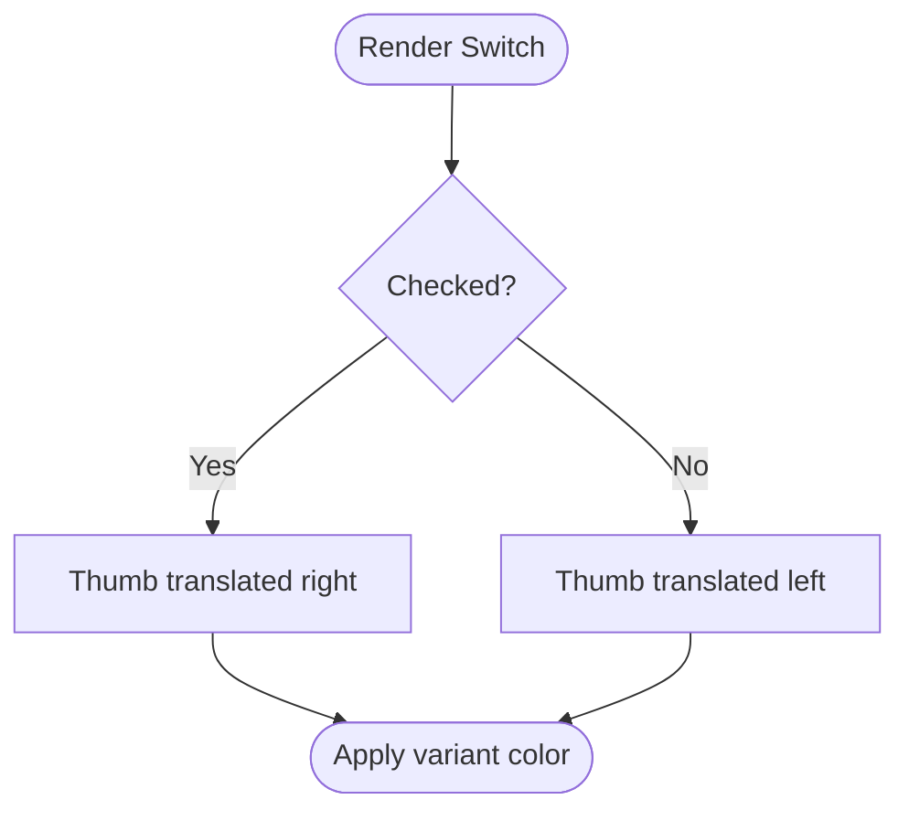

**Diagram sources**
- [switch.tsx:8-29](file://components/ui/switch.tsx#L8-L29)

**Section sources**
- [switch.tsx:1-30](file://components/ui/switch.tsx#L1-L30)

### Table
- Composition
  - Table, TableHeader, TableBody, TableFooter, TableRow, TableHead, TableCell, TableCaption
- Accessibility
  - Use thead/tbody and th scope for screen readers.

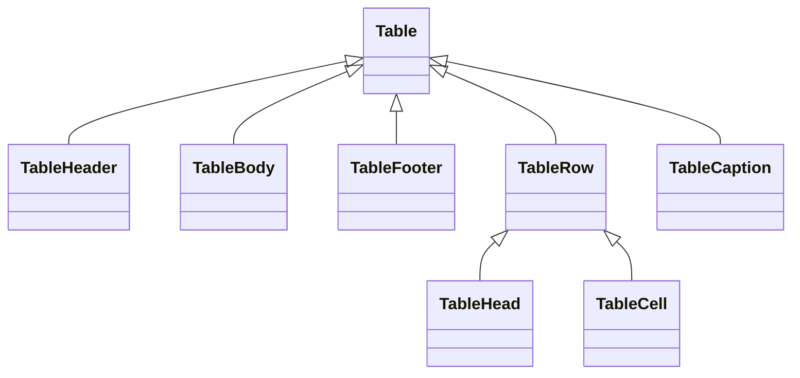

**Diagram sources**
- [table.tsx:5-117](file://components/ui/table.tsx#L5-L117)

**Section sources**
- [table.tsx:1-118](file://components/ui/table.tsx#L1-L118)

### Alert
- Props
  - variant: default | destructive
- Accessibility
  - Role set to alert; ensure sufficient color contrast.

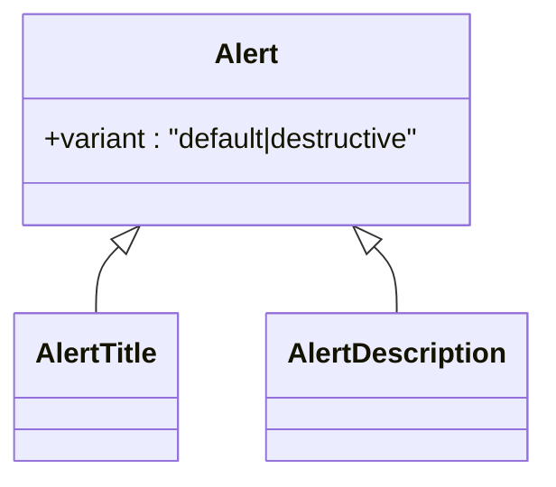

**Diagram sources**
- [alert.tsx:22-59](file://components/ui/alert.tsx#L22-L59)

**Section sources**
- [alert.tsx:1-60](file://components/ui/alert.tsx#L1-L60)

### Toast
- Composition
  - Provider, Viewport, Root, Action, Close, Title, Description
- States and Animations
  - Open/close animations; swipe-to-dismiss; destructive variant styling.

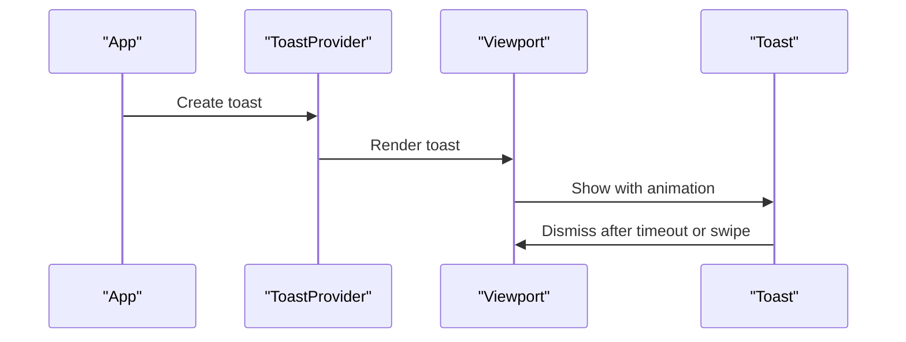

**Diagram sources**
- [toast.tsx:10-56](file://components/ui/toast.tsx#L10-L56)

**Section sources**
- [toast.tsx:1-130](file://components/ui/toast.tsx#L1-L130)

### Skeleton
- Props
  - Standard HTML div attributes.
- Animation
  - Pulse animation for loading placeholders.

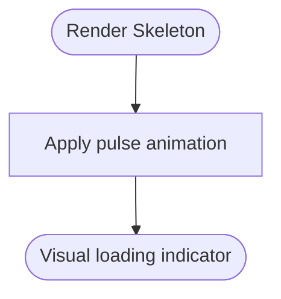

**Diagram sources**
- [skeleton.tsx:3-15](file://components/ui/skeleton.tsx#L3-L15)

**Section sources**
- [skeleton.tsx:1-16](file://components/ui/skeleton.tsx#L1-L16)

### Tooltip
- Composition
  - Provider, Root, Trigger, Content
- States and Animations
  - Directional slide and fade transitions; sideOffset configurable.

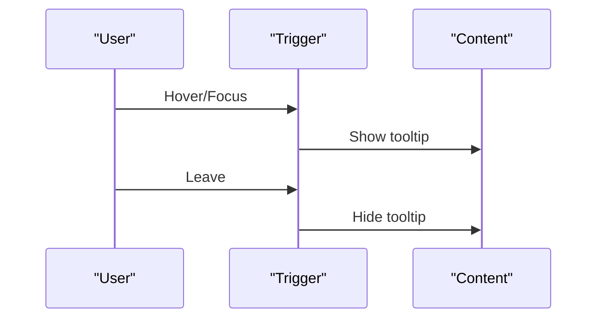

**Diagram sources**
- [tooltip.tsx:14-27](file://components/ui/tooltip.tsx#L14-L27)

**Section sources**
- [tooltip.tsx:1-31](file://components/ui/tooltip.tsx#L1-L31)

## Dependency Analysis
- Internal dependencies
  - All components import a shared cn utility for merging Tailwind classes.
  - Many components depend on Radix UI primitives for accessible behavior.
  - Form components integrate with react-hook-form for validation and messaging.
- External dependencies
  - @radix-ui/react-* for accessible primitives.
  - lucide-react for icons.
  - class-variance-authority for variant/state styling.
  - react-hook-form for form composition.

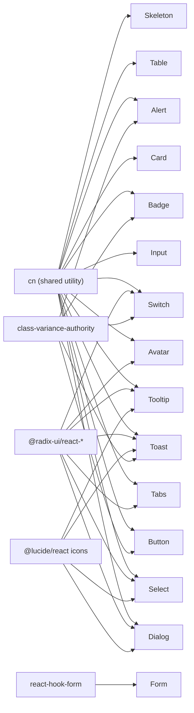

**Diagram sources**
- [button.tsx:1-5](file://components/ui/button.tsx#L1-L5)
- [input.tsx:1-3](file://components/ui/input.tsx#L1-L3)
- [card.tsx:1-3](file://components/ui/card.tsx#L1-L3)
- [dialog.tsx:1-7](file://components/ui/dialog.tsx#L1-L7)
- [select.tsx:1-7](file://components/ui/select.tsx#L1-L7)
- [tabs.tsx:1-6](file://components/ui/tabs.tsx#L1-L6)
- [badge.tsx:1-4](file://components/ui/badge.tsx#L1-L4)
- [avatar.tsx:1-6](file://components/ui/avatar.tsx#L1-L6)
- [switch.tsx:1-6](file://components/ui/switch.tsx#L1-L6)
- [table.tsx:1-3](file://components/ui/table.tsx#L1-L3)
- [alert.tsx:1-4](file://components/ui/alert.tsx#L1-L4)
- [toast.tsx:1-8](file://components/ui/toast.tsx#L1-L8)
- [skeleton.tsx](file://components/ui/skeleton.tsx#L1)
- [tooltip.tsx:1-6](file://components/ui/tooltip.tsx#L1-L6)
- [form.tsx:1-16](file://components/ui/form.tsx#L1-L16)

**Section sources**
- [button.tsx:1-5](file://components/ui/button.tsx#L1-L5)
- [input.tsx:1-3](file://components/ui/input.tsx#L1-L3)
- [card.tsx:1-3](file://components/ui/card.tsx#L1-L3)
- [dialog.tsx:1-7](file://components/ui/dialog.tsx#L1-L7)
- [select.tsx:1-7](file://components/ui/select.tsx#L1-L7)
- [tabs.tsx:1-6](file://components/ui/tabs.tsx#L1-L6)
- [badge.tsx:1-4](file://components/ui/badge.tsx#L1-L4)
- [avatar.tsx:1-6](file://components/ui/avatar.tsx#L1-L6)
- [switch.tsx:1-6](file://components/ui/switch.tsx#L1-L6)
- [table.tsx:1-3](file://components/ui/table.tsx#L1-L3)
- [alert.tsx:1-4](file://components/ui/alert.tsx#L1-L4)
- [toast.tsx:1-8](file://components/ui/toast.tsx#L1-L8)
- [skeleton.tsx](file://components/ui/skeleton.tsx#L1)
- [tooltip.tsx:1-6](file://components/ui/tooltip.tsx#L1-L6)
- [form.tsx:1-16](file://components/ui/form.tsx#L1-L16)

## Performance Considerations
- Prefer variant props over ad-hoc Tailwind classes to keep the component API stable and minimize runtime class merging.
- Use Skeleton for async content to reduce layout shifts.
- Limit deep nesting in Dialog/Select/Tooltip to reduce DOM tree size.
- Avoid excessive re-renders by memoizing heavy props passed to form controls.
- Keep animations minimal; rely on data-state-driven transitions already present in overlays and toasts.

## Troubleshooting Guide
- Dialog does not close on Escape or click outside
  - Ensure the component is mounted client-side and the Root is properly initialized.
  - Verify Portal rendering and Overlay click-to-close behavior.
- Select scrolls unexpectedly
  - Confirm viewport sizing and popper positioning; adjust position prop if needed.
- Form label or error message not associated with input
  - Wrap the control in FormControl and pair FormLabel with the control’s id.
- Toast not dismissing
  - Check timeout configuration and swipe gesture handling; ensure Provider is present.
- Tooltip not visible
  - Confirm TooltipProvider is wrapping content and Trigger is used correctly.

**Section sources**
- [dialog.tsx:1-123](file://components/ui/dialog.tsx#L1-L123)
- [select.tsx:1-161](file://components/ui/select.tsx#L1-L161)
- [form.tsx:1-179](file://components/ui/form.tsx#L1-L179)
- [toast.tsx:1-130](file://components/ui/toast.tsx#L1-L130)
- [tooltip.tsx:1-31](file://components/ui/tooltip.tsx#L1-L31)

## Conclusion
Muse’s UI library combines accessible primitives from Radix UI, expressive styling via Tailwind and CVA, and robust form integration with react-hook-form. Components are designed for composability, customization, and predictable behavior across devices and assistive technologies.

## Appendices
- Theming and customization
  - Override default tokens by adjusting Tailwind theme colors and spacing; variants can be extended via CVA.
- Responsive design
  - Use responsive utilities (sm:, md:, lg:) on component props and container layouts.
- Accessibility checklist
  - Ensure labels, descriptions, and error messages are programmatically associated; provide keyboard navigation; maintain sufficient color contrast.
- Cross-browser compatibility
  - Test with latest Chrome, Firefox, Safari, and Edge; verify Radix UI polyfills if targeting older browsers.